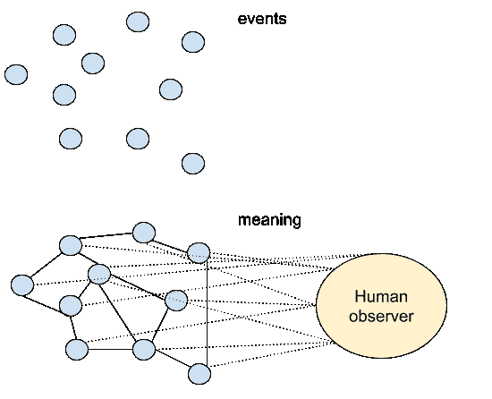
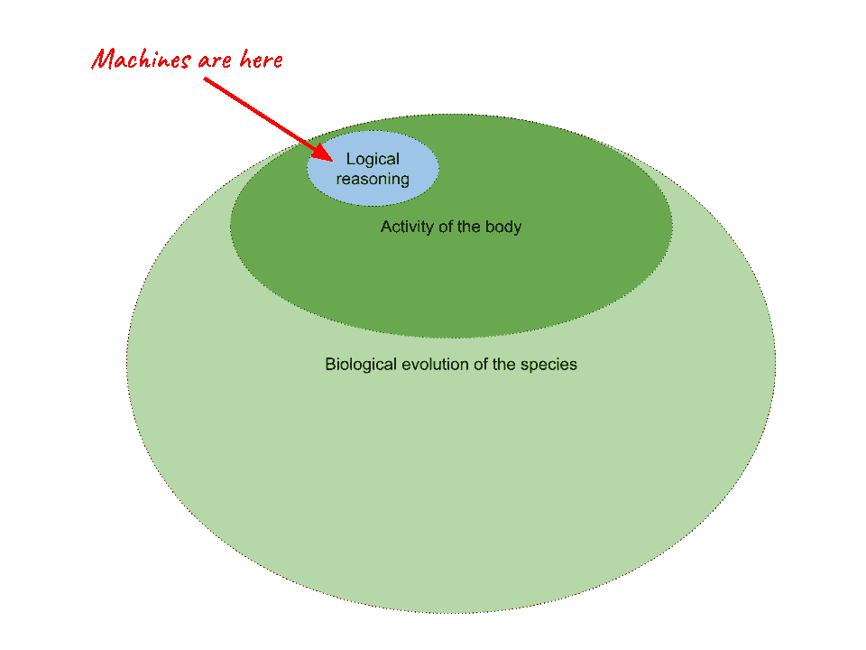

# 哲学和人工智能# 1——意识

> 原文：<https://medium.com/mlearning-ai/philosophy-and-artificial-intelligence-1-471eb002ec2d?source=collection_archive---------1----------------------->

哲学和人工智能有什么关系？

人工智能理论背后的主要问题是一个哲学问题:作为人类意味着什么？还有许多其他更具体的问题，但是它们都与这个基本问题相关联。如何在机器中模拟人类的学习过程？机器能变得有意识吗？“有意识”是什么意思？我们应该让机器做出道德决定吗？“自由意志”存在吗？人类知识和现实世界之间的关系是什么？

对于所有这些问题，我们都没有确定(“科学”)的答案，但不提出这些问题，我们就不能说机器应该如何使用，这是人工智能伦理学(以及其他相关领域)的主要关注点。先说最根本的问题。

**那么，你怎么知道你是有意识的？**

意识是一种神秘的现象，然而它是让我们成为人类的关键。我们对**意识的体验实际上是我们唯一在处理的事情**(当然，当*我们是*意识的时候；当我们不是的时候，我们没有*处理*任何东西——所以我们没有证据证明其他任何东西是真实的。正如勒内·笛卡尔所说，

我怎么知道[上帝]没有带来没有地球，没有天空，没有延伸的东西，没有形状，没有大小，没有位置，同时确保所有这些东西在我看来就像它们现在一样存在？

然而，为了保持这篇文章的简短，不使这篇文章成为一篇 400 页长的文章，我们必须假设:

1)世界存在，

2)我们存在，

3)我们都分享着这种有意识的神秘品质，这是人类对世界的人造形象。

(否则，写任何关于这件事的东西都会像[杰瑞的《渴望苹果？演示文稿](https://www.youtube.com/watch?v=rGvf0JUSaEg)。

为什么我们有意识？

乔治·莱考夫和马克·约翰逊开始了他们第二重要的书， [*肉身哲学*](https://georgelakoff.com/books/philosophy-in-the-flesh/) ，以一个陈述开始，即头脑是固有的，思想大部分是无意识的。自[柏拉图](https://plato.stanford.edu/entries/ancient-soul/#3)以来，无意识在我们日常生活中的作用就一直存在于哲学辩论中，每个试图在手动输入数百次后记住手机密码或房门密码的人都知道，身体拥有自己的记忆。这意味着，意识不是我们生存所必需的，因为其他动物也不需要它。但是我们需要它来做一些事情。

从生物学的角度来看，意识是一种工具，被开发出来使我们能够应对时间的流逝。正是意识保持着过去、现在和未来之间的连续性。它允许我们推迟满足感，从而专注于耗时的活动，如艺术、科学和技术。意识创造**意为**。我们观察事件和物体，并以某种方式将它们联系起来，创造秩序和意义，并以此为基础做出决定。

意识是否“只是一个帮助我们进入下一个进化阶段的把戏”，或者还有更多(例如灵魂的存在)是一个形而上学的问题，这意味着它超出了科学方法的范围(顺便说一下，这也是我们意识的产物)。然而，我们可以肯定的是，我们的生物学(我们的中枢神经系统，我们的整个身体，我们的进化)对我们的意识结构至关重要。

**思维机械**

所以[计算心学](https://plato.stanford.edu/entries/computational-mind/)有一个根本性的错误。大脑可能是“肉做的[电脑](https://www.businessinsider.com/is-your-brain-just-a-meat-computer-2016-6?IR=T)”，但**大脑不是头脑**电脑永远缺少人脑的整个生物背景。

1.  目前，我们还不确定神经系统中的某些连接在处理复杂的智力任务中起着什么作用。只有这样，才有可能在机器中再造人脑。我们谈论的是亿万个细胞。

2.这意味着我们无法真正估算出创造人类级别的人工智能需要什么样的“计算能力”。这不是“多少”的问题，而是“如何”的问题。这就是为什么在计算能力上比人脑强大得多的计算机，看起来仍然是无意识的，仍然无法“做人”。

3.但是如果他们有意识呢？如果谷歌真的在看你在网上做什么，默默的评判你呢？好吧，问题就在这里——即使它是“有意识的”,或者在未来会变得有意识，它也不会是人类的意识——仅仅因为它不会在人类的“硬件”上运行。换句话说，它可以是“超智能的”，但它不会是人类——我们可能永远也不会知道它有任何意识。

理解意识现象对于人工智能伦理学和人工智能理论的相关问题至关重要。每周一次，我会发表一篇简短的博文(就像这篇)来讨论人工智能哲学和伦理学中的一些基本问题。我们将从哲学概念开始，然后在人工智能的背景下讨论它们。所以在接下来的几周里，我将谈论:

*   意义和感觉
*   自由意志和个人责任
*   真相、偏见和数据
*   平等、多样性和正义

我也会努力推广一些关于这些事情的有趣的论文和书籍。如果你想推荐一些其他的话题，一本书或一篇论文来讨论，不要犹豫让我知道！希望本系列对您有所帮助。