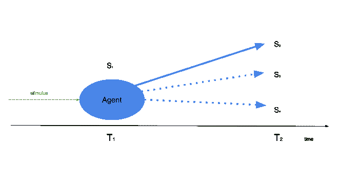
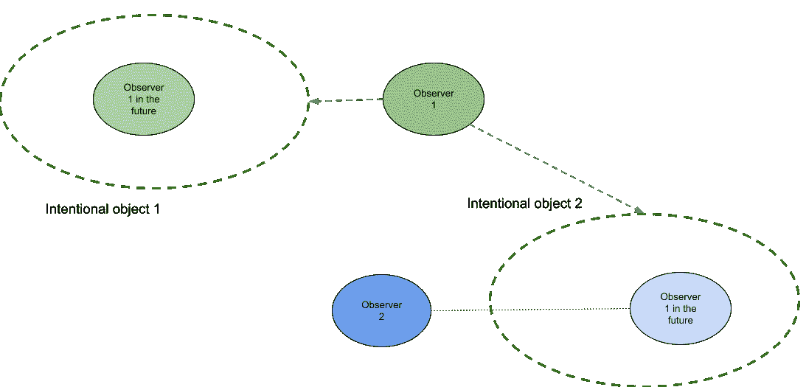

# 哲学和人工智能# 3——意志自由

> 原文：<https://medium.com/mlearning-ai/philosophy-and-artificial-intelligence-3-freedom-of-will-d9de989c7d70?source=collection_archive---------4----------------------->

Pixabay @ Pexels

*见上一篇* [*此处*](/mlearning-ai/philosophy-and-artificial-intelligence-1-471eb002ec2d)&[*此处*](/mlearning-ai/philosophy-and-artificial-intelligence-2-715d173583b2) *。*

**意志的自由意味着什么？**

自由意志的整个概念意味着作出选择的代理人 1)可以不这样做，2)意识到作出了选择。因此**他们要为自己选择的结果负责**,因为没有他们，时间线会看起来不同(更好或更坏)。如果我们意识到要做出选择，却不能做出其他选择，或者意识不到这些选择，那么个人责任的概念就没有任何意义。

但是代理人可以“不这样做”到底是什么意思呢？在给定的时间 T1，有一个状态 S1。如果在 T1 中行动的代理人在他们的行动中是自由的，这意味着我们有一组可能的状态{S2，S3，S4，…Sn}，并且在 T2 仅观察到 S2 的事实意味着它仅由代理人的自由行动(或无行动)引起。

但是我们怎么知道状态{S3，S4，…Sn}是可能的呢？因为 S2 是唯一被观测到的，也许它是唯一可能的？如果你观察一只蚂蚁去某个地方，它也符合上面的描述，我们不把它归因于“意志自由”——只有概率空间。如果这同样适用于人类呢？

**不相容论和自由意志的幻觉**

你可能非常了解一个由普通 20 岁的大学生(还有山姆·哈里斯)提出的关于自由意志不存在的论点:

*   *世界是物质的；*
*   每一个物理过程都有一个原因；
*   我们的身体是物质的；
*   因此，我们的选择是确定的，没有自由意志之类的东西的空间。

换句话说，我们所做的每一个决定都是确定的——而[拉普拉斯的恶魔](https://en.wikipedia.org/wiki/Laplace%27s_demon)会知道我们未来选择的一切——这意味着我们无法控制我们所做的事情——或者有一些随机因素，一个机会，这……意味着相同的结果(如果原因是随机的，我们就无法控制行动)。

另外，有一个著名的 Benjamin Libet 实验，用[*Bereitschaftspotential*](https://en.wikipedia.org/wiki/Bereitschaftspotential)进行，这个实验表明我们的身体在我们做出有意识的决定之前就决定了我们要做什么。因此——不相容论者说——自由意志是一种幻觉，是我们的大脑为了使已经完成的事情合理化而制造的。所以根本不存在“另辟蹊径”的能力。

**自由意志到底有多自由**

嗯，我们都觉得我们有选择的自由。决定论的不相容论认为这是我们大脑制造的幻觉。然而，正如克里斯蒂安·库普克指出的那样，如果自由意志是一种幻觉，那么在我们的大脑中一定有与之相关的神经系统，而我们找不到这样的东西。**如果我们坚持决定论的不相容论，我们实际上无法解释为什么我们需要自由的“幻觉”**——就像我们无法解释[意义的现象](https://www.linkedin.com/pulse/philosophy-artificial-intelligence-2-olgierd-sroczynski/)。如果没有它我们也能生存，为什么我们还需要它？

让我们来看看人类的决策过程是如何工作的。正如我们之前提到的，人类思维能够创造抽象概念，有意识的物体，在组织世界中扮演主要角色。意识也是基于对我们自己的抽象——不随时间流逝而改变的身份。我们可以改变我们的性格，但是如果我们记得我们过去所做的一些选择，我们肯定它们是由同一个实体“自我”做出的。

我们看待未来的方式也是如此——当我们做决定时，我们正在创造一个尚不存在的抽象概念。因此，我可以根据我的身体向我发出的生物冲动来决定我午餐应该吃牛排还是沙拉，这在很大程度上是一个物质决定论的问题。但是当我做出选择的时候，我不仅有物质上的冲动，还有这个选择会导致什么的整体概念。我买得起牛排吗？沙拉对我来说更健康吗？吃完牛排后我会有什么感觉？而这恰恰是关于“午餐该吃什么”的问题。

伴随着道德问题，通往未来的心路历程还有另一个要素:心智理论。我们不仅意识到我们计划要做的事情的直接后果，而且我们也意识到其他人会看到我们并评判我们。这也可以适用于选择吃什么，如果它成为一个道德问题(例如，是否在星期五吃肉，或者是否可以杀动物作为食物)。

Intentional object #1 is the observer’s vision of themself in the future. Intentional object #2 is the first observer’s vision of the second observer’s vision of the first observer in the future.

有目的的物体，如价值观，也会创造生物刺激(例如，我们做好事的愿景会释放荷尔蒙，引起快感)，所以从决定论的角度来看，这些有目的的物体如何影响我们的身体也是因果顺序的一部分。然而，根据我们现在所知道的，我们不能简单地将价值和其他抽象概念简化为我们大脑和身体某些部分的活动。不同的人对各种刺激的反应是不同的，包括价值观和观念。我们至少可以说，这个过程是不可计算的，所以它确实与经典的拉普拉斯恶魔决定论无关。