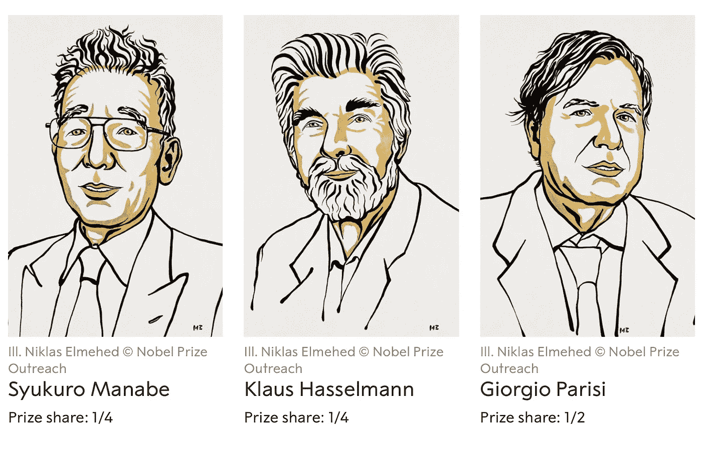

# 2021 年诺贝尔物理学奖，人工智能和机器学习

> 原文：<https://medium.com/mlearning-ai/physics-nobel-prize-2021-ai-and-machine-learning-8232c8428cc8?source=collection_archive---------0----------------------->

Physics Nobel Prize Winners of 2021\. Image credit from Nobel Prize official [website](https://www.nobelprize.org/prizes/physics/2021/summary/) under the creative common license.

2021 年诺贝尔物理学奖授予了三位物理学家，以表彰他们对理解复杂系统的贡献。四分之一的奖金颁给了日本的【**寿郎·马纳贝**和德国的**克劳斯·哈塞尔曼**。意大利理论物理学家乔治·帕里西获得了该奖项的一半。

**真部修郎**和**克劳斯·哈塞尔曼**获奖: