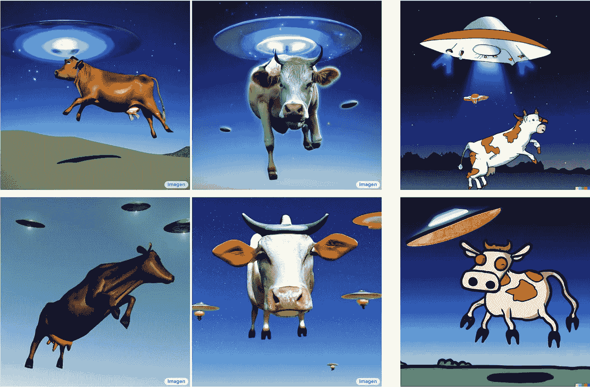

# 前所未有的图片现实主义与文字知识相结合

> 原文：<https://medium.com/mlearning-ai/picture-realism-like-never-before-paired-with-a-knowledge-of-words-42c72fde7e6c?source=collection_archive---------2----------------------->

## [机器学习艺术](https://mlearning.substack.com)

## Imagen，一个文本到图像的扩散模型。**Imagen beats**[DALL-E 2](https://mlearning.substack.com/p/-8-ai-art-tools-worth-learning-about?r=z7zu8&s=w&utm_campaign=post&utm_medium=web)

[https://mlearning.substack.com](https://mlearning.substack.com)

多模态学习最近变得很突出。这些模型已经改变了研究界，并通过创造性的图像生成和…