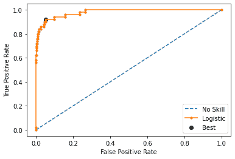

# Pip 安装自动运行

> 原文：<https://medium.com/mlearning-ai/pip-install-autoroc-ba4ac1514739?source=collection_archive---------3----------------------->

Auc ROC 曲线最佳阈值的自动化


大家好，你们好吗？好极了。

今天，我将向您介绍我自己定制的 pip 包，它可以自动计算 AUC ROC 曲线的最佳阈值。

我们已经了解了 auc roc 图及其使用原因。如果不是，让我给你一个简单的答案 auc roc 图是用来寻找最佳阈值考虑或相信我们的分类。

让我们借助一个例子来了解如何应用 autoroc。

autoroc

现在让我们用传统的方法

```
# calculate roc curve
fpr, tpr, thresholds = roc_curve(testy, yhat)# calculate the g-mean for each threshold
gmeans = sqrt(tpr * (1-fpr))# locate the index of the largest g-mean
ix = argmax(gmeans)
print('Best Threshold=%f, G-Mean=%.3f' % (thresholds[ix], gmeans[ix]))# plot the roc curve for the model
pyplot.plot([0,1], [0,1], linestyle='--', label='No Skill')
pyplot.plot(fpr, tpr, marker='.', label='Logistic')
pyplot.scatter(fpr[ix], tpr[ix], marker='o', color='black', label='Best')# axis labels
pyplot.xlabel('False Positive Rate')
pyplot.ylabel('True Positive Rate')
pyplot.legend()# show the plot
pyplot.show()
```



我们都知道这一点。

**曲线下的 AUC 面积**是在各种阈值设置下对分类问题的性能测量。而 **ROC** 是一条概率曲线。 **AUC** 代表可分离的程度或度量。它告诉我们这个模型在多大程度上能够区分不同的类。**AUC 越高，模型预测 0 & 1 越好**

现在，当我们不得不追求自动化时，我们无法想象每一次。这就是我定制的名为 autoroc 的软件包的作用

```
from autoroc_rupakbob import autoroc
t, t1 = autoroc.best_threshold(testy,yhat)
```

只有两行代码。就是这样！

现在，我们可以轻松地将提取的值用于进一步的计算目的。

另一个版本被证明要快得多，可以使用 **Youden 的 J 统计**进行交叉验证

```
from autoroc_rupakbob import autoroc
t3= autoroc.best_threshold_YoudenJstatistic(testy,yhat)
```

我希望它在你的用例中会有用。要了解更多关于这个包的信息，请点击链接[https://pypi.org/project/autoroc/](https://pypi.org/project/autoroc/)

或者简单地使用 **pip 安装 autoroc**

**查看 kaggle 实现:**[**https://www.kaggle.com/rupakroy/pip-install-autoroc**](https://www.kaggle.com/rupakroy/pip-install-autoroc)

感谢您的时间，如果您喜欢这篇短文，我的 medium repo 中有大量关于高级分析、数据科学和机器学习的主题。[https://medium.com/@bobrupakroyT21](/@bobrupakroy)

如果你需要什么，请告诉我。稍后再聊。

