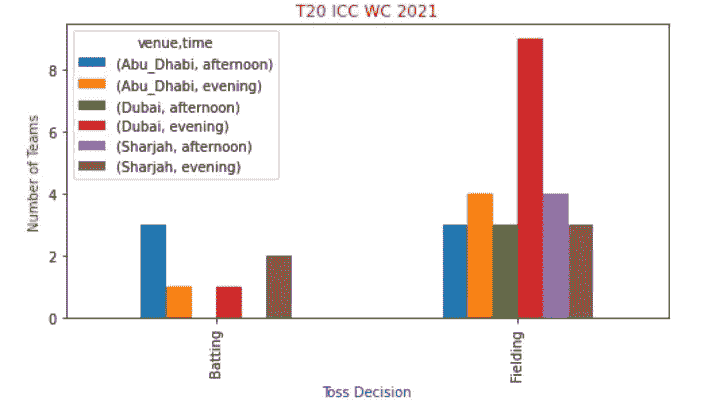
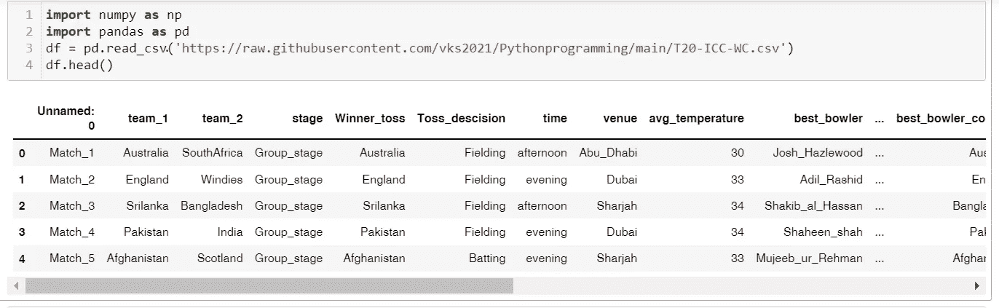
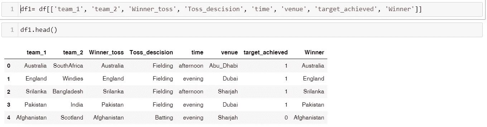
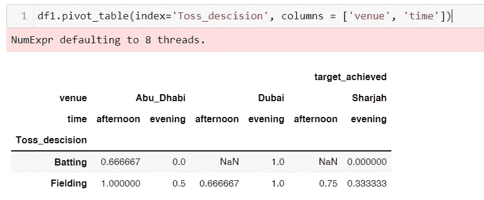
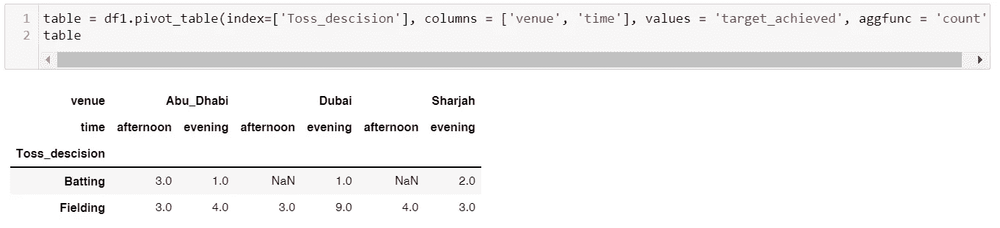
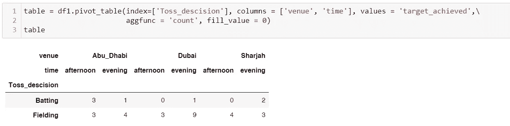
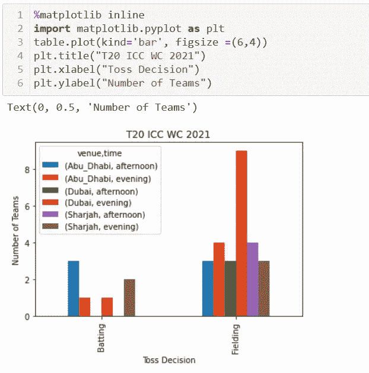
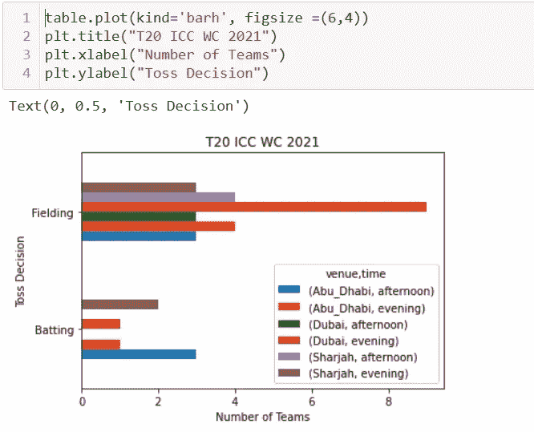

# Pandas 中的数据透视表用于 Python 中的数据汇总和可视化

> 原文：<https://medium.com/mlearning-ai/pivot-table-in-pandas-for-data-summarization-and-visualization-in-python-aa2a763a633f?source=collection_archive---------1----------------------->

**朋友们好，**

我敢肯定，你们中的大多数人都使用过微软 Excel 的[数据透视功能来处理数据和进行数据分析。MS Excel 提供了一个简单、快速的拖放功能，可以对数据进行计算、汇总数据和汇总数据集，以便进行高级分析，从而得出有意义的模式、见解和趋势。用 MS Excel 做数据展示生成可视化很容易。](https://support.microsoft.com/en-us/office/create-a-pivottable-to-analyze-worksheet-data-a9a84538-bfe9-40a9-a8e9-f99134456576)

**“数据透视表将简单的列式数据作为输入，并将条目分组到一个二维表中，这在 python 中提供了数据的多维汇总。”杰克·范德普拉斯**

对于 python 爱好者来说，pandas 库提供了 pivot_table()函数，用于处理表格数据集，尽管 pandas dataframe 类似于 MS excels。它非常强大，速度快，并带有可定制的参数。Pandas pivot_table()函数比 MS Excel pivot 函数更高效、更强大、更健壮。你可能很快就能理解函数的语法。但是一旦你理解了，它会让 supper 中的数据聚合和数据可视化变得简单。它可以轻松处理非常大的数据文件。

在本文中，我们将看到 pandas pivot_table()函数的本质，它使数据聚合和可视化任务变得非常简单。所以，让我们深入了解它。我们将借助 ICC T20 世界杯数据集的一个有趣用例来理解它。我们从 https://www.kaggle.com/affanazhar/icct20-worldcup2021? ka ggle[获取了 2021 年 IIC 世界杯 T20 数据集 select=kaggle_data.csv](https://www.kaggle.com/affanazhar/icct20-worldcup2021?select=kaggle_data.csv) ，将数据集重命名为 T20_ICC_WC.csv，下面的步骤演示了如何使用 pandas 的 pivot_table()函数进行类似于 Python 中 MS excel 的聚合和可视化。

1.  如果你是 jupyter notebook 用户，运行 jupyter notebook，导入 pandas 包并将 CSV 文件读入 pandas dataframe。举个例子，

2.**执行数据选择**:选择您想要考虑的数据项，用于数据聚合和可视化。例如，我们希望可视化场地明智的球队赢得了多少次投掷和选择守备/击球，也赢得了比赛。因此，我们从数据集中选择了所需的数据项。举个例子，

3. **Pivot_table()函数使用 index** 参数来指定透视表索引上的分组依据键。([点击](https://pandas.pydata.org/docs/reference/api/pandas.pivot_table.html)此处查阅熊猫 pivot_table()函数官方文档)。例如，我们可以通过列名 venue 和 time 来总结 toss_decision。默认情况下，pivot_table()按 numpy.mean()使用聚合，如下所示:

4.您可以使用**聚合函数，如 max、min、mean、count** 等。但是这里我们要应用聚合函数 count。因此，我们可以如下指定 aggfunc = 'count ':

5.我们也可以**用期望值填充 NA/NaN 值**。举个例子，

6.现在我们可以导入 matlotlib.pyplot 来绘制所需的**可视化**。例如，条形图:

7.我们还可以使用**水平条形图**生成可视化。举个例子，

**结论**

在这篇文章中我们已经看到了如何使用 pandas 的 pivot_table()函数。使用 pivot_table()函数似乎非常容易和超级简单，并且具有更大的灵活性和健壮性。一旦理解了这个概念，在 Python 中执行聚合和可视化就只需要几行简单的代码了。也可以**访问** [**Jupyter 笔记本**](https://github.com/vks2021/Pythonprogramming/blob/f6af5fb329da9df7835bab85eb26fce93d21f949/LinkedIn%20Post%2037%20-%20Pivot%20table.ipynb) **对 pivot_table 进行教程。**

总结笔记时，请随意分享您的意见。你的评论一定会帮助我更好地展示内容。下周见。

 [## Mlearning.ai 提交建议

### 如何成为 Mlearning.ai 上的作家

medium.com](/mlearning-ai/mlearning-ai-submission-suggestions-b51e2b130bfb)