# 放置方法:三维场景上的人体生成器

> 原文：<https://medium.com/mlearning-ai/place-method-human-body-generator-on-a-3d-scenes-f43215ca6bad?source=collection_archive---------2----------------------->

来自[马普智能系统研究所](https://is.mpg.de/)和[苏黎世联邦理工学院](https://ethz.ch/en.html)的研究人员提出了一种非常优雅的方法，在给定的 3D 场景中生成逼真的人类。让我们讨论一下为什么它是相关的，并深入细节。

# 当前危机

工业界和学术界正在推动现实世界环境的数字化。当苹果(和其他智能手机/平板电脑制造商)推出带有深度传感器和激光雷达的新设备时(点击这里查看[演示](https://www.youtube.com/watch?v=fS3J4V_BgP0)，来自世界各地的研究人员正在努力寻找使用新型数据的新方法。这些数据主要由普通起居室、浴室、办公室和食堂的 3D 扫描组成，细节化程度相当高。有大量的任务跟踪与这些数据一起工作，例如在 occuse[论文](https://arxiv.org/abs/2003.06537)中完成的家具的语义和实例分割，或者在我的[科学小组](http://adase.group/)基于部件的 RGB-D 扫描理解的[论文](https://arxiv.org/abs/2012.02094)中完成的家具的部件完成。这些任务(以及许多其他任务)对于创造智能助手是至关重要的，智能助手可以帮助痴呆症患者、老年人或残疾人在他们自己的房子里充分生活。
我们知道真实世界的室内环境可能包含人，但现有的大部分数据集都没有。PLACE 论文的作者([PLACE:Proximity Learning of Articulation and Contact in 3D](https://arxiv.org/abs/2008.05570))，他们正在解决现有 3D 虚拟现实环境(如 [Habitat](https://www.youtube.com/watch?v=NCt4_I7lgfs) )的这一重大限制。他们提供了一种在 3D 环境中生成人体网格的方法

Renders from the paper ([source](https://github.com/sanweiliti/PLACE))

# 体系结构

让我们仔细看看这个方法的组成部分

## 基点集

将 ICCV 2019 的第[条](https://arxiv.org/abs/1908.09186)中提出的基点的想法进行组合。

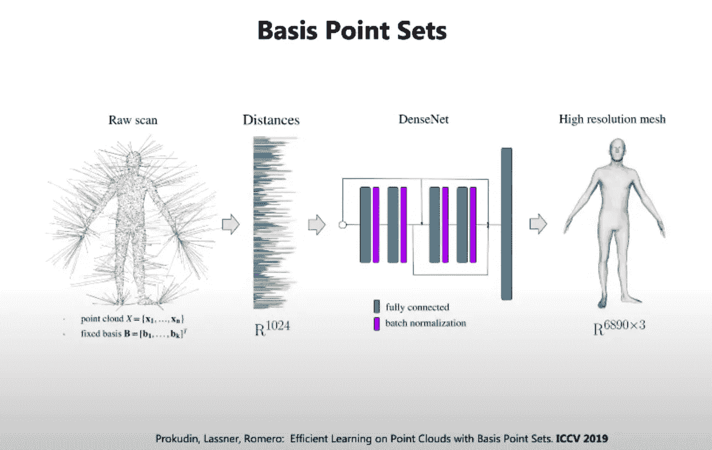

[source](https://www.youtube.com/watch?v=zJ1hbtMHGrw)

他们用到空间中固定基点的距离对原始身体点云进行编码，然后使用简单的 MLP，使用编码从 [SMPL-X](https://smpl-x.is.tue.mpg.de/) 推断全身高分辨率网格。固定的基点意味着对于每个*不同的*输入身体点云，我们将计算到空间中*相同的*点的距离。在原始论文中，固定点的数量是 1024，而在位置论文中，这个数字上升到 10k。正如您在幻灯片中看到的，在不了解人所在场景的情况下，创建这样的编码是可能的。但是作者走得更远，给了我们创建人-场景交互表示的方法。

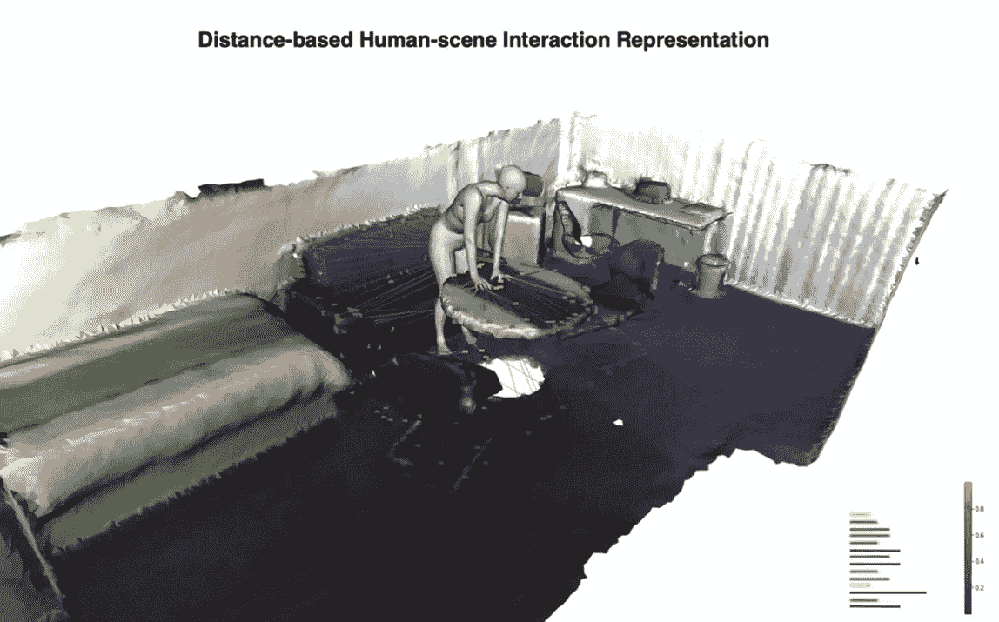

**Scene BPS** and **BPS features (**[**source**](https://www.youtube.com/watch?v=zJ1hbtMHGrw)**)**

给定一个场景网格(3D 环境)和一个人体网格，可能[在场景顶点](https://www.arxiv-vanity.com/papers/2008.05570/)上有基点。由此衍生出两个定义**场景** **BPS** —场景上设置的固定基点和 **BPS 特征** —基点到人体网格顶点的距离。在这个[视频](https://youtu.be/zJ1hbtMHGrw?t=110)中，你可以看到环境中固定的一组点和不同的身体实际上有不同的一组距离，因为不同的姿势有不同的 BPS 特征。

## 基于距离的人体网格生成器

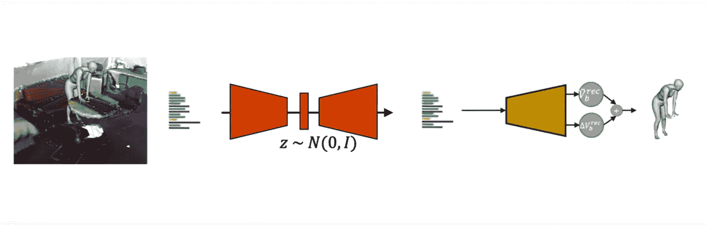

Human mesh generator architecture ([source](https://www.youtube.com/watch?v=zJ1hbtMHGrw))

为了创造一个能制造出似是而非的人体的发生器，作者提出了以下途径。给定场景和人类网格，他们计算 BPS 特征(距离)并训练**变分自动编码器** ( **VAE** )来重建这样的距离。从这一点，重建的身体特征去 MLP 回归到完整的身体顶点。MLP 输出两个东西:所有身体顶点的全局 3D 平移和中间重建顶点，它们的总和给出重建的身体顶点。本文所有训练使用的初始数据源是 [PROX](https://prox.is.tue.mpg.de/) 数据集。

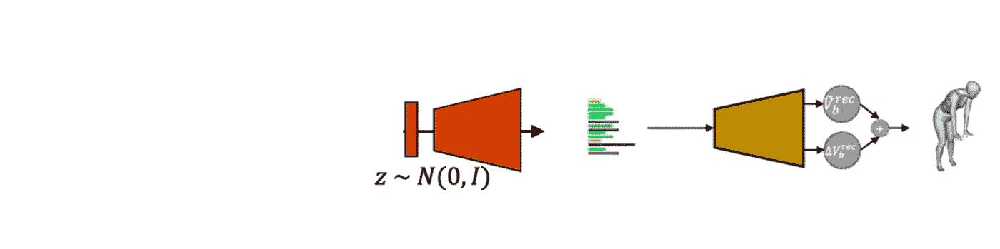

Generation pipeline ([source](https://www.youtube.com/watch?v=zJ1hbtMHGrw))

在测试过程中，可以从高斯分布中抽取随机向量，并将其传递给 VAE 解码器。这给了我们一个人体网格生成管道。

人们可能会注意到，这个模型只对场景网格上的*单个场景*和*单个* *固定点集*有效。在上面提到的对 VAE 的简短介绍之后，我们将讨论作者们打算如何克服这个问题

## 变分自动编码器简介

这项工作使用 VAEs 来重建人类网格，正如我们稍后将看到的环境表现。为了达成共识，让我们快速讨论一下 VAE 是如何工作的。

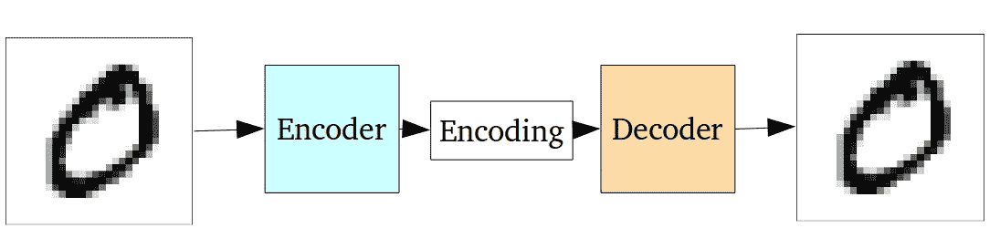

Work example of autoencoder on one of the [MNIST](https://en.wikipedia.org/wiki/MNIST_database) images

标准自动编码器由编码器和解码器两部分组成。编码器将三维网格等高维数据压缩成低维表示，通常压缩成大小为 *N.* 的向量，解码器则相反，将这个向量扩展成原始数据。这两个是使用*重建损失联合训练的神经网络。*这种损失改善了编码器丢弃不必要信息的能力和解码器创建接近源数据的输出的能力。

可以使用自动编码器作为类似于训练数据的新数据样本的生成器。但是普通自动编码器的解码器只能从训练过程中出现的潜在向量中产生有效数据。为了克服这些限制，我们可以使用**变型自动编码器**或 **VAEs**

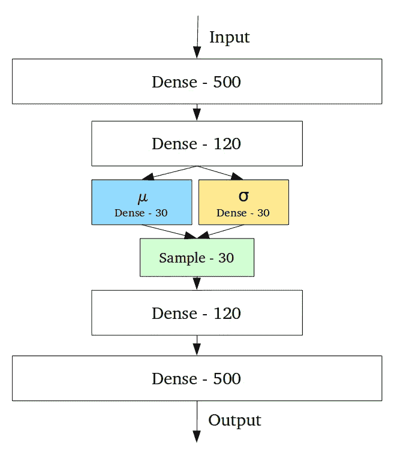

VAE encodes parameters of distribution instead of samples

看一下来自[这个](https://towardsdatascience.com/intuitively-understanding-variational-autoencoders-1bfe67eb5daf)帖子的图片。在网络中间，我们看到 **μ** 、 **σ** 和**样本**。两个模型之间的主要区别在于，每个输入的普通 AE 产生一个长度为 30 *的潜在表示，例如*，而 VAE 创建两个正态分布参数向量(mu 和 sigma)。输入片段的确切潜在表示将是在**样本**层获得的 30 个随机变量的实现。

这使得我们的编码偏差稳健，因为在这种情况下，解码器被教导不仅为一个向量预测相同的输出，而且为潜在空间中的一组接近点(分布在 **μ** 周围，偏差为 **σ** )预测相同的输出。这整件事就是用两个损失训练出来的:*重建*和 *KL 发散。*在这种情况下，后者用于强制所有参数 **μ，σ** 偏离标准正态偏差更小(指参数 **0，I** )。你可以在这里了解更多关于这些损失如何加权的信息[。](https://stats.stackexchange.com/questions/332179/how-to-weight-kld-loss-vs-reconstruction-loss-in-variational-auto-encoder?newreg=fe83a46ff69d4f63953ea3b8fc346d23)

## 基于距离的两阶段人体场景编码

回到人类生成的任务，这是不可能不同意，它是非常可取的，能够生成人类不是在唯一的场景，而是在任何给定的场景。为了克服这样的问题，afters 提出使用使用基点和 VAE 的相同技术来编码场景上的人体和场景本身。

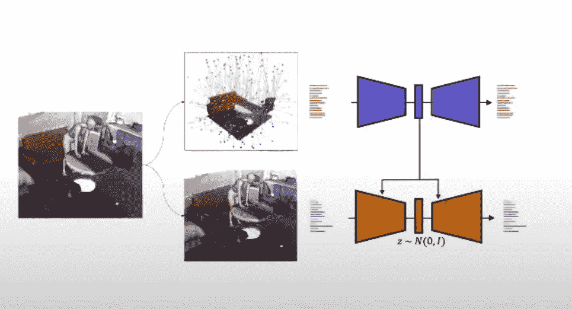

Distance based encoding of the scene (in blue, upper most) and of the human body in (in orange, bottom) ([source](https://www.youtube.com/watch?v=zJ1hbtMHGrw&t=345s))

基点固定在三维空间中立方体笼子的墙壁和天花板上。相同的一组基点用于来自 PROX 数据集的输入场景的任何裁剪。这种方法有助于了解人体网格周围的环境和身体特征本身。人类自动编码器变成了一个**条件 VAE** ，因为它受场景潜在向量的制约。在实践中，这种调节可以通过在将来自两个网络的潜在向量传递到人类发生器的解码器之前将其级联来实现。

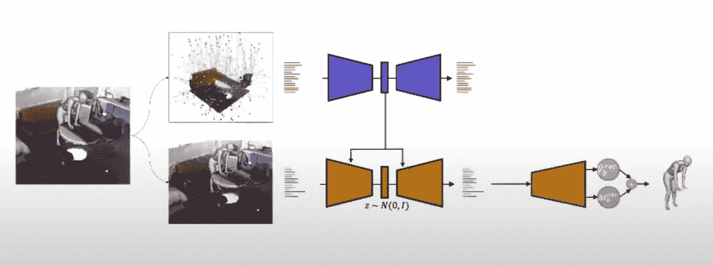

The rest of the network stays the same ([source](https://www.youtube.com/watch?v=zJ1hbtMHGrw&t=345s))

在提出的两个 VAEs 之上，仍然有 MLP 回归高分辨率人体网格。根据作者的说法，这种方法导致了好的结果，但是当他们增加一个条件时，结果会变得更好。

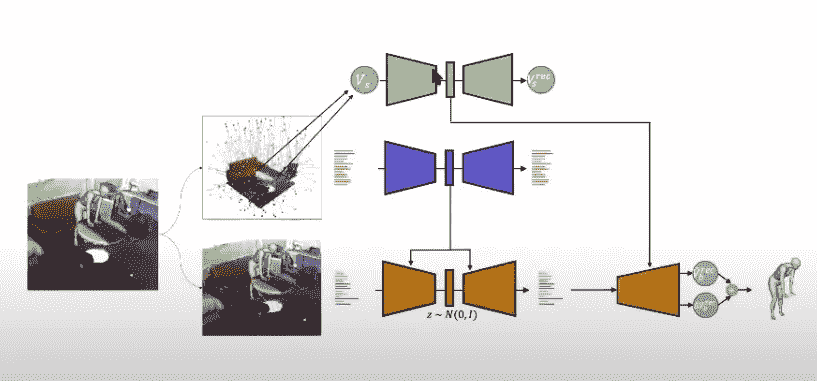

VAE for absolute (x,y,z) locations of the scene (in green, upper most) [(source)](https://arxiv.org/abs/2012.12877)

研究人员提出不仅用距离，而且用网格表面的绝对 *(x，y，z)坐标*对场景进行编码。负责这种编码的其他 VAE 及其潜在向量被馈送到流水线末端的回归 MLP

## 基于交互的优化

全位置方法的最后一步是基于交互的优化。

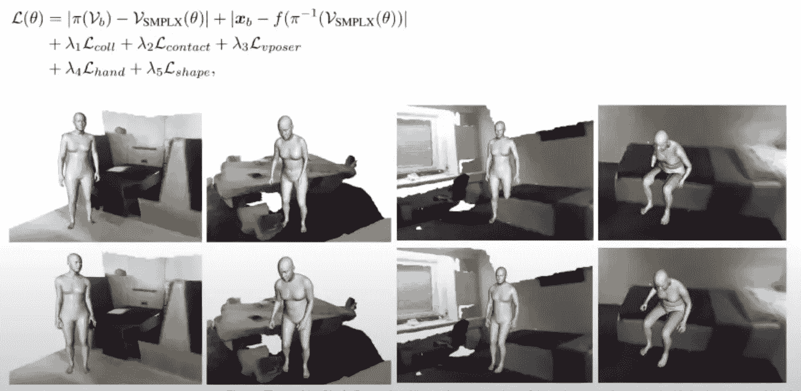

Top row: results before optimization, bottom row: after optimization [(source)](https://arxiv.org/abs/2012.12877)

它们在身体形状的**θ**参数上引入了复杂的损失。这种损失一方面有助于克服相互渗透(如右数第三列)，另一方面迫使网络产生更自然的身体姿势(见第一列)。

# 结果评估

为了评估结果的质量，作者让评估者参与进来。他们编写了一个工具，用户可以在其中比较两个不同的人体网格，并决定哪个模型是

*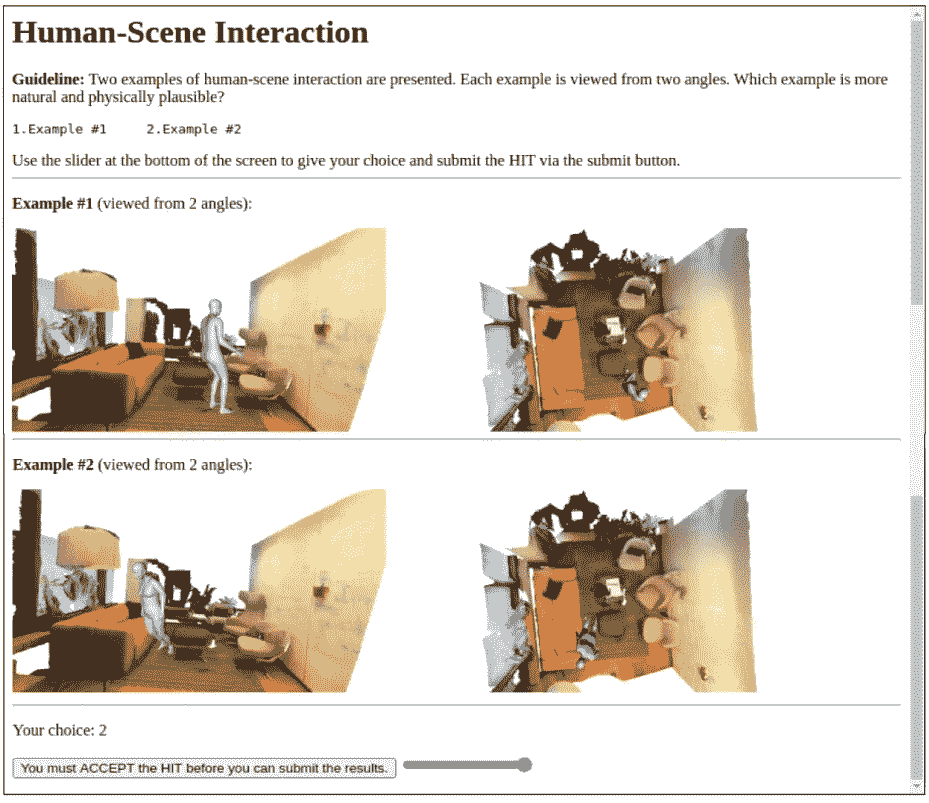*

*Comparison tool [(source)](https://arxiv.org/abs/2012.12877)*

*这导致了以下结果*

*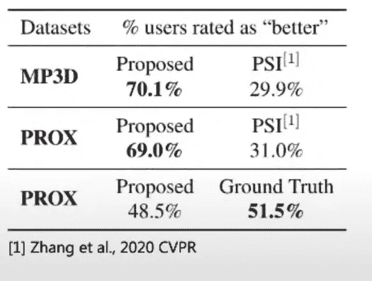*

*[Source](https://arxiv.org/abs/2012.12877)*

*在评估阶段，大约 70%的用户认为在两个数据集上，提出的模型比以前的模型好于 [PSI 模型](https://arxiv.org/abs/1912.02923)(来自相同作者)。非常令人鼓舞和有趣的是，48.5%的用户认为人造人比地面真相本身更可信。您可能还会注意到，结果仅适用于 PROX，并且模型是在 PROX 上训练的。*

# *给我看看代码！*

*本文展示了三维人体形状生成领域的重大成果。这些结果可能对研究室内 3D 模型的研究人员和开发人员有用，也许我们会在不久的将来看到虚拟辅助技术或计算机游戏中使用类似的方法，谁知道呢。但是今天你可以复制这个结果，因为作者提供了他们在 github 上实验的代码库。*

# *参考*

*[1]地点:在 3D 环境中近距离学习发音和接触【https://arxiv.org/abs/2012.12877 *

*[2]直观理解变分自动编码器【https://medium.com/r? URL = https % 3A % 2F % 2f towards data science . com % 2f 直观-理解-变分-自动编码器-1bfe67eb5daf*