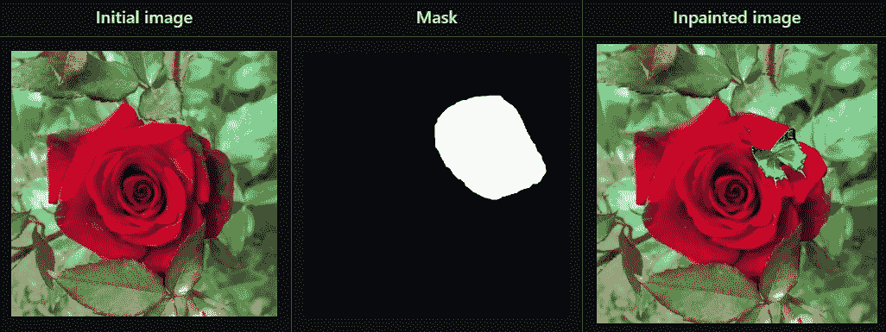

# 稳定扩散的游乐场

> 原文：<https://medium.com/mlearning-ai/playground-for-stable-diffusion-d6954e8477a4?source=collection_archive---------0----------------------->

> 使用稳定扩散模型生成图像和视频的简单指南

嗨，让我们来看一篇关于稳定扩散和使用的简短的资料性阅读。这篇文章是为对计算机视觉和深度学习感兴趣，需要为他们的工作创建图像资产，或者对应用扩散模型构建他们的应用感兴趣的内容创建者和开发者写的。这篇文章不会深入稳定扩散背后的数学、建筑和研究。如果您有兴趣了解详细信息，链接附在参考资料部分。

## 介绍📜

什么是“扩散”？

根据维基百科，“扩散是任何东西(例如，原子、离子、分子、能量)通常从一个浓度较高的区域到一个浓度较低的区域的净运动。”

类似于定义，在前向扩散过程中，扩散模型逐渐将噪声应用于图像，直到图像变成完全的噪声。这实质上是扩散图像中的像素。在反向扩散过程中，噪声图像在相同的步骤中被去噪，直到数据被恢复。因为这是一个连续的过程，所以发生[模式崩溃](https://developers.google.com/machine-learning/gan/problems)(GANs 的问题)的可能性较小。

## 潜在扩散模型🧙‍♂️

潜在扩散模型由 GAN 结构、扩散模型和变压器模型构成。大多数扩散模型使用 U-Net 架构来保持图像的维度。通常，扩散模型应用像素空间中的扩散，但是稳定扩散模型应用潜在空间中的扩散。因此，术语“潜在扩散模型(LDM)”。使用转换器(编码器和解码器)完成像素空间到潜在空间的转换。与以前的方法相比，这种方法的内存效率高，并且还能生成非常详细的图像。

## 使用🏃‍♂️

我们将使用 Github 库[稳定扩散操场](https://github.com/Logeswaran123/Stable-Diffusion-Playground)来实现稳定扩散模型的不同应用模式。

在撰写本文时，该存储库支持 5 种模式，
1。文本到图像
2。图像到图像
3。修补
4。梦想
5。有生命的

让我们详细了解一下每个模式及其用法。

## 代码要求

遵循存储库中的 [readme](https://github.com/Logeswaran123/Stable-Diffusion-Playground/blob/main/README.md) 代码需求部分并设置环境。这是本文后面几节的基本部分。

## 拥抱脸访问令牌

[稳定扩散游乐场](https://github.com/Logeswaran123/Stable-Diffusion-Playground) codebase 使用拥抱脸下载模型并使用它们的 API。要使用 hugging face hub，用户必须创建一个访问令牌来验证其身份。为此，在 huggingface.co 的[创建一个账户。然后，进入设置- >访问令牌。创建具有读取权限的访问令牌。](https://huggingface.co/)

创建的访问令牌将由应用程序的模式使用。当提示输入访问令牌时，从“设置”->“访问令牌”中复制并使用它。请不要公开共享访问令牌。

## 文本到图像模式


Text to Image result

给定输入提示，该模式将基于提示描述生成图像。运行以下命令启动文本到图像模式的应用程序，

```
python run.py --mode txt2img --device gpu --save
```

遵循命令行界面提供拥抱脸用户访问令牌，输入提示和要生成的图像的分辨率。

## 图像到图像模式


Image to Image result. Left is original input image. Right is generated image based on prompt and input image.

给定输入提示和图像，该模式将根据提示描述修改输入图像。运行以下命令启动图像到图像模式的应用程序，

```
python run.py --mode img2img --device gpu --save
```

遵循命令行界面提供拥抱脸用户访问令牌，输入提示，输入图像和强度。“强度”将接受[0，1]范围内的值，其中 0 表示与初始输入图像相比没有变化，1 表示基于输入提示与初始输入图像相比完全变化。

## 修复模式



Inpaint result. Left is initial input image. Center is mask image. Right is generated image based on prompt, initial image and mask image.

给定一个输入提示、一个初始输入图像和一个掩码图像，该模式将只根据掩码图像指定区域的提示描述修改输入图像。运行下面的命令来启动修复模式的应用程序，

```
python run.py --mode inpaint --device gpu --save
```

遵循命令行界面提供拥抱脸用户访问令牌，输入提示，输入图像，面具图像和力量。“强度”将接受[0，1]范围内的值，其中 0 表示与初始输入图像相比没有变化，1 表示基于输入提示与初始输入图像相比完全变化。

## 梦想模式

给定输入提示，该模式将根据提示描述生成视频。运行下面的命令来启动梦想模式的应用程序，

```
python run.py --mode dream --device gpu --save --num <number of frames>
```

<number of="" frames="">表示生成的视频所需的帧数。</number>

遵循命令行界面提供拥抱脸用户访问令牌，输入提示和分辨率的视频生成。

这种模式的工作方式是在固定数量的步长上对潜在值进行球面插值，并将潜在值作为初始输入潜在值提供给模型。这在生成的帧中产生小的变化，保持帧之间的一致性。因此，视频感觉像是由模型想象出来的梦幻效果。

## 动画模式

这种模式与其他模式的不同之处在于它的用途和体系结构。动画模式支持基于输入提示的 2D 和 3D 视频生成。这种模式也支持视频作为输入，并根据输入提示将视频转换成一种风格。运行以下命令启动动画模式的应用程序，

```
python run.py --mode animate --device gpu --save
```

遵循命令行界面提供拥抱脸用户访问令牌。需要在 [animation_mode/config.py](https://github.com/Logeswaran123/Stable-Diffusion-Playground/blob/main/animation_mode/config.py) 文件中设置模式的提示和配置。浏览[自述文件](https://github.com/Logeswaran123/Stable-Diffusion-Playground/tree/main/animation_mode)以更好地理解配置及其用法。

## 演示视频

## 结论

潜在扩散模型在图像生成方面向前迈进了一步，生成了具有极端细节的高分辨率图像，同时还保留了图像的语义结构。

[稳定扩散操场](https://github.com/Logeswaran123/Stable-Diffusion-Playground)应用是扩散模型领域突破性研究和发展的结果。感谢令人惊叹的创作者和开发者开源了论文、项目和模型，供每个人实验、用于各种应用并改进之前的作品。

## 参考

[1]罗宾·龙巴赫，安德烈亚斯·布拉特曼，张秀坤·洛伦茨，帕特里克·埃塞尔，比约恩·奥姆，“利用潜在扩散模型的高分辨率图像合成”，arXiv:2112.10752，2021

[2]布拉特曼等人。艾尔。，潜在扩散模型，[https://github.com/CompVis/latent-diffusion](https://github.com/CompVis/latent-diffusion)，2022

[3] Logeswaran Sivakumar，稳定扩散游乐场，[https://github . com/Logeswaran 123/Stable-Diffusion-Playground](https://github.com/Logeswaran123/Stable-Diffusion-Playground)，2022

[4]抱脸稳定扩散，[https://github . com/Hugging Face/diffusers/tree/main/src/diffusers/pipelines/Stable _ Diffusion](https://github.com/huggingface/diffusers/tree/main/src/diffusers/pipelines/stable_diffusion)，2022

[](/mlearning-ai/mlearning-ai-submission-suggestions-b51e2b130bfb) [## Mlearning.ai 提交建议

### 如何成为 Mlearning.ai 上的作家

medium.com](/mlearning-ai/mlearning-ai-submission-suggestions-b51e2b130bfb)