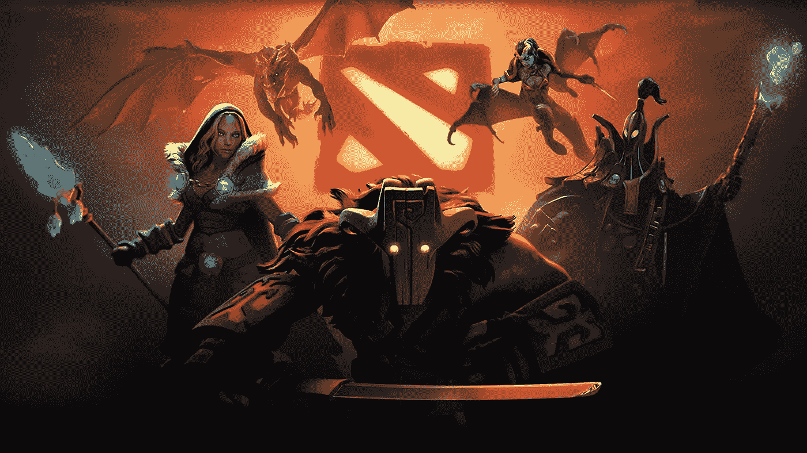
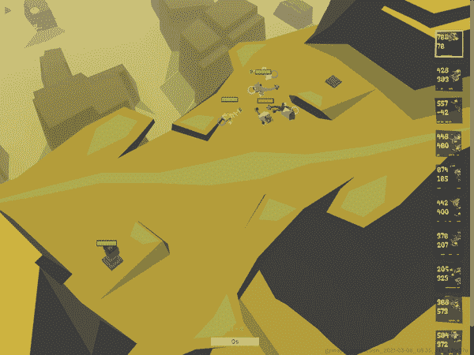
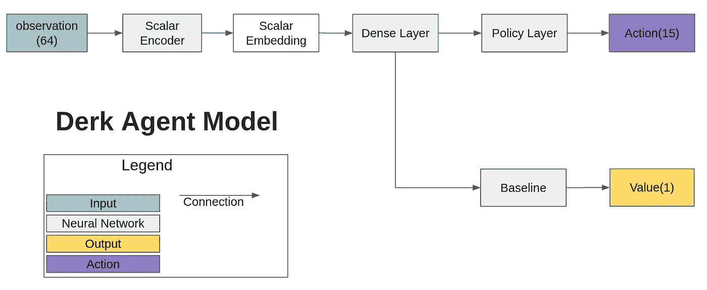
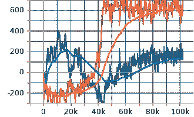

# 使用深度强化学习玩 MOBA 游戏—第 1 部分

> 原文：<https://medium.com/mlearning-ai/playing-moba-game-using-deep-reinforcement-learning-part-1-106e60aa4110?source=collection_archive---------2----------------------->

image from [wallpapercave](https://wallpapercave.com/dota-2-wallpapers)

MOBA 是目前最受欢迎的游戏类型之一，还有 RTS 和 MMORPG。不像 RTS 游戏，MOBA 游戏有固定数量的单位可以由用户控制。然而，随着游戏的进行，单位可以通过等级和物品系统成长。在这个系列中，我们将通过代码示例学习如何为 MOBA 游戏制作深度强化学习代理。

DOTA2 是研究中最常用的 MOBA 游戏，因为它有 Python API 和大量参考资料。然而，由于 DOTA2 的庞大规模，很难轻松检查深度强化学习是否有效。因此，我将介绍小型 MOBA 游戏称为德克游戏第一。在确认 DRL 算法适用于小型游戏后，我将解释如何将其扩展到大型游戏。

# 热身

德克博士的变异战场是一个游戏，3 个德克林为了通过攻击或杀死敌人的塔来获得更多分数而与其他德克林战斗。为此，他们可以使用各种物品，如武器、盾牌、状态物品和治疗物品。它具备成为 MOBA 游戏的所有要素。此外，它默认支持深度强化学习所需并行环境功能。

The Dr. Derk’s Mutant Battleground

我们将使用 Google Research 的一个[种子 RL](https://github.com/google-research/seed_rl) 作为主要的训练方法。它基本上是演员-评论家算法，使用 V-trace 来使用非策略数据。让我们使用 Seed RL 培训 Derk 环境。你需要访问下面的 GitHub 链接和 Derk 游戏的下载文件夹。

1.  [https://github . com/Kim bring 2/MOBA _ RL/tree/main/dr-derks-突变体-战场](https://github.com/kimbring2/MOBA_RL/tree/main/dr-derks-mutant-battlegrounds)

Derk 游戏的神经网络结构由三个 DNN 组成，分别用于观察处理、动作选择和 DRL 训练。

Derk Network Structure

因为最初的种子 RL 是为一个代理人训练准备的，我们需要为 MOBA 风格的游戏运行两个种子 RL。

Reward graph of Derk game

反正你按照 GitHub 上的解释，1 到 2 小时内就可以查看到左图所示的奖励图。

在德克游戏的情况下，即使一个德克林装备了 HP 恢复物品，所有的德克林在训练结束时也只会用武器攻击对手。

Training Result Video

# 结论

在这篇文章中，我们简要探讨了如何使用深度强化学习来训练 MOBA 游戏。

如果游戏变大，网络大小，参数应该改变。此外，我们不可避免地要实现基于规则的方法。然而，基本的训练方法是一样的。

 [## Mlearning.ai 提交建议

### 如何成为 Mlearning.ai 上的作家

medium.com](/mlearning-ai/mlearning-ai-submission-suggestions-b51e2b130bfb)