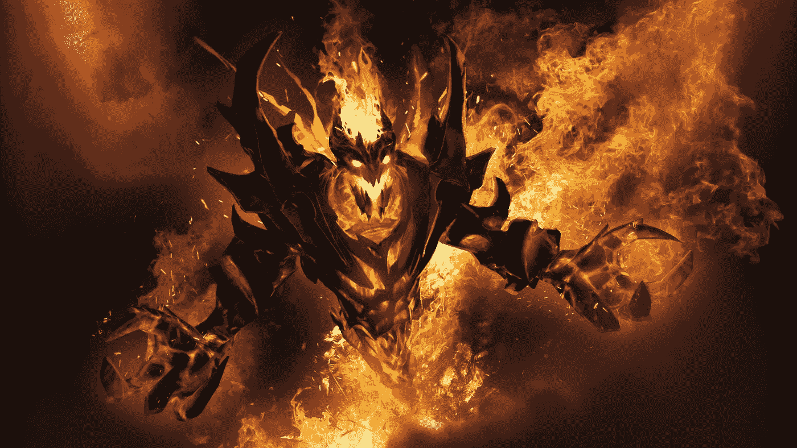
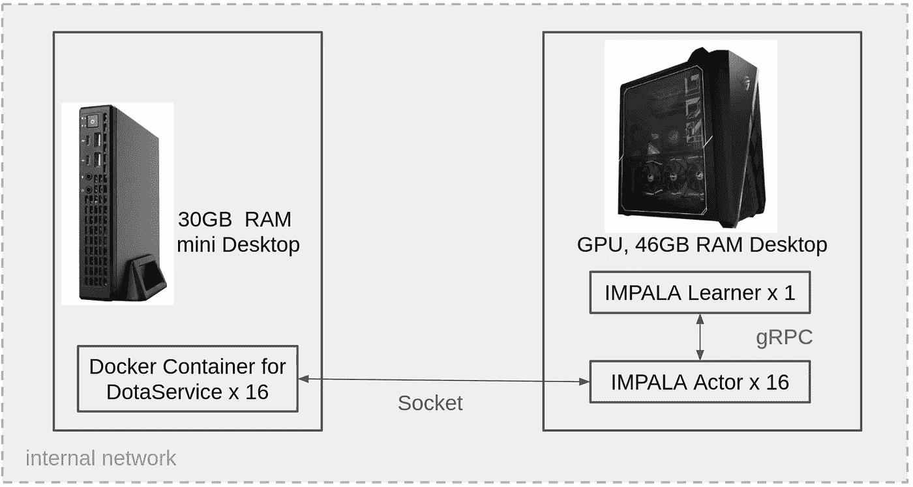
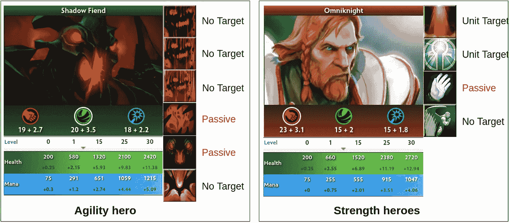
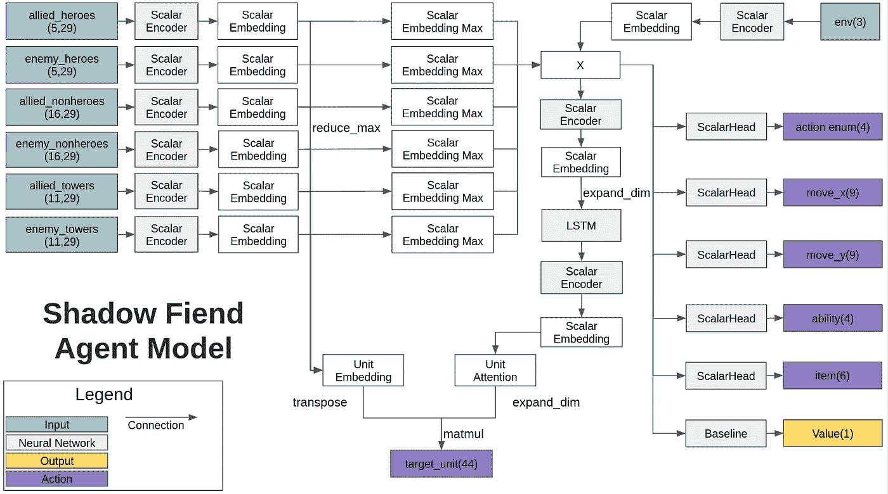
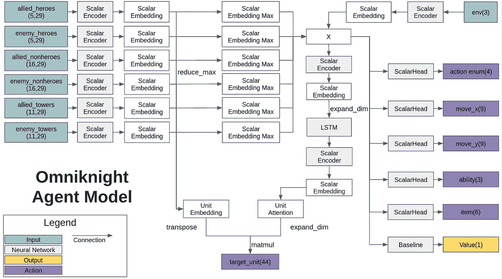
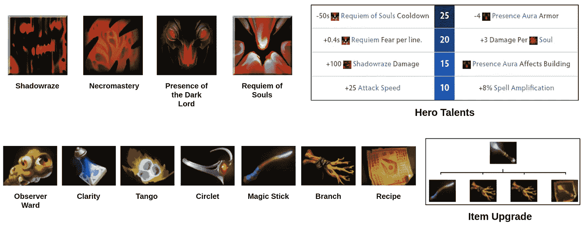
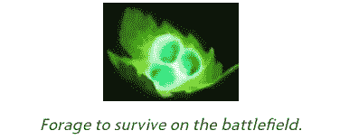
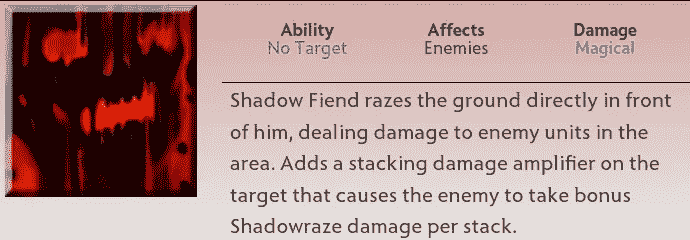
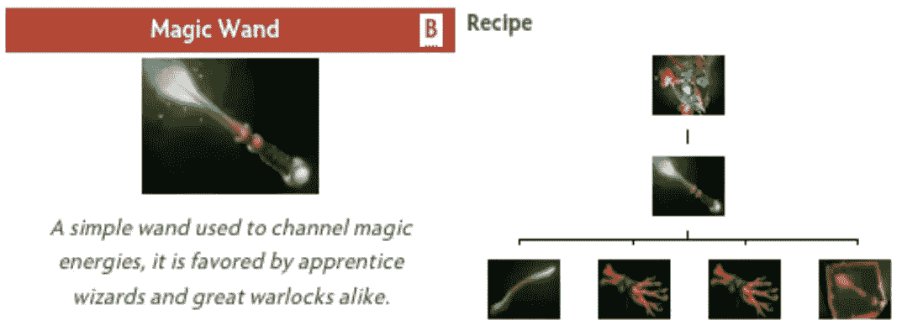
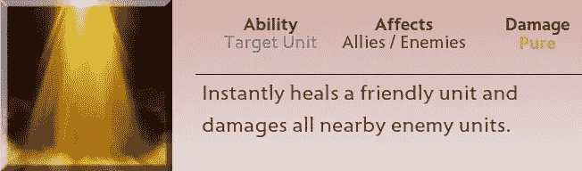

# 使用深度强化学习玩 MOBA 游戏—第二部分

> 原文：<https://medium.com/mlearning-ai/playing-moba-game-using-deep-reinforcement-learning-part-2-a31573b0a48d?source=collection_archive---------2----------------------->

image from [wallpapercave](https://wallpapercave.com/dota-2-wallpapers)

在上一篇文章中，我们学习了如何使用深度强化学习来训练一个简单的 MOBA 游戏。在这篇文章中，我将解释在将同样的方法应用于 Dota2 之前我们需要知道的事情。

这篇帖子的代码可以在这里找到:[https://github . com/Kim bring 2/MOBA _ RL/blob/main/dota 2/env _ test . py](https://github.com/kimbring2/MOBA_RL/blob/main/dota2/env_test.py)

你只需要在同一台电脑上运行 DotaService 和代码。

# 培训环境

与 Derk 训练不同，Dota2 的每个无头环境都需要 1GB 以上的 RAM 内存。因此，最好使用单独的 PC 运行环境，因为 DRL 培训通常在有许多环境时更好。当然，GPU 对于那台 PC 是不必要的，因为我们在这里不运行训练代码。

My Training Setting for Dota2

对于种子 RL 的 PC，需要 GPU，我们将在这里使用张量流。如果我们知道相同路由器情况下的 IP 地址，则 DotaService 和 Seed RL 之间的通信可以通过套接字通信来实现。

# 网络结构

Dota2 和 Derk 的第一个区别是每个英雄都有自己独特的能力和地位。这意味着我们需要为每个英雄编写不同的代码。

Dota2 Difference of Each Heroes

在暗影恶魔的例子中，总共有 4 种非被动类型的能力。因此，能力行动网络有 4 个输出。

Network of the Shadow Fiend

另一方面，Omniknight 网络只需要 3 个输出。

Network of the Omniknight

在观察网络的情况下，没有必要改变它们，因为所有的英雄都处于相同的条件下。

# 管理项目和能力

第二，这里 Dota2 可以在游戏时间选择各种物品和能力。

Dota2 example of item and ability

此外，每个项目都有不同的目标和活动方法。

Tango item of Dota2

例如，探戈是最基本的项目，可以在游戏开始时在商店购买。英雄可以在附近的一棵树上使用它来恢复生命值。

英雄可以购买和使用探戈物品，如下面的视频。

Example of using the Tango item

每种能力也有不同的目标和活动方式。

Shadowraze ability of Dota2

暗影夷平是暗影恶魔英雄的基本技能。这种能力不需要目标。相反，英雄可以对敌人远距离施放

最好是当敌人英雄或怪物在它的范围内时使用这个技能，就像下面的视频。

Example of using the Shadowraze ability

Dota2 的英雄可以通过使用配方系统将低等级物品升级到高等级。

Item upgrade system of Dota2

下面的视频展示了如何从食谱中获得魔杖。

Example of obtaining the magic wand from recipe

与地图尺寸较小的 Derk 游戏不同，Dota2 的起点和战斗点之间的距离较长。

Town Portal Scroll of Dota2

因此，英雄应该使用城镇传送门卷轴快速加入和退出战斗。英雄在游戏开始时收到一个 TP 卷轴，使用后必须从商店购买。

下面的视频展示了如何使用 TP 卷轴快速从战斗点回到起点。

Example of using the Town Portal Scroll

城镇传送门卷轴通常用于逃离紧急情况。对于不需要每次都移动到起点的快速物品购买，英雄可以使用快递运送物品。

Courier of Dota2

如果 hero 不在店里，而你买了一件东西，它会被存放在 stash 里。快递员可以在这里取回物品，也可以在秘密商店购买物品交给英雄。

下面的视频展示了战斗点的英雄如何在不使用信使移动到起点的情况下获得物品。

Example of using the Courier

在 MOBA 游戏中，有一个英雄主要负责攻击，其他有支援能力的英雄可以辅助他们。

Purification ability of Omniknight

比如全骑士英雄有恢复同队 HP 的能力打得好。

下面的视频是一个恢复同队英雄 HP 的例子。

Example of using the Purification

# 结论

在本帖中，我们看到如何使用与 Dota2 的物品和能力相关的功能。在下一篇帖子中，我将解释如何将这样的功能与以前的深度强化学习结合起来使用。

 [## Mlearning.ai 提交建议

### 如何成为 Mlearning.ai 上的作家

medium.com](/mlearning-ai/mlearning-ai-submission-suggestions-b51e2b130bfb)