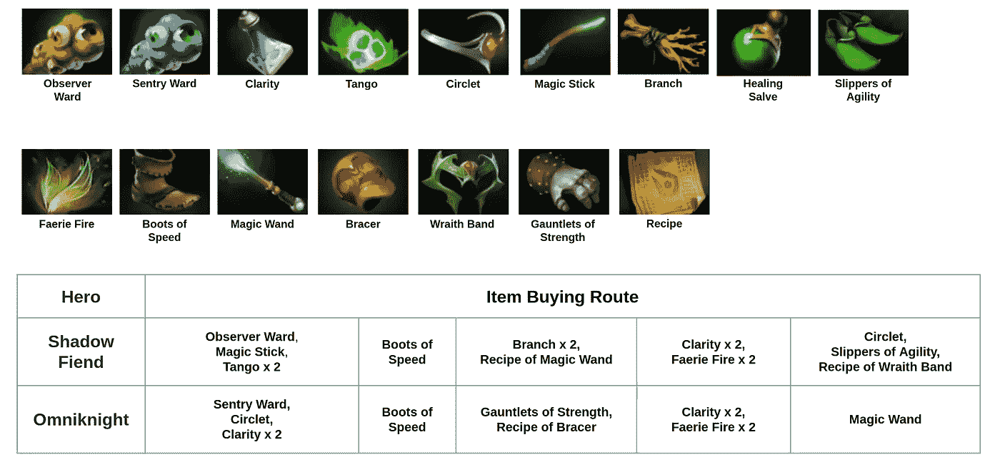
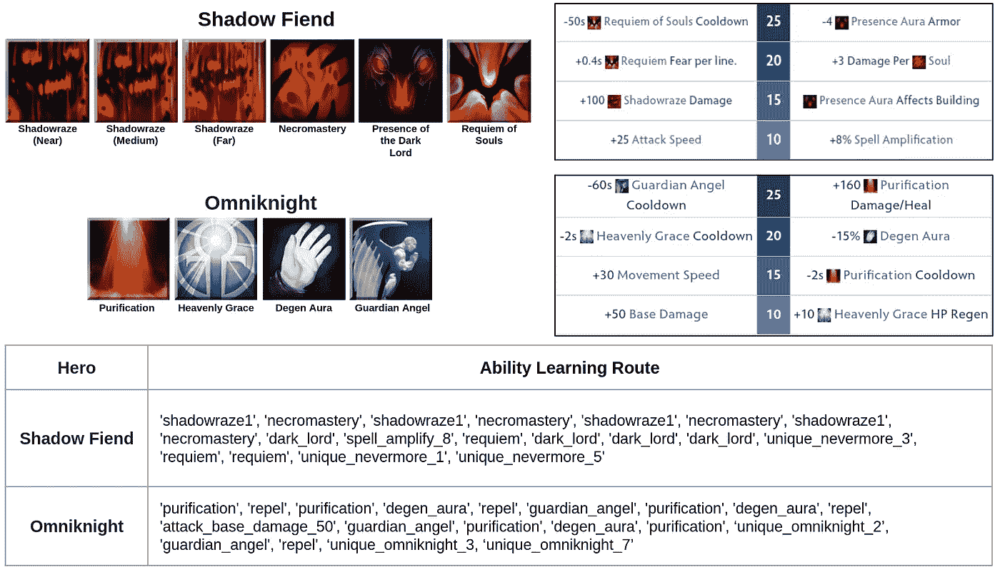
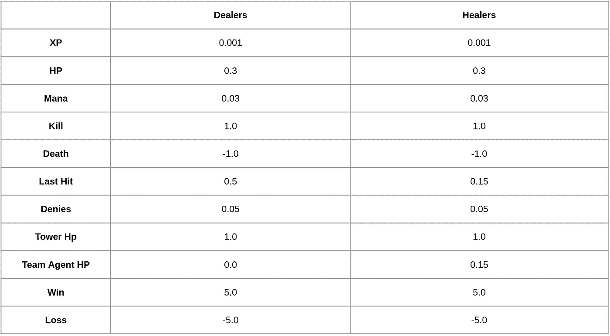
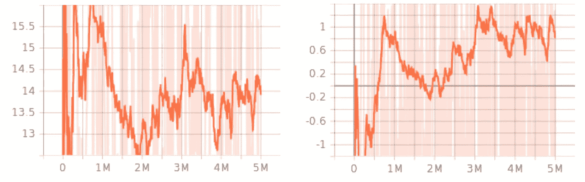

# 使用深度强化学习玩 MOBA 游戏——第三部分

> 原文：<https://medium.com/mlearning-ai/playing-moba-game-using-deep-reinforcement-learning-part-3-f5b19b2f984f?source=collection_archive---------4----------------------->

image from [wallpapercave](https://wallpapercave.com/dota-2-wallpapers)

在前两篇文章中，我们准备了使用深度强化学习来训练大规模 MOBA 游戏所需的基本组件。在本帖中，我们将看到如何结合 Dota2 和 Seed RL 的代码。

你可以在 https://github.com/kimbring2/MOBA_RL/tree/main/dota2 找到这篇文章的代码。

# 基于学习的 Dota2 代码

Derk 和 Dota2 网络的主要区别在于动作网络的数量。在前一种情况下，只使用一个网络，因为游戏简单。然而，后者需要使用六个网络进行行动选择。因此，在 Seed RL 代码中创建代理网络时，需要进行以下更改，以反映不同的。

Dota2 Agent Network

像 Derk 代理的情况一样，Dota2 代理将来自参与者的观察发送给学习者以选择动作。区别在于动作由多个参数组成。因此，我们必须将它们组合起来，以生成最终的操作，并将其发送到环境步骤。

Dota2 Action Selection from RL

演员兼评论家 DRL 在训练时将从所选动作的对数概率值计算的损失用于策略分布。因此，您还需要计算添加动作的损失。

Dota2 Loss Calculation

# Dota2 的基于规则的代码

在 Dota2 中，与 Derk 不同，agent 需要在游戏过程中获取物品和能力。我把物品和能力的名称保存在列表中，当英雄的黄金和等级满足一定条件时按顺序使用，因为这部分用 DRL 实现有点困难。

Item buying route of each hero

Ability learning route of each hero

Dota2 Action Selection from Rule

# 奖励设置

DRL 的一个重要的事情是奖励设置。根据我们的奖励，代理将学习一种完全不同的行为。不像 Derk 那样从环境内部自动计算奖励，我们需要从原始观察中计算奖励。

Reward Table

强化学习的奖励基本上是为了获得经验。另外，对敌方单位造成伤害和对己方单位造成恢复的代理对最后一击有不同的权重。最后，根据游戏结果给予巨额奖励，以设定整个游戏过程中的长期策略。

Reward example for ShadowFiend

我们可以使用的最基本的奖励成分是经验值、生命值和最后一击，也就是英雄在最后一次攻击中杀死怪物并获得金币的次数。

# Dota2 的训练结果

如果你用我们在 2 天内设置的基本奖励来训练代理，你可以看到两个代理的奖励增加到某一点，如下图所示。

Reward Graph of Basic Reward Set

仅使用图表无法完全确认培训是否成功完成。因此，我们需要启动游戏客户端来直观地查看代理的行为，如下图所示。

Evaluation Result of Agent

我们可以看到英雄移动到中间通道，那里的小兵只是来战斗以获得经验值，即使我们没有使用任何基于规则的代码来移动和攻击，

# 结论

在这篇文章中，我们看一下我们需要修改和添加什么，以便像 Derk 一样使用 DRL 来训练 Dota2。如您所见，我们需要在 Dota2 中使用基于规则的小方法进行项目和能力管理。对于英雄的移动和攻击，我们可以使用 DRL。此外，我们检查，与 Derk 相比，训练时间相当长。

 [## Mlearning.ai 提交建议

### 如何成为移动人工智能的作者

medium.com](/mlearning-ai/mlearning-ai-submission-suggestions-b51e2b130bfb)