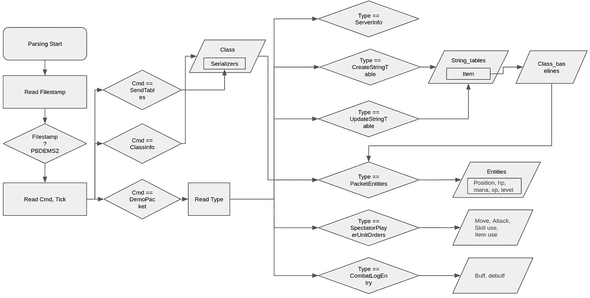

# 用深度强化学习玩 MOBA 游戏——第四部分

> 原文：<https://medium.com/mlearning-ai/playing-moba-game-using-deep-reinforcement-learning-part-4-5fdfbff753df?source=collection_archive---------3----------------------->

Image From [Wallpapercave](https://wallpapercave.com)

在以前的帖子中，我们使用深度强化学习来训练一个代理，以赢得限于中间车道的游戏。

在 Dota2 有大量状态和动作的情况下，即使地图区域和英雄数量有限，训练也需要至少 1 周的时间。我们可以预计将需要一个多月的时间来训练代理人使用地图的所有区域和英雄。在这种情况下，我们可以首先通过监督学习用人类专家数据训练代理模型，然后将其用于强化学习以提高训练速度。

在 Dota2 的情况下，重放文件使用 Google Protobuf 协议保存为 dem 文件扩展名。

Flowchart of Dota2 replay parsing

我们可以根据 cmd、size 读取存储在 dem 文件中的数据，这些数据是在每个数据流的开头读取的。

Rendering replay information of Dota2

解析后的数据可以直接用于训练代理模型，也可以通过 GUI 显示，以便快速查看重放文件。

在这篇文章中，为了便于解释，我截取了一小部分代码。完整的代码可在这里，包括图形用户界面:[https://github.com/kimbring2/MOBA_RL/tree/main/dota2_replay](https://github.com/kimbring2/MOBA_RL/tree/main/dota2_replay)。

# 解析演示类型

解析从打开 dem 文件开始，检查 filestamp 是否是一个特定的单词。例如，Dota2 客户端 5550 版本记录的重播文件的文件标记是“PBDEMS2”。如果这一步通过了，我们可以进行下一步。

Filestamp read forDota2 replay file

下一步是通过读取 cmd 数据来决定下一个数据流使用哪种 Protobuf 协议。您可以在 demo.proto 文件中检查每个 cmd 的数据结构。

First part of demo.proto file

数据体大小由 cmd 之后读取的数据决定。对于 SendTables 或 ClassInfo，解析到此结束。然而，在 DemoPacket 的情况下，我们需要再解析一次数据体。

Demo type parsing for Dota2 replay file

## 1.解析发送表

在 Dota2 的情况下，数据有各种形式，如 int、float、string 和 array。当解析重放文件时，我们需要使用正确的解码器类型。

SendTables parsing part

发送表解析部分选择用于解析详细数据的解码器。

## 2.解析 ClassInfo

ClassInfo 部分选择 demo_class，稍后需要它来解析详细数据。

Parsing the ClassInfo data

# 解析演示数据包

在 DemoPacket 的情况下，我们需要像第一种情况一样按照这个顺序读取 cmd，size。然后，我们需要根据 cmd 决定需要哪种类型的 Google Protobuf，并根据大小读取数据。

Parsing the DemoPacket data

## 1.正在解析 ServerInfo

ServerInfo 信息的参数因客户端版本而异。

例如，当确定分组实体 cmd 处 class_id 的读取长度时，使用 max_classes。game_dir 可用于检查生成重放文件的客户机的信息。

## 2.解析 CreateStringTable

StringTable 是一种查找表，稍后在游戏中将 int 类型值转换为实际名称时会用到。

StringTable for Dota2 replay parsing

## 3.解析包潜力

PacketEntities 是 Dota 2 重播解析中最复杂和耗时的部分，在这里我们可以获得游戏中存在的所有英雄、npc、怪物、建筑的位置、hp、法力、物品、能力信息。

Information of hero entity

在英雄实体的情况下，信息由 id，位置，角度，经验，hp，法力，能力，物品组成。我们可以通过使用我们之前选择的解码器来分离那种信息。

## 4.解析 SpectatorPlayerUnitOrders

尽管我们可以从包潜力中获得关于游戏中所有实体的信息，但它不包含对监督学习至关重要的人类玩家行为。

Parsing SpectatorPlayerUnitOrders data

可以从 SpectatorPlayerUnitOrders 解析此信息。它们包括点击位置、使用物品和能力、攻击目标等。

## 4.解析战斗日志条目

英雄获得增益和减益，如果它接近的基础，塔或其他英雄有一个特定单位的光环。我们代理还需要使用该信息作为模型的状态。

Parsing the CombatLogEntry data from Dota2 replay

这些数据可以从 CombatLogEntry 中获得。实际上，那部分给出的值是 int 类型的。我们可以使用该值作为您之前获得的 StringTable 的索引，以查找实体的字符串类型名称。

# 结论

在这篇文章中，我们研究了如何从 Dota2 的重放文件中提取数据用于监督学习。我们可以使用这些信息来训练代理在特定的状态下遵循特定的动作。

 [## Mlearning.ai 提交建议

### 如何成为 Mlearning.ai 上的作家

medium.com](/mlearning-ai/mlearning-ai-submission-suggestions-b51e2b130bfb)