# PLDA

> 原文：<https://medium.com/mlearning-ai/plda-a07405127e3e?source=collection_archive---------1----------------------->

## 概率线性判别分析如何训练和推理

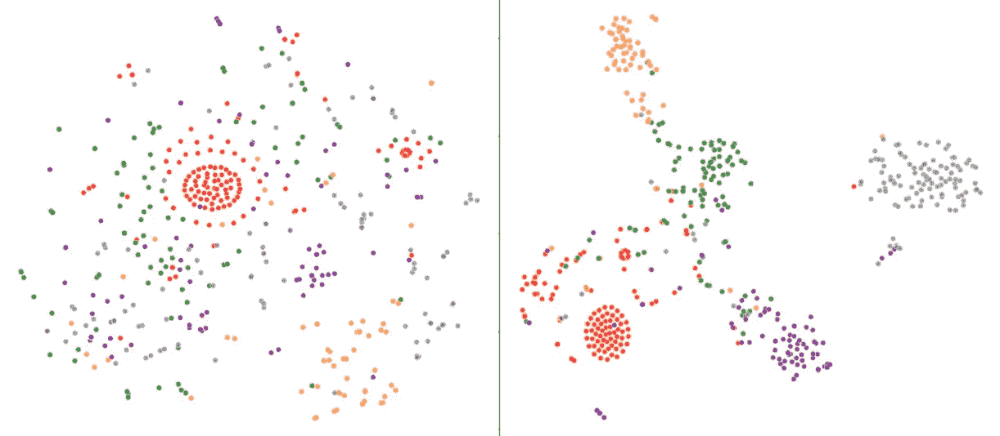

# 介绍

概率线性判别分析(PLDA)是一种降维技术，与线性判别分析(LDA)相比，它是一种进步。LDA 特征是作为训练 PLDA 的结果而得到的，但是它们具有附加到它们上面的概率模型，该概率模型自动地给予更有区别的特征更大的权重([源](https://link.springer.com/content/pdf/10.1007%2F11744085_41.pdf))。

这篇文章的目的是展示 PLDA 是如何被训练和用于推理的。最后用几个例子说明了 PLDA 如何用于分类和聚类。我假设你熟悉 [LDA](/nerd-for-tech/linear-discriminant-analysis-c24d9729d3d2) 的概念，并对 PLDA 有所了解。如果你对 PLDA 的介绍感兴趣，这里有一个很棒的[帖子](https://towardsdatascience.com/probabilistic-linear-discriminant-analysis-plda-explained-253b5effb96)。本帖的主要来源是原创的 PLDA [文章](https://link.springer.com/content/pdf/10.1007%2F11744085_41.pdf)和 python [实现](https://github.com/RaviSoji/plda)。

# 学习超参数

## 公式

学习 PLDA 参数包括几个步骤。一般来说，从数据中去除奇异点，计算散射矩阵。然后学习并存储必要的参数，用于将来的推断。

更详细地说，应遵循以下步骤([来源](https://link.springer.com/content/pdf/10.1007%2F11744085_41.pdf)):

*   将数据投影到主成分分析(PCA)子空间，以消除奇异点。这也是一种正则化，因为我们转换要素来描述大部分方差并减少它们的数量(我们使数据集更加“密集”)。
*   计算类内和类间散布矩阵(Sb 和 Sw)。
*   求广义特征向量的矩阵 W，使得:

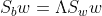

λ**代表特征值。矩阵 W 将用于计算将数据投影到 PLDA 子空间的投影/加载矩阵 A。还要注意，类内和类间散布矩阵的特征值可以通过以下方式计算:**

λb 和λw 都是对角线(对角线上下的所有其他值都将是 0)。

*   学习模型的 PLDA 参数 m(均值)、A(负载矩阵，等价地，方差φb 和φw，它们基本上是类内和类间散布矩阵)和ψ(协方差矩阵)，使得:

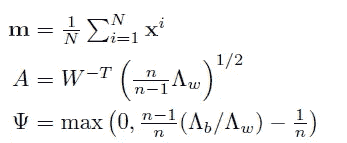

[source](https://link.springer.com/content/pdf/10.1007%2F11744085_41.pdf)

注意 n 是每类的平均例子数:n=(例子总数)/(类数)。矩阵 A(或者更准确地说是它的逆)将是把数据从原始空间转换到 PLDA 操作的潜在空间的矩阵。

*   为了降低维数，只保留ψ的 d 个最大元素，并将 rest 设置为零。

与 LDA 相比，PLDA 有更多的参数。但这可能是有益的，因为我们可以计算数据点属于某一类的概率。现在让我们用 python 实现训练。

## Python 实现

大多数代码样本都来自(或受其启发)库[这里](https://github.com/RaviSoji/plda)。我稍微修改了一些部分。python 中的分步实现:

*   执行`[PCA](https://scikit-learn.org/stable/modules/generated/sklearn.decomposition.PCA.html)`，这是 scikit-learn 的简单实现:

*   类内和类间散布矩阵的计算也非常简单:

请注意，它的结果与此处[的版本](https://github.com/RRisto/learning/blob/master/linear_algebra_learn/linear_discriminant_analysis/linear%20discriminant%20analysis.ipynb)相似(您可以在此处看到比较[，它们可能有不同的数值，但它们之间的余弦相似度实际上为 1，这意味着它们之间的角度为 0，它们指向相同的方向，因此非常相似)。](https://github.com/RRisto/learning/blob/master/linear_algebra_learn/linear_discriminant_analysis/scatter_matrices.ipynb)

*   可以使用`[scipy.linalg.eigh](https://docs.scipy.org/doc/scipy/reference/generated/scipy.linalg.eigh.html)`计算广义特征向量的 W:

如果你对广义特征值问题感兴趣，这个[源](https://arxiv.org/pdf/1903.11240.pdf)可能会感兴趣(尤其是第 5.2.2 章。FISHER 判别分析，因为我们试图最大化类别之间的距离，最小化每个类别内的方差)。

*   学习参数 m，A 和ψ。从[原文](https://link.springer.com/content/pdf/10.1007%2F11744085_41.pdf)第 537 页可以看出，我们要计算类内和类间散布矩阵的λ(特征值)。使用点积是微不足道的:

一旦我们有了类内和类间散布矩阵的特征值，我们可以很容易地使用`numpy` : `X.mean(axis=0)`计算 m

为了计算 A(加载矩阵)，我们可以从[第 537 页](https://link.springer.com/content/pdf/10.1007%2F11744085_41.pdf)执行公式:

此外，我们将计算 A 的逆，因为它需要进一步的计算:`np.linalg.inv(A)`

类似地，ψ的计算遵循原始文章中的公式:

*   为了只保留ψ的 d 个最大元素，我们将只找到非零元素ψ的位置:

现在我们几乎有了一个可以用于推断的模型参数。再走几步，我们就到了。

# 推理

## 公式

这里我将展示分类的例子。对于分类，我们有一些探测示例 xᵖ，我们知道它属于 m 个类别中的一些类别(该模型被训练来识别)。我们也有 M 个类中每个类的样本(训练数据)。任务是找到探测器最可能来自的类。首先，我们必须将数据转换到具有更好的类间分离和更小的类内方差的潜在空间。这是使用平均值 m 和 A 的倒数来完成的:

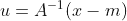

formula to transform data from original space to latent PLDA space. [Source](https://link.springer.com/content/pdf/10.1007%2F11744085_41.pdf)

要找到样本属于某一类的概率，我们需要知道每一类的均值和协方差。之后，我们可以使用正态分布计算该示例属于每个类别的概率(准确地说是对数概率密度)。为了将探针与每一类样品进行比较，我们可以使用以下公式:

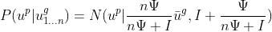

[Source](https://link.springer.com/content/pdf/10.1007%2F11744085_41.pdf)

其中:

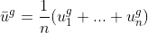

[Source](https://link.springer.com/content/pdf/10.1007%2F11744085_41.pdf)

并且:

*   ψ是先验协方差矩阵(基于训练数据)
*   n 是训练数据中某类样本的数量

第一个公式表明，我们将计算探针 uᵖ的概率给定类别 uᵍ样本均值及其协方差ψ:探针属于具有其自身均值和协方差的某个类别的概率是多少。最后一个公式显示了 uᵍ.类别的平均值

## Python 代码

在 python 代码中，我们将执行以下步骤:

*   将训练数据变换到潜在空间:`x_in_u = (X-m)@inv_A.T`，注意 X 已经使用 PCA 进行了变换。现在我们必须只保留相关维度的数据:`U_model = x_in_u[:,relevant_U_dims]`
*   现在，我们可以使用上一节中提到的公式，计算训练数据中每个类别的均值和协方差:

这两个步骤可以在训练期间完成，因为它们仅使用训练数据，并且在推断期间不需要重新计算它们。

在推论中我们必须做以下步骤:

*   将探测数据转换到潜在空间。首先我们要应用 PCA: `data_test_pca = pca.transform(testing_data)`。在此之后，转换探针进入潜在空间(减去平均值并应用 A 的倒数):`data_test_u = (data_test_pca-m)@inv_A.T`。最后只保留相关维度:`data_test_u = data_test_u[:,relevant_U_dims]`。
*   计算探针来自每个类别的对数概率，并为每个探针样本找到最可能的类别:

训练和推理的完整示例可在[这里](https://github.com/RRisto/learning/blob/master/linear_algebra_learn/linear_discriminant_analysis/probabilistic_linear_discriminant_analysis.ipynb)获得。现在，我们可以为每个类别保留最可能的预测类别。

# 例子

## 分类

为了评估 PLDA 有多适合分类，我做了一些简单的实验。首先，我使用 MNIST 数据集来测试不同的分类降维技术。这里的[是](https://github.com/RRisto/learning/tree/master/linear_algebra_learn/linear_discriminant_analysis/mnist_demo/mnist_data)用于实验的数据。实验结果和代码在[这里](https://github.com/RRisto/learning/blob/master/linear_algebra_learn/linear_discriminant_analysis/probabilistic_linear_discriminant_analysis.ipynb)可用(参见“分类 mnist 数据”一节)。只有 300 个样本和 10 个类(数字从 0 到 9)。实验具有以下结构:

*   对于范围为 10 到 100(步长为 10)的每个组件数量，执行以下操作:
*   对于 0 到 50 范围内的 I，使用 I 作为随机种子，对 MNIST 数据进行随机分割。测试大小设置为 0.3
*   使用训练数据训练 PLDA、PCA 和 LDA
*   预测每个测试数据样本的最可能类别。直接使用 PLDA 作为分类器(从 PLDA 分数中找到最可能的类)。对于 PCA 和 LDA，使用降维数据来训练`[LinearSVC](https://scikit-learn.org/stable/modules/generated/sklearn.svm.LinearSVC.html)`分类器，并根据测试数据进行预测。

与 LDA 相关的区别是:组件的最大数量与训练数据中的类的数量相关。最多 LDA 个组件数可以是 min(n_classes -1，n_features) ( [source](https://scikit-learn.org/stable/modules/generated/sklearn.discriminant_analysis.LinearDiscriminantAnalysis.html) )。在当前实验中，这意味着最多只能有 9 个组件。PLDA 没有此限制，组件数可以是原始数据中的最大要素数(尽管使用这么多组件可能会导致过度拟合)。

为了进行准确性比较，使用了 F1 分数。LDA 的 F1 平均得分最低，约为 0.68。PLDA 和主成分分析对不同数量的成分有不同的准确性。

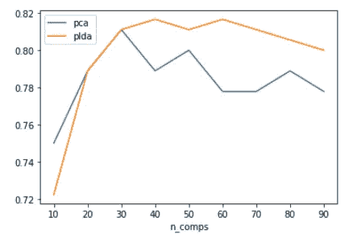

PCA and PLDA median F1-scores with different number of components (n_comps).

从图中我们可以看出，在少量成分的区域，PCA 和 PLDA 精度是相当的。两者都急剧上升到 30 个成分。大约 30 种成分的主成分分析具有最高的 F1 值(大约 0.81)。但是 PLDA 有 40 个分量，最大精度约为 0.82。

该实验的目的不是制造最准确的分类器，而是表明 PLDA 具有与组件数量相关的强性能。我们可以看到，与不使用来自类别标签的信息的 PCA 相比，PLDA 应该潜在地为分类提供更合适的变换。当然，不同数据集之间的性能差距可能会有所不同。

对于第二个分类实验，我训练了简单的`LinearSVC`模型，并将其与基于 PLDA 特征训练的`LinearSVC`模型进行比较(使用 40 个组件)。实验设置为只有 10%的数据用于测试。简单 SVC 模型具有以下准确性:

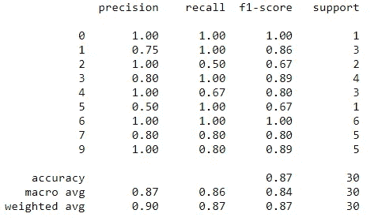

Simple linear SVC model accuracy

作为对比，我们可以看到 PLDA 提供了更高的精确度:

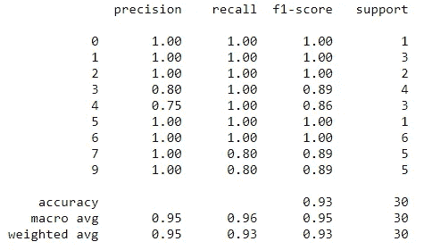

Simple linear SVC model accuracy if PLDA features are used

这个实验的一个注意事项是，如果使用不同的训练和测试分割大小，它具有不同的准确性。在当前的实验中，测试数据中的样本非常少。但是 PLDA 可能会提高分类的准确性。

## 使聚集

对于聚类，我使用了来自[的一个 NLP 数据集(文件 TREC.train.all.txt 和 TREC.test.all.txt)。该数据集比 MNIST 数据集更具挑战性，涉及将问题分为 6 种类型(无论问题是关于人、地点、数字信息等。)(](https://github.com/AcademiaSinicaNLPLab/sentiment_dataset/tree/master/data)[来源](https://www.aclweb.org/anthology/C02-1150.pdf))。此实验的代码可从[这里](https://github.com/RRisto/learning/blob/master/linear_algebra_learn/linear_discriminant_analysis/probabilistic_linear_discriminant_analysis.ipynb)获得(参见“问题数据”一节)。

想法是看看 PLDA 是否有助于转换聚类数据，以及它是否可以直观地看到。读入数据后，使用`[CountVectorizer](https://scikit-learn.org/stable/modules/generated/sklearn.feature_extraction.text.CountVectorizer.html)`进行转换，并使用`[TSNE](https://scikit-learn.org/stable/modules/generated/sklearn.manifold.TSNE.html)`将数据维数降低到 2，以便绘图，我们可以看到以下绘图:

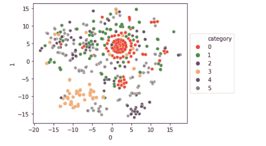

TREC original dataset after using TSNE to reduce dimensionality to 2

我们可以看到，数据有一些集群，但许多类是混合的。有些班级很容易聚集，有些分散在各处。PLDA 分离后变得更加清晰:

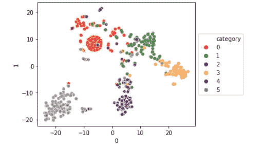

TREC PLDA transformed dataset after using TSNE to reduce dimensionality to 2

尽管仍然有一些混合的例子，但是集群现在更加分离。和 LDA 一样，PLDA 试图最小化类内方差，最大化类间方差。PLDA 变换(将数据投影到 PLDA 潜在空间)使数据更容易分离。

另一种聚类方法是 PLDA 分数——记录样本属于 6 个类别之一的概率(在分类中，我们选择了最大的类别分数，这里我们包括所有类别)。这为每个数据点创建了一个分数向量，我们可以使用`[cosine_similarity](https://scikit-learn.org/stable/modules/generated/sklearn.metrics.pairwise.cosine_similarity.html)`来衡量这些点彼此之间的相似程度。为了比较，一个简单的余弦相似性矩阵是从文档术语矩阵计算的，一个是从变换的 PLDA 特征计算的。

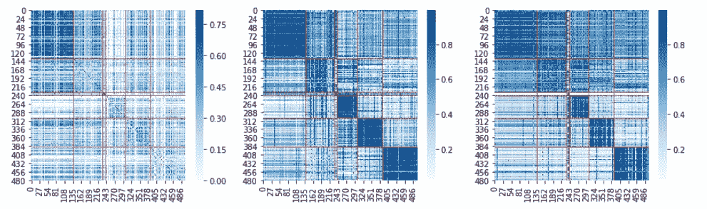

Questions dataset cosine similarity matrices heatmaps from CountVectorizer features (left) and PLDA transformed features (middle) and from PLDA scores (right). Sample are ordered by categories, red lines show class changes

我们可以看到，视觉上的 PLDA 分数和 PLDA 变换特征使得分离更具对比性。原始数据在类别之间已经有一些差异，但是它们在视觉上不如在另外两个图中那么清晰。因此，PLDA 可用于使用变换后的特征/PLDA 分数进行聚类。

# 结论

我希望这篇文章强调了 PLDA 训练背后的一些逻辑。它可以被看作是 LDA 扩展，包括每个数据点属于某个类别的概率。PLDA 可用于分类和聚类。

# 参考

*   余弦 _ 相似度， [skicit-learn](https://scikit-learn.org/stable/modules/generated/sklearn.metrics.pairwise.cosine_similarity.html)
*   计数矢量器，[skict-learn](https://scikit-learn.org/stable/modules/generated/sklearn.feature_extraction.text.CountVectorizer.html)
*   特征值和广义特征值问题:教程，[便雅悯·高霍，法克里·卡雷，马克·克劳利](https://arxiv.org/pdf/1903.11240.pdf)
*   线性判别分析， [Risto Hinno](https://github.com/RRisto/learning/blob/master/linear_algebra_learn/linear_discriminant_analysis/linear%20discriminant%20analysis.ipynb)
*   PCA， [skicit-learn](https://scikit-learn.org/stable/modules/generated/sklearn.decomposition.PCA.html)
*   概率线性判别分析
*   概率线性判别分析
*   概率线性判别分析(PLDA)解释说，
    [普拉奇·辛格](https://towardsdatascience.com/probabilistic-linear-discriminant-analysis-plda-explained-253b5effb96)
*   概率 _ 线性 _ 判别 _ 分析，[里斯托·欣诺](https://github.com/RRisto/learning/blob/master/linear_algebra_learn/linear_discriminant_analysis/probabilistic_linear_discriminant_analysis.ipynb)
*   散布矩阵， [Risto Hinno](https://github.com/RRisto/learning/blob/master/linear_algebra_learn/linear_discriminant_analysis/scatter_matrices.ipynb)
*   SciPy.org
*   情感 _ 数据集， [AcademiaSinicaNLPLab](https://github.com/AcademiaSinicaNLPLab/sentiment_dataset/tree/master/data)
*   TSNE， [skicit-learn](https://scikit-learn.org/stable/modules/generated/sklearn.manifold.TSNE.html)