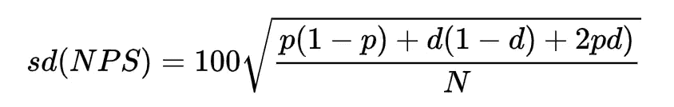
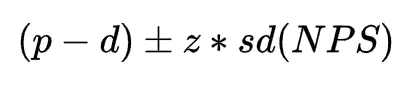
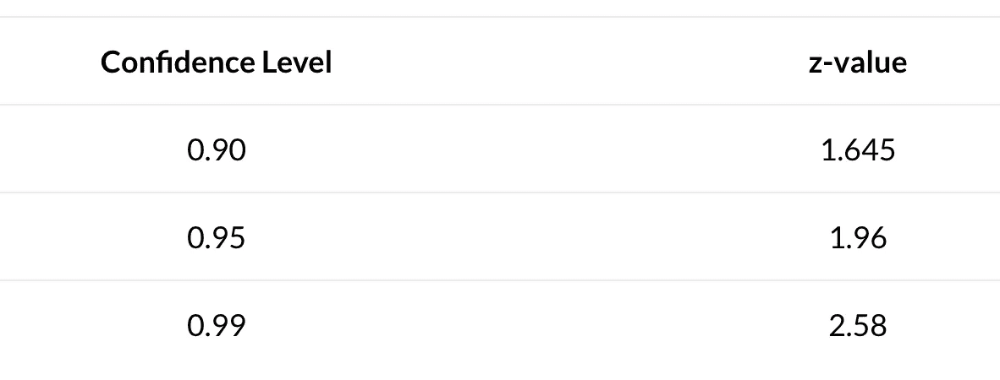
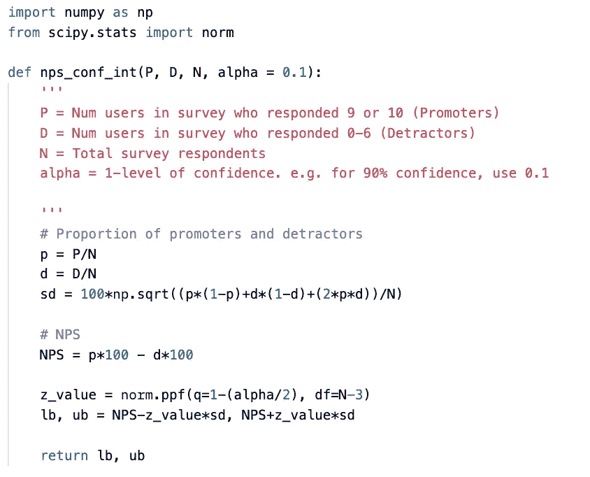
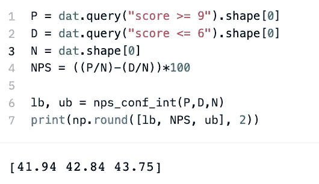
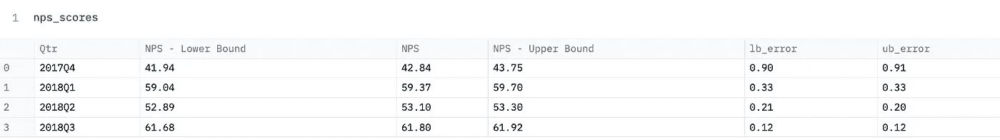
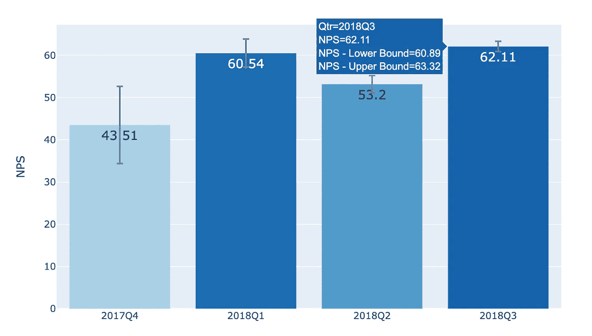
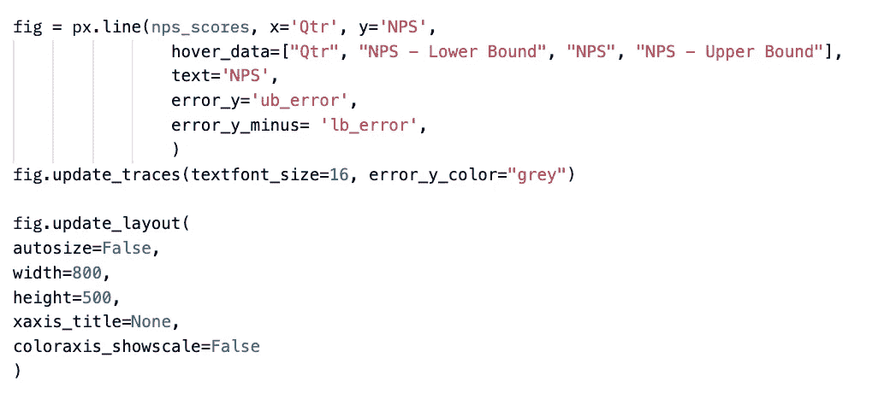
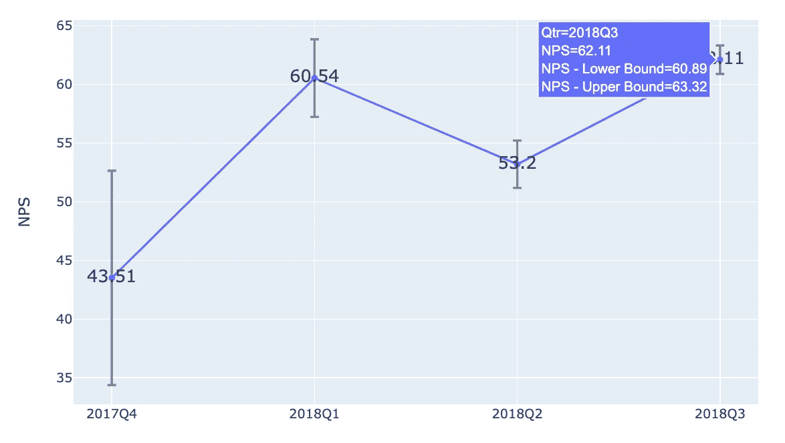

# 用 Plotly Python 绘制带置信区间的净推广分数

> 原文：<https://medium.com/mlearning-ai/plotting-net-promoter-scores-with-confidence-intervals-in-plotly-python-2c6b9c3c6855?source=collection_archive---------5----------------------->

# **什么是 NPS？**

在许多面向消费者的行业中，净推广分数被广泛用作忠诚度和参与度的衡量标准。在用户体验同等重要的公司中，拥有准确的 NPS 分数和置信区间对于决策至关重要。

NPS 分数本身是通过调查用户的问题“您向朋友或同事推荐我们公司/产品/服务的可能性有多大？”回答范围从 0 到 10，10 是最有可能推荐的。NPS 是(%回答 9 或 10 的用户)— (%回答 0-6 的用户)，或者通常被称为%“促进者”— %“贬低者”。这个分数让公司知道，相比不太可能推广产品的用户，有多少用户会推广他们的产品。

# NPS 数据通常是如何收集的？

通常情况下，数据是通过在你的网站上随机调查受访者来收集的，使用的服务如 [HotJar](https://www.hotjar.com/) 。应事先确定样本量，事先商定调查的置信水平和误差幅度。有许多[在线工具](https://www.smartsurvey.co.uk/survey-tools/sample-size-calculator)可以帮你做到这一点。

例如，如果你的公司网站有大约 100，000 名活跃用户，你的目标是调查结果有 90%的置信度和 3%的误差，你将需要至少 751 名受访者。

# 用置信区间计算 NP

因为 NPS 分数是根据样本估计的两个比例的函数，所以计算标准偏差需要使用分类分布进行一些推导。完整的推导过程在这篇 [CYBAEA 文章](https://www.cybaea.net/Journal/2016/01/14/NPS-confidence-intervals-stats/)中有所概述。标准偏差的相关计算如下:

这与两个独立样本比例差异的标准差略有不同，因为最后一项 *2pd* 考虑了 *p* 和 *d* 之间的协方差。

一旦有了标准偏差，置信区间可以用以下公式计算:

其中 *z* 是 z 测试值，取决于您想要为测试选择的置信度。假设您有超过 30 名受访者，对于双边假设检验，常见的 z 检验值为:

要在 Python 中实现这一点，请使用以下函数:

这将返回置信区间的下限(lb)和上限(ub)。

通过一个使用[样本](https://github.com/sixhobbits/nps-sample-data/blob/master/score.csv) NPS 数据的示例，我们可以通过以下方式轻松提取样本数据集的下限和上限:

# 向 Plotly Python 添加置信区间

NPS 在上下文中是有用的，即在跟踪分数如何随时间变化时。通常，NPS 调查每季度进行一次。

Plotly 是 Python 中一个有用的图形工具，因为它允许用户以简单直观的方式集成交互式功能。可以选择添加悬停数据，覆盖图中的标签。在这种情况下，我们可能希望为 NPS 分数和置信区间的下限和上限添加点值，以使数字对观众来说更清楚。

为方便绘制 NPS 置信区间，数据帧应按季度排序:

因为 Plotly 将误差棒绘制为点估计值的差值，所以我们需要使用*NPS-下限*或*上限-NPS* 来获得误差值。

**条形图**

使用以下函数，将绘制一个条形图，根据该季度 NPS 得分的高低为每个条形图着色。悬停数据显示所有相关的数据点。

使用`fig.update_traces`，可以控制文本标签的大小和误差线的颜色。使用`fig.update_layout`，可以控制图形的大小，以及显示哪些轴标签和图例。为简单起见，图中未显示 x 轴标题和色标图例。`color_continous_scale`确定条块使用的色标，而`range_color`指定条块的亮/暗程度。

这导致了以下情节:

**线条图**

或者，我们可以使用线图来表示相同的数据。呈现更加清晰，但是，我们失去了代表分数级别的颜色强度的额外视觉兴趣。当有许多季度的数据要显示时，最好使用折线图。

这导致了以下情节:

感谢阅读！我希望你觉得有能力绘制有价值的 NPS 数据。

 [## Mlearning.ai 提交建议

### 如何成为 Mlearning.ai 上的作家

medium.com](/mlearning-ai/mlearning-ai-submission-suggestions-b51e2b130bfb)