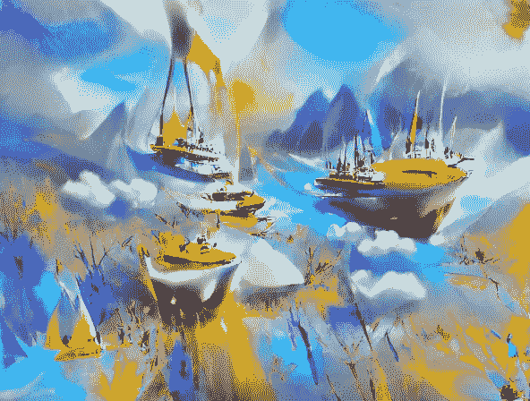

# 诗歌遇上人工智能

> 原文：<https://medium.com/mlearning-ai/poetry-meets-artificial-intelligence-9dc7ec86dd04?source=collection_archive---------12----------------------->

一篇关于人工智能和诗歌的短文。

Copyright: George Odarquaye Lamptey

你可能会看着这篇文章，想知道他到底在说什么。这张图片是通过机器学习和人工智能生成的。从最基本的角度来说，许多人认为计算机被编程来从另一幅图像中绘制这幅图像，但事实并非如此。