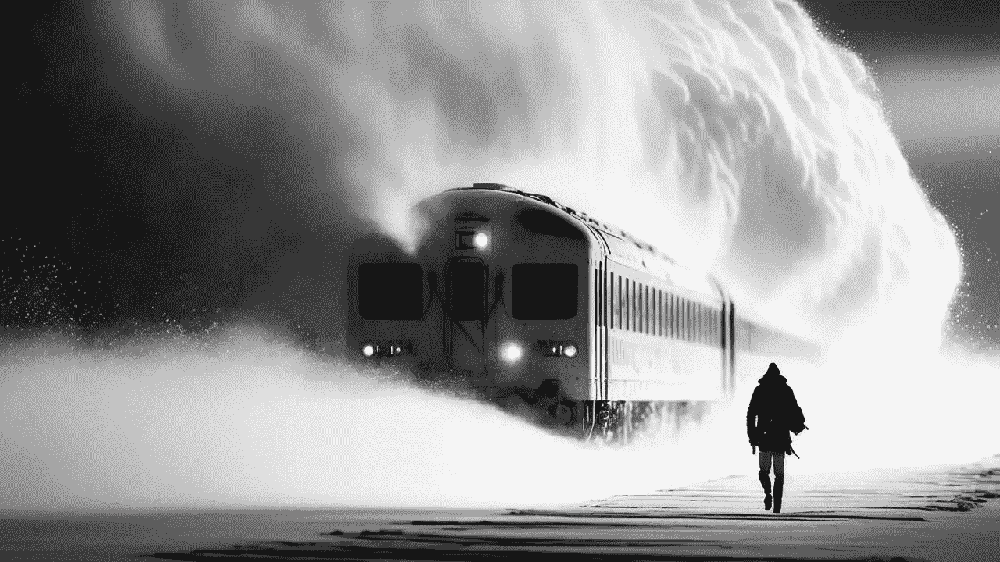

# 诗歌会改变 2023

> 原文：<https://medium.com/mlearning-ai/poetry-will-change-2023-2328edf60f33?source=collection_archive---------2----------------------->

## 你只能通过第一个看到变化

## 或者 [2023](https://open.substack.com/pub/mlearning/p/will-google-die-in-2023-a-new-star?r=z7zu8&utm_campaign=post&utm_medium=web) 将永远改变诗歌

[Waiting at the train station. Time-traveling train. Stay or board?](https://open.substack.com/pub/mlearning/p/will-google-die-in-2023-a-new-star?r=z7zu8&utm_campaign=post&utm_medium=web)

## 诗歌的未来是什么？

你读过真正让你产生共鸣的诗吗？因为它用一个美丽的句子表达了你的感受。诗歌已经存在了几千年，虽然它是一门艺术…