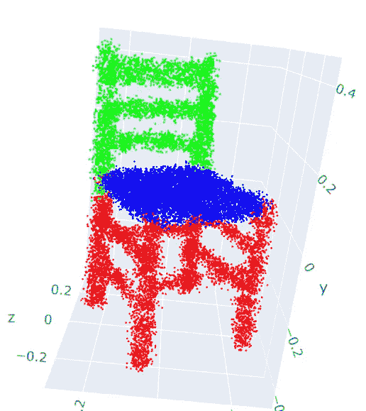
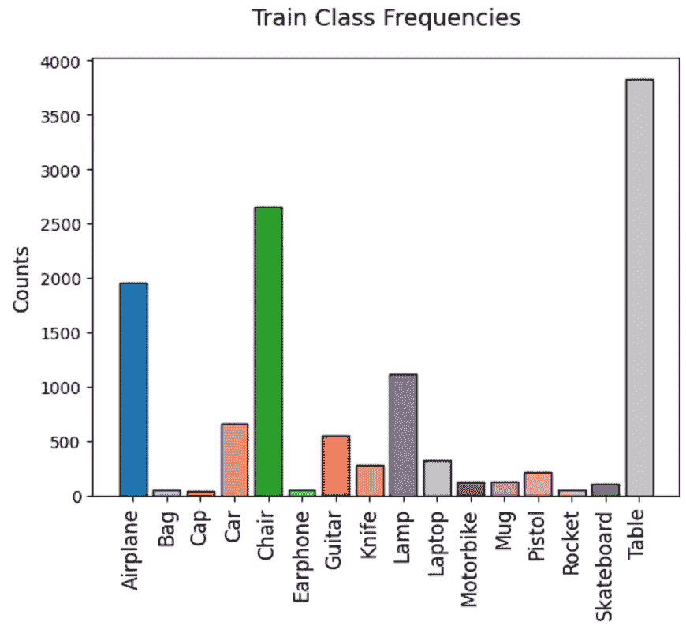
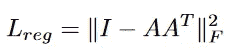
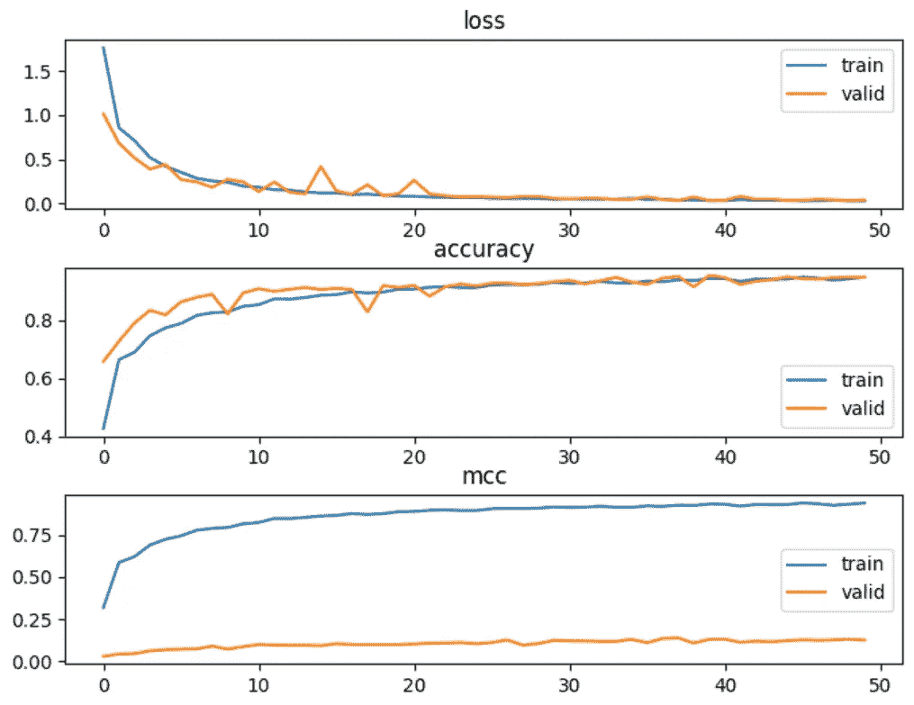
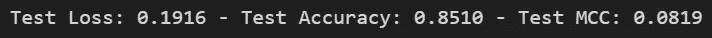
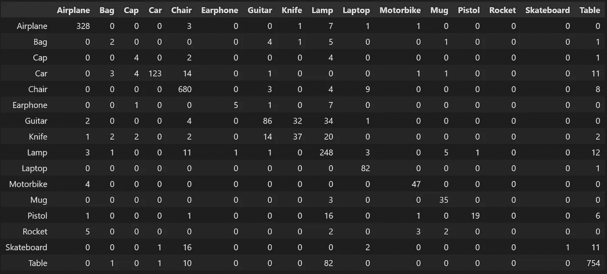
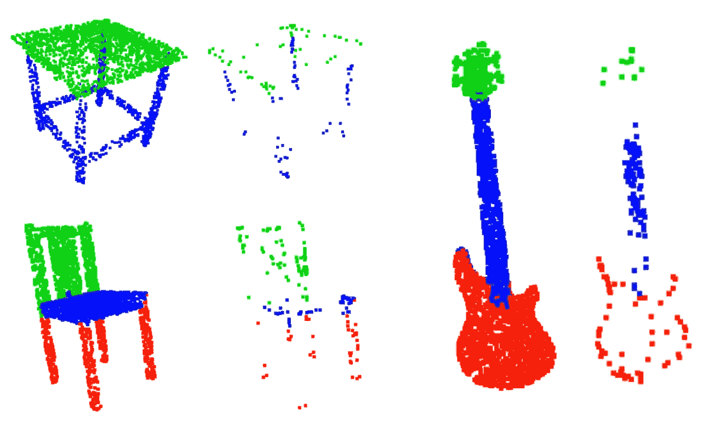

# 分类点网

> 原文：<https://medium.com/mlearning-ai/point-net-for-classification-968ca64c57a9?source=collection_archive---------3----------------------->

## 如何训练点网进行点云分类


Photo by [Christoph von Gellhorn](https://unsplash.com/es/@cvgellhorn?utm_source=medium&utm_medium=referral) on [Unsplash](https://unsplash.com?utm_source=medium&utm_medium=referral)

这是点网系列的第三部分:

1.  [点网直观介绍](/@itberrios6/introduction-to-point-net-d23f43aa87d2)
2.  [点网从无到有](/@itberrios6/point-net-from-scratch-78935690e496)
3.  **用于分类的点网**
4.  [用于语义分割的点网](/@itberrios6/point-net-for-semantic-segmentation-3eea48715a62)

在本教程中，我们将学习如何为[分类](https://en.wikipedia.org/wiki/Statistical_classification)训练点网。我们将主要关注数据和训练过程；演示如何从头开始编写点网络代码的教程位于[这里](/@itberrios6/point-net-from-scratch-78935690e496)。本教程的代码位于这个[库](https://github.com/itberrios/3D/tree/main/point_net)中。我们将使用的笔记本位于该存储库中的[这里](https://github.com/itberrios/3D/blob/main/point_net/pointnet_cls.ipynb)。一些代码的灵感来自这个[库](https://github.com/intel-isl/Open3D-PointNet)。

# 获取数据

我们将使用只有 16 个类的较小版本的 shapenet 数据集。如果你正在使用 [Colab](https://colab.research.google.com/) ，你可以运行下面的代码来获取数据。警告，这将需要很长时间。

```
!wget -nv https://shapenet.cs.stanford.edu/ericyi/shapenetcore_partanno_segmentation_benchmark_v0.zip --no-check-certificate
!unzip shapenetcore_partanno_segmentation_benchmark_v0.zip
!rm shapenetcore_partanno_segmentation_benchmark_v0.zip
```

如果你想在本地工作，请访问上面第一行的链接，数据将自动下载为 zip 文件。

数据集包含 16 个带有类标识符的文件夹(在自述文件中称为“synsetoffset”)。文件夹结构是:

*   **synsetoffset**
    -点:来自 ShapeNetCore 模型的均匀采样点
    - point_labels:逐点分割标签
    - seg_img:标签的可视化
*   **train_test_split** :带有训练/验证/测试分割的 JSON 文件

自定义 PyTorch 数据集位于[这里](https://github.com/itberrios/3D/blob/main/point_net/shapenet_dataset.py)，说明代码超出了本教程的范围。需要知道的重要事情是数据集可以获得(点云，类)或(点云，分段标签)。在训练和验证过程中，我们给点云添加高斯噪声，并随机地[围绕垂直轴(本例中为 y 轴)旋转](https://www.brainm.com/software/pubs/math/Rotation_matrix.pdf)。我们还对点云执行[最小-最大归一化](https://en.wikipedia.org/wiki/Feature_scaling#Rescaling_(min-max_normalization))，使它们的范围为 0-1。我们可以创建 shapenet 数据集的实例，如下所示:

```
from shapenet_dataset import ShapenetDataset

# __getitem__ returns (point_cloud, class)
train_dataset = ShapenetDataset(ROOT, npoints=2500, split='train', classification=True)
```

# 探索数据

在开始任何培训之前，让我们先来研究一些培训数据。为此，我们将使用 Open3d 版本 0.16.0(必须是 0.16.0 或更高版本)。

```
!pip install open3d==0.16.0
```

我们现在可以用下面的代码来查看一个样本点云。您应该注意到，每次运行代码时，点云都以不同的方向显示。

```
import open3d as o3
from shapenet_dataset import ShapenetDataset

sample_dataset = train_dataset = ShapenetDataset(ROOT, npoints=20000, split='train', 
                                                 classification=False, normalize=False)

points, seg = sample_dataset[4000]

pcd = o3.geometry.PointCloud()
pcd.points = o3.utility.Vector3dVector(points)
pcd.colors = o3.utility.Vector3dVector(read_pointnet_colors(seg.numpy()))

o3.visualization.draw_plotly([pcd])
```



Figure 1\. Noisy point cloud with random rotation. Y-axis is the vertical axis. Source: Author.

你可能不会注意到噪音有很大的不同，因为我们添加的数量很少；我们添加了少量，因为不想大大破坏结构，但这少量足以对模型产生影响。现在我们来看看培训班的频率。



Figure 2\. Frequencies of the training classes. Source: Author.

我们可以在图 2 中看到，这绝对不是一个平衡的训练集。因此，我们可能想要应用类别加权，甚至使用[焦点损失](https://arxiv.org/pdf/1708.02002.pdf)来帮助我们的模型学习。

# 点净损失函数

当训练点网络进行分类时，我们可以使用 PyTorch 的标准[交叉熵损失](https://pytorch.org/docs/stable/generated/torch.nn.CrossEntropyLoss.html)，但我们还想增加一项，以包括论文[ [1](https://arxiv.org/pdf/1612.00593.pdf) 中提到的正则化项。正则项强制特征变换矩阵正交，但是为什么呢？特征变换矩阵旨在[旋转](https://en.wikipedia.org/wiki/Rotation_matrix) ( [变换](https://en.wikipedia.org/wiki/Rigid_transformation))点云的高维表示。我们如何确定这种学习到的高维旋转实际上是在旋转点云呢？为了回答这个问题，让我们考虑旋转的一些期望的性质。我们希望学习到的旋转是[仿射](https://en.wikipedia.org/wiki/Affine_transformation)，这意味着它保留了结构。我们想确定它没有做什么奇怪的事情，比如把它映射回一个更低维度的空间或者打乱它的结构。我们不能仅仅绘制一个 nx64 点云来检查这一点，但是我们可以通过鼓励旋转是[正交的](https://en.wikipedia.org/wiki/Orthogonal_matrix)来让模型学习有效的旋转。这是因为正交矩阵保留了长度和角度，而旋转矩阵是一种特殊类型的正交矩阵[ [2](https://people.math.harvard.edu/~knill/teaching/math22b2019/handouts/lecture08.pdf) ]。我们可以“鼓励”模型通过正则化项来学习正交旋转矩阵:



Figure 3\. Point Net Regularization term. [Source](https://arxiv.org/pdf/1612.00593.pdf).

我们利用正交矩阵的一个基本性质，即它们的列和行是正交向量。对于完全正交的矩阵，图 3 中的正则项将等于零。[ [2](https://people.math.harvard.edu/~knill/teaching/math22b2019/handouts/lecture08.pdf)

在训练过程中，我们只是将这一项加入到我们的损失中。如果你已经过了[之前关于如何对点网编码的教程](/@itberrios6/introduction-to-point-net-d23f43aa87d2)，你可能还记得特征变换矩阵 A 是由分类头返回的。

现在让我们编写点净损失函数。我们已经添加了加权(平衡)交叉熵损失和[聚焦损失](https://arxiv.org/pdf/1708.02002.pdf)的术语，但是解释它们超出了本教程的范围。这个代码位于[这里](https://github.com/itberrios/3D/blob/main/point_net/point_net_loss.py)。这段代码改编自这个[库](https://github.com/clcarwin/focal_loss_pytorch)。

```
import numpy as np
import torch
import torch.nn as nn
import torch.nn.functional as F

class PointNetLoss(nn.Module):
    def __init__(self, alpha=None, gamma=0, reg_weight=0, size_average=True):
        super(PointNetLoss, self).__init__()
        self.alpha = alpha
        self.gamma = gamma
        self.reg_weight = reg_weight
        self.size_average = size_average

        # sanitize inputs
        if isinstance(alpha,(float, int)): self.alpha = torch.Tensor([alpha,1-alpha])
        if isinstance(alpha,(list, np.ndarray)): self.alpha = torch.Tensor(alpha)

        # get Balanced Cross Entropy Loss
        self.cross_entropy_loss = nn.CrossEntropyLoss(weight=self.alpha)

    def forward(self, predictions, targets, A):

        # get batch size
        bs = predictions.size(0)

        # get Balanced Cross Entropy Loss
        ce_loss = self.cross_entropy_loss(predictions, targets)

        # reformat predictions and targets (segmentation only)
        if len(predictions.shape) > 2:
            predictions = predictions.transpose(1, 2) # (b, c, n) -> (b, n, c)
            predictions = predictions.contiguous() \
                                     .view(-1, predictions.size(2)) # (b, n, c) -> (b*n, c)

        # get predicted class probabilities for the true class
        pn = F.softmax(predictions)
        pn = pn.gather(1, targets.view(-1, 1)).view(-1)

        # get regularization term
        if self.reg_weight > 0:
            I = torch.eye(64).unsqueeze(0).repeat(A.shape[0], 1, 1) # .to(device)
            if A.is_cuda: I = I.cuda()
            reg = torch.linalg.norm(I - torch.bmm(A, A.transpose(2, 1)))
            reg = self.reg_weight*reg/bs
        else:
            reg = 0

        # compute loss (negative sign is included in ce_loss)
        loss = ((1 - pn)**self.gamma * ce_loss)
        if self.size_average: return loss.mean() + reg
        else: return loss.sum() + reg
```

# 分类训练点网

现在我们已经了解了数据和损失函数，我们可以继续培训了。在我们的培训中，我们希望量化模型的表现。通常我们关注损失和准确性，但是对于这个分类问题，我们将需要一个度量来解释不正确的分类以及正确的分类。想想典型的混淆矩阵:真阳性、假阴性、真阴性和假阳性；我们需要一个在所有这些方面都表现良好的分类器。[Matthews Correlation Coefficient](https://en.wikipedia.org/wiki/Phi_coefficient)(MCC)量化了我们的模型在所有这些指标上的表现，被认为是比准确性或 F1 分数[ [3](https://bmcgenomics.biomedcentral.com/articles/10.1186/s12864-019-6413-7) ]更可靠的单一性能指标。MCC 的范围从-1 到 1，其中-1 表示性能最差，1 表示性能最佳，0 表示随机猜测。我们可以通过 [torchmetrics](https://torchmetrics.readthedocs.io/en/stable/) 使用带有 PyTorch 的 MCC。

```
from torchmetrics.classification import MulticlassMatthewsCorrCoef

mcc_metric = MulticlassMatthewsCorrCoef(num_classes=NUM_CLASSES).to(DEVICE)
```

培训过程是一个基本的 PyTorch 培训循环，在培训和验证之间交替进行。我们使用 Adam 优化器和我们的点净损失函数以及上面图 3 中描述的正则化项。对于点净损失函数，我们选择设置α，它对每个样本的重要性进行加权。我们还设置伽马，其调节损失函数并迫使其集中于困难的例子，其中困难的例子是那些以较低概率分类的例子。详见[笔记本](https://github.com/itberrios/3D/blob/main/point_net/pointnet_cls.ipynb)中的注释。注意到当使用[循环学习率](https://pytorch.org/docs/stable/generated/torch.optim.lr_scheduler.CyclicLR.html)时，模型训练得更好，所以我们在这里实现了它。

```
import torch.optim as optim
from point_net_loss import PointNetLoss

EPOCHS = 50
LR = 0.0001
REG_WEIGHT = 0.001 

# manually downweight the high frequency classes
alpha = np.ones(NUM_CLASSES)
alpha[0] = 0.5  # airplane
alpha[4] = 0.5  # chair
alpha[-1] = 0.5 # table

gamma = 1

optimizer = optim.Adam(classifier.parameters(), lr=LR)
scheduler = torch.optim.lr_scheduler.CyclicLR(optimizer, base_lr=0.0001, max_lr=0.01, 
                                              step_size_up=2000, cycle_momentum=False)
criterion = PointNetLoss(alpha=alpha, gamma=gamma, reg_weight=REG_WEIGHT).to(DEVICE)

classifier = classifier.to(DEVICE)
```

请按照[笔记本](https://github.com/itberrios/3D/blob/main/point_net/pointnet_cls.ipynb)进行训练循环，并确保你有一个 GPU。如果没有，删除调度程序并将学习率设置为 0.01，在几个时期后，您应该会得到足够好的结果。如果您遇到任何 PyTorch 用户警告(由于 nn 的未来更新。MaxPool1D)，您可以使用以下命令抑制它们:

```
import warnings
warnings.filterwarnings("ignore")
```

# 培训结果



Figure 4\. Training metrics. Source: Author.

我们可以看到，训练和验证的准确性都提高了，但 MCC 只在训练时提高，而在验证时没有提高。这可能是由于在验证和测试拆分中，某些类的样本量非常小；因此，在这种情况下，MCC 可能不是验证和测试的最佳单一指标。这就需要对 MCC 何时是一个好的指标进行更多的调查；即多少不平衡对 MCC 来说是太多了？每个班级需要多少样本才能使 MCC 有效？

让我们来看看测试结果:



Figure 5\. Test metrics. Source: Author.

我们看到，测试的准确度在 85%左右，但是 MCC 刚刚超过 0。因为我们只有 16 个类，所以让我们查看笔记本中的[混淆矩阵](https://en.wikipedia.org/wiki/Confusion_matrix)来更深入地了解测试结果。



Figure 6\. Test data Confusion matrix. Source: Author.

在很大程度上，这种分类是可以的，但也有一些不太常见的类别，如“火箭”或“滑板”。该模型在这些类别上往往具有较差的预测性能，而在这些不太常见的类别上的性能是导致 MCC 下降的原因。另一件要注意的事情是，当你检查结果时(如[笔记本](https://github.com/itberrios/3D/blob/main/point_net/pointnet_cls.ipynb)所示)，你会在更频繁的课上获得良好的准确性和自信的表现。然而，在频率较低的类中，您会注意到置信度较低，准确性较差。

# 检查临界集

现在我们来看看本教程最有趣的部分，临界集。临界集是点云集合的本质潜在点。这些点定义了它的基本结构。这里有一些代码显示如何可视化它们。

```
from open3d.web_visualizer import draw 

critical_points = points[crit_idxs.squeeze(), :]
critical_point_colors = read_pointnet_colors(seg.numpy())[crit_idxs.cpu().squeeze(), :]

pcd = o3.geometry.PointCloud()
pcd.points = o3.utility.Vector3dVector(critical_points)
pcd.colors = o3.utility.Vector3dVector(critical_point_colors)

# o3.visualization.draw_plotly([pcd])
draw(pcd, point_size=5) # does not work in Colab
```

这里有一些可视化效果，注意我使用了“draw()”来获得更大的点尺寸，但它在 Colab 中不起作用。



Figure 7\. Point Cloud Sets and their corresponding critical sets learned by Point Net. Source: Author.

我们可以看到，临界集显示了它们对应的点云的整体结构，它们本质上是稀疏采样的点云。这表明经过训练的模型实际上已经学会区分不同的结构，并且表明它实际上能够基于它们的区分结构来对每个点云类别进行分类。

# 结论

如果你已经做到了这一步，祝贺你！你已经学会了如何从头开始训练一个点网络，我们甚至已经学会了如何可视化点集。我鼓励你回去，确保你理解了一切，如果你真的感兴趣，尝试提高整体分类性能。以下是一些帮助你开始的建议:

*   使用不同的损失函数
*   在[循环学习率调度器](https://pytorch.org/docs/stable/generated/torch.optim.lr_scheduler.CyclicLR.html)中尝试不同的设置
*   尝试对点网络架构进行修改
*   尝试不同的数据扩充
*   使用更多数据→尝试完整的 [shapenet 数据集](https://shapenet.org/)

# 参考

[1]查尔斯，R. Q .，苏，h .，凯春，m .，&吉巴斯，L. J. (2017)。PointNet:用于 3D 分类和分割的点集深度学习。 *2017 年 IEEE 计算机视觉与模式识别大会(CVPR)* 。[https://doi.org/10.1109/cvpr.2017.16](https://doi.org/10.1109/cvpr.2017.16)

[2]克尼尔，未注明日期。*第八单元:正交组——哈佛大学*。people.math.harvard.edu。2022 年 12 月 10 日检索，来自[https://people . math . Harvard . edu/~ knill/teaching/math 22b 2019/讲义/讲师 08.pdf](https://people.math.harvard.edu/~knill/teaching/math22b2019/handouts/lecture08.pdf)

[3]奇科博士和朱尔曼博士(2020 年)。马修斯相关系数(MCC)在二分类评估中相对于 F1 分数和准确性的优势。 *BMC 基因组学*， *21* (1)。[https://doi.org/10.1186/s12864-019-6413-7](https://doi.org/10.1186/s12864-019-6413-7)

[](/mlearning-ai/mlearning-ai-submission-suggestions-b51e2b130bfb) [## Mlearning.ai 提交建议

### 如何成为 Mlearning.ai 上的作家

medium.com](/mlearning-ai/mlearning-ai-submission-suggestions-b51e2b130bfb)