# 流行的机器学习算法(监督和非监督学习)

> 原文：<https://medium.com/mlearning-ai/popular-machine-learning-algorithms-supervised-and-unsupervised-learning-766120e96d49?source=collection_archive---------7----------------------->

## 一些流行的机器学习算法及其 Python 实现(Scikit-learn)

Photo by Serpstat from [Pexels](https://www.pexels.com/photo/silver-imac-displaying-line-graph-placed-on-desk-572056/)

# 介绍

机器学习对我们的日常生活帮助很大。许多机器学习应用程序包括推荐系统、垃圾邮件过滤器、股票价格预测、情感分析、社交媒体上的排名帖子、搜索引擎、手写识别等。嗯，机器学习确实已经成为我们日常生活的一部分。然而，机器学习到底是什么？

> 机器学习是在没有明确编程的情况下赋予计算机学习能力的研究领域。阿瑟·塞缪尔，1959 年

还有另一种解释:

> 如果一个计算机程序在任务 T 和性能测量 P 上的性能随着经验 E 的增加而提高，那么这个程序就可以说是从经验 E 中学习了

总之，机器学习不需要显式编程，它可以从数据中学习并找到模式。想了解更多关于机器学习的知识，可以阅读这篇[文章](https://en.wikipedia.org/wiki/Machine_learning)。

本文探讨了流行的机器学习算法，包括监督和非监督学习。这些算法包括:

[1。线性回归](#dbe5)
[2。逻辑回归](#e872)
[3。支持向量机【SVM】](#923a)
[4。k-最近邻(KNN)](#ba48)
[5。朴素贝叶斯分类](#88df)
[6。决策树](#d773)
[7。随机森林](#0dd8)
[8。k-均值聚类](#b0f3)

读完这篇文章后，你应该能够理解一些最流行的机器学习算法。所以让我们开始吧！

# **1。线性回归**

线性回归又名普通最小二乘法(OLS)是一种受监督的机器学习算法，其中预测的输出是连续数据，通过拟合直线来获得误差最小的回归模型。而在统计学中，线性回归是一种对解释变量和响应变量之间的关系进行建模的线性方法。解释变量也称为自变量，而响应变量也称为因变量。简而言之，线性回归通过根据因变量和自变量拟合误差最小的直线来预测输出。

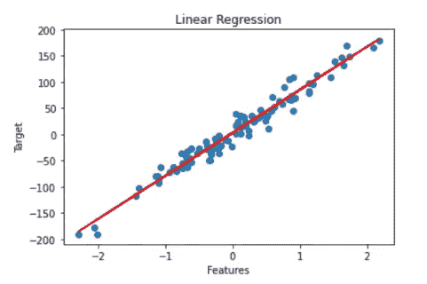

Linear regression (image by author).

线性回归有几种类型，包括简单线性回归、多项式回归和多项式回归。然而，有时线性回归模型可以提供不太准确的预测(过拟合或欠拟合)。要解决这个问题，可以使用线性回归类型，如岭回归(L2 范数)和套索回归(L1 范数)。你可以看这个[视频](https://youtu.be/VqKq78PVO9g)了解更多关于脊和套索回归的知识。

那么，我们如何衡量我们的线性回归模型是好的呢？因此，我们可以使用几个评估指标来衡量线性回归模型的好坏，包括均方根误差(RMSE)、均方误差(MSE)、平均绝对误差(MAE)、平均绝对百分比误差(MAPE)和平均百分比误差(MPE)。

使用 Scikit-learn 简单实现线性回归:

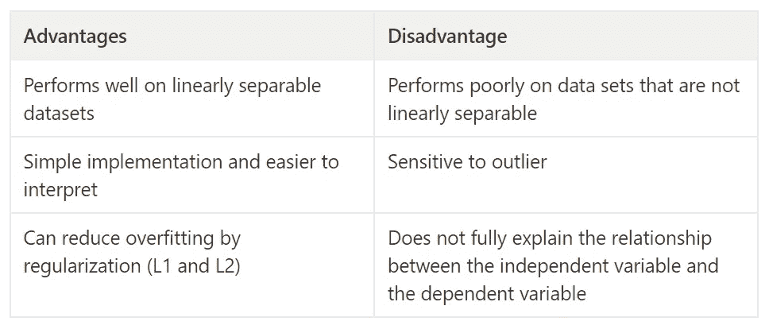

# **2。逻辑回归**

就像线性回归一样，逻辑回归也是一种有监督的机器学习算法。逻辑回归通常用于分类，因为它可以输出与属于给定类别的概率相对应的值。与预测结果为连续值的线性回归不同，逻辑回归预测结果为离散类。

逻辑回归使用 sigmoid 函数转换输出并返回一个概率值，然后可以将该概率值映射到两个或多个离散类。如果估计的概率大于 50%或具有最大值，则模型预测该实例属于该类，如果它不属于该类或具有较小的值，则模型预测它不属于该类。比如 60%是 1 类，40%是 0 类。

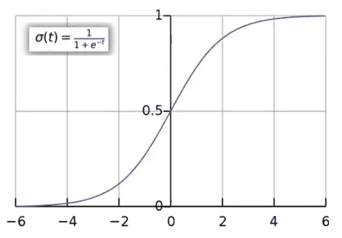

Logistic regression with sigmoid function (image by author).

逻辑回归可用于多种分类情况，如二元分类(通过或失败)、多类分类(猫、狗或猪)和有序分类(高、中、低)。为了评估逻辑回归模型，我们可以使用混淆度、ROC 曲线、AIC (Akaike 信息标准)、零偏差和剩余偏差。

使用 Scikit-learn 简单实现逻辑回归:

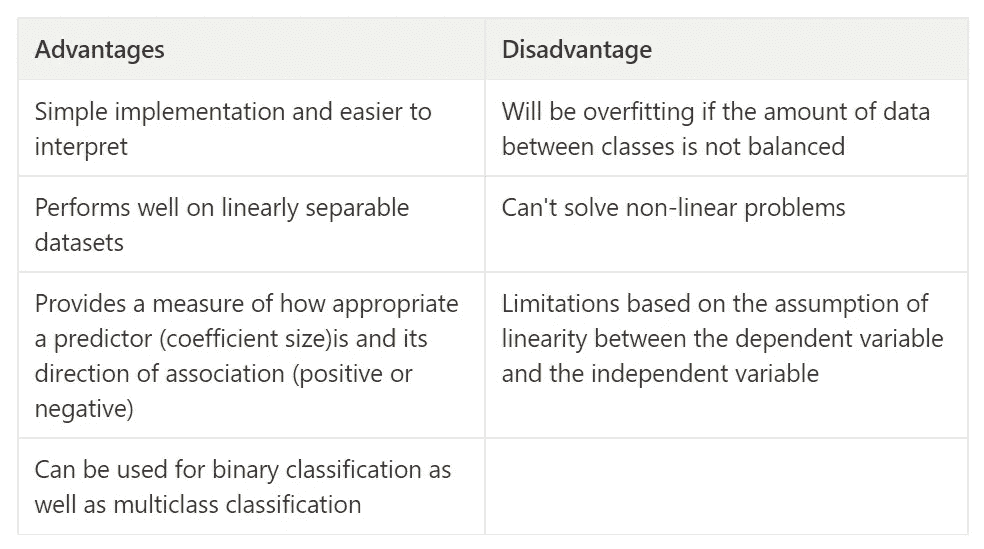

# **3。支持向量机(SVM)**

支持向量机(SVM)是一种受监督的机器学习算法，能够执行线性或非线性分类、回归和异常值检测。SVM 算法的目标是了解每个训练数据点对于表示两个类别之间的决策边界(*超平面*)有多重要，并产生属于不同类别的对象之间的最大最小距离(*余量*)。

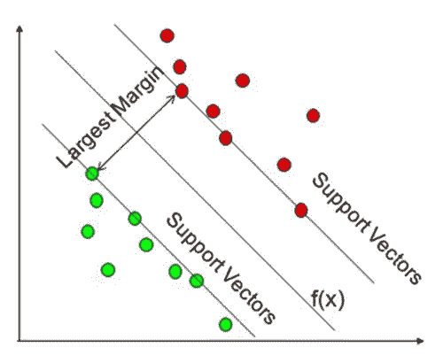

Support vector machine (Zhang et al., 2020).

SVM 可以处理分类任务和回归任务。在分类任务中，SVM 试图在两个类之间拟合最大可能的街道，同时限制边界违规。而在回归任务中，SVM 试图在街道上拟合尽可能多的实例，同时限制边界违规，街道的宽度由超参数控制。

在分类任务中，SVM 适用于可线性分离或不可线性分离的数据集。对于可分离的数据集，我们可以使用软间隔分类，而对于不可分离的数据集，我们可以使用多项式核、相似性特征和高斯 RBF 核。

使用 Scikit-learn 简单实现支持向量机:

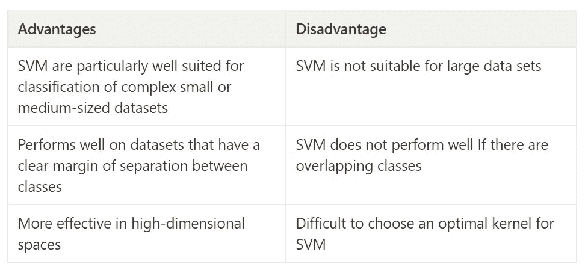

# **4。k-最近邻(KNN)**

k-最近邻(KNN)是最简单的监督机器学习算法之一，用于分类和回归。K-最近邻的主要概念是找到预定义数量的最接近新点的训练样本，并从这些训练样本中预测标签。训练数据集中最近的数据点称为其*最近邻*。

KNN 算法有以下步骤。首先，选择邻居的数量 K。然后，计算新点和所有训练数据之间的欧几里德距离。最后，挑选最接近的训练数据的前 K 个。

在创建 KNN 模型时，您需要注意两个重要参数，包括相邻要素的数量以及如何测量数据点之间的距离。在实践中，选择三个或五个邻域已经给出了很好的精度结果，但是您仍然必须对其进行调整以获得具有高精度的模型(尽可能选择奇数个邻域)。选择正确的距离度量也非常重要，但在实践中，欧氏距离效果很好。

使用 Scikit-learn 简单实现 K 近邻:

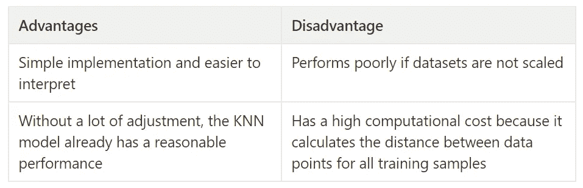

# **5。朴素贝叶斯分类**

朴素贝叶斯分类也是一种监督机器学习算法，它是一种分类器算法。朴素贝叶斯是基于贝叶斯理论的概率分类器，这意味着基于对象的概率进行预测。给定一些新信息 P(B | A)和事件概率 P(A)的先验信念，贝叶斯定理是理解某个事件概率 P(A | B)的首要方法。

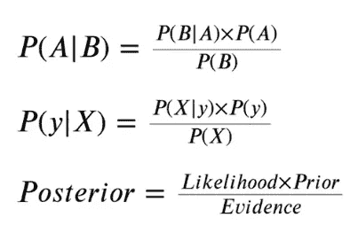

Bayesian formula

存在几种类型的朴素贝叶斯模型，包括高斯模型、多项式模型和伯努利模型。高斯 NB 假设特征遵循正态分布，可应用于任何连续数据，而伯努利 NB 假设二进制数据，当数据为多项式分布时，使用多项式 NB。

使用 Scikit-learn 简单实现朴素贝叶斯:

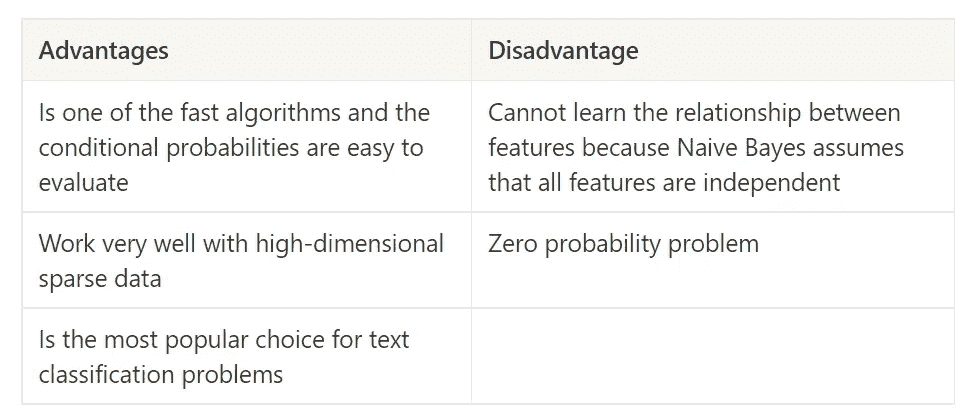

# **6。决策树**

决策树是受监督的机器学习算法，可用于分类和回归任务。决策树的主要概念是创建一个模型，通过学习从数据特征推断的简单决策规则来预测目标变量的值。决策树的工作方式是将数据集连续分割成小段，直到目标变量不变或数据集无法再分割为止。但这种算法是贪婪的，它在某一时刻做出最佳决策，而不考虑全局最优。

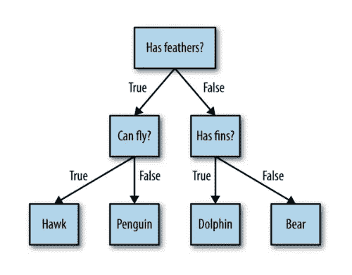

Example of decision tree (Muller & Guido, 2016).

决策树还可以估计一个实例属于某个特定类的概率。实际上，决策树模型很容易过度拟合。要解决这个问题，您可以提前停止创建树，或者先构建树，然后删除或折叠包含少量信息的节点。要提前停止创建树，必须设置树的最大深度和最大叶子数。

使用 Scikit-learn 简单实现决策树:

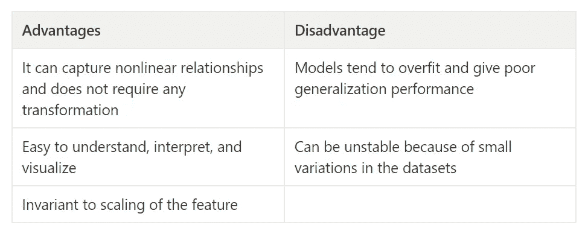

# 7 .**。随机森林**

随机森林是一种有监督的机器学习算法，是一种集成方法。集成是结合多个机器学习模型来创建更强大的模型的方法。随机森林基本上是决策树的集合，其中每棵树都与其他树略有不同。随机森林的工作原理是根据随机的特征子集训练许多决策树，然后对它们的预测进行平均。

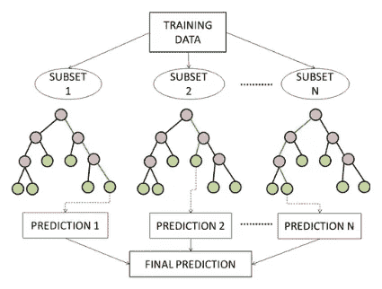

Random forest (Laudato et al., 2020).

导致过度拟合模型的决策树问题的解决方案是随机森林。随机森林通过平均来自多个决策树的结果来减少训练数据的过度拟合。制作随机森林模型有几个挑战，包括需要很长的训练时间，因为它是一个学习集合，比其他机器学习模型需要更多的资源，并且更复杂。

使用 Scikit-learn 简单实现随机森林:

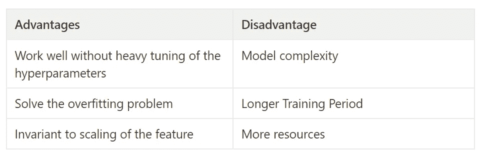

# **8。k-均值聚类**

K-means 聚类是一种无监督的机器学习算法，也是最常用的聚类算法。聚类是将数据集划分成组的任务，这些组称为聚类。如果我们希望对未标记的数据进行分组，K-means 算法是一个不错的选择。K-means 聚类试图找到代表某个数据区域的聚类中心，并将每个数据点分配到最近的聚类中心。

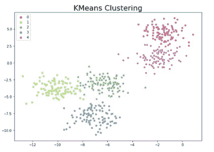

Kmeans clustering (image by author).

这里最重要的事情是，你必须确定算法必须找到的 k 个簇的数量。当聚类过少或过多时，模型的性能会很差。此外，选择正确的质心初始化策略对模型在训练期间的性能有显著影响。

使用 Scikit-learn 简单实现 K-means 聚类:

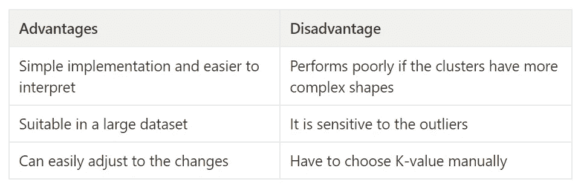

# **总结**

这个世界上有许多机器学习算法，每天都会有新的算法出现。流行的机器学习算法，其中一些是线性回归、逻辑回归、支持向量机、K-最近邻、朴素贝叶斯分类、决策树、随机森林和 K-均值聚类。每种算法都有自己的优缺点。在实践中，您可能会尝试应用这些算法，并选择性能最佳的算法。

# **参考文献:**

[1]阿尔邦，C. (2018)。机器学习与 Python 食谱:从预处理到深度学习的实用解决方案。奥赖利媒体

[2] Géron，a .(2019)。使用 Scikit-Learn、Keras 和 Tensorflow 进行机器学习:构建智能系统的概念、工具和技术。奥赖利媒体

[3]劳达托、詹纳罗&奥利韦托、罗科&斯卡拉布利诺、西蒙尼&科拉维塔、安吉拉-丽塔&德维托、卢卡&皮卡里略、弗朗切斯科&图多萨、伊万。(2020).压缩心电图信号中 R 峰出现的识别。10.1109

[4]a .穆勒和 s .圭多(2016)。Python 机器学习导论:数据科学家指南。奥赖利媒体

[5]张，简&松拉，拉胡尔&洛克哈特，瑟蒙。(2020).使用可穿戴传感器和支持向量机自动检测老年人的动态和静态活动。Sci。2.56.10.3390/sci2030056。

 [## 用于数据可视化的顶级 Python 库(静态和交互式可视化)

### 用于数据可视化的 python 库集合

medium.com](/mlearning-ai/top-python-libraries-for-data-visualization-static-and-interactive-visualization-e5f1bc72de41)