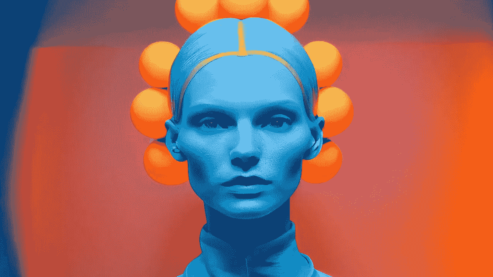

# 自由镜头时代的人像摄影

> 原文：<https://medium.com/mlearning-ai/portrait-photography-in-the-era-of-free-lensa-ai-a40ffdfcd494?source=collection_archive---------5----------------------->

## [使用简单，没有限制，可替代](https://open.substack.com/pub/evartology/p/free-alternative-to-lensa-ai?r=9hp4d&utm_campaign=post&utm_medium=web)

[Want to snap a gorgeous selfie for free?](https://open.substack.com/pub/evartology/p/free-alternative-to-lensa-ai?r=9hp4d&utm_campaign=post&utm_medium=web)

**[**扩散模特**](https://open.substack.com/pub/mlearning/p/how-does-a-diffusion-model-work?r=z7zu8&utm_campaign=post&utm_medium=web)
每张[人像](/p/f239cd3443db)都是独一无二的。在任何时候，只有一件[艺术品](/mlearning-ai/all-art-is-a-machine-and-all-machines-are-art-e787a38fcd97)是原创的。它有不同的制造原因。只有一个男人和一个女人存在。就算是实物也不可能有最好的 AI 输出那么好。所以，每一代新人都是不同的人。**