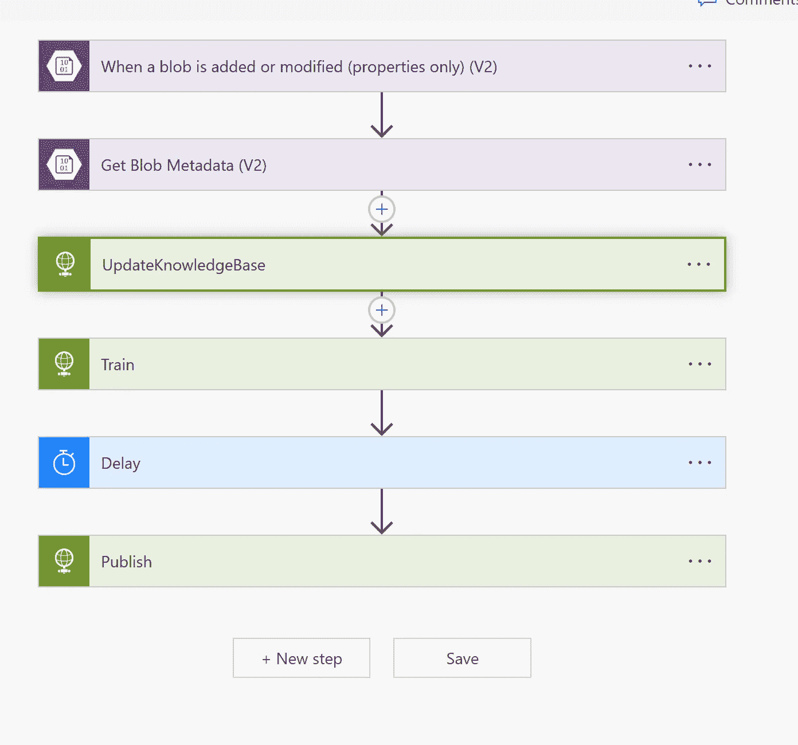
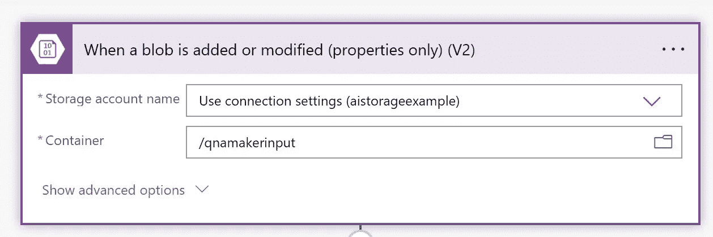
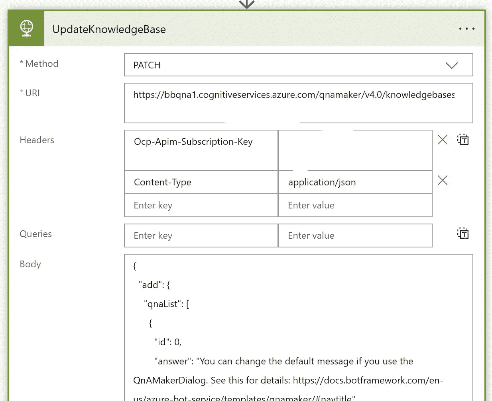
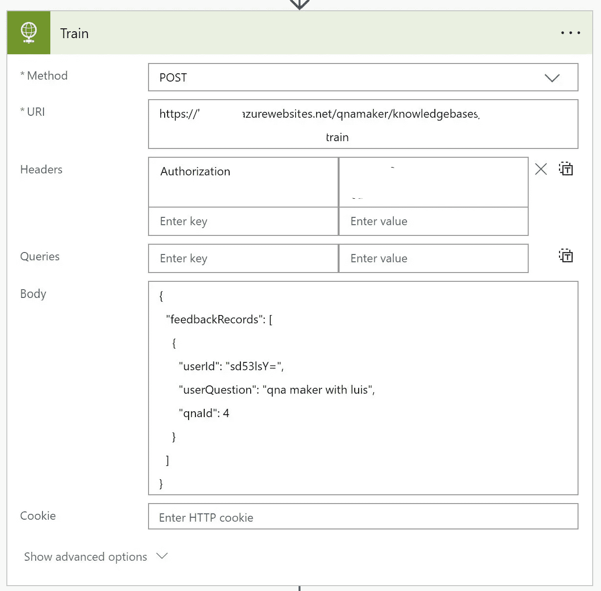
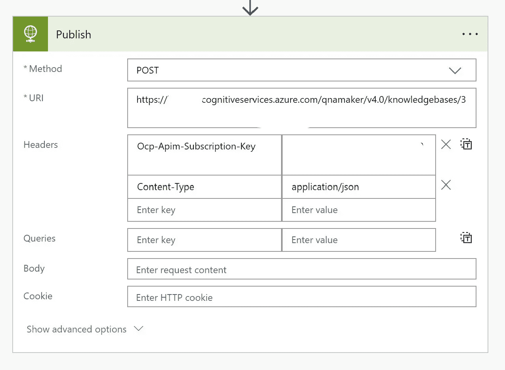
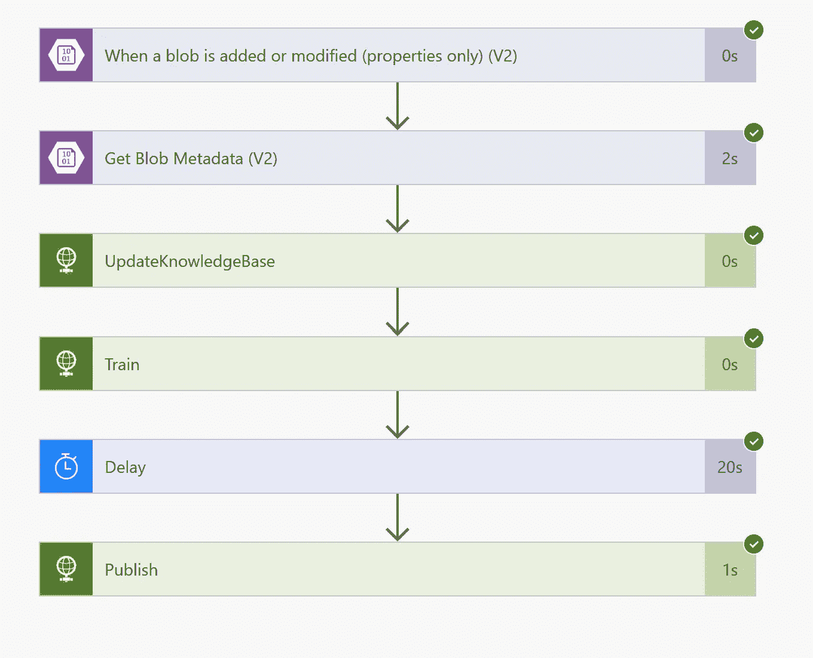

# 自动化 Azure 认知服务 QnA Maker 培训和发布的功率流

> 原文：<https://medium.com/mlearning-ai/power-flow-to-automate-azure-cognitive-services-qna-maker-train-and-publish-129af2f4e196?source=collection_archive---------5----------------------->

# 更新知识库、培训和发布 QnA 制造商的自动化流程

# 用例

*   创建 QnA 制造商知识库
*   基于 blob 触发器更新知识库的能力
*   更新知识库
*   培训和发布 QnA 制造商
*   使用功率流

# 整个过程



# 步伐

*   首先用 blob 触发器创建一个功率流
*   配置存储帐户名称并使用密钥进行身份验证



*   接下来引入 HTTP 任务来更新知识库
*   查看端点 URL
*   用 QnA Maker UI 中的实际知识库 id 替换 xxxxxxxxxxxxxxxxxxxxxxx 中的知识库 id
*   qna Maker UI[Https://qnamaker.ai/](https://qnamaker.ai/)

```
Method: PATCH
URL: https://qnaservicename.cognitiveservices.azure.com/qnamaker/v4.0/knowledgebases/xxxxxxxxxxxxxxxxxxxxxx
Ocp-Apim-Subscription-Key: Primary or Secondary Key from Azure Portal
Content-Type: application/json
```



*   这是我们传递的数据

```
{
  "add": {
    "qnaList": [
      {
        "id": 0,
        "answer": "You can change the default message if you use the QnAMakerDialog. See this for details: https://docs.botframework.com/en-us/azure-bot-service/templates/qnamaker/#navtitle",
        "source": "Custom Editorial",
        "questions": [
          "How can I change the default message from QnA Maker?"
        ],
        "metadata": []
      }
    ],
    "urls": [
      "https://docs.microsoft.com/en-us/azure/cognitive-services/Emotion/FAQ"
    ],
    "files": [
      {
        "fileName": "SurfaceManual.pdf",
        "fileUri": "https://download.microsoft.com/download/2/9/B/29B20383-302C-4517-A006-B0186F04BE28/surface-pro-4-user-guide-EN.pdf"
      }
    ]
  },
  "delete": {
    "ids": [
      13,
      35
    ]
  },
  "update": {
    "name": "QnA Maker FAQ Prompts Bot",
    "qnaList": [
      {
        "id": 2,
        "answer": "You can use our REST apis to create a KB. See here for details: https://docs.microsoft.com/en-us/rest/api/cognitiveservices/qnamaker/knowledgebase/create",
        "source": "Custom Editorial",
        "questions": {
          "add": [],
          "delete": []
        },
        "metadata": {
          "add": [],
          "delete": []
        },
        "context": {
          "isContextOnly": false,
          "promptsToAdd": [
            {
              "displayText": "Add Prompts",
              "displayOrder": 0,
              "qna": {
                "id": 0,
                "answer": "Click here to know more https://docs.microsoft.com/en-us/azure/cognitive-services/qnamaker/how-to/multiturn-conversation",
                "source": "Editorial",
                "questions": [
                  "How can I add prompts?"
                ],
                "metadata": [],
                "context": {
                  "isContextOnly": false,
                  "prompts": []
                }
              },
              "qnaId": 0
            },
            {
              "displayText": "Delete Prompts",
              "displayOrder": 0,
              "qna": {
                "id": 0,
                "answer": "Click here to know more https://docs.microsoft.com/en-us/azure/cognitive-services/qnamaker/how-to/multiturn-conversation",
                "source": "Editorial",
                "questions": [
                  "How can I delete delete prompts?"
                ],
                "metadata": [],
                "context": {
                  "isContextOnly": false,
                  "prompts": []
                }
              },
              "qnaId": 0
            },
            {
              "displayText": "Update Knowledgebase",
              "displayOrder": 0,
              "qna": null,
              "qnaId": 3
            }
          ],
          "promptsToDelete": [
            3
          ]
        }
      },
      {
        "id": 3,
        "answer": "You can use our REST apis to update your KB. See here for details: https://docs.microsoft.com/en-us/rest/api/cognitiveservices/qnamaker/knowledgebase/update",
        "source": "Custom Editorial",
        "questions": {
          "add": [],
          "delete": []
        },
        "metadata": {
          "delete": [
            {
              "name": "category",
              "value": "api"
            }
          ],
          "add": [
            {
              "name": "category",
              "value": "programmatic"
            }
          ]
        },
        "context": {
          "isContextOnly": false,
          "promptsToAdd": [
            {
              "displayText": "Regenerate Endpoint keys",
              "displayOrder": 1,
              "qna": null,
              "qnaId": 4
            }
          ],
          "promptsToDelete": [
            4
          ]
        }
      }
    ]
  }
}
```

*   现在让我们来训练知识库文章
*   方法:邮寄



*   这里有一些变化，网址是不同的

```
URL: https://qnaservice.azurewebsites.net/qnamaker/knowledgebases/xxxxxxx/train
Authorization: Key from QNA Maker portal Publish screenMethod: POST
Content-Type: application/json{
  "feedbackRecords": [
    {
      "userId": "sd53lsY=",
      "userQuestion": "qna maker with luis",
      "qnaId": 4
    }
  ]
}
```

*   培训后发布知识库
*   方法:邮寄

```
Ocp-Apim-Subscription-Key: Primary or Secondary Key from Azure Portal
```



*   保存并运行测试
*   将文档上传到 blob 以触发



原文—【github.com】samples 2022/qna flow . MD at main balakreshnan/samples 2022

[](/mlearning-ai/mlearning-ai-submission-suggestions-b51e2b130bfb) [## Mlearning.ai 提交建议

### 如何成为 Mlearning.ai 上的作家

medium.com](/mlearning-ai/mlearning-ai-submission-suggestions-b51e2b130bfb)