# 强大的熊猫功能，您的数据分析离不开它

> 原文：<https://medium.com/mlearning-ai/powerful-pandas-functions-your-data-analysis-cant-live-without-44dbfc9e4e0?source=collection_archive---------0----------------------->

数据科学工资数据常用熊猫函数示例


Photo by [NASA](https://unsplash.com/@nasa?utm_source=medium&utm_medium=referral) on [Unsplash](https://unsplash.com?utm_source=medium&utm_medium=referral)

如果你主要用 Python 编码，不管你正在解决什么类型的问题，或者你正在建立什么类型的模型，每一个数据科学/机器学习项目都严重依赖于这些简单而强大的 Pandas 函数。

在本文中，我将以[“数据科学工作薪水”](https://www.kaggle.com/datasets/ruchi798/data-science-job-salaries)(来自 Kaggle)数据为例，带您了解每个函数。对于每个函数，你可以点击它的名字，它会带你到文档。

## 安装—入门

在我们开始之前，请确保您已经安装并正确导入了熊猫。

如果您有 conda 环境，请在终端中运行以下命令:

```
conda install pandas
```

或者，pandas 可以通过 pip 从 [**PyPI**](https://pypi.org/project/pandas/) 安装。在终端中运行以下命令:

```
pip install pandas
```

如果您遇到任何问题，请务必查看 [pandas 文档](https://pandas.pydata.org/getting_started.html)并从那里排除故障。

现在我们已经成功地在本地安装了熊猫，让我们导入这个包，让熊猫施展它的魔法吧！

pandas 的传统别名是`pd`，因此加载 pandas 作为`pd`被认为是所有 pandas 文档的**标准实践**。

## [pandas.read_csv](https://pandas.pydata.org/docs/reference/api/pandas.read_csv.html?highlight=read_csv)

首先，让我们从 ds_salaries.csv 加载数据集。该函数读入一个逗号分隔值(csv)文件，我们可以将它存储在 DataFrame 中。

在这里，我们将数据帧存储在变量`df.`中

## [熊猫。DataFrame.head](https://pandas.pydata.org/docs/reference/api/pandas.DataFrame.head.html?highlight=head#pandas.DataFrame.head) (n=5)

加载数据集后，我们需要做的第一件事就是查看我们的数据。此函数允许我们查看前 n 行数据(默认为 5 行)，您可以指定想要查看的行数。

在这里，我将行数指定为“10”，结果如下:

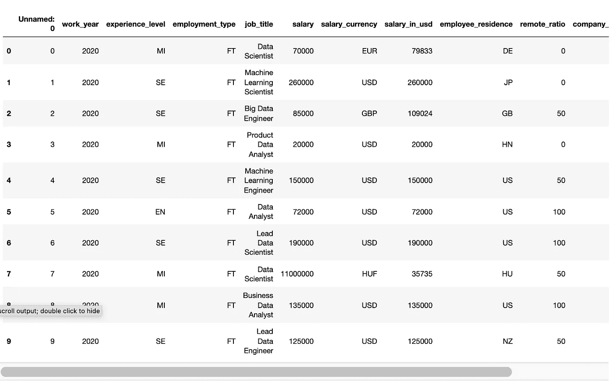

Top 10 Rows of Data — Image by Author

同样，熊猫。DataFrame.tail(n=5)将返回 DataFrame 的最后 n 行(默认值为 5)。

## [熊猫。DataFrame.columns](https://pandas.pydata.org/docs/reference/api/pandas.DataFrame.columns.html)

如果你想查看数据帧的所有列，这个函数将返回一个列表中的所有列名。

输出:

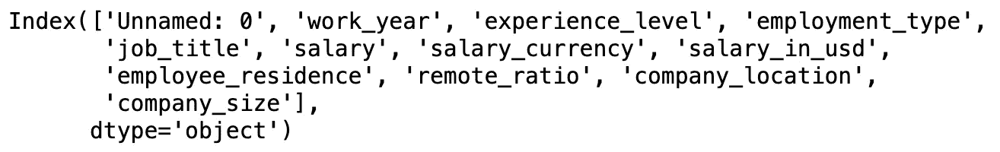

List a Column Names — Image by Author

## [熊猫。DataFrame.dtypes](https://pandas.pydata.org/docs/reference/api/pandas.DataFrame.dtypes.html)

这是另一个“必须运行”的函数，它向我们显示了每一列的数据类型。

输出:

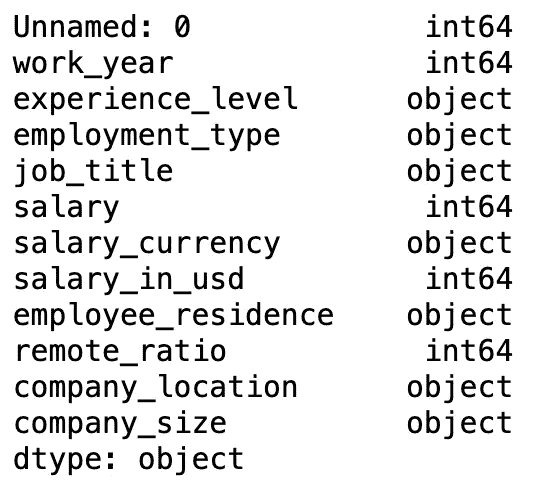

Data Type of Columns — Image by Author

如果想检查单个列的数据类型，也可以对特定的列使用这个函数。

## 熊猫。DataFrame.info

这个函数打印数据集的简短摘要——了解数据的另一个重要步骤，我们正在处理的数据。

输出:

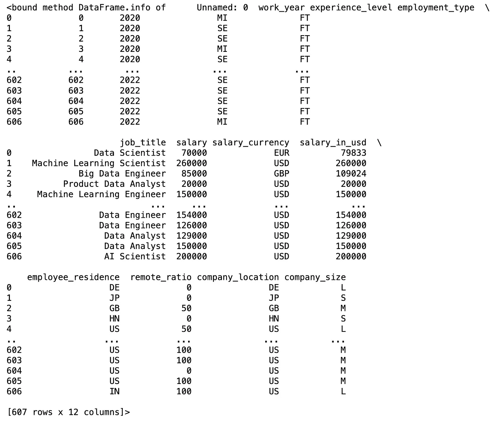

DataFrame Info — Image by Author

在这里，我们可以看到数据的所有列、头部和尾部。数据框的形状也打印在底部。如果你只是想看看数据的形状，下面是一个方便快捷的功能。

## [熊猫。DataFrame.shape](https://pandas.pydata.org/docs/reference/api/pandas.DataFrame.shape.html)

输出:

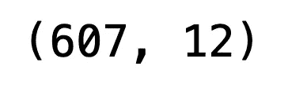

Shape of the DataFrame — Image by Author

正如我们在这里看到的，这个函数返回一个表示数据帧维度的元组。在 EDA 开始时了解数据的形状总是好的，如果您正在进行任何形式的数据操作，请经常仔细检查数据的形状。

## [熊猫。DataFrame.drop](https://pandas.pydata.org/docs/reference/api/pandas.DataFrame.drop.html?highlight=drop#pandas.DataFrame.drop)

现在我们已经了解了数据中的内容，是时候进行一些数据清理了！一般来说，我会先删除数据集中无意义的列，这样我们就可以专注于重要的信息。在这个数据帧中，我们看到第一列`Unnamed: 0`是。csv 文件是多余的。因此，我们将使用该函数删除该列。

这里我们删除了列并更新了数据帧。该函数不仅可以删除列，还可以删除行或基于条件语句的特定数据集。

## [熊猫。DataFrame.groupby](https://pandas.pydata.org/docs/reference/api/pandas.DataFrame.groupby.html?highlight=groupby#pandas.DataFrame.groupby)

到现在为止，我可能已经运行这个函数一百万次了！使用这个函数，我们可以对任何列上的数据进行分组，并执行聚合计算。例如，如果我们想知道**平均年薪(美元)是多少**:

这一行代码会给我们答案。

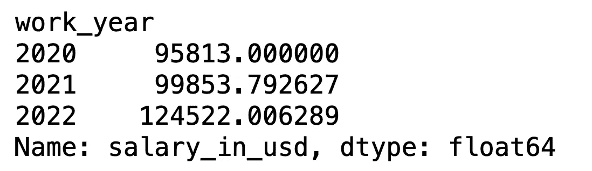

Salary per Year — Image by Author

我们调用了`.groupby()`，并传递了要分组的列的名称，即`work_year`。然后使用`['salary_in_usd']`来指定执行实际聚合的列。

## [熊猫。DataFrame.plot.bar](https://pandas.pydata.org/docs/reference/api/pandas.DataFrame.plot.bar.html)

为了可视化上面的信息(年薪)，我们可以调用这个函数来绘制一个漂亮而简单的条形图。

输出:

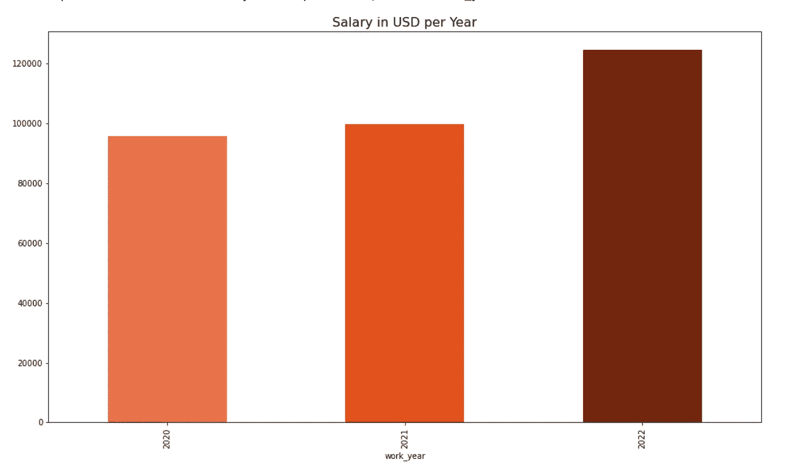

Salary per Year — Image by Author

您还可以为“x”和“y”轴传入您想要的特定列，此外，您还可以使用“color”参数自定义颜色。

## 熊猫。DataFrame.plot.hist

类似地，我们可以生成单个变量的直方图。例如，如果我们想查看总体工资分配情况:

输出:

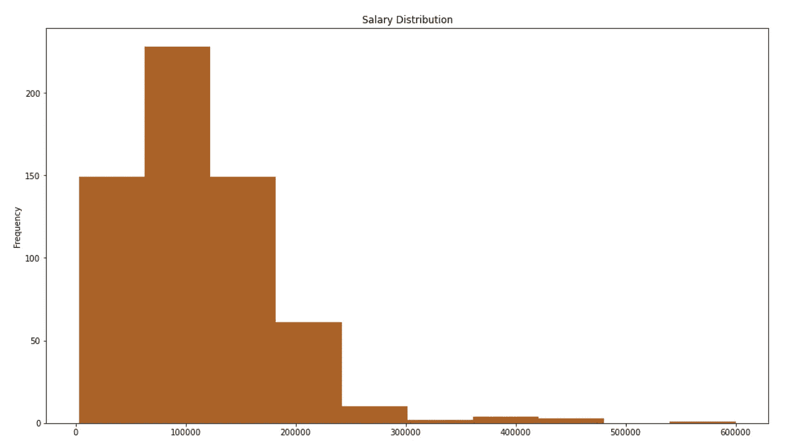

Salary Distribution — Image by Author

## [熊猫。DataFrame.value_counts](https://pandas.pydata.org/docs/reference/api/pandas.DataFrame.value_counts.html?highlight=value_count)

这是另一个经常使用的函数—它计算数据帧或特定列中的唯一行。例如，如果我们想知道每个职位的人数，或者最常见的职位是什么:

输出:

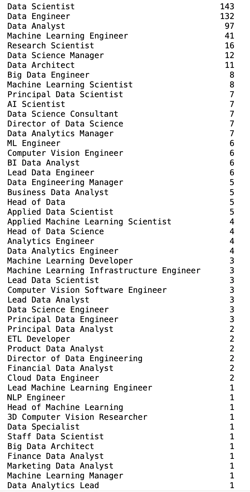

Count per Unique Job Title — Image by Author

哇，有各种各样的工作头衔！但是现在我们可以很容易地从这个函数的输出中看出最常见的职称是什么。我们还可以用一个简单的 pandas 函数来可视化这些信息。

## [熊猫。DataFrame.plot.barh](https://pandas.pydata.org/docs/reference/api/pandas.DataFrame.plot.barh.html)

类似于我们上面做的条形图，这个函数绘制了一个水平条形图。

输出:

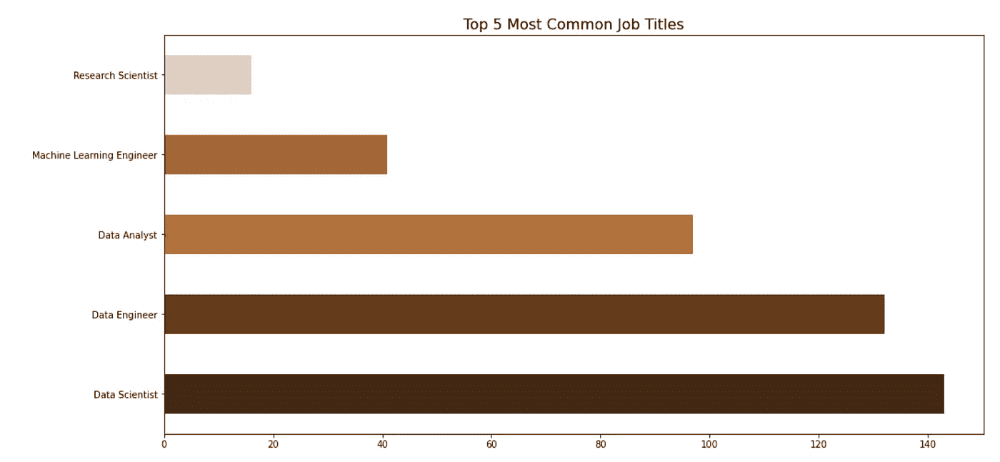

Top 5 Most Common Job Titles — Image by Author

这里我只画出了`value_counts()`输出的前 5 个结果，但是你可以随时指定你想要展示的信息。

## [pandas.get_dummies](https://pandas.pydata.org/docs/reference/api/pandas.get_dummies.html?highlight=dummy)

让我们把注意力转移到`'company_size'`列，这是一个分类特征，并使用`value_counts()`来检查每个独特大小的数量。

在许多情况下，如果我们向一个模型输入一个具有两个以上唯一值的分类特征，我们需要转换/编码变量。这个函数就是这样做的:

输出:

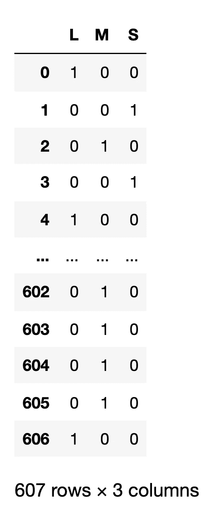

dummy_df — Image by Author

在这里，我将虚拟变量存储到一个单独的数据帧中，因此我们可以将这个数据帧连接到原始数据帧。

## [pandas.concat](https://pandas.pydata.org/docs/reference/api/pandas.concat.html?highlight=concat#pandas.concat)

这个简单的`.concat`函数允许我们将虚拟变量合并到原始数据帧中。

输出:

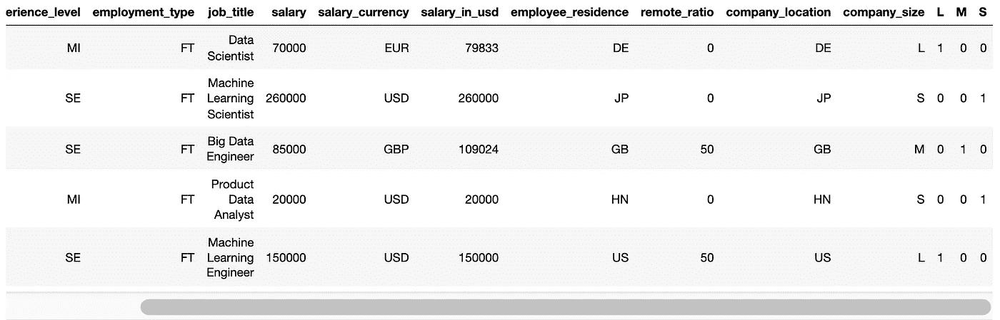

DataFrame after Concat — Image by Author

如果我们查看原始数据帧`'df'`的头部，我们可以看到`'company_size'`的唯一值现在有了自己的列。

# 在你走之前…

如果你想看到这个数据集的完整 EDA，请访问我的 GitHub 上的这个 [**笔记本**](https://github.com/m3redithw/data-science-visualizations/blob/main/DataScienceSalaries/ds_salaries_eda.ipynb) 。

我希望本文展示了一些对您有帮助的 pandas 函数，并让您对 Python、pandas 和可视化在一般探索性数据分析中的使用有了更高层次的理解。

感谢您的阅读！我很想听听你的想法。❤️

请随时在 Linkedin 上与我联系。

[](/mlearning-ai/mlearning-ai-submission-suggestions-b51e2b130bfb) [## Mlearning.ai 提交建议

### 如何成为 Mlearning.ai 上的作家

medium.com](/mlearning-ai/mlearning-ai-submission-suggestions-b51e2b130bfb)