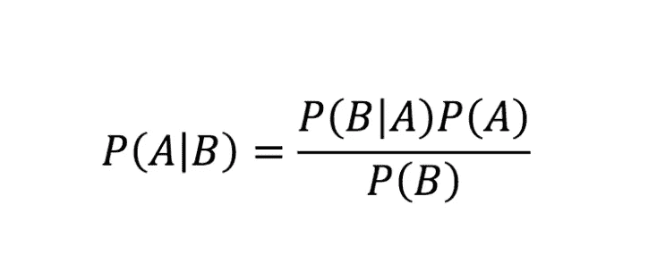
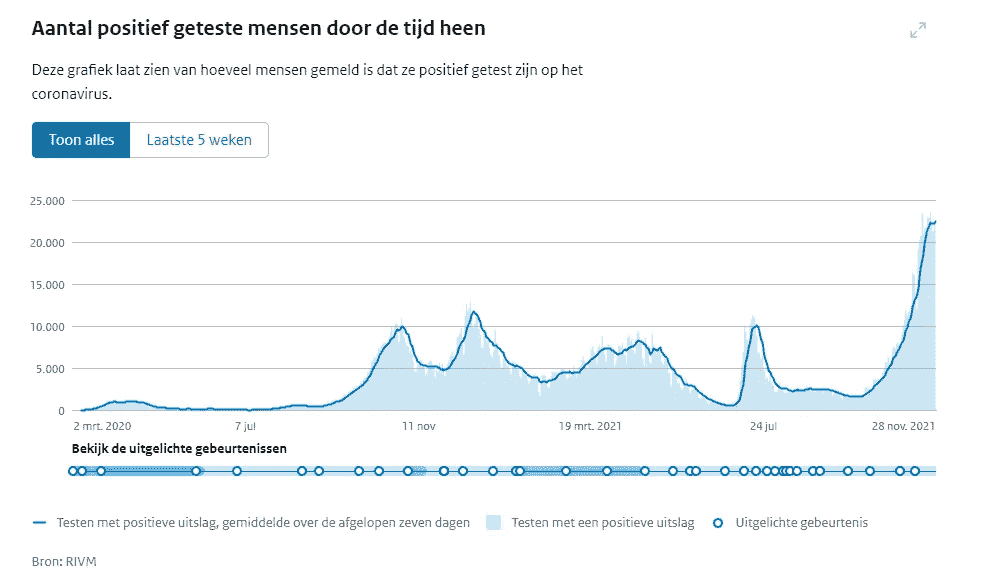
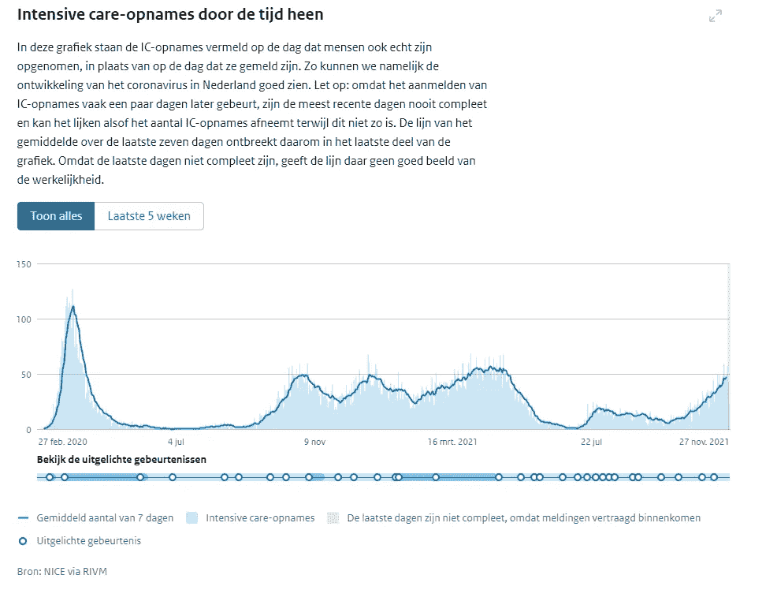
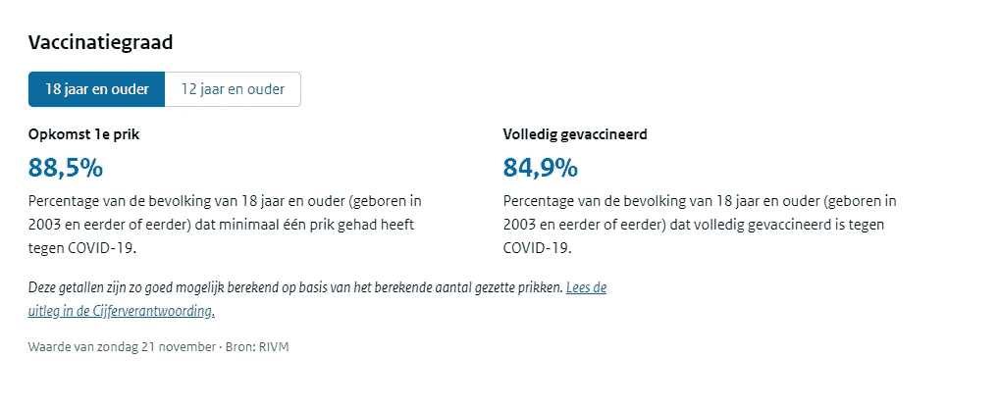
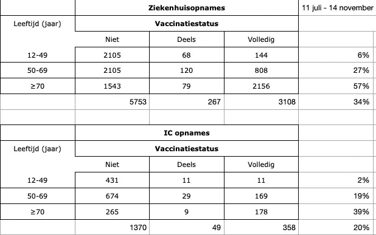
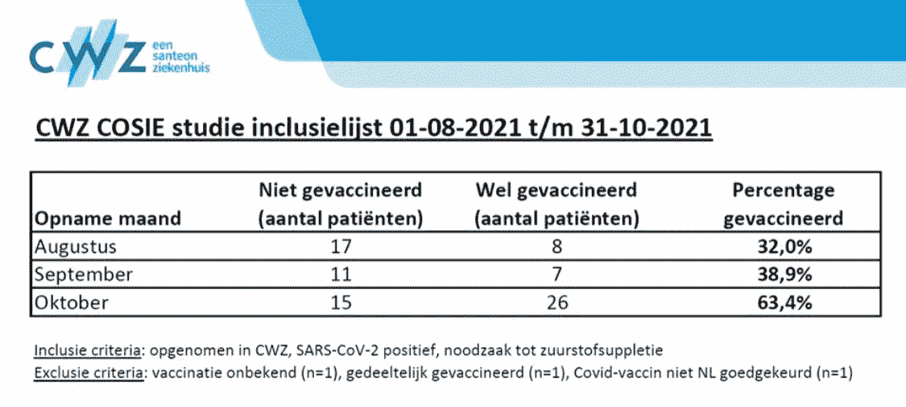

# Pr(非 VAX |伊斯兰法院联盟)≠ Pr(伊斯兰法院联盟|非 VAX)

> 原文：<https://medium.com/mlearning-ai/pr-non-vax-icu-pr-icu-non-vax-f7af477896ad?source=collection_archive---------1----------------------->

我已经在另一篇[帖子](/@marc.jacobs012/why-science-is-beautifully-human-and-very-frail-4f6225d32bb0)中表明，科学是人类的工作。从这个词最纯粹的意义上来说，这是不言自明的，因为机器不做科学(还没有)。我们有。以及由此带来的所有后果，因为人类的一切本质上都是脆弱和易错的。不幸的是，我们似乎时常忘记这一点，过于强调科学向我们展示的东西。仿佛科学是纯粹的，完美的，无所不包的。

我不打算重复我在之前的帖子中所写的内容，但我要做的是更深入地挖掘‘依赖’。条件概率。为了解释这一点，我想再次使用贝叶斯定理，它是这样的:



1.  P(A|B)是从属概率:如果 B 为真，A 的概率。这也被称为后验概率。
2.  P(B|A)也是相依概率:A 为真时 B 的概率。这也叫给定 A 固定 B 的可能性，因为 P(B|A) = L(A|B)。
3.  P(A)和 P(B)分别是 A 和 B 的概率。这些是边际概率，这意味着概率是不相关的。这就是所谓的先验概率。

同样，关键词是依赖。B and B 依赖于美国，只是这种依赖是不一样的。这就是我想在这篇文章中谈论的——当你只看数据而不包括更大的世界时，贝叶斯定理中的反直觉。有趣的是，贝叶斯定理是我们人类实际学习方式的数学表示。也就是迭代地，但也从更大的画面中清晰地划分出来。“无知是福”这句话是认知失调的前兆。

让我通过特别关注新冠肺炎、ICU 入院和疫苗接种状态之间的关系来具体说明。最近这里有很多事情要做。



In Dutch, the number of positive tests through time.



In Dutch, the number of ICU admission across time.



In Dutch, the level of vaccination — 88.5% for first shots, and 84.9% for second shots.

我现在越来越多地听到的是，ICU 病床上挤满了未接种疫苗的人群。这些数据是免费提供的，尽管是高度聚合的，而且缺乏更细粒度的关键变量。然而，我们可以指望它。参见下面的 [RIVM](https://coronadashboard.government.nl/) 图表。



In Dutch, the rows show age, and the columns show non-vax, partial-vax, and complete-vax (2 shots).

其他可用的来源是表格，例如来自 [CWZ](https://www.cwz.nl/) 的表格，但是为了方便起见，我将使用 RIVM 表格进行计算。正是因为它强调了没有接种疫苗的人最终会被送进重症监护室。



为了有一个好的开始，我们必须立即声明 Pr(VAX)不是 Pr(VAX)。这是同一枚硬币两面的两个位置，但不可互换:

1.  给定疫苗接种状态下某人进入 ICU 的几率— Pr(A|B)。
2.  给定某人进入 ICU 的疫苗接种状态— Pr(B|A)。

经常出错的是，上面这些表被看做是 Pr(A|B)的‘证明’，但实际上是 Pr(B|A)。事实上，它甚至是 Pr(B，C|A ),因为它是某人已经接种疫苗，并且已经达到一定年龄的机会，他或她将最终进入 ICU。那是我们获取信息的地方。因此，这并不等于 Pr(A|B，C)——考虑到他的年龄和疫苗接种情况，他最终进入重症监护室的几率。

我已经揭示了其中的区别，在于这些表格并没有考虑病人最终入住 ICU 的“先验概率”。几乎是不存在的。如果每年有 3000 名新冠肺炎患者来到 ICU，那就是 3000/1750 万人。这是最终住进重症监护室的基本机会。除此之外，还有年龄和疫苗接种情况，你实际上想要包括更多的变量。不幸的是，RIVM 没有任何可用的原始数据，所以我们只能用有限的信息来凑合。如上所述，这对于本练习来说不是问题。

为了进一步计算，我需要表格中没有的额外信息，所以我使用了 [CBS](https://www.cbs.nl/en-gb) 和 [RIVM](https://coronadashboard.government.nl/) 网站来创建上下文。蒙克的作品。

```
p ("12-49")           = (8406602  / 17475415)         = 0.4
p ("50-69")           = (4691222  / 17475415)         = 0.27  
p (">70")             = (2424970  / 17475415)         = 0.14
p (">12")             = (15522794 / 17475415)         = 0.89

p (VAX | "12-49")     = (6118208  / 8406602)          = 0.73
p (nVAX| "12-49")     = (2288394  / 8406602)          = 0.27
p (VAX | "50-69")     = (4145529  / 4691222)          = 0.88
p (nVAX| "50-69")     = (545693   / 4691222)          = 0.12
p (VAX | ">70")       = (2222492  / 2424970)          = 0.92
p (nVAX| ">70")       = (202478   / 2424970)          = 0.08
```

然后，关掉 RIVM 表的数据。

```
Pr("12-49"|IC)           = (453      / 1777)          = 0.26
Pr("50-69"|IC)           = (872      / 1777)          = 0.49
Pr(">70"  |IC)           = (452      / 1777)          = 0.25

Pr(VAX|IC,  ">70")       = (178      / 452)           = 0.3938 
Pr(nVAX|IC, ">70")       = ((265+9)  / 452)           = 0.6062
Pr(VAX|IC,  "12-49")     = (11       / 453)           = 0.0243
Pr(nVAX|IC, "12-49")     = ((431+11) / 453)           = 0.9757
Pr(VAX|IC,  "50-69")     = (169      / 872)           = 0.1938 
Pr(nVAX|IC, "50-69")     = ((674+29) / 872)           = 0.8062
```

最后六排特别有意思。如果我们解释接种疫苗或未接种疫苗的概率比(我认为部分接种疫苗为未接种疫苗)，那么它看起来像这样:

*   “>70” = 0.6062/0.3938 = 1.53
*   “12–49” = 0.9757/0.0243 = 40.11
*   “50–69” = 0.8062/0.1938 = 4.16

令人印象深刻。在重症监护室发现未接种疫苗的“12-49 岁”儿童的几率是接种疫苗儿童的 40 倍。只是，这些都是边际比率，这些比率只有在你想尽可能快地跑过重症监护室去寻找一个未接种疫苗的 35 岁老人时才有意思。如果你想知道一个没有接种疫苗的 35 岁的人最终进重症监护室的可能性有多大，这就没什么意思了。事实上，我甚至不知道找到一个 35 岁未接种疫苗的人的几率有多大，因为数据分类相当宽泛。我也不知道我是否会找到一个男人或女人，以及这个人已经在那里多久了。除了疫苗接种情况和大致的年龄估计，我对这些人一无所知。

然而，我们不要扫兴。让我们根据疫苗接种情况和年龄类别，计算实际进入 ICU 的概率。

下面用代码描述，对于年龄" > 70 "的人进入 ICU 的概率。

```
Pr(ICU|">70")       = Pr(">70"|IC)*Pr(IC)/Pr(">70")
                    = (0.25* 0.0001)/ 0.14=0.0001785714

Pr(ICU|VAX,">70")   = Pr(VAX|ICU,">70")*Pr(ICU|">70")/Pr(VAX|">70") 
                    = (0.3938*0.0001785714)/0.92=0.0007276739 

Pr(ICU|nVAX,">70")  = Pr(nVAX|ICU,">70")*Pr(ICU|">70")/Pr(nAX|">70")
                    = (0.6062*0.0001785714)/0.08=0.001288175
```

让我们比较一下 VAX 和非 VAX 的概率。我们可以看到，在 70 岁或以上，基于非 VAX 或 VAX 的情况下，最终入住 ICU 的概率分别为:1:776 和 1:1374。

```
Pr(nVAX|ICU,">70") ≠  Pr(ICU|nVAX,">70")
0.6062             ≠  0.001288175        IT IS 470x MOREPr(VAX|ICU,">70")  ≠  Pr(ICU|VAX,">70")
0.3938             ≠  0.0007276739       IT IS 541x MORE
```

然后，让我们来比较一下 70 岁以上老人住进重症监护室的可能性。

```
Pr(ICU|nVAX,">70") ≠ Pr(ICU|VAX,">70")
0.001288175        ≠ 0.0007276739       IT IS 1.77x MORE
```

综上所述，证明了一个简单的包含 VAX 状态和年龄的 ICU 患者的表格并不能提供最终进入 ICU 的真实概率。事实上，真正的概率是 500 倍左右。这些都是值得交流的数字！尽管如此，去重症监护室接受绝育手术的机会还是少了 1.77 倍。

让我们完成其他小组的练习。

```
Pr(ICU|"12-49")     = Pr("12-49"|ICU)*Pr(ICU)/Pr("12-49")
                    = (0.26*0.0001)/0.48=0.00005

Pr(ICU|VAX,"12-49") = Pr(VAX|ICU,"12-49")*Pr(ICU|"12-49")/Pr(VAX|"12-49")
                    = (0.0243*0.00005)/0.73=0.0000016 Pr(ICU|nVAX,"12-49")= Pr(nVAX|ICU,"12-49")*Pr(ICU|"12-49")/Pr(nVAX|"12-49")
                    = (0.9757*0.00005)/0.27=0.0001806852
```

现在我们有了基于 VAX 状态和年龄的进入 ICU 的后验概率，让我们比较一下数字。

```
Pr(nVAX|ICU,"12-49") ≠  Pr(ICU|nVAX,"12-49")
0.9757               ≠  0.0001806852        IT IS 5400x MOREPr(VAX|ICU,"12-49")  ≠  Pr(ICU|VAX,"12-49")
0.0243               ≠  0.0000016           IT IS 15187x MORE
```

正如你所看到的，这个表格又一次不是很有用，并且严重高估了最终进入 ICU 的真实概率，非 Vax 人群为 1:5000，VAX 人群为 1:625000。

```
Pr(ICU|nVAX,"12-49") ≠ Pr(ICU|VAX,"12-49")
0.0001806852         ≠  0.0000016            IT IS 112x MORE
```

比较后验概率显示，对于 12-49 岁年龄组，非 VAX 组的概率高 112 倍。然而，鉴于我们现在掌握的有限数据，在 ICU 结束的概率约为 1:5000。

如果我们完成最新一组，即 50-69 岁年龄组的练习，我们会得到这些数字。

```
Pr(ICU|"50-69")     = Pr("50-69"|ICU)*Pr(ICU)/Pr("50-69")
                    = (0.49*0.0001806852)/0.27 = 0.0001814815  

Pr(ICU|VAX,"50-69") = Pr(VAX|ICU,"50-69")*Pr(ICU|"50-69")/Pr(VAX|"50-69")
                    = (0.1938*0.0001814815)/0.88 = 0.00003996718

Pr(ICU|nVAX,"50-69")= Pr(nVAX|ICU,"50-69")*Pr(ICU|"50-69")/Pr(nVAX|"50-69")
                    = (0.8062*0.0001814815)/0.12 = 0.001219253
```

如果我们对它们进行比较，我们会看到与上面看到的相同的情况，那就是基于数据表的概率并不能产生一个人最终进入 ICU 的真实概率。再次严重高估。

```
Pr(nVAX|ICU,"50-69") ≠  Pr(ICU|nVAX,"50-69")
0.8062               ≠  0.001219253 IT IS 661x MOREPr(VAX|ICU,"50-69")  ≠  Pr(ICU|VAX,"50-69")
0.1938               ≠  0.00003996718 IT IS 4848x MORE
```

当我们做最后的比较时，我们看到非 VAX 组患者最终入住重症监护室的概率要高 30 倍。50-69 岁的非 VAX 人最终住进 ICU 的概率约为 1:1000。考虑到目前为止我们在荷兰 ICU 数据中所看到的，我认为这是一个严重的高估。这意味着我们需要更多的上下文数据，但我们没有得到。

```
Pr(ICU|nVAX,"50-69") ≠ Pr(ICU|VAX,"50-69")
0.001219253          ≠ 0.00003996718        IT IS 30x MORE
```

综上所述，我们可以做如下陈述:

1.  Pr(nonVAX|ICU) ≠ Pr(ICU|nonVAX)。后者是给定手头数据的真实后验概率
2.  未接种疫苗的人表现更差，然而，他们的基线数字并没有那么差。此外，12-49 岁组的意义不大，因为非 Vax 组的人数如此之多。单就年龄而言，他们应该有更高的基线数字。
3.  这些计算远远不足以对正在发生的事情有一个很好的了解。概率需要背景，年龄和 VAX 身份并不能满足它。
4.  我甚至还没有包括任何来自疫苗的不良事件。

非常欢迎对计算的评论和修正。科学是人类的工作，人类的工作是会出错的，当涉及到我的计算时，我绝对是人类。透明度对我来说至关重要。

> *因此，我要向* [*雷内·斯密特*](https://medium.com/u/d6feb014a530?source=post_page-----f7af477896ad--------------------------------) *表示诚挚的感谢，他向我展示了一个被忽略的关于* ***Pr((n)VAX|IC，Age)*** *的条件基础概率的错误。你现在看到的结果就是修正后的结果。如果仍然有错误，请让我知道！*

[](/mlearning-ai/mlearning-ai-submission-suggestions-b51e2b130bfb) [## Mlearning.ai 提交建议

### 如何成为 Mlearning.ai 上的作家

medium.com](/mlearning-ai/mlearning-ai-submission-suggestions-b51e2b130bfb)