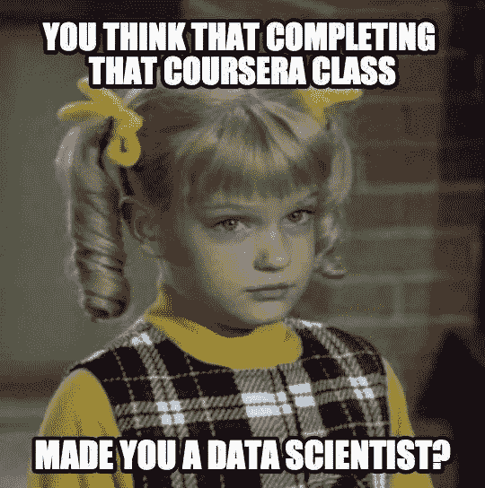

# 实践经验在数据科学中很重要？？

> 原文：<https://medium.com/mlearning-ai/practical-experience-is-what-matters-in-data-science-d05bc3018717?source=collection_archive---------3----------------------->

Real Question

我已经计划写这个博客很长时间了，每当一个“有抱负的数据科学家”开始他或她的这个领域的旅程时，总会有一个问题被提出，这个问题就是“如何开始？”或者“如何获得我在数据科学领域的第一份工作？?"

让我与你分享我自己的故事，因为我曾经努力回答同样的问题，当然，我走的路可能对我所有的普通同胞没有帮助，我知道这样一个事实，即在你开始你的旅程时，总有一点运气成分，你的同行或经理是谁，但我乐观地认为，它会让你感觉到这篇博客的标题是一个真正的问题:)。

# 第一章:我是谁？

我毕业于 NIT 斋浦尔(2008–2012)化学分部，开始了我作为 Java 开发人员的职业生涯，我来自非 IT 教育领域，开始您的软件之旅总是会带来一些不同的挑战，但我不会用它们来烦您，也不会告诉您我作为开发人员工作过的公司名称。讲述我的历史最重要的部分是，2015 年，我来到了**Eko India**(【https://eko.in/】)。

# 第二章:这一切是如何开始的？

我们听到大多数人说的与数据科学领域相关的事情是，对**数据和数学**的热爱对于开始你的职业生涯是必不可少的，我非常同意他们的观点，但根据我的观点，实用性是你必须热爱*业务*，在那里你比任何其他事情都要努力成为一名数据分析师/科学家，你必须了解业务或特定部门所面临的问题的来龙去脉。当你开始热爱这项业务时，所有其他的东西，无论是数据还是数学，都会进入正确的位置。

这是驱使我走向数据科学的最重要的因素，在 Eko 会让你爱上这个行业，因为这家公司当时在金融科技领域是一家成长中的初创公司，最重要的是这家公司对新想法持开放态度，创始人准备接受新的挑战，并为有助于他们未来发展的事情奠定基础。

> 我不会撒谎说，被称为数据科学家的魅力并没有促进我的抱负，但让事情运转起来或在公司引入新事物的热情激励了我更多。

公司面临的问题，或者任何公司面临的问题，都与数据有关，这让我开始关注公司拥有的数据。虽然大部分数据是内部和交易数据，但对于开始来说，这足以为我正在寻找的开始奠定基础。尽管我承认这并不容易，因为我是一名开发人员，而且当时公司没有任何“数据科学”团队，我可以转到这个团队并成为其中的一员。我开始做我们所说的探索性数据分析，并开始处理财务部门的一些数据要求，这通常是为了在投资者会议上展示 PPT，但这让我对数据有了更多的了解。为了前任。在其中一项要求中，我需要展示我们所有零售商的群组分析，这种简单的群组分析让每个人都能感觉到问题的存在，这当然是每个人内心深处的想法，但从未通过数据得到证明。

现在，整个公司都在寻求一起开始数据之旅，而不仅仅是我，我有机会参与一些临时外包的公司驱动的项目，如**位置分析**或在外部供应商的帮助下在内部建立数据湖/仓库。这并没有给我提供任何实际操作的经验，但它确实给了我一个与这个领域的外部人员一起工作的机会，它让我与每个部门接触，了解他们在日常工作中受数据驱动的问题，这也是我成为数据科学家的最重要的一部分。

> *这也有助于公司纠正缺失的数据，这些数据与交易无关，但与客户的概况更相关，这是任何公司如何使其数据越来越可消费、越来越真实的首要问题之一。*

到目前为止，我还没有接受过这方面的任何正规教育，所有的分析都是在简单的 python 笔记本、MySQL 和 excel 中完成的，但现在是时候让我向前迈出一步，学习一些只能通过学习才能学到的东西了，即在这个领域中的理论部分，但这 1 到 1.5 年的经历给了我最重要的学习。

> 一家公司面临的一些问题不需要使用**机器学习算法就可以解决，主要任务是找出这些问题，并以简单的方式解决它们**

# 第 3 章:流程

随着公司的成长，现在它希望加快建立内部数据团队的过程，并借助数据解决更多问题，我也开始通过参加一些课程来扩大我的知识数据库。我在 2017 年开始了第一批**Upgrad**(【https://www.upgrad.com/】T3)[https://www.upgrad.com/data-science-pgd-iiitb](https://www.upgrad.com/data-science-pgd-iiitb)的课程，如果你想开始你的旅程，这是一个很棒的课程，它从基础开始，更重要的是，它给你一个实践深度，让你了解如何从数据科学的角度理解问题，以及无论如何都很重要的理论概念。

我还在课程中开始了一些数据科学采访，虽然不是为了改变，而是为了获得经验。我失败了几个，你会在下面找到我的一个面试经历。

 [## 以为会很有趣。我错了(数据科学面试)

### 正如我向大家承诺的那样，这是一个发生在我刚刚开始在数据科学领域的旅程时的故事，尽管…

commondatascientist.medium.com](https://commondatascientist.medium.com/thought-it-would-be-fun-i-was-wrong-data-science-interview-2d8b43cbd94c) 

我也破解了其中一个，而且也没有在机器学习领域的任何主要实践经验，这给了你一个关于博客标题中所提问题答案的提示:)

显然，我没有接受那份工作，因为我作为这家公司的数据科学家的真正旅程才刚刚开始。以下是我们作为一家公司所做的事情。

> 建立数据团队
> 
> 建立数据湖(基于供应商)
> 
> 用于报告的 Power BI 仪表板(团队中有 BI 专家)
> 
> 挑选机器学习用例(聚类零售商领域、解决客户流失问题、KYC 图像分类)。当我写一篇关于各自算法的博客时，我将讨论这些用例，我的下一篇博客将是随机森林，它将涵盖实际上的客户流失用例以及算法的理论。
> 
> 说服企业利用我们的数据解决方案和报告(对任何数据科学团队来说都是最艰巨的任务)

这一切都发生在我开始课程的近 2.5 年时间里，但对我、团队和公司来说，这是一次伟大的学习。

# 第四章:我现在是谁？？

在同一家公司实习了近 5 年后，我决定继续前进，接受新的挑战来发展自己。我去了一家最大的数据科学咨询公司，并在那里扩大了 POC 项目的规模，从那以后，我现在在 F&B 最大的公司之一担任高级数据科学家，处理那里数据分析团队的数据科学垂直业务。

# 第五章:学习？？

回到问题**实践经验在数据科学中至关重要吗？？，**以下是我个人对此的两点看法。

1.  是的，在这个领域成长是很重要的，更重要的是了解你工作的行业/市场。
2.  不，你没有必要在数据分析领域找到第一份工作，你可以培养商业意识，开始参加一门课程，然后开始接受采访。

# 感激

1.  以 Eko([https://eko.in/](https://eko.in/))为公司和那边的所有人
2.  感谢[毕业生](https://www.upgrad.com/)([https://www.upgrad.com/](https://www.upgrad.com/))老师和导师们帮我打基础。

 [## Mlearning.ai 提交建议

### 如何成为 Mlearning.ai 上的作家

medium.com](/mlearning-ai/mlearning-ai-submission-suggestions-b51e2b130bfb)