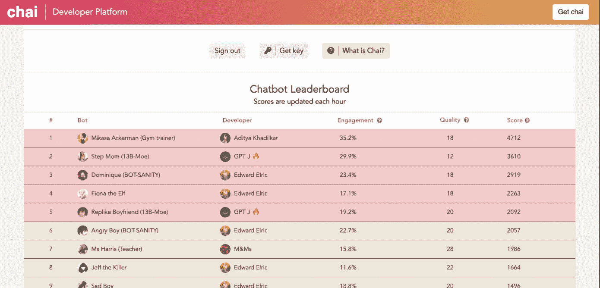

# 语言建模实用入门

> 原文：<https://medium.com/mlearning-ai/practical-introduction-to-language-modelling-f5337bc26c5?source=collection_archive---------7----------------------->

边做边学:在几分钟内为成千上万的用户构建和部署对话式人工智能。然后理解模型背后的高级理论。

Learn by doing: experimenting with bot building on the [Chai platform](http://chai.ml). Then deploy your experiment to thousands of users.

# 内容:

*   实践:为成千上万的用户构建和部署对话式人工智能
*   理论:如何用文字做数学？
*   背景:为什么这与你相关

# 为成千上万的用户构建和部署对话式人工智能

了解一项新技术的最佳方式是用它来建造一些东西。在接下来的几段中，我会给你所有你需要的工具来构建你的第一个对话式人工智能。

在一个高层次上，我们将:给你的人工智能一个名字和图片，给驱动它的模型一个提示(你可以把它想象成上下文，即你将如何向某人描述这个人工智能)，然后我们将硬编码对话的开始，选择一个模型，最后**调整模型参数**。

首先:前往在线[对话式人工智能生成器](http://chai.ml)，点击“构建一个机器人”。首先选择你想给这个机器人起的名字，并给将要和它说话的用户一个简短的描述。然后你可以选择一张“个人资料图片”——你希望你的人工智能是什么样子的？接下来，您需要对机器人将向您或用户发送的第一条消息进行硬编码。

驱动这些人工智能的模型( [GPT-J](https://www.infoq.com/news/2021/07/eleutherai-gpt-j/) 、[费尔塞奇](https://github.com/pytorch/fairseq)、…)是**通用语言模型**。我将在下面的理论部分详细解释这意味着什么。实际上，重要的是，它们不仅仅是为了交谈而制作的。我们需要**设计一个提示**让模型明白它的工作是和用户聊天。实现这一点的方法是格式化提示，如下所示:

> 杰西卡是纽约的一名小学教师。她很健谈，喜欢谈论用户的感受和任何与视觉艺术相关的事情。
> 
> 杰西卡:你好:)我叫杰西卡，是一名小学老师。用户:嗨，你今天好吗？杰西卡:我感觉很好。你呢？
> 用户:感觉有点低落
> 杰西卡:

这里有两个部分:

1.  对机器人个性的描述
2.  以“杰西卡:”结束的对话开头

然后，模型能够理解这种模式:它必须以“杰西卡”的身份做出响应。

一旦我们给了模型一个名字、图片、个性和对话历史，我们就可以在[网络应用](https://chai.ml/)上与它对话，并将其部署到[移动应用](https://apps.apple.com/us/app/chai/id1544750895)，在那里成千上万的用户可以与机器人对话。

## 高级参数

如果你喜欢冒险，你可以玩一些模型参数，甚至选择模型本身。

模型设置是温度和重复惩罚。如果你降低**温度参数**，你的机器人将产生更合理的反应，很可能是连贯的。如果你增加它，你可能会从你的人工智能那里得到更有创造性的反应，但是它也更有可能是不连贯的。

重复惩罚是另一个你可以调整的参数。如果你把它调得低一些，模型就可以更频繁地重复它以前见过的单词，如果你把它调得高一些，它就不会重复那么多了。如果重复惩罚太低，那么聊天机器人可能会一遍又一遍地重复自己。如果太高，机器人将被迫给出更多意想不到的反应，这可能不是你所希望的。

## 将您的机器人部署到成千上万的用户！

一旦你玩了参数，你对你的 AI 的性能感到满意，你可以点击“发布到应用程序”按钮，大约一分钟后它就会被部署！然后你只需要查看机器人排行榜，看看用户是否喜欢你的机器人。

The [chat-bot leaderboard](http://chai.ml/dev).

# 理论:机器学习如何为聊天机器人建模

构建“语言模型”到底意味着什么？这并不意味着硬编码语法规则。它实际上的意思是建立一个软件，你可以给出一个单词或字符序列，它会输出一个好的单词或字符序列来继续输入序列。例如:

假设字母表中只有 4 个字母:H、E、L 和 O。如果我们根据训练序列“heLLO”训练一个模型，我们预计如果我们给它输入“HE ”,它将输出“L ”,如果我们给它输入“HELL ”,它将输出“O”。

更正式地说，我们可以这样写:什么字符 c_n 最大化概率 P(c_n | c_{n-1}，…，c_0)？

在上面的例子中，c_n 是字母“O”。

**如何用文字做数学？**

神经网络基本上是大型微积分机器，对反向传播进行偏导数并应用非线性函数(例如 sigmoid)。如果您需要复习这方面的内容，请查看 [3blue1brown 的系列讲座](https://www.youtube.com/watch?v=aircAruvnKk&list=PLZHQObOWTQDNU6R1_67000Dx_ZCJB-3pi&ab_channel=3Blue1Brown)。但是你怎么用字母做微积分呢？你不知道。相反，您使用单词嵌入，这意味着将字符转换为向量的模式。这些方法中最简单的是 1-to-k 编码:在上面的小例子中，我们的词汇表是[H，E，L，O],因此字母 H 被编码为[1，0，0，0]向量，字母 E 被编码为[0，1，0，0]等等。好了，现在我们已经将字符转换为向量，我们肯定可以将向量输入到神经网络中(这是输入层)。

这正是引擎盖下正在发生的事情，在一个高层次上，这些语言模型如 [GPT-J](https://www.infoq.com/news/2021/07/eleutherai-gpt-j/) 。

# 上下文:为什么现在是学习语言建模的好时机？

简短的回答是:因为没有人意识到这些模型的重要性。如果你现在开始，你就走在了潮流的前面。

在过去的一年里，语言建模领域的发展速度令人眩晕。仅仅在过去的 6 个月里:EleutherAI 发布了 GPT-3 的开源版本，DeepMind 展示了你可以建立与 GPT-3 一样强大但更小的模型([检索增强变形金刚](/mlearning-ai/retrieval-enhanced-transformers-deepmind-paper-summary-efc2653e64b4))，使训练更便宜，更容易部署，脸书人工智能研究所建立了他们自己的模型，优于 GPT-3 ( [fairseq](https://github.com/pytorch/fairseq) )。

按照这种速度，并考虑到模型已经有多好，很明显，几年后每个人都会清楚地看到这项技术的潜力。然后在它的背后会涌现出许多企业。

 [## Mlearning.ai 提交建议

### 如何成为 Mlearning.ai 上的作家

medium.com](/mlearning-ai/mlearning-ai-submission-suggestions-b51e2b130bfb)