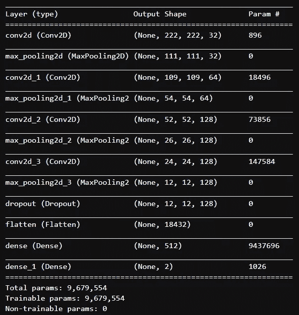
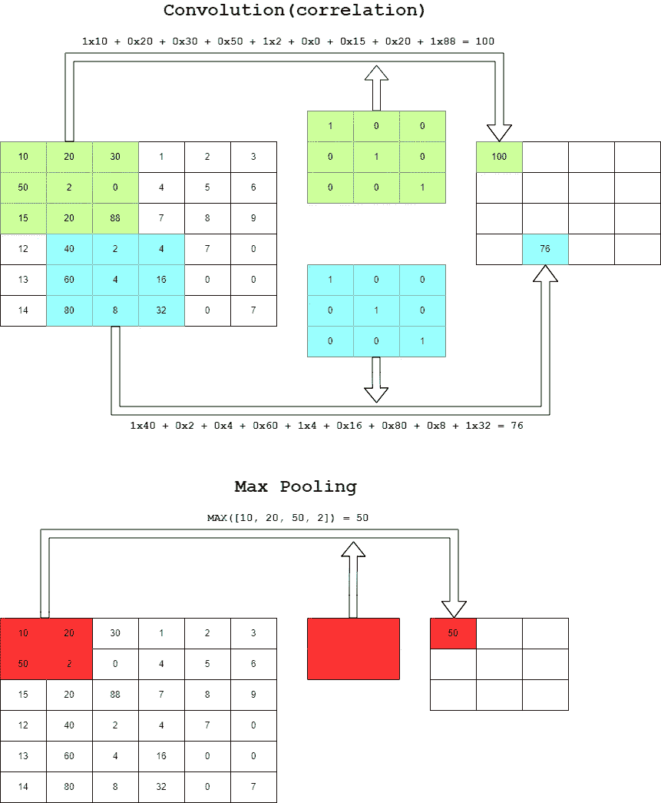
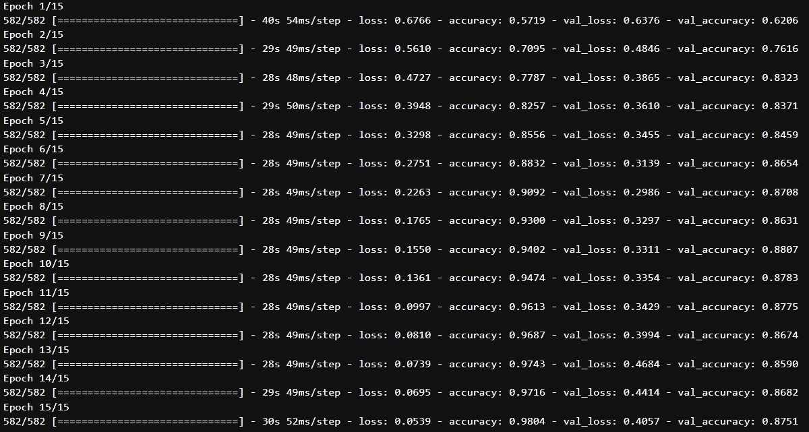
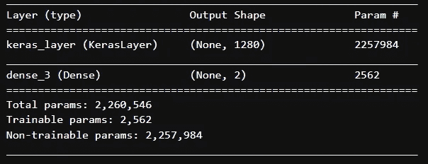
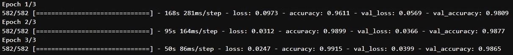

# TensorFlow 的实用迁移学习

> 原文：<https://medium.com/mlearning-ai/practical-transfer-learning-with-tensorflow-1f16bb9ac379?source=collection_archive---------11----------------------->

是你的神经网络表现不好吗？您的计算资源有限吗？不用担心；还有希望！拿起你的咖啡，让我们去另一个冒险！=D

Photo by [Andrea De Santis](https://unsplash.com/@santesson89?utm_source=medium&utm_medium=referral) on [Unsplash](https://unsplash.com?utm_source=medium&utm_medium=referral)

# **简介**

今天，我将向您展示迁移学习如何帮助提高模型的质量，减少培训时间，并减少在 CPU、GPU 和 TPU 上的花费。所有这一切只需一个简单的实现！

这怎么可能呢？

**转移学习**

迁移学习是重用已经训练好的模型并扩展它(用你自己的数据添加和训练最终的层)。

为了举例说明这个过程是如何工作的，让我们建立一个神经网络来对猫和狗进行分类。然后我们再用迁移学习创建第二个神经网络，就可以对比了！

# 开始！

**首先要做的事情！**

我们的第一步将是导入库并加载数据！我们将使用 tensorflow_dataset 库加载图像。

在这里，我们加载了猫和狗，元数据以及训练和验证(80-20)的划分。你可以在这里找到这个数据集[，](https://www.tensorflow.org/datasets/catalog/cats_vs_dogs)以及其他几个。

**处理数据**

使用迁移学习时，了解我们将要使用的模型的 input_shape 是至关重要的，这样我们就可以调整数据以适应神经网络。在这个猫和狗的数据集中，我们有不同大小的图像，我们要使用的模型要求图像的分辨率为 224x224。

为了使模型正常工作，像素值需要归一化[0，1]，而不是以标准方式[0，255]。

让我们创建一个两者都做的函数！

好吧！现在让我们创建培训和验证批次！不要忘记应用预取，这将在处理当前数据的同时准备后续数据，从而减少训练所需的时间。

**第一枪**

那么，让我们建立我们的第一个神经网络吧！

这里我们有网络的总结！

Summary of the first model —Source: the author

正如你所看到的，我们有几层 Conv 和最大池对。卷积层负责在不同的输入图像区域应用过滤器(内核)。最大池减少了输入图像的大小(在这种情况下，从网格中选择最大值)。

Convolution and Max Pooling — Source: the author

如果这些概念仍然不清楚，我推荐[这篇文章](https://towardsdatascience.com/a-comprehensive-guide-to-convolutional-neural-networks-the-eli5-way-3bd2b1164a53)深入探讨卷积层和最大池。

**注:卷积 x 相关**

我们常说的卷积的运算，其实就是相关！这两个过程非常相似，不同之处在于，在卷积中，我们在将滤波器应用于图像之前将其旋转 180°。如果你想进一步了解这种差异，可以查看[这篇优秀的文章](https://towardsdatascience.com/convolution-vs-correlation-af868b6b4fb5)(感谢纳赛尔·博安的推荐)。

好吧！现在是时候编译和训练我们的模型了！

该模型是用 adam 优化器、准确性和交叉熵编译的。我们将进行 15 个时期的训练！让我们看看结果！

Training of the first model — Source: the author

如您所见，我们的模型在验证数据集中停滞在接近 88%的准确率！我们能得到更好的结果吗？

**第二枪**

现在是转移学习的时候了！让我们选择一个已经在 [TensorFlow Hub 网站](https://tfhub.dev/)上训练过的模型吧！

我为本文选择的是 [MobileNet V2](https://tfhub.dev/google/tf2-preview/mobilenet_v2/feature_vector/4) ，一个轻量级的、移动优化的神经网络。还记得分辨率的标准 224x224 吗？您可以在每个型号的 TensorFlow Hub 页面上找到这些信息。

第一步是下载没有最终分类层(特征向量)的模型。

下载完神经网络后，让我们冻结所有层(只训练最后一层)。

现在让我们构建模型，类似于我们之前所做的，但是现在使用 feature_extractor。在这个例子中，我们只添加了输出层的特征向量，但你也可以添加其他层！(感谢加布里埃尔·卡西米罗指出这一点)。

Summary of the second model —Source: the author

请注意，我们现在有了 MobileNet 网络和最后一个密集层！另外，请注意，这个网络的参数比前一个少。让我们编译模型，看看结果！

如你所见，我们将只训练 3 个纪元！而且只有最后一层！

Training of the second model — Source: the author

哇！我们的神经网络在验证数据集中有 98%的准确率！这就是迁移学习的力量！

**保存并加载模型**

我们可以保存模型以备后用！让我们将其保存为 HDF5 (.h5)格式，这将允许我们重新创建模型，即使我们无法访问创建它的代码！

值得注意的是，我们将要创建的. h5 文件将包括模型架构、训练过程中学习到的权重、编译器传输的设置以及优化器状态(允许您从停止的地方继续)。

看到多简单了吧？模型现在在选择的目录中！

要加载模型，只需传递路径和 custom_objects(告诉 keras 如何加载 hub。KerasLayer)在 tf.keras.models 的 load_model 中！

你可以用我们训练的最后一个模型做一些预测，用我们加载的这个模型，你会看到预测值之间不会有差别！上面打印的结果是 0.0。

**结论**

在今天的旅程中，我们看到了迁移学习如何以更低的时间和硬件成本提供更好的预测能力的示例。如果你想看更多用图像迁移学习的例子，我推荐[这篇文章](https://towardsdatascience.com/transfer-learning-with-vgg16-and-keras-50ea161580b4)。

现在轮到你了！玩得开心！

**那都是乡亲们！**

 [## GitHub-JPedroBraganca/my-tensor flow-游乐场

### 此时您不能执行该操作。您已使用另一个标签页或窗口登录。您已在另一个选项卡中注销，或者…

github.com](https://github.com/JPedroBraganca/my-tensorflow-playground) 

Photo by [Jason Leung](https://unsplash.com/@ninjason?utm_source=medium&utm_medium=referral) on [Unsplash](https://unsplash.com?utm_source=medium&utm_medium=referral)

 [## Mlearning.ai 提交建议

### 如何成为 Mlearning.ai 上的作家

medium.com](/mlearning-ai/mlearning-ai-submission-suggestions-b51e2b130bfb)