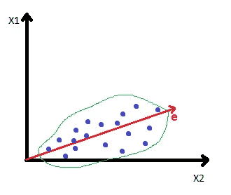

# 数据集预处理

> 原文：<https://medium.com/mlearning-ai/pre-processing-of-dataset-e8994a1e57a3?source=collection_archive---------8----------------------->

除了数据清理，数据准备还包括数据预处理步骤，这一步骤处理数据库维度的更改。该步骤主要处理数据库中特征的添加、删除和选择。

维数灾难是维数越多，数据建模就越困难，因为它变得越复杂，执行任何数据挖掘任务都需要更多时间。可以通过移除不必要的列，或者合并列以形成更有意义或有用的特征，或者通过选择最重要的特征等来减少维度。

# 特征构造

创建新的特征，以便可以从数据库中提取更有意义的信息。创建新特征会增加数据库的维度，但它有助于创建更好的模型，如果需要，可以在特征选择过程中避免。

我们可以通过**聚合**创建一个新特征，这包括求和、最小值、最大值、平均值、总计数等。例如，在具有指定每小时温度的列的数据库中，我们可以通过计算平均值来创建新的特征平均温度，或者我们可以创建具有最高和最低温度的两个新特征。

构建要素的另一种可能方式是执行算术运算。假设一列显示提供给一个物体的总力，另一列记录物体移动的总距离。我们可以将两列的值相乘，并创建一个新的特征来显示完成的总工作量。

此外，可以将这些值转换到新的域或新的标度，并且可以创建新的特征，例如将温度单位从摄氏温度改变为开尔文温度，或者将距离单位从英里改变为千米温度等。

# 特征选择

要素选择是通过从数据集中选择要素子集并将其进一步用于数据挖掘任务来完成的。这有助于避免不太有用的特征，并且有助于降低数据挖掘任务的复杂性。

有各种各样的特征选择技术，这些技术可以分为以下几类

1.  包装方法
2.  过滤方法
3.  嵌入式方法

## 包装方法

在这些方法中，进行不同的特征组合，并使用交叉验证来检查每个组合对于要执行的数据挖掘任务的性能，然后提供最佳特征集作为这些方法的输出。

## 过滤方法

在这些方法中，没有进行交叉验证，使用特征的内在属性选择最佳特征集，评估每个特征和目标特征之间的关系，并根据评估向每个特征提供分数。然后选择得分最高的特征。

## 嵌入式方法

一些数据挖掘算法自动为任务选择最佳特征，即特征选择嵌入在算法中。

# 主成分分析降维

主成分分析是另一种降低数据库维数的好方法。PCA 找出代表数据最大变化的投影。

假设，一个数据集有两个特征 X1 和 X2，我们希望其中有一个特征代表数据的最大变化。 **e** 是 PCA 后的合成投影。如果我们为 X1 和 X2 做一个协方差矩阵，主特征向量的方向被选择为 **e** 的方向。主特征向量是最大特征值对应的特征向量。

Image by the author

# 特征转换

## 离散化

离散化是将具有连续值的要素转换为离散箱的过程。这在某些情况下更有意义，并且当要管理的数据变化较少时更容易处理。例如，将“年龄”特征转换为离散的容器——婴儿、儿童、成人和老人。

有多种方式来创建这些分区，例如使所有箱的宽度相等，即使箱具有相等的间隔，使所有箱的频率相等，使用 k 均值聚类等。

## 编码

与数字列不同，分类列大多数时候包含标签。将这些标签编码成在数据挖掘任务中更有用的数字要容易得多。

**顺序编码** —如果列中的标签表示某种顺序，那么在这种情况下顺序编码是最好的。假设，一个有学生标记的表包含一列值—一等、二等、三等、不及格。这些值当然代表顺序，并且在编码后需要保留这个顺序。在这种情况下，顺序编码很有用，因为它用数字(如 1、2、3 等)对每个标签进行编码。

**一个热编码** —如果标签是名义上的，即它们没有任何顺序，在这种情况下可以使用一个热编码。这种技术为每个变量创建一个新列，用 0 或 1 表示该标签是否存在。

例如，一列代表学生的房子，标签为“红色”、“绿色”、“蓝色”和“黄色”。将为这些标签中的每一个创建单独的列，并且如果一个学生属于红房子，则“红”列将该学生的值设为 1，而所有其他列(“绿”、“蓝”和“黄”)将该学生的值设为 0。

根据问题和数据挖掘任务使用其他特征转换，如**规范化**和**标准化**。

# 摘要

在这篇文章中，我谈到了不同的预处理过程，如特征构造，特征选择，特征转换和主成分分析降维。我已经讨论了用于这些过程的不同技术。还有更多的预处理技术，我们可以从下面的参考中了解一下。

# 参考

[1] Khalid K. Al-jabery，Tayo Obafemi-Ajayi，Gayla R. Olbricht，Donald C. Wunsch II，2 —数据预处理，生物医学应用中数据分析的计算学习方法，学术出版社，2020 年，第 7–27 页。

[2][https://www.youtube.com/watch?v=wZQM_9vhulg&t = 778s&ab _ channel = data mining-IIT kgp](https://www.youtube.com/watch?v=wZQM_9vhulg&t=778s&ab_channel=DataMining-IITKGP)

[3][https://www . analyticsvidhya . com/blog/2020/10/feature-selection-techniques-in-machine-learning/](https://www.analyticsvidhya.com/blog/2020/10/feature-selection-techniques-in-machine-learning/)

[4][https://www . analyticsvidhya . com/blog/2020/08/types-of-categorial-data-encoding/](https://www.analyticsvidhya.com/blog/2020/08/types-of-categorical-data-encoding/)

[5][https://machine learning mastery . com/principal-components-analysis-for-dimensionality-reduction-in-python/](https://machinelearningmastery.com/principal-components-analysis-for-dimensionality-reduction-in-python/)

 [## Mlearning.ai 提交建议

### 如何成为 Mlearning.ai 上的作家

medium.com](/mlearning-ai/mlearning-ai-submission-suggestions-b51e2b130bfb) 

🟠 [**提交到 MLearning.ai**](/mlearning-ai/mlearning-ai-submission-suggestions-b51e2b130bfb)