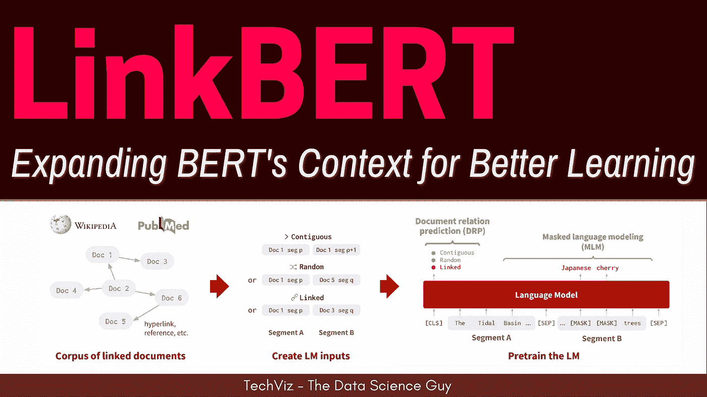

# 带文档链接的预训练语言模型:开启知识和回答问题的新方法！

> 原文：<https://medium.com/mlearning-ai/pre-training-language-models-with-document-links-the-new-way-to-unlock-knowledge-and-answer-4aa8017cd294?source=collection_archive---------5----------------------->

## 文档图上的 BERT

在这篇博客中，我们将进入论文 [LinkBERT:带文档链接的预训练语言模型](https://arxiv.org/pdf/2203.15827.pdf)。

# 概观