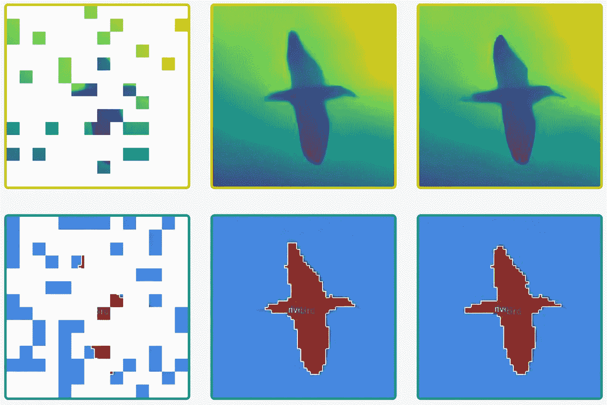

# 视觉变形者的预训练策略

> 原文：<https://medium.com/mlearning-ai/pre-training-strategy-for-vision-transformers-5b5179a15a9b?source=collection_archive---------4----------------------->

## [机器学习艺术](https://mlearning.substack.comhttps://mlearning.substack.com)

[https://mlearning.substack.com](https://mlearning.substack.com)

在本文中，作者提出了一种创建多模态模板的方法，该模板可用于视觉转换器的预训练。给定一个来自多个模态的小随机样本，**多模态**预训练的目标是**重建已经被屏蔽掉的**。这允许高效和有效的预训练，并具有优异的结果。