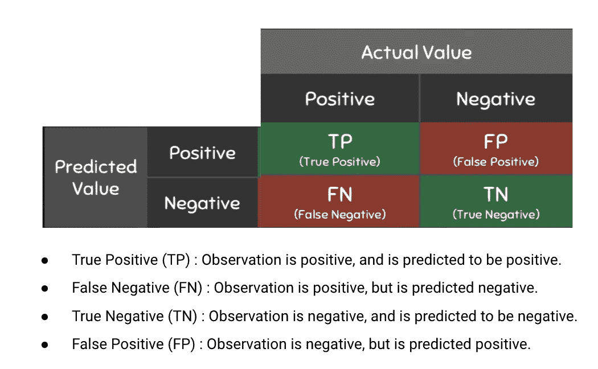
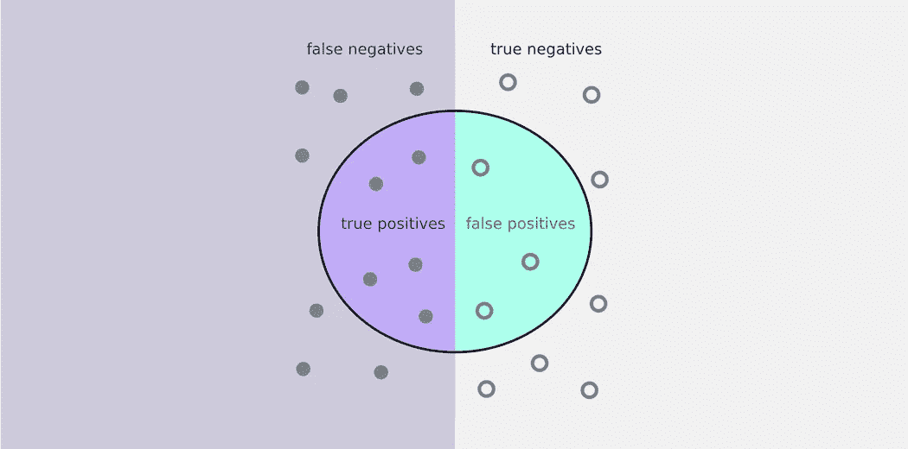
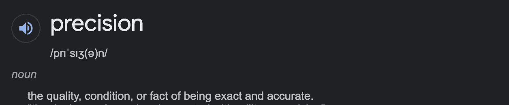

# 精确度和召回率—已解释！

> 原文：<https://medium.com/mlearning-ai/precision-and-recall-explained-ddcfcef3f675?source=collection_archive---------3----------------------->

当使用分类模型时，我们需要使用度量来检查我们的模型执行得有多好。



Source: Google

给定一组苹果和橙子之间的图像，在创建分类模型后，我们需要在测试集上运行它，以确定我们的模型从给定的训练数据中学习得有多好。

想到的第一个指标是**准确度**，根据其基本定义，准确度是通过观察总数得出的正确预测总数，即预测正确的苹果总数/橙子和苹果总数。

通常，当我们的数据集苹果和橘子的分布相等时，精度保持值，但在现实生活中，我们获得的数据是不平衡的，这意味着通常我们的苹果或橘子比另一个更高或更低。

这就是我写这篇中型文章的原因，处理不平衡的数据分类指标。



Source: Google

# 精度:

根据谷歌的定义，精确度是:



> "精确和准确的事实."

在机器学习中，精度可以用同样的方式来理解。

精确度定义为**正确分类的阳性样本(真阳性)与正确或不正确分类的阳性样本总数的比率**。精度=真阳性/真阳性+假阳性。精度= TP/TP+FP。

## **简单解释:**

我们把我们的模型分成两部分，苹果边和橘子边。

> 注意:苹果方可能没有苹果和橘子，反之亦然，记住这是我们正在检查的模型预测。

因此，为了计算苹果的精度，我们只检查模型的苹果一侧。这里我们检查苹果的总数除以苹果和橘子的总数。

> ***精度:总苹果正确/总苹果侧观察***

# 回忆:

**回想一下**试图回答以下问题:

***正确识别实际阳性的比例是多少？***

也就是说，如果我们计算苹果召回率，正确找到的苹果总数除以实际苹果总数。

*   回忆=真阳性/(真阳性+假阴性)

# **问题:**

*   每一个假阴性错误都会让公司损失 5000 美元。
*   每一个假阳性错误都会给公司造成 100 美元的损失。

您认为公司在创建分类模型时应该更加关注什么指标？

是精准还是召回？

# **回答:**

这里有一个思路可以回答这个问题。我们可以计算两个不同场景的成本，并查看每个指标的值，以决定哪一个指向最佳模型。

这是两种情况，每种情况下模型都会犯五个错误:

1.  100 个成分，4 个真阳性，91 个真阴性，3 个假阳性和 2 个假阴性。这个场景的成本是 300 美元+10，000 美元= 10，300 美元。
2.  100 个成分，5 个真阳性，90 个真阴性，2 个假阳性，3 个假阴性。这个场景的成本是 200 美元+15，000 美元= 15，200 美元。

第二种情况对公司来说更糟，所以我们需要查看每一个指标，看看哪一个能告诉我们这一点。

在这两种情况下，模型的准确率都是 95%—100 个样本中有 5 个错误。如果你优先考虑模型的准确性，她将无法区分这两种情况。所以第一个选择是不正确的。

让我们计算每个场景的[精度](https://en.wikipedia.org/wiki/Precision_and_recall#Precision):

```
precision = TP/(TP+FP)precision1 = 4/(4+3)
precision1 = 4/7
precision1 = 0.57precision2 = 5/(5+2)
precision2 = 5/7
precision2 = 0.71
```

如果你优先考虑模型的精确性，她会错误地认为第二种情况更好，但事实并非如此。因此，第二个选择是不正确的。

让我们计算每个场景的[召回](https://en.wikipedia.org/wiki/Precision_and_recall#Recall):

```
recall = TP/(TP+FN)recall1 = 4/(4+2)
recall1 = 4/6
recall1 = 0.66recall2 = 5/(5+3)
recall2 = 5/8
recall2 = 0.62
```

回忆告诉你第一种情景比第二种好，这是正确的。**优先召回是一个好策略。**

[](/mlearning-ai/mlearning-ai-submission-suggestions-b51e2b130bfb) [## Mlearning.ai 提交建议

### 如何成为 Mlearning.ai 上的作家

medium.com](/mlearning-ai/mlearning-ai-submission-suggestions-b51e2b130bfb)