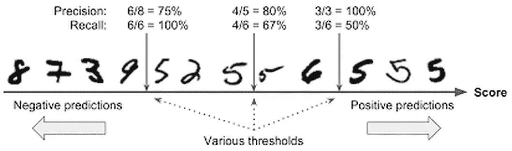
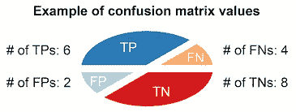
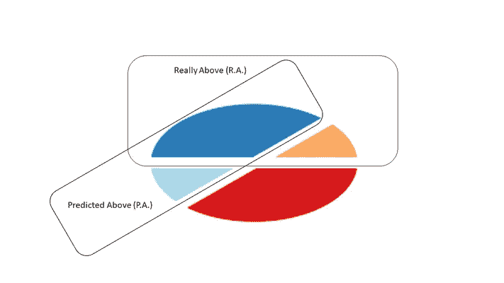
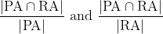

# 精确度/召回率:一个组合的和概率的观点。

> 原文：<https://medium.com/mlearning-ai/precision-recall-a-combinatoric-and-probabilistic-point-of-view-c904f7ab15df?source=collection_archive---------5----------------------->

Probably the most comprehensive picture about precision and recall that I have ever seen. Thanks to A.Géron.

如果您曾经处理过分类问题，那么您一定使用过这些指标。关于它们的文章很多，什么时候用，有什么定义等等。但是大多数人只回答了前四个问题:

精度如何？
什么是召回？
他们的定义是什么？
公式？
为什么用它们而不用其他公式？
在谈论的时候，有哪些不混淆精度和召回的小技巧？他们来自哪里？

为了满足我们的好奇心，我们必须对这些度量标准进行深入的理解。首先，我们将从空白中重新创建概念，然后以“集合”(或组合)和概率的观点呈现公式，最后将这些观点与语义相结合，以确保两者不会混淆。

# 再造概念:组合方式

首先，重要的是要记住，谈论模型的精确度或召回率没有任何意义。
至少，我们可以谈一谈特定车型对特定品类的召回(或精准)馈赠。

因此，如果我们处理一个分类问题，其中有 5 个类别，那么每个模型将提供 5 个召回和 5 个精确结果。
我们最终可以使用分组公式(如加权平均值)来利用所有这些数据，但由于平滑效应，存在失去意义的风险。

那么现在，让我们说，我们要预测一个数据是假还是真，重点是真。

我们有四种可能性:

预测真观察真(TP)，预测真观察假(FP)，预测假观察假(TN)和预测假观察真(FN)

在下图中，让我们集中预测圆圈上方。

## 一些有理数

我们看到有两种类型的误差需要量化:橙色和彩色。
快速思考表明**有必要对**进行归一化:我们想以对待 1000 个样本的方式来看待与 100，000 个样本相关的误差。

因此，我们想**看看比率**。但是，分母应该是什么。实际上，有三种自然选择:
-位于**圆**
上的点集的大小-真正位于圆
上方的点集的大小-**估计位于**圆上方的点集的大小。

我们跳过整个循环，因为对于这个问题，我们关注的是循环的特定部分。所以，剩下最后两个选项。

我们还看到，查看**误差**导致**改变分子** :
-真正位于上方的误差是橙色的
-估计的误差是彩色的。

从美学的角度来看，最好是专注于预测良好的值。(我们可以利用互补公式推导出误差！！)

最后我们有两个可能的度量:
-蓝色/(上面预测的)
-蓝色/上面

# 组合的和概率的观点

从组合学(集合论)的角度来看，如果我们称 PA 为上面预测的点集，称 RA 为真正上面的点集，我们看到的是

从概率的角度来看，它对应于 P(RA|PA)和 P(PA|RA)，其中 P(X|Y)表示 X 知道 Y 的概率。

现在的问题是“谁是谁”和“如何记住谁是谁”？=)

# 了解面额

让我们回忆一下我们的照片。

在这里，“精度”和“召回”的公式是:
- **精度** = TP/(TP+FP)
…………..**= # dark Blue/# Blue = P(RA | PA)**
和
- **回忆**= TP/(TP+FN)
…………=**# dark blue/# Above = P(PA | RA)**

那么，如何记忆它们呢？

## 语义观点

如果我们参考精度的“非技术”定义，我们得到:

> *某事*准确的说*是某事*谁是*，谁已经*被正确识别。

我们可以推而广之地看到，**精度就是算法提供**精确数据的能力，从而**一个数据谁被正确识别。**
那么，精度就是算法提供良好分类数据的能力，**所以概率是正确的，知道它被预测了**！

> *回忆是*记住所学*或经历过的事情的动作或能力。***

*对我们的问题，有什么行动，有什么体会？*动作是分类器*(你想要的每一个)，体验是数据。
由此可见**，回忆是**算法的官能，从正确的分类中学习，或者用更数学的方式:**正确分类的概率，知道数据是来自期望的标签**！*

* [## Mlearning.ai 提交建议

### 如何成为 Mlearning.ai 上的作家

medium.com](/mlearning-ai/mlearning-ai-submission-suggestions-b51e2b130bfb) 

[成为作家](/mlearning-ai/mlearning-ai-submission-suggestions-b51e2b130bfb)*