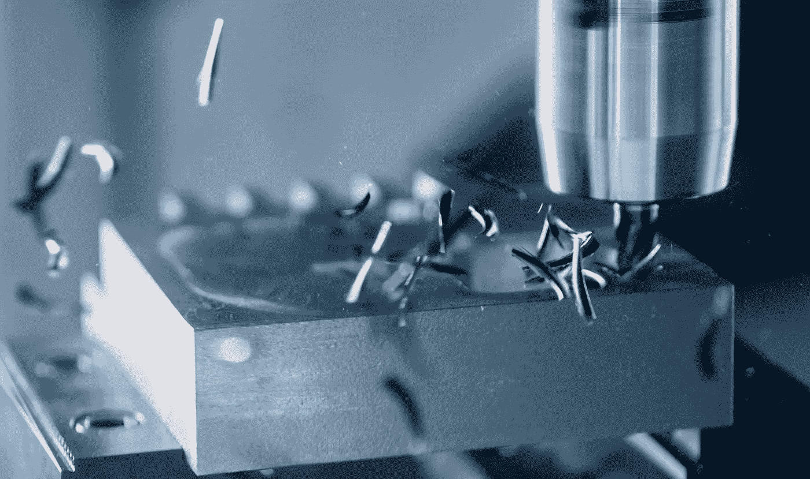

# 分类的精确度、召回率和 F1 分数|您需要知道的一切

> 原文：<https://medium.com/mlearning-ai/precision-recall-and-f1-score-for-classification-everything-you-need-to-know-d6409644db21?source=collection_archive---------8----------------------->

A different kind of precision. ;-) | Photo by [Daniel Smyth](https://unsplash.com/@smudgern6?utm_source=medium&utm_medium=referral) on [Unsplash](https://unsplash.com/?utm_source=medium&utm_medium=referral)

在本文中，我将向您展示何时使用上述哪一个指标。

在我们开始之前，您可能认为这里缺少准确性度量。我已经写了一篇关于准确性度量的文章，当它肯定不应该被使用时，请随意[查看](/@martin-thissen/heres-why-your-model-might-not-be-as-accurate-as-you-think-aa18ebb769bc)。