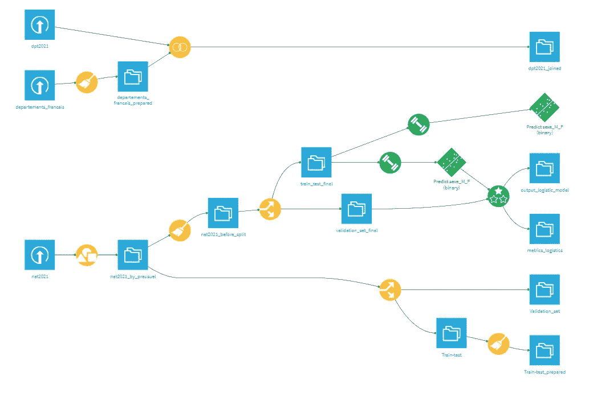

# 使用机器学习从名字预测性别

> 原文：<https://medium.com/mlearning-ai/predict-sex-from-first-name-using-machine-learning-3b8841bc7755?source=collection_archive---------3----------------------->

我从 INSEE 网站上找到了法国人名字的档案。这份档案包含了所有“1900 年至 2021 年间出生在法国的孩子被赋予的名字”。我检索这个文件的目的是创建一个机器学习(ML)模型，通过知道一个人的名字来确定他的性别。在本文的剩余部分，我将解释我如何着手构建这个模型。