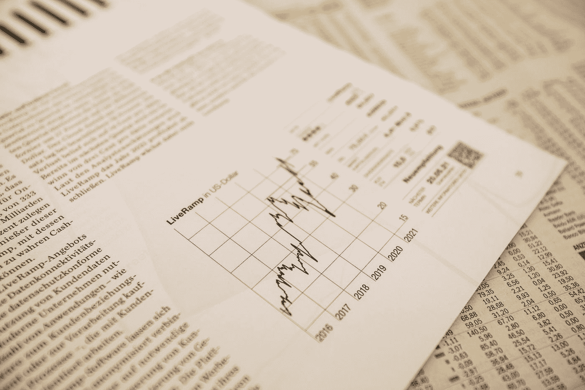

# 我是如何用 Python 和机器学习来预测 S&P500 股票价格的

> 原文：<https://medium.com/mlearning-ai/predict-sp500-stock-price-with-python-machine-learning-sentiment-analysis-a296dc276353?source=collection_archive---------3----------------------->

用机器学习和情绪分析教程预测股票价格。

Photo by [Markus Spiske](https://unsplash.com/@markusspiske?utm_source=medium&utm_medium=referral) on [Unsplash](https://unsplash.com?utm_source=medium&utm_medium=referral)

**part 1:**[**用芬伯特变压器进行股票新闻情绪分析**](/codex/stocks-news-sentiment-analysis-with-deep-learning-transformers-and-machine-learning-cdcdb827fc06)

**在之前的一篇帖子中，我写了一篇关于如何使用 FinBERT 深度学习转换器模型对新闻标题进行情感分析的教程。我建议你…**