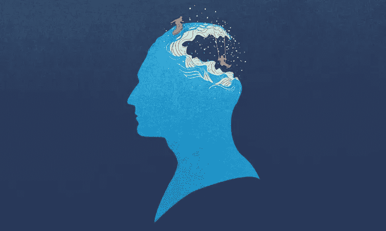
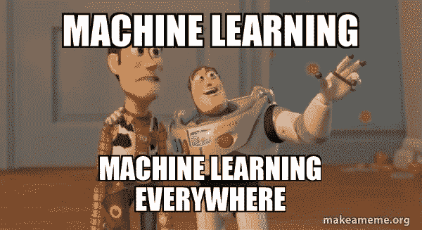
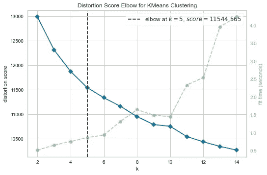
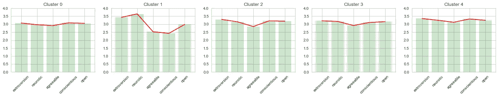
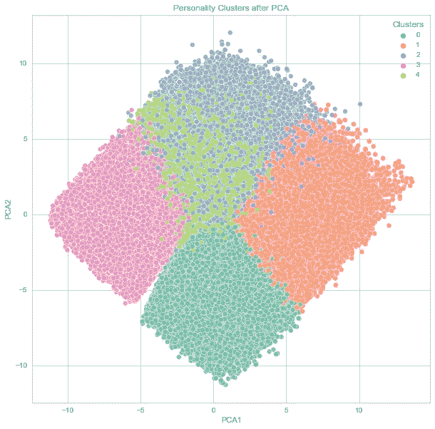
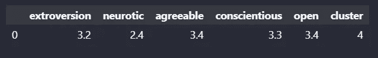
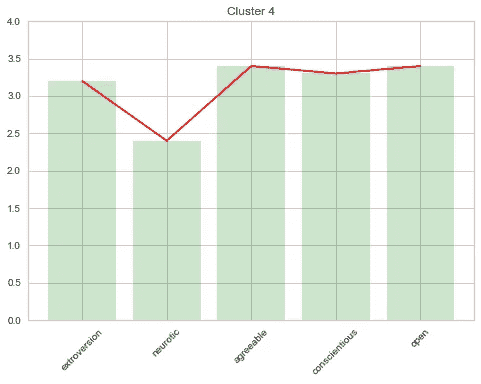
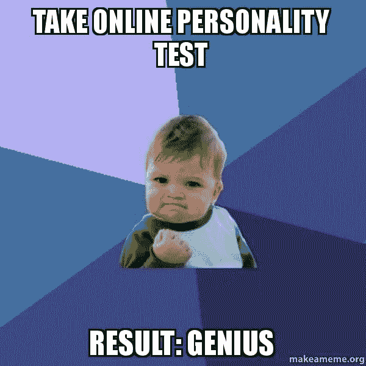

# 预测你的个性

> 原文：<https://medium.com/mlearning-ai/predict-your-personality-f2c5d3701dc3?source=collection_archive---------9----------------------->

## 机器学习的有趣部分

## 如何根据调查或面试问题评估你的个性？让我们找到它！！！



Personality Prediction

# 背景:

通过像脸书和推特这样的社交媒体应用来预测人类的行为和个性，正引起研究人员的极大关注。关于人类思想的统计信息是预测各种人类行为和个性的研究的重要资产。目前的工作主要是基于大五人格特质猜测用户性格。建立智能句子分析模型来提取个性特征。

# 为什么它很重要？

当今的企业界不仅关注潜在雇员拥有的技能，还关注他们的个性。个性是帮助一个人在职业和个人生活中取得成功的因素。

因此，招聘人员必须了解一个人的性格特征。随着求职者的指数增长，很难通过查看简历来手动筛选出最适合合适工作的候选人。该项目的重点是检查不同的机器学习方法，以便通过使用 NLP 技术的 CV 分析来有效地预测个性。

结果表明，随机森林算法实现了更好的准确性，当与其他算法，如 KNN，逻辑回归，SVM，和朴素贝叶斯。

# 我们将如何预测？

该项目基于使用机器学习算法和被称为海洋模型的 big 5 模型来识别个人的个性。当将统计分析应用于个性调查数据时，使用一些词来准确地描述该人的总体性格或个性。

# 海洋模型

海洋模型包括:

开放体验:它涉及不同的方面，如想象力、敏感性、注意力、对多样性的偏好和好奇心。

**尽责:**这个特点用来形容人的细心和勤奋。它是描述一个人有多有组织和有效率的品质。

**外向性:**描述最佳候选人如何与人交往的特质，也就是他/她的社交技能有多好。

宜人性:这是一种基于慷慨、同情、合作和适应他人的能力来分析个人行为的品质。

**神经质:**这种特质通常描述一个人有情绪波动和极度的表达能力。



# 方法学

## **选择数据集:**

获取数据是模型训练的第一步。数据集必须准确可信。可能有多个数据源，如传感器、平面文件、数据库、数据仓库、社交媒体网站等。我从 Kaggle 获得我的项目数据集。

**参考:**

[https://www . ka ggle . com/datasets/tunguz/big-five-personality test？datasetId=516764](https://www.kaggle.com/datasets/tunguz/big-five-personalitytest?datasetId=516764)

## **清理数据集:**

预处理数据集是机器学习的第二步。在训练更好的模型之前，移除有噪声的数据、填充空值、替换垃圾数据、使用公式找到未知列是很重要的。

为此，我使用了 python 库的不同函数，如 NumPy、Pandas 等。用于清理数据集。

## **可视化数据集:**

在训练模型之前，理解数据集并选择机器学习的方法是很重要的。将行和列可视化为图形、查找趋势、移除异常值以及对数据集列进行分组以进行训练是定义数据集的一部分。

由于我们的问题是基于无监督学习的，所以我选择了聚类技术。

## **对数据集进行聚类:**

在训练模型之前，我们需要找出应该有多少个分类。定义聚类的数量对于找到数据集的每个不同特征非常重要。为此，我们使用肘方法来找到最适合数据集的最佳聚类数。

因为我们遵循海洋模型，所以将会有 5 个主要的 5 种不同类型的人格群。



## **训练模型:**

训练模型是机器学习的主要部分。在一个数据集上训练多种算法，并检查哪种算法的精确度最高。

有许多算法用于聚类，如 K-mean、分割等。向算法提供定义的数据集和聚类数，算法将训练模型。使用混淆矩阵、准确度、ROC 曲线等评估模型。



## **可视化模型:**

可视化模型有助于检查训练好的模型是否工作良好。发现异常值和错误是模型可视化的目标。

由于我们的数据集包含数百万行，因此我们使用 PCA 模型来降低维度，并线性分布相关特征。



## **测试模型:**

测试模型和训练模型一样重要。训练一个模型后，会提供未标记的数据，训练好的模型会预测数据的标签并给出结果。

如果结果是错误的，则使用不同的算法反复训练模型，直到模型提供良好的准确性和预测。

# **结果和发现**

对模型进行评估后，输入数据进行测试，并找到预测结果。

例如，输入基于个性的问题的答案集，并基于具有测试数据的训练模型预测你的个性，并基于预测的聚类获得你的个性特征的得分。

> **输入测试数据:**

```
data = pd.read_excel(‘../dataset/test_data.xlsx’)
```

> **测试模型:**

```
my_personality = k_fit.predict(data)
```

> **成绩:**



# 结论:

每个人都有与众不同的个性，人类开始试图立即读懂对方。第一印象可能不完全准确——但性格差异确实与外在行为甚至外表有联系，这可以提供一个人一般是什么样的早期线索。随着时间的推移，观察一个人在不同情况下的思维和行为，可能会更好地了解这个人的特质。



# 项目链接

[](https://github.com/billypentester/persoanlity_prediction) [## GitHub-billypentester/personality _ prediction

### 从像脸书和推特这样的社交媒体应用中预测人类行为和个性正在实现…

github.com](https://github.com/billypentester/persoanlity_prediction) [](/mlearning-ai/mlearning-ai-submission-suggestions-b51e2b130bfb) [## Mlearning.ai 提交建议

### 如何成为 Mlearning.ai 上的作家

medium.com](/mlearning-ai/mlearning-ai-submission-suggestions-b51e2b130bfb)