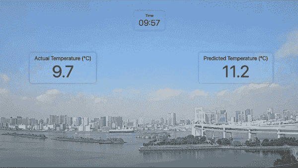
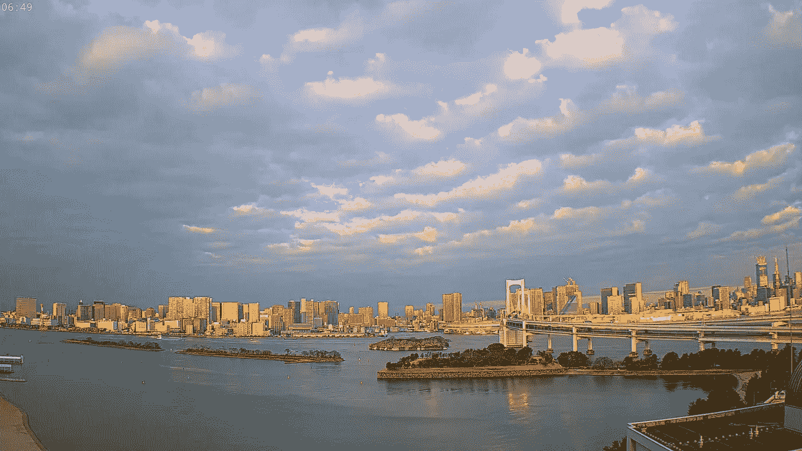
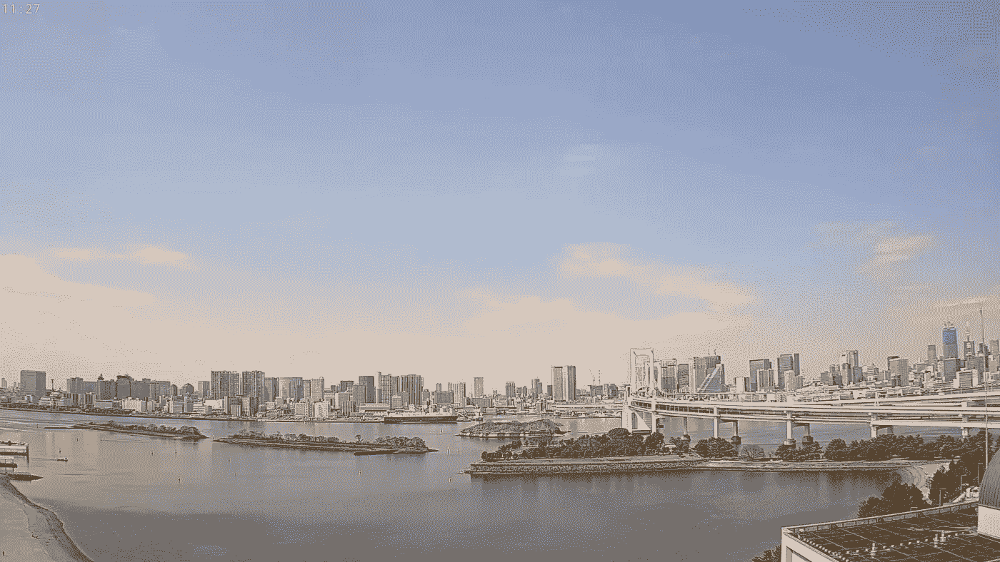
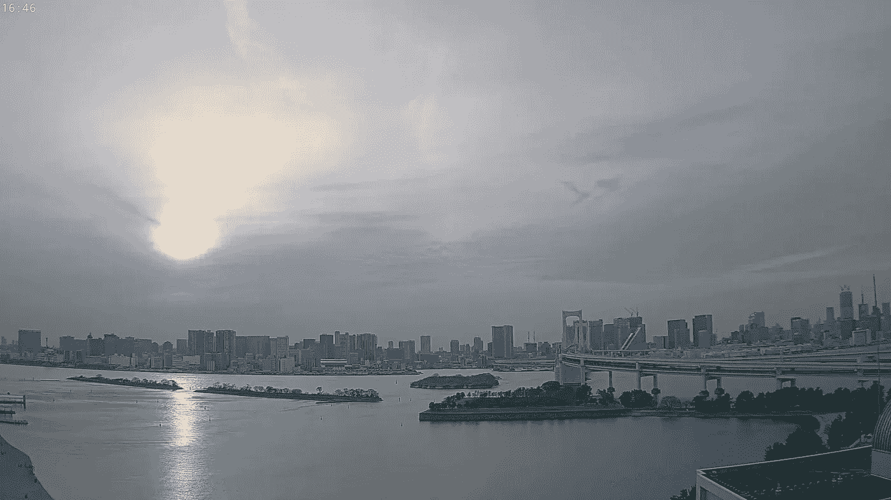
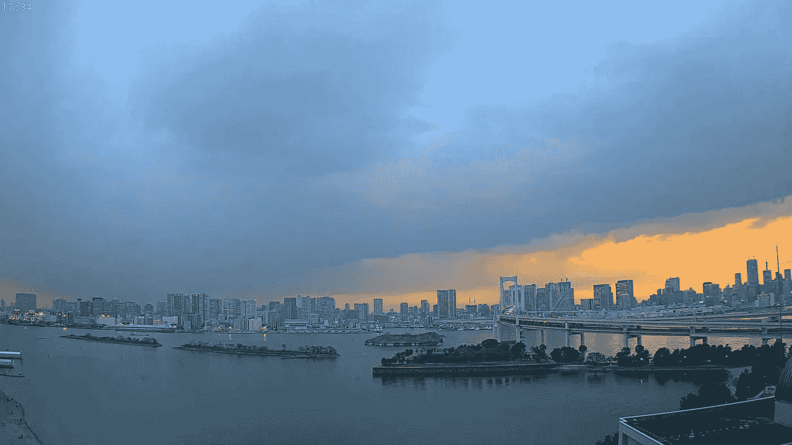
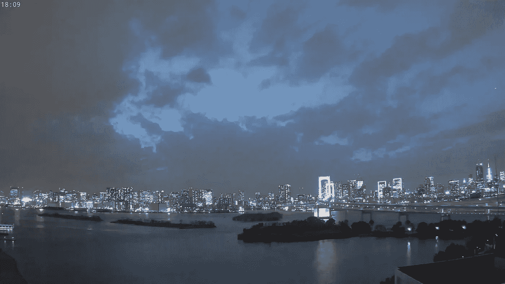
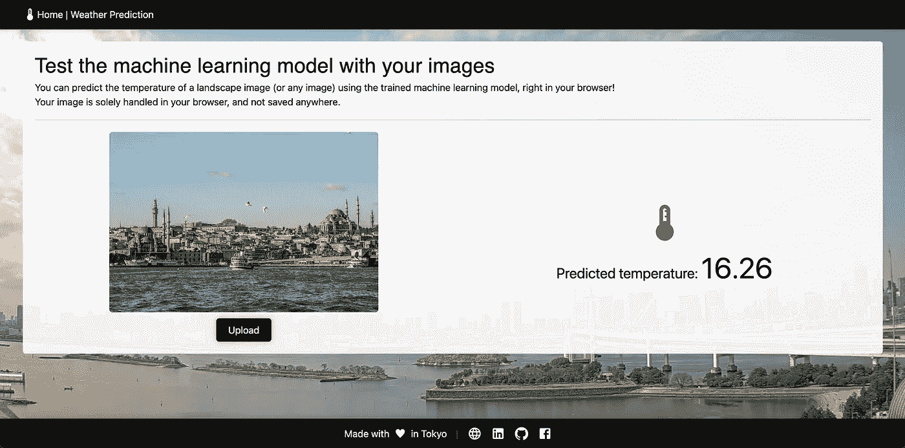

# 利用景观图像预测大气温度

> 原文：<https://medium.com/mlearning-ai/predicting-atmospheric-temperature-using-landscape-images-5130495f80bf?source=collection_archive---------7----------------------->

Actual vs. predicted temperatures at [Rainbow Bridge](https://www.youtube.com/watch?v=n3B8fp-Henc), Tokyo across 2 days

你能猜出照片拍摄时以下地点的温度吗？

[Rainbow Bridge](https://www.youtube.com/watch?v=n3B8fp-Henc), Tokyo on a sunny yet cloudy day

这是一项艰巨的任务，对吗？这张照片可能来自一个寒冷的清晨，也可能来自一个温暖的傍晚。大气温度也取决于季节和地点。总而言之，大气温度是很多参数共同作用的结果，这些参数让我们很难一眼就能确定。供您参考，上述情况下的温度为 5.4 摄氏度。

## 目标

在这篇文章中，我们将尝试通过观察东京彩虹桥的图像来估计这个地方的大气温度。

## 方法

我们将使用卷积神经网络来训练一个模型，预测图像拍摄时的温度。我们的任务将是回归任务，而不是分类任务，因为我们的目标变量(温度)是一个连续变量。虽然图像卷积主要用于分类问题，如对象检测或人脸识别，但它并不常用于回归任务，因此在线上没有很多关于这方面的资料。

Temperature: 9.1 °C at [Rainbow Bridge](https://www.youtube.com/watch?v=n3B8fp-Henc), Tokyo

## 数据收集

对于这个任务，我们将连接到 Youtube 和 OpenWeatherMap APIs，分别用于收集图像和天气信息。我们编写一个连接到 Youtube API 的脚本，每隔 50 秒对 Odaiba 直播摄像头进行一次截图。拍摄快照后，脚本连接到 OpenWeatherMap API 并获取彩虹桥(Odaiba)的天气信息。收集的数据与时间戳一起写入我们的本地机器，以便稍后链接回图像和温度。我们运行这个脚本大约 2 天，收集 2k+的图像和天气信息。

## 数据处理

当 OpenWeatherMap API 被请求提供一个坐标的天气信息时，它检查附近的气象站并提供最新的信息。例如，当我们查询彩虹桥时，我们根据查询完成的时间从塔米或品川站获得信息。由于我们不希望我们的数据出现不连续(塔米和品川可能在同一时间有不同的温度)，我们将数据集缩小到从塔米站获得的信息。这总共给我们留下了 1902 张图像。图像文件路径和相关温度以及时间戳被整理到主数据文件中。这些数据和图像一起被上传到 Google Drive，用于在 Google Colab 上训练模型。

Temperature: 11.1 °C at [Rainbow Bridge](https://www.youtube.com/watch?v=n3B8fp-Henc), Tokyo

## 模型

使用彩虹桥区域的 1，902 幅图像，我们将数据集分为训练(70%)和测试(30%)子集。训练子集的一部分将被用作早期停止的验证子集，以防止过拟合。

神经网络由 1 个输入层、2 个卷积层+最大池层+ 1 个全局平均池层+ 3 个密集层和 1 个输出层(温度)组成。

卷积层在图像上滑动一个小窗口，并从图像中提取有用的特征。在一个常用的例子中，卷积层可以学习识别图像中的边缘。在卷积层之后立即应用 MaxPool 是缩小输出的常见做法。然后，我们应用全局平均池层，以减少图像到 1D 矢量。这个 1D 向量通过一个标准的 3 层多层感知器移动，该感知器具有一个 ReLu 激活函数，它将从图像中给我们温度作为 1 值。

我们在 Google Colab 上使用 GPU 加速来更快的学习。第一个纪元将花费相对较长的时间，因为张量被移动到 GPU，但未来的纪元将花费明显较短的时间，学习将在不到 10 分钟内完成。

Temperature: 13.5 °C at [Rainbow Bridge](https://www.youtube.com/watch?v=n3B8fp-Henc), Tokyo

## 结果

模型达到均方根误差 **1.2 C** ，而 R 平方为 **0.79** 。不错吧，特别是考虑到模型只使用图像进行训练，没有额外的数据。

## 结论

我们使用卷积神经网络训练了一个机器学习模型，通过查看东京彩虹桥的图像来预测大气温度。图像和温度数据在 2 天内从 Youtube live cam 和 OpenWeatherMap 获得。使用 1，902 幅图像来训练模型，并且达到了合理的精度。该模型很难预测清晨和傍晚的温度，这两个时段的温度变化很大，而图像却保持相似。这可以通过将小时作为另一个变量提供给模型来解决。此外，一个高度精确的模型可以用一年中更大的图像数据集来训练。

Temperature: 12.3°C at [Rainbow Bridge](https://www.youtube.com/watch?v=n3B8fp-Henc), Tokyo

## **自己试试吧！**

我创建了一个[网站](https://weather-prediction.vercel.app/)，可以让你用自己的图像预测一幅风景图像的大气温度！推断是在浏览器上完成的，图像不会保存在任何地方。

Test the model using your own images! (Image by the author)

## 来源

[项目网站](https://weather-prediction.vercel.app/)，[机器学习代码](https://colab.research.google.com/drive/1cFlGTV0bDZgda3qLoO5cGHvcbFrHE0J5?usp=sharing)，[数据采集代码](https://colab.research.google.com/drive/11DMV4It_DxDvq1TaojlOROhVncjtp306?usp=sharing)，[数据](https://drive.google.com/drive/folders/19egAgOXflnckYDF9DzvC261R47jqwV_u?usp=sharing)

 [## Mlearning.ai 提交建议

### 如何成为 Mlearning.ai 上的作家

medium.com](/mlearning-ai/mlearning-ai-submission-suggestions-b51e2b130bfb)