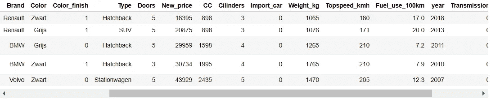
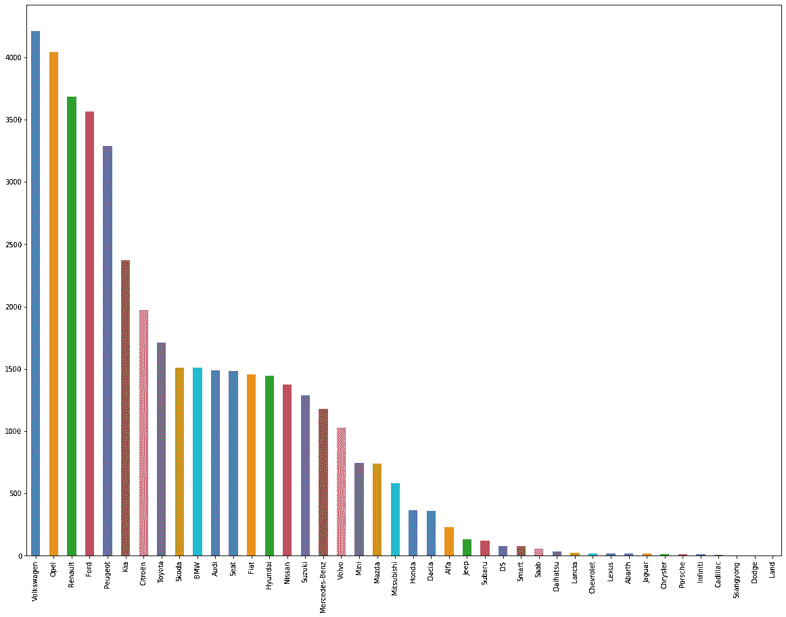
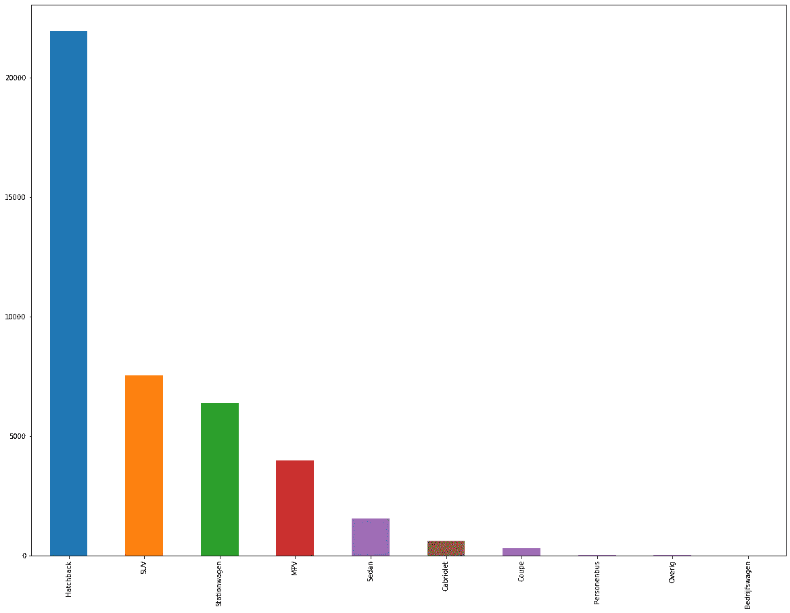
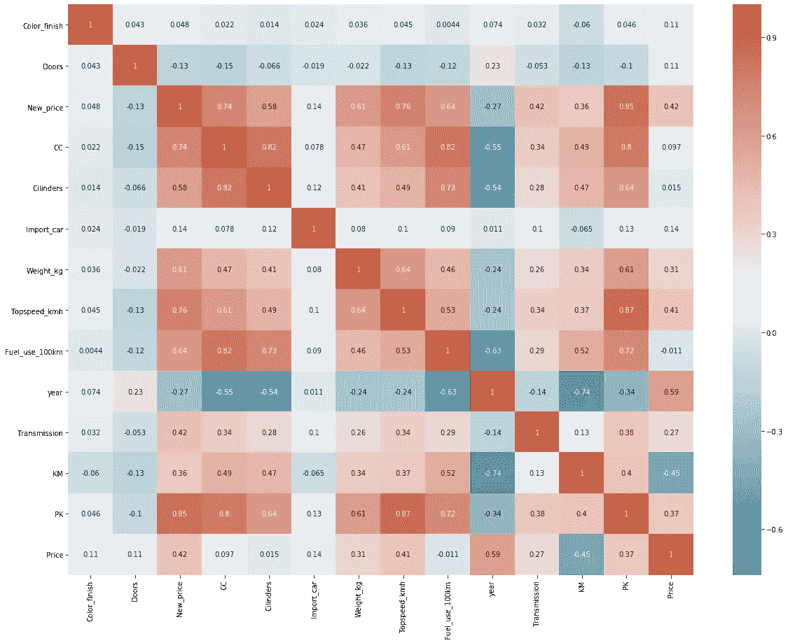
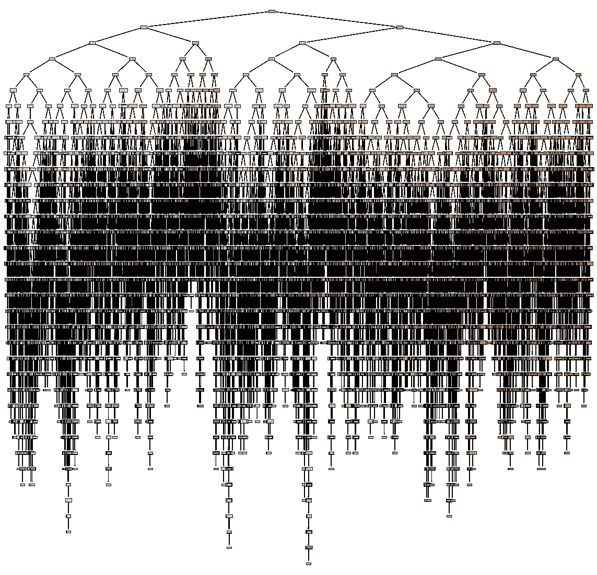
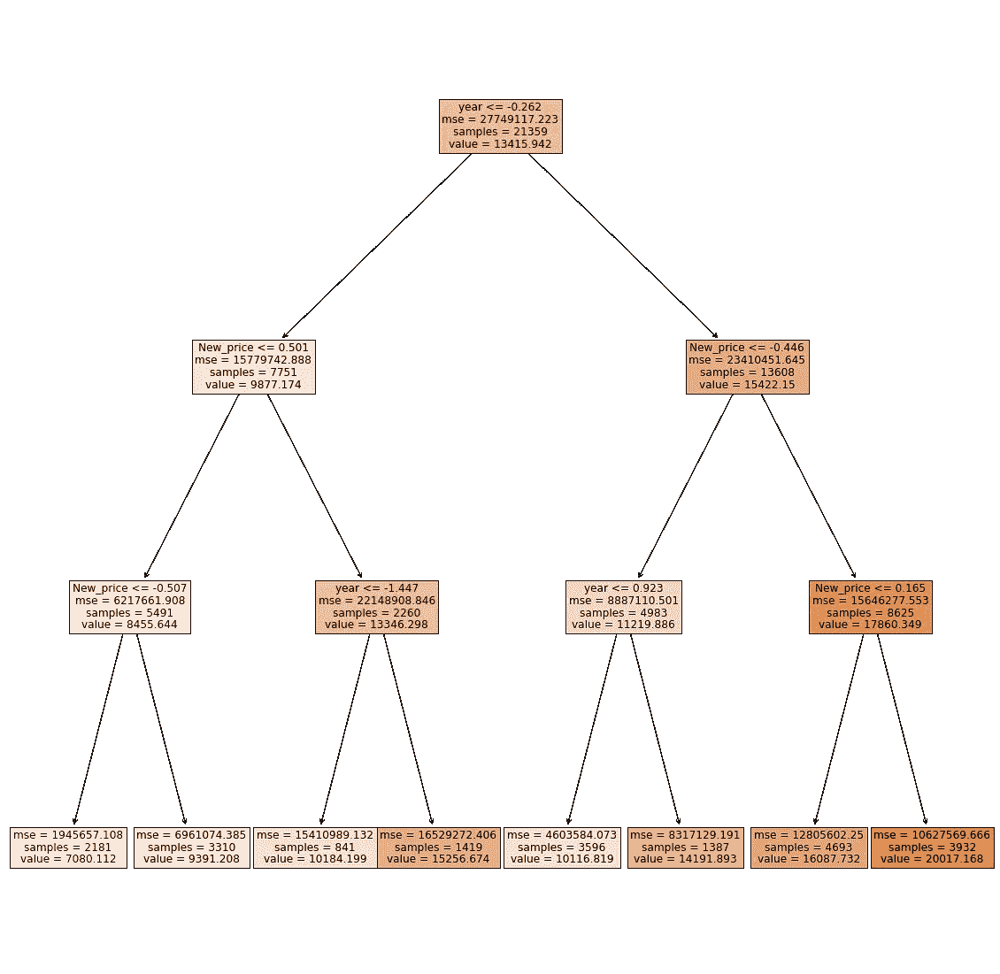
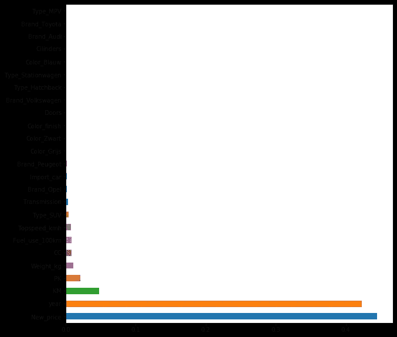
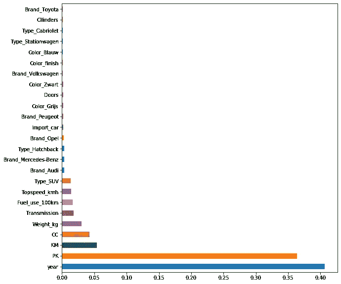

# 用机器学习预测汽车价格

> 原文：<https://medium.com/mlearning-ai/predicting-car-prices-with-machine-learning-40665403296a?source=collection_archive---------1----------------------->

如何利用数据科学买车


购买二手车的过程可能需要很长时间。你可以在网上和网下找到数以千计的汽车，你可以很容易地花几个小时或几天来比较它们，因为二手车的定价不是很透明。因此，我决定尽可能用最无聊的方式搜索汽车:浏览一个汽车网站，创建一个模型来预测二手车的市场价值。

# **数据**

由于我希望有一个数据集来训练机器学习模型和选择潜在的购买汽车，我决定自己创建一个荷兰汽车网站，而不是使用旧的 Kaggle 数据集。可以用 Selenium 或 BeautifulSoup 进行刮擦，这产生了价格在€5k 和€25k 之间的大约 45k 二手车的数据集，不包括柴油车。

在清理数据(并检查分布)后，数据集包括许多相关的特征，这些特征可用于预测数据集中每辆汽车的市场价值。



检查制造商的汽车分布显示，在我的数据集中排名第一的制造商是大众，其次是欧宝和雷诺，我的数据集中大多数汽车是掀背车，其次是 SUV。

```
plt.figure(figsize = (20,15))
cars['Brand'].value_counts().plot(kind='bar')
```



Distribution of cars by brand

```
plt.figure(figsize = (20,15))
cars['Type'].value_counts().plot(kind='bar')
```



Distribution of cars by type

为了直观显示数据集并更好地理解变量之间的关系，我们可以创建一个关联热图。这张热图显示了变量*年份*和*价格*之间，以及汽车的*新价格*和实际*价格*之间的高度正相关。在变量*年*和*公里*(里程表)之间可以观察到高度负相关。这些相关性是有意义的，因此这是数据建模部分的一个好的起点。

```
# calculate correlation matrix
corr = cars.corr()
# plot the heatmap
plt.figure(figsize =(20,15))
ax=sns.heatmap(corr, xticklabels=corr.columns, yticklabels=corr.columns, annot=True, cmap=sns.diverging_palette(220, 20, as_cmap=True))
bottom, top = ax.get_ylim()
ax.set_ylim(bottom + 0.5, top - 0.5)
```



Correlation heatmap

# 数据建模

为了预测数据集中汽车的市场价值，我使用了随机森林模型。在开始建模之前，我首先必须将分类变量转换成虚拟变量，将变量的每个唯一值转换成它自己的二进制变量。

```
cars = pd.get_dummies(cars, drop_first=True)
```

其次，我需要缩放自变量。自变量的比例很重要，因为*年*变量的最大值是 2021，而*公里*(里程表)的最大值是 385，000 公里。因此，如果您不缩放数据，那么与*年*变量的相同变化相比，*公里*变量的微小变化将对模型产生更大的影响。

```
from sklearn.preprocessing import StandardScaler
X_head = cars.iloc[:, cars.columns != 'Price']
X = cars.loc[:, cars.columns != 'Price']
y = cars['Price']
X = StandardScaler().fit_transform(X)
```

现在我们可以训练和测试随机森林模型。随机森林基本上构建了多个决策树，并将它们合并在一起(作为一个整体运行)以获得更准确和稳定的预测。我用数据集的 80%来训练模型，20%来测试它。

```
from sklearn.ensemble import RandomForestRegressor
from sklearn.model_selection import train_test_split
from sklearn.metrics import mean_absolute_error as mae
X_train, X_test, y_train, y_test = train_test_split(X, y, test_size=.20, random_state=0)
model = RandomForestRegressor(random_state=1, max_depth=50)
model.fit(X_train, y_train)
pred = model.predict(X_test)
print(mae(y_test, pred))
print(cars['Price'].mean())
model.score(X_test,y_test)
```

该模型的平均绝对误差(MAE)为 896，€的平均价格为 13，498，准确率为 94.3%！

我们可以用下面的代码来可视化随机森林模型的一个单独的决策树:

```
from sklearn.tree import export_graphviz
from sklearn import tree
from sklearn.datasets import load_boston
from dtreeviz.trees import dtreeviz # will be used for tree visualization
from matplotlib import pyplot as plt
plt.rcParams.update({'figure.figsize': (12.0, 8.0)})
plt.rcParams.update({'font.size': 14})
plt.figure(figsize=(20,20))treepicture = tree.plot_tree(model.estimators_[50], feature_names=cars.columns, filled=True)
```



阅读整个决策树是不可能的，所以我们可以限制决策树的深度，以检查具有有限数量变量的单个决策树。要对一个新点进行分类，只需沿着树向下移动，使用该点的特征来回答问题，直到到达一个叶节点，在该叶节点上，类就是预测。但是请记住，所有变量都是按比例缩放的，因此树中的所有特征值也是按比例缩放的。



检查特征重要性表明，*年*变量和*新 _ 价格*变量是计算二手车市场价值的关键特征，其次是*公里*(里程表)变量。



Feature importance of the model

由于汽车的 *new_price* 也间接计入了其他汽车特性，所以我也是在没有这个变量的情况下训练模型。这仍然会导致 93.8%的准确率。车的特性，比如马力( *PK* 变量)，在这款车型中变得更加重要。



Feature importance of the model without the new price variable

我使用训练好的模型创建了一个数千辆汽车的数据集，包括汽车功能、价格和基于随机森林模型的估计市场价值。这让我能够筛选出最好的汽车交易，并进一步探索这些汽车的细节。该模型还允许我检查我在其他网站和线下发现的汽车的估计市场价值，几天前，我基于这个小型数据科学项目买了一辆汽车！

*感谢您的阅读！如果你对这篇文章有任何问题或评论，请在下面随意评论。*