# 用 XGBoost 回归预测 Glassdoor 上数据科学家的工资

> 原文：<https://medium.com/mlearning-ai/predicting-data-scientist-salaries-on-glassdoor-using-xgboosted-regression-1c4494b607b7?source=collection_archive---------1----------------------->

数据科学家求职可能是一个令人生畏的旅程，需要应对不断变化的技能要求、社交媒体形象的提升和持续的职业网络。但有一件事不应该被蒙在鼓里，那就是你经过几个月的面试、带回家的测试和礼貌的电子邮件后，辛辛苦苦挣来的薪水。

这就是我决定刮 Glassdoor 的原因，这是一个现任和前任员工可以为潜在候选人留下有价值信息的网站，包括工作场所评论、福利信息，是的，还有薪水。这个项目是作为 Metis 数据科学和机器学习项目的一部分完成的，并且在我完成这个项目后，受到了我自己未来求职的启发。

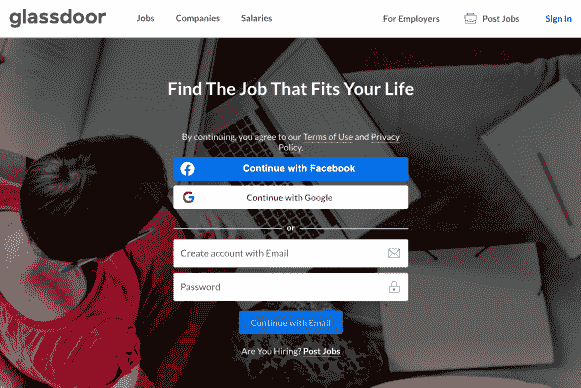

抓取是系统地、自主地从网上提取现成的、公开的信息的过程。我们构建算法，可以访问我们感兴趣的网页，记录我们感兴趣的所有数据，然后根据这些信息构建数据框架以供进一步使用。这些算法也被称为机器人，是的，所有这些验证码，你必须完成，以证明你不是一个机器人，特别是试图阻止网络爬虫(和其他类型的程序)访问他们的页面。

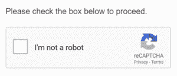

网络抓取并不违法，但那些需要会员资格和付费才能获取信息的公司和网站，并不喜欢机器人进来拿走它们。大多数大型网站(Zillow、Amazon 和 yes- Glassdoor)都会有网页抓取机器人要遵循的指南，你可以通过在任何网页上添加“robots.txt”来访问这些指南(比如 glassdoor.com/robots.txt 的

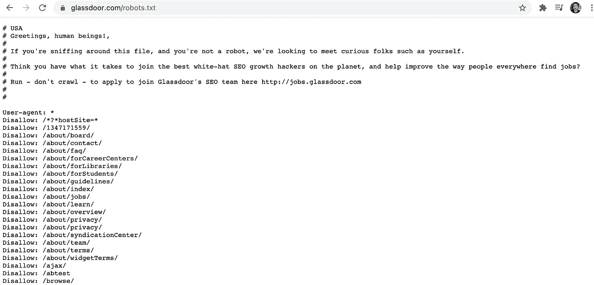

这基本上是一个页面，让你知道你的机器人在哪里*欢迎*搜集信息，它不在哪里。你可能会也可能不会遵循这些指导方针，因为网络抓取并不违法。但是，你可以依靠网站(如 Glassdoor)来设置尝试阻止你的方法(如那些验证码)。

如今，为了浏览网站，最好做好受到干扰的准备，并考虑到你可能需要一段时间才能获得你需要的信息。因为我的目标是 Glassdoor，所以我决定使用 Selenium 来构建我的 web 抓取机器人。

Selenium 是一个自动化网络浏览器的程序，这意味着你可以告诉 selenium 打开谷歌浏览器，进入[Glassdoor.com](http://Glassdoor.com)，搜索“数据科学家薪水”，等待 3 秒钟，点击搜索，然后在后续页面复制前 40 个搜索结果，点击列表中每个公司的“公司概述”，并收集每个薪水发布的额外公司数据。

我就是这么做的。

你可以配置 Selenium 运行“headless ”,这样它实际上就不会在你的电脑上启动网页，我强烈建议你在运行大规模搜索时使用这个设置，比如我的搜索，它搜索了美国大陆 30 多个不同城市的工资信息。

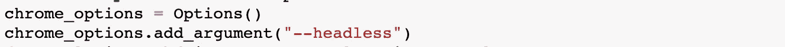

在你的网络搜索中建立停顿也很重要，尤其是当你像我一样使用自动网页的时候。在这个项目中建立暂停有两个主要原因:1)为你填充搜索栏的搜索表单，以及 2)普通人完成你编码的搜索所需的时间。

正如我提到的，许多网站不喜欢你抓取，并会试图通过监控你在他们页面上的搜索历史的速度来抓住你，如果它看起来超级像人类(如果你不告诉你的机器人慢下来，它就会这样)，就把你踢出去。

在你的代码中输入几个 time.sleep 暂停(我的代码有 6 个)，你就应该准备好了(我的机器人就在雷达下飞行)。

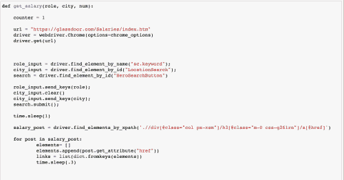

我根据人口和在科技界的受欢迎程度，搜索了美国大陆 30 多个城市的数据科学家工资。所有四个主要的人口普查区域都有代表(东北部、南部、中西部、西部),尽管与所有其他州相比，加州的城市绝对有过多的代表(我说我查找了热门的技术区域！).

我为每个薪水职位收集了 25 个不同的特征，包括职位发布的城市、公司和行业，以及薪水信息，如与公司相关的薪水范围、额外福利以及现金和股票奖金。

我还从 Numbeo.com 的 T2 搜集了所有感兴趣城市的生活成本数据。有三个城市没有 Numbeo 上的 COL 数据，对于这些城市，我用地理上和经济上距离最近的城市替换了数据。

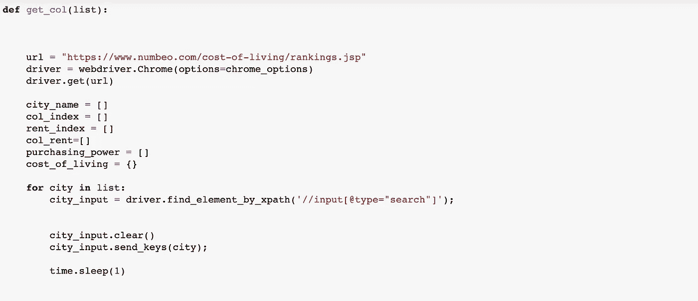

在建模之前，数据中有几个关键问题需要解决，即月薪与年薪发布、以 ascii 字符显示的国际货币、重复发布和基本工资范围。

虽然有些公告在最初的搜索结果中有明确的基本工资，但其他人提供了该职位的建议工资范围，这要么是因为可用的数据点很少，要么是因为报告的收入之间存在足够大的差异，因此有必要提供一个范围。

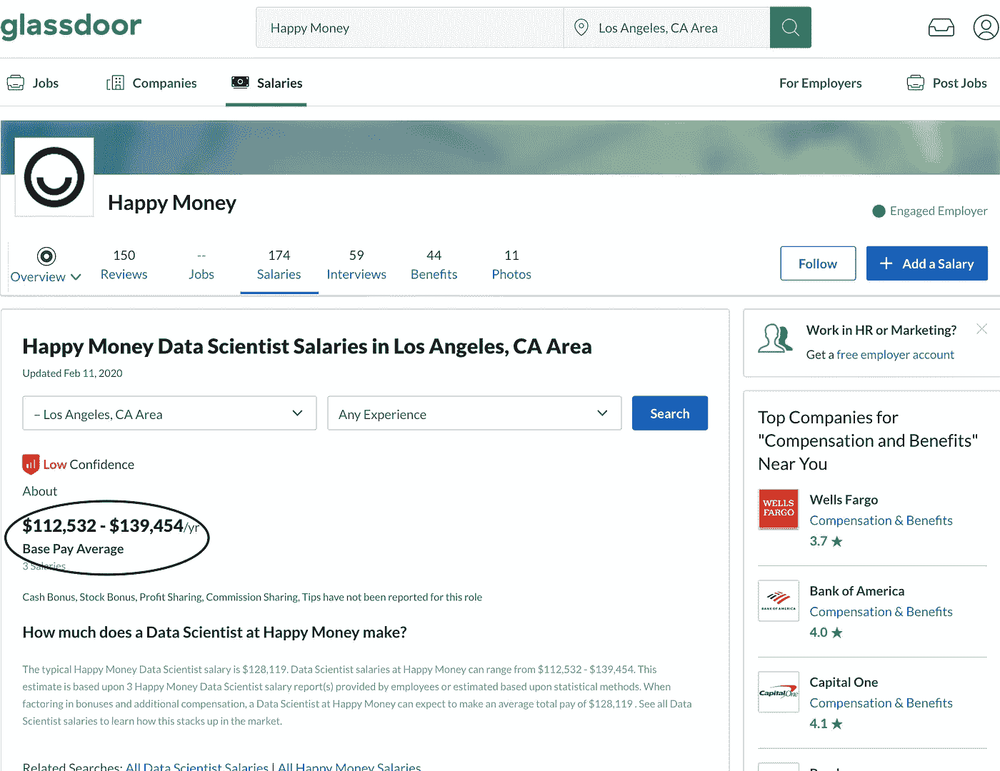

总共从 Glassdoor 收集了 1，477 个工资数据点，有 25 个特征，其中 6 个是分类的。

为了预测数据科学家的年度工资，我排除了月薪信息，因为它代表月薪而不是年薪、以非美元货币发布的工资以及超过 200，000 美元的工资，因为它们远远超出了四分位范围。

数据清理后，1303 个数据点用于分析。Glassdoor 报告的最终数据集中数据科学家的平均工资为 108，850 美元，标准差为 28，119 美元。四分位数范围是 91，344 美元到 126，033 美元。

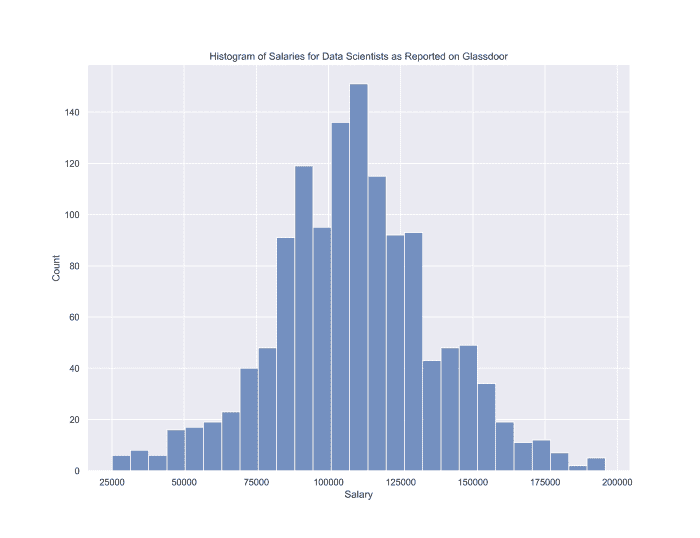

从简单清理和初步可视化的数据中很容易发现有趣的趋势，包括基于人口普查地区的工资差异。与东北部、中西部和南部相比，西海岸的数据科学家薪酬更高。

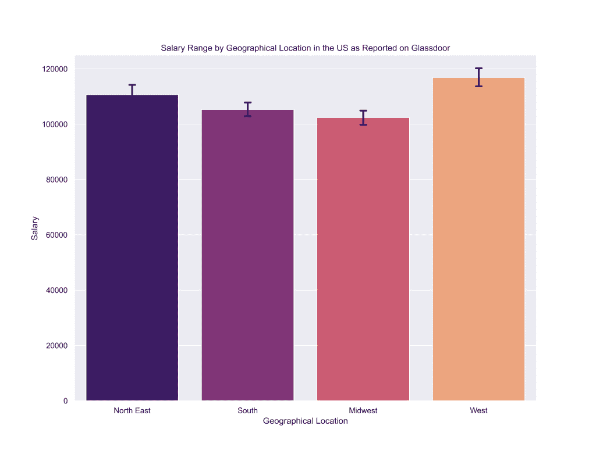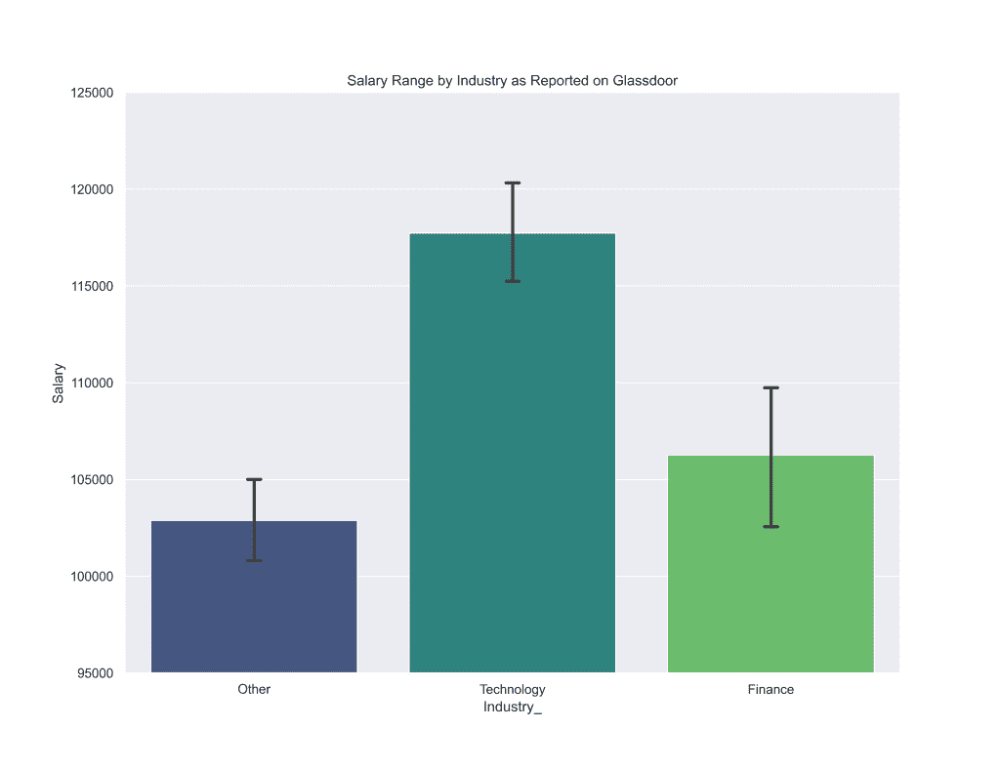

与金融和其他行业(包括服务、政府、通信和制造)相比，技术行业的数据科学家工资更高。

回归是预测连续数值的监督机器学习模型。它估计您的预测值(目标)和您认为可能影响该目标的变量(特征)之间的关系。

我测试了三种不同的回归模型:Lasso、Ridge 和 XG Boost。Lasso 和 Ridge 都是正则化的线性回归模型，这意味着它们通过将系数估计值(或对目标的影响)缩小到零来抑制过于复杂的模型(具有大量要素的模型)。

XGboost 回归是一种基于决策树的机器学习算法，它使用极端梯度提升来提高预测速度和准确性。梯度推进基于这样的思想，即当最佳可能模型与较弱模型的先前迭代相结合时，整体预测误差被最小化。

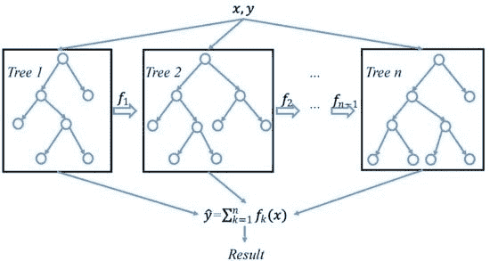

这个项目证明了 XGBoost 回归优于 Lasso 和 Ridge。

我首先将我的数据分为测试集、训练集和评估集，以便训练我的回归模型，并在测试它们用于现实世界之前评估它们的准确性。这个想法是保留你的数据的一部分，只用于测试目的，这样你就可以对你的模型的数据有一个真实的分数，这是以前没有过的。

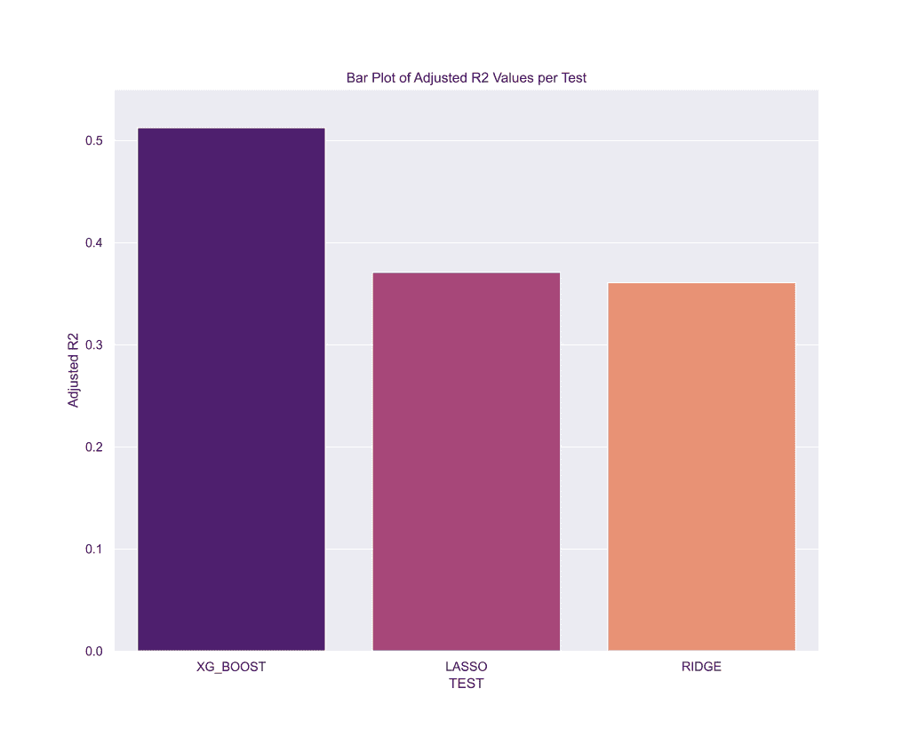

初始训练步骤显示，与 Lasso 和 Ridge 相比，XG Boost 回归不仅具有更高的调整 R2(模型得分，0–1)，而且与其他两个模型相比，它还具有更低的 RMSE(预测值与实际值的标准误差)。

这显然是在这个数据集上运行的最佳模型。

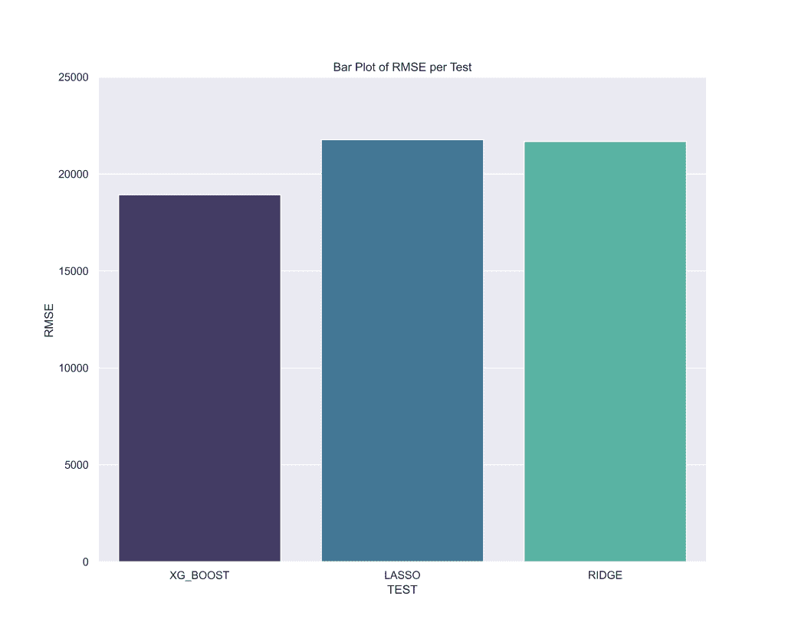

在训练和评估数据集上训练 XGBoost 后，最终测试显示性能有所提高(ha，ha)——最终调整后的 R2 值为 0 . 67，RMSE 为 15，831 美元。这意味着模型解释了数据中 67%的变化，预测值和实际值之间的平均误差为 15，831 美元。

决策树可视化在特征解释方面是最准确的，因为它清楚地显示了哪些预测器位于决策树的顶部。

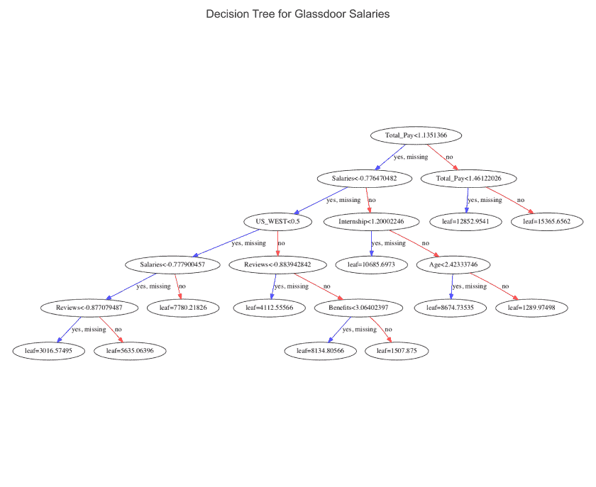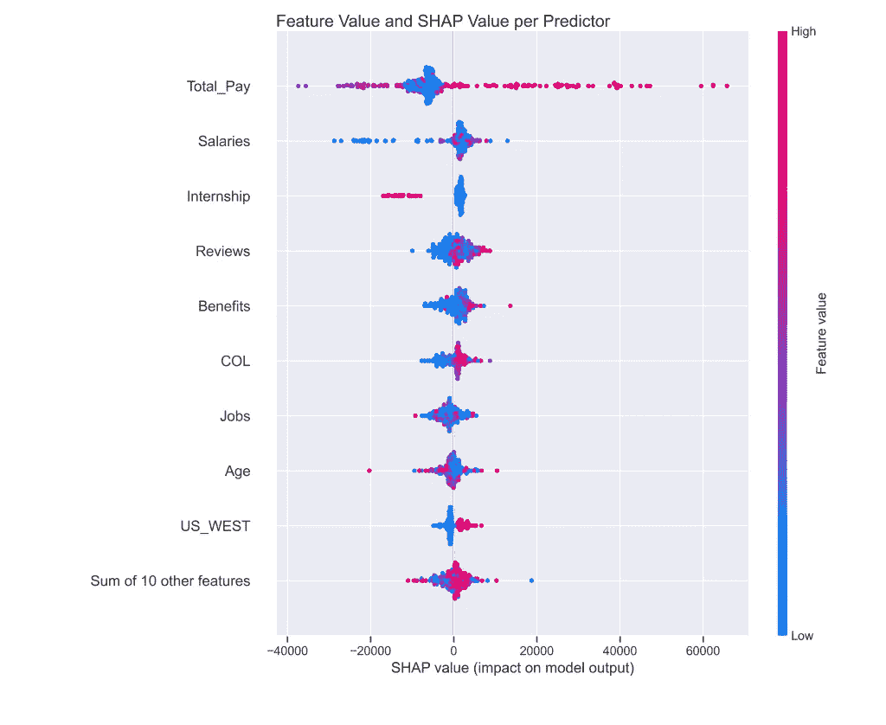

总薪酬是模型中最重要的特征，当您使用 Shapely Additive 解释值来可视化模型所做的决策时，这一点就很明显了。

那么什么是总薪酬呢？嗯，回到 Glassdoor 上的帖子，该网站提供了相当多不同维度的工资数据，其中许多被用作该模型的功能。Glassdoor 有基本工资(或年薪，这是模型中使用的目标)的信息，还有股票奖金、现金奖金和福利。总薪酬并不总是包含在每个职位中，它是 Glassdoor 对包括额外福利在内的全部工资的估计。

这意味着较高的总薪酬，即包括额外福利的较高年薪，与该职位较高的基本工资相关。这可能意味着，当查看数据科学家的招聘信息时，那些列出更多福利的人可能比那些没有列出福利的人工资更高。

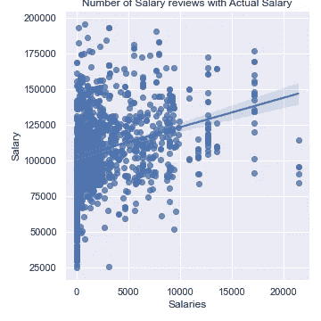

下一个最强的预测因素是薪水，它实际上代表了该公司在 Glassdoor 上披露的薪水数量。这意味着，过去和现在与 Glassdoor 分享薪水的员工人数越多，该公司数据科学家的薪水可能就越高。

查看你申请的潜在公司的 Glassdoor，看看有多少人在 Glassdoor 上分享了他们的薪水，这可能是一个好主意。分享公司信息的人越多，该公司的工资就越高。

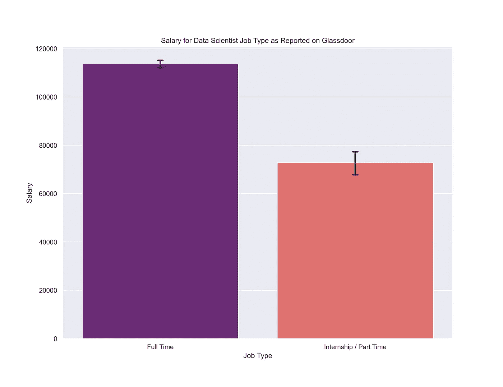

最后，实习。有很多实习的机会，这些都是在一个新的领域增长经验的绝佳机会，但你应该知道，与大多数公司的正式职位相比，实习职位的工资较低。在小公司担任初级数据科学家可能比在大公司实习更好，尤其是当你的起薪是当务之急的时候。

如果你想查看完整的项目和这个模型的所有预测，请查看我的 GitHub [这里](https://github.com/CeliaSagas/Data-Coin)或个人网站[这里](http://celiasagastume.com)。

【https://celiasagastume.com】最初发表于**。**