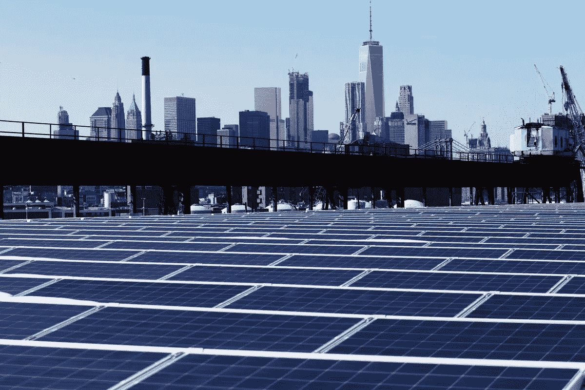

# 利用天气数据预测用电量

> 原文：<https://medium.com/mlearning-ai/predicting-electricity-consumption-using-weather-data-29d2a35e6ac9?source=collection_archive---------0----------------------->

*本文展示了一个使用多元时间序列和向量自回归(VAR)模型的机器学习项目。*

Photo courtesy of Mark Lennihan/AP

根据 2021 年联合国气候报告，一些全球变暖的影响现在是不可逆转的。这种影响是有害的，因为海平面继续上升，由于北极冰的融化，位于海平面以下的地区…