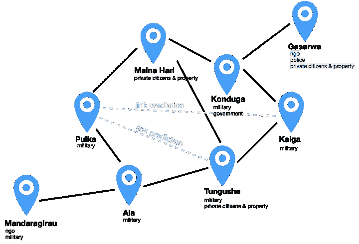
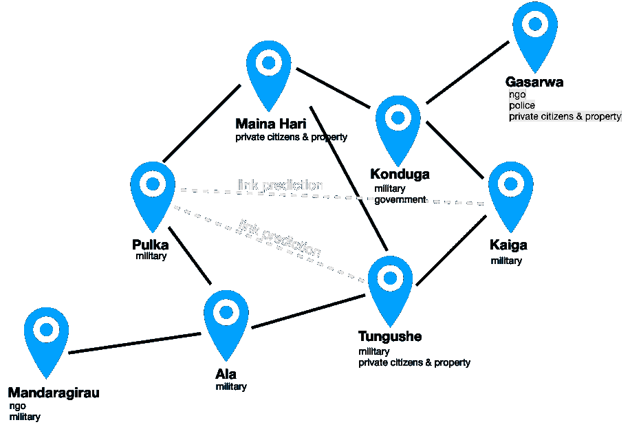
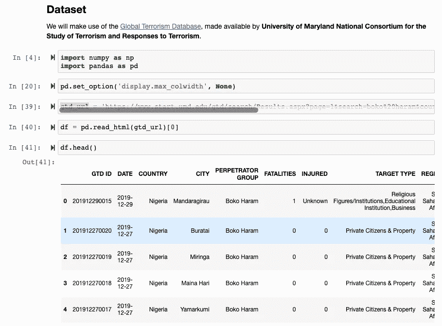
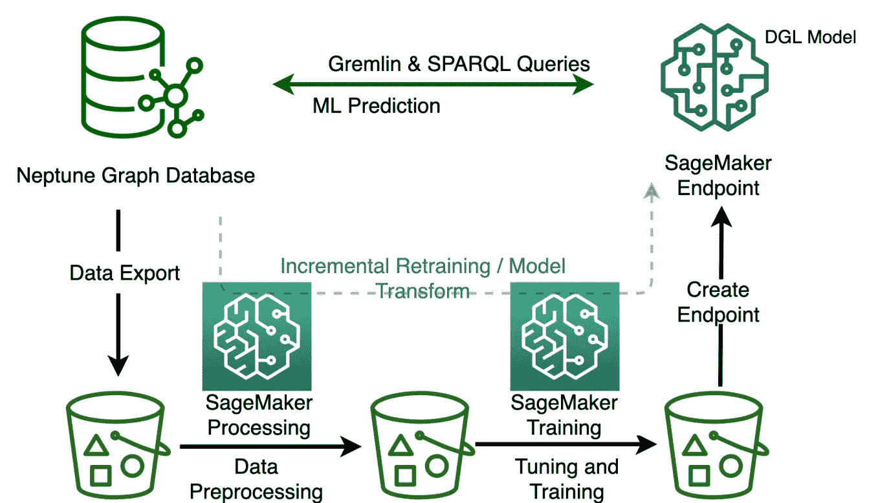
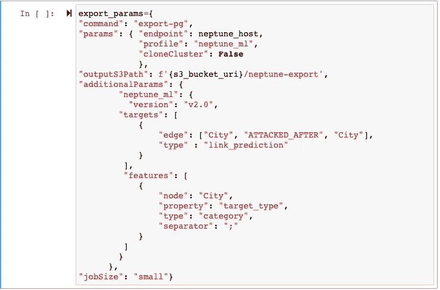

# 用亚马逊 Neptune ML 预测未来的恐怖袭击目标

> 原文：<https://medium.com/mlearning-ai/predicting-future-terrorist-targets-with-amazon-neptune-ml-d5471589f0c7?source=collection_archive---------9----------------------->



Modeling Terrorist Attacks in Nigeria as a Graph Network

我们经常在现实世界的应用中看到基于图表的推荐引擎，从社交网络到电子商务平台的产品推荐。我们中的许多人已经开始依赖推荐系统来建立新的职业关系(LinkedIn)，做出购买决定(亚马逊)，甚至发现新的音乐来听(Spotify)。在社交网络(例如 LinkedIn)中，基于用户的其他联系向用户显示新的联系建议或推荐。具有共同连接的用户很可能认识或想要彼此连接。因此，我们可以很容易地将社交网络表示为图形。

**这篇博文的灵感来自 AWS 最近的一篇博客:**

[](https://aws.amazon.com/blogs/machine-learning/graph-based-recommendation-system-with-neptune-ml-an-illustration-on-social-network-link-prediction-challenges/) [## 基于图的 Neptune ML 推荐系统:以社会网络链接为例

### 推荐系统是现实世界中最广泛采用的机器学习技术之一

aws.amazon.com](https://aws.amazon.com/blogs/machine-learning/graph-based-recommendation-system-with-neptune-ml-an-illustration-on-social-network-link-prediction-challenges/) 

## 语境

恐怖袭击可以自然地表示为图形网络，其中节点表示目标位置，目标位置之间的连接、袭击之间的时间顺序表示为边。下面说明了一个示例网络。如果我们想象我们有一个恐怖分子目标网络，地点(节点)在 Maina Hari、Pulka、Mandaragirau、Tungushe、Kaiga、Konduga 和 Gasarwa。它们的关系由链接(边)表示，每个位置的目标属性(如军事基地、宗教机构、非政府组织、私人公民和财产、警察局、教育机构和政府办公室)由节点属性表示。



Boko Haram Attacks in Nigeria as a Graph Network

这里的目标是预测下一个可能的目标位置，如果这些位置之间存在潜在的缺失链接。例如，我们是否应该提醒安全机构普尔卡和通古社之间可能有联系？查看图表，我们可以看到他们有两个共同的位置，阿拉和 Maina Hari..因此，通古社和普尔卡有可能受到攻击。这些问题和直觉是网络推荐系统的主要逻辑或推理。

在这篇博文的剩余部分，我们将使用[全球恐怖主义数据库](https://www.start.umd.edu/gtd/)，展示如何用社交网络来表达恐怖袭击。然后，我们将使用[亚马逊 Neptune ML](https://aws.amazon.com/neptune/machine-learning/) 和[亚马逊 SageMaker](https://aws.amazon.com/sagemaker/) 来训练和部署能够预测下一次可能的恐怖袭击的推荐引擎。该系统的结果是在反恐(甚至有组织犯罪)中提高基于人工智能的情报。

我们将介绍如何使用图形神经网络(GNNs)来推荐下一个可能被攻击的位置，作为一个**链接预测**问题。我们将使用亚马逊 Neptune ML 训练一个 GNN 模型，并通过链接预测任务在演示图上进行推理。GitHub 上提供了示例代码(根据要求)。

## 基于图形神经网络的路段预测

考虑到以前的恐怖袭击目标网络，我们希望预测/推荐恐怖组织可能袭击的地点。我们希望加强安全人员的情报收集，收集潜在目标位置的信息。Konduga 和 Tungushe 拥有共同的城市/城镇属性，但没有共同的链接。哪个会比较好推荐？当被框定为一个链接预测问题时，任务被分配给两个节点之间任何可能的一个分数。链接分数越高，这个推荐就越有可能收敛。通过学习图中已经存在的链接结构，链接预测模型可以概括新的链接预测，从而“完成”图。

要了解更多关于图形神经网络中的链接预测以及 GNNs 如何工作的信息，请查看 AWS 的博客文章，【Neptune ML 的基于图形的推荐系统:社交网络链接预测挑战的说明。

# 用亚马逊 Neptune ML 训练我们的图形卷积网络

Neptune ML 使用图形神经网络技术在您的图形数据上自动创建、训练和部署 ML 模型。Neptune ML 支持常见的图预测任务，例如节点分类和回归、边分类和回归以及链接预测。Neptune ML 的动力来自:

*   [Amazon Neptune](https://aws.amazon.com/neptune/) :一个快速、可靠、完全托管的图形数据库，针对存储数十亿条关系和以毫秒级延迟查询图形进行了优化。
*   Amazon SageMaker :一个完全托管的服务，为每个开发人员和数据科学家提供快速准备构建、训练和部署 ML 模型的能力。
*   [深度图形库(DGL)](https://www.dgl.ai/) :一个[开源](https://github.com/dmlc/dgl/)，高性能，可伸缩的 Python 包，用于图形上的 DL。

使用 [AWS CloudFormation 快速入门模板](https://docs.aws.amazon.com/neptune/latest/userguide/machine-learning.html)，您可以轻松开始使用 Neptune ML。它设置了必要的基础设施组件，包括 Neptune DB 集群，并设置了网络配置、IAM 角色和关联的 SageMaker notebook 实例，并为 Neptune ML 预填充了笔记本样本。*完成后不要忘记删除堆栈*。

## 原始数据准备

如前所述，我们将利用全球恐怖主义数据库。对于本例，我们将直接利用网站上的数据子集。



Pandas read_html table from [Global Terrorism Database](https://www.start.umd.edu/gtd/) website

现在我们的数据样本已经准备好了，是时候用 Amazon Neptune ML 训练我们的 GNN 模型了。下图显示了 Neptune ML 训练基于 GNN 的推荐系统的步骤。



Source: [Graph-based recommendation system with Neptune ML: An illustration on social network link prediction challenges](https://aws.amazon.com/blogs/machine-learning/graph-based-recommendation-system-with-neptune-ml-an-illustration-on-social-network-link-prediction-challenges/)

## 数据导出配置

我们的 Neptune ML 过程的第一步是从 Neptune 集群导出图形数据。我们必须为数据导出任务指定参数和模型配置。我们使用 Neptune 工作台进行所有的配置和推荐。工作台让我们可以使用 Amazon SageMaker 托管的 Jupyter 笔记本来处理 Neptune DB 集群。此外，它在笔记本电脑中提供了许多神奇的命令，节省了大量的时间和精力。以下是我们的导出参数示例:



Neptune ML export params

关于`export_params`所需配置的更多信息，参见[从 Neptune 为 Neptune ML 导出数据](https://docs.aws.amazon.com/neptune/latest/userguide/machine-learning-data-export.html)。

## 数据预处理

Neptune ML 执行特征提取和编码，作为数据处理步骤的一部分。常见的属性预处理类型包括:通过一键编码对分类特征进行编码，对数字特征进行分桶，或者使用 word2vec 对字符串属性或其他自由格式的文本属性值进行编码。

要运行数据预处理，请使用下面的 Neptune notebook magic 命令:`%neptune_ml dataprocessing start`

详见[处理从 Neptune 导出的图形数据用于训练](https://docs.aws.amazon.com/neptune/latest/userguide/machine-learning-on-graphs-processing.html)。

## 模型培训和部署

下一步是 GNN 模型的自动化训练。模型训练分两个阶段完成。第一阶段使用 SageMaker 处理作业来生成模型训练策略。这是一个配置集，它指定了将用于模型训练的模型类型和模型超参数范围。然后，将启动 SageMaker 超参数调优作业。

要开始训练步骤，您可以使用`%neptune_ml training start`命令。

一旦训练步骤完成，我们就可以在 SageMaker 端点后面部署 GNN 模型，开始实时提供预测服务。模型输入将是我们需要在遭到攻击后识别可能的恐怖分子目标的城市，以及边类型，输出将是基于该城市的可能的恐怖分子目标的列表。

要将模型部署到 SageMaker 端点实例，使用`%neptune_ml endpoint create`命令。

更多信息见[使用 Neptune ML](https://docs.aws.amazon.com/neptune/latest/userguide/machine-learning-on-graphs-model-training.html) 训练模型。

## 使用 Gremlin 查询 ML 模型

一旦端点准备好了，我们就可以用它来进行图推理查询。Neptune ML 支持 Gremlin 或 SPARQL 中的图推理查询。在我们的例子中，我们现在可以用 Neptune ML 检查城市“Ala”上的潜在恐怖分子目标。它需要几乎相同的语法来遍历边缘，并列出通过 ATTACKED_AFTER 连接连接到 Ala 的其他城市。

```
%%gremlin 
g.with("Neptune#ml.endpoint","${endpoint_name}").      V().hasLabel('City').has('name', 'Ala').       out('ATTACKED_AFTER').with("Neptune#ml.prediction").hasLabel('City').values('name')
```

下面是另一个例子，可以用来预测“阿拉”受到攻击后最有可能被攻击的前八大城市:

```
%%gremlin 
g.with("Neptune#ml.endpoint","${endpoint_name}").with("Neptune#ml.limit",8).V().hasLabel('City').has('name', 'Ala').       out('ATTACKED_AFTER').with("Neptune#ml.prediction").hasLabel('City').values('name')
```

更多信息见 Neptune ML 中的 [Gremlin 推理查询。](https://docs.aws.amazon.com/neptune/latest/userguide/machine-learning-on-graphs-inference-queries.html)

# 结论

这篇文章的灵感来自 AWS blogpost [基于图形的推荐系统 Neptune ML:一个关于社交网络链接预测挑战的例子](https://aws.amazon.com/blogs/machine-learning/graph-based-recommendation-system-with-neptune-ml-an-illustration-on-social-network-link-prediction-challenges/)。我们展示了 Neptune ML 和 GNNs 如何使用链接预测任务，结合图表中复杂交互模式的信息，帮助安全机构加强情报收集，以挫败恐怖袭击。

对于生产就绪的实现，该解决方案需要在更大的数据集上进行训练。我们还可以考虑丰富数据集，特别是具有其他属性的位置(节点)天气条件、到特定兴趣点的距离等。

想在 AWS 上构建你的下一个 AI 用例？你可以通过[电子邮件](mailto:elesin.olalekan@gmail.com)联系我，在[推特](https://twitter.com/elesinOlalekan)上关注我，或者在 [LinkedIn](https://www.linkedin.com/in/elesinolalekan/) 上联系我，订阅我在 Medium 上的时事通讯。

[](/mlearning-ai/mlearning-ai-submission-suggestions-b51e2b130bfb) [## Mlearning.ai 提交建议

### 如何成为 Mlearning.ai 上的作家

medium.com](/mlearning-ai/mlearning-ai-submission-suggestions-b51e2b130bfb)