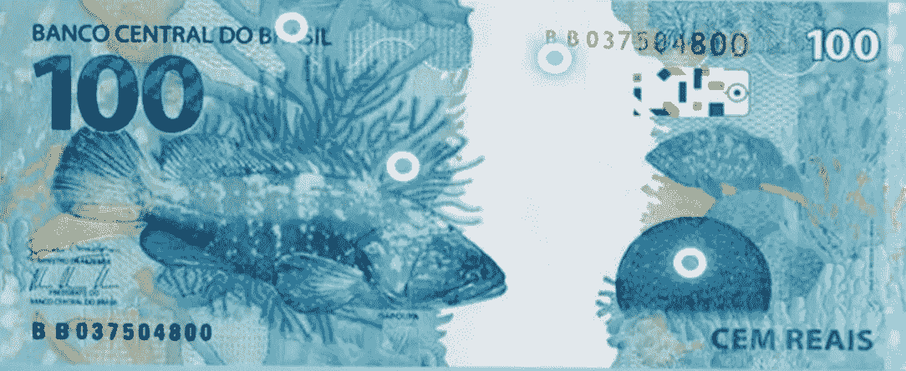
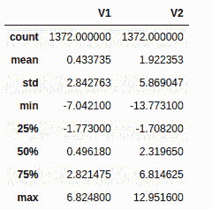
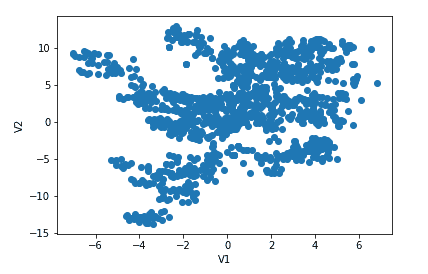
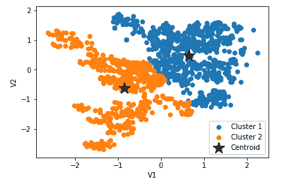
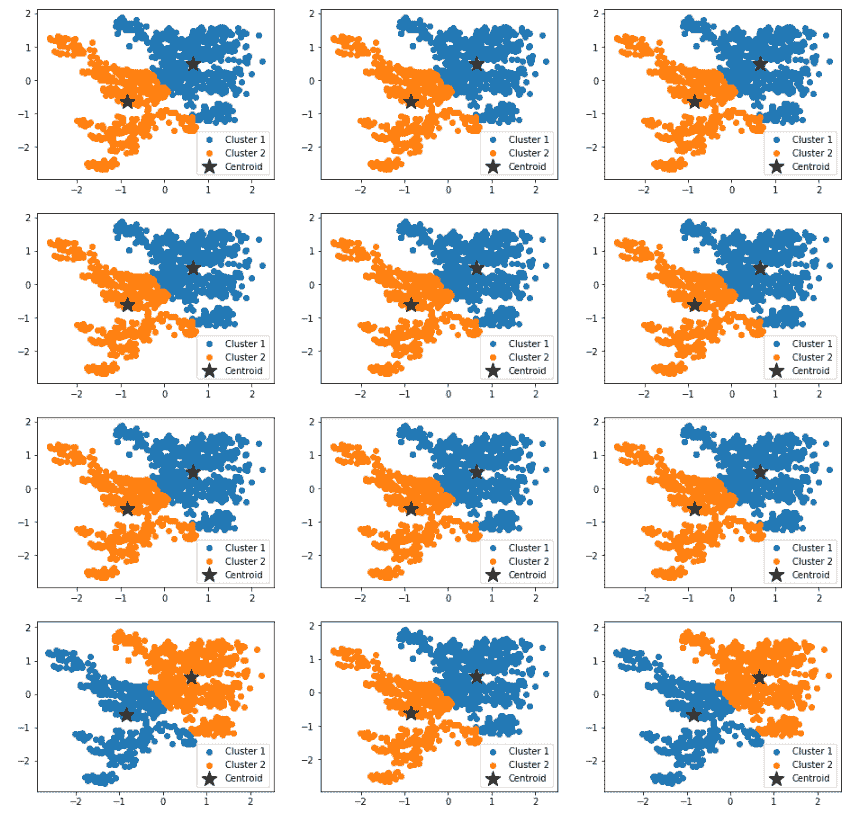

# 预测真钞和伪钞

> 原文：<https://medium.com/mlearning-ai/predicting-genuine-and-forged-banknotes-f4ac38d5aa0e?source=collection_archive---------4----------------------->

我不知道你住在哪里，但在巴西，货币交易仍然是现实。这种交易不太安全，因为识别伪钞并不那么容易。银行无休止地为纸币增加安全性。紫外线和全息特征、水印和金属线，但伪造者会随着新技术得到更新。

Photo by Banco Central do Brasil/Reproduction

这种可能应用的核心将是一个机器学习项目来做出这些预测。为此，将使用 OpenML 中的一个名为“钞票认证”的数据集，该数据集将帮助我们区分真假钞票。

# 探索性分析

该数据集是使用真钞和伪钞的图像构建的。小波变换从这些图像中提取方差、偏斜度、峰度和熵等特征。但是对于这个项目，将使用这个数据集的简化版本，其中仅包括使用小波变换从图像中提取的方差(V1)和偏斜度(V2)。这两个特征都没有缺失值，并且是连续的数字。数据集的描述如下所示:

Description of the dataset

为了使数据可视化，我们将使用 matplotlib 的散点图，这将允许我们对数据进行更好的分析。

Two-dimensional visualization of the dataset

# 模型训练

由于数据集没有目标，该项目涉及构建无监督的机器学习。K-means 聚类是对数据集进行推理的最简单算法之一。该算法将数据点聚集在 K 个簇中，其中每个数据点最接近 K 个簇的质心之一。

图中的分布似乎不太分散，也不太居中，实例的数量似乎足够，这意味着值得尝试 K-means 聚类算法，尽管分布形状不是球形的。由于第一个特征在-7.04 至 6.82 之间变化，而另一个在-13.77 至 12.95 之间变化，因此对两个特征应用相同的测量比例可能是有意义的，即在创建模型之前标准化特征。

为了使用 K-均值，我们将使用两个聚类。一张是真钞，另一张是假钞。在下面，可以将聚类后的结果可视化。

Clustering visualization

K-means 聚类算法通过随机选择质心的初始位置来计算最接近质心的点，然后重新计算，从而开始聚类过程。这种随机选择可能会影响最终结果，所以有必要检查算法对于给定数据集是否稳定。为了检查算法的稳定性，我们将多次重新运行它，并检查最终结果中的显著差异。

Results of rerun of K-means 12 times

# 结果

在重新运行 K-means 12 次后，可能会看到不明显的差异，这使我们可以得出结论，K-means 算法对于此数据集是稳定的。在 1，372 个数据点中，775 个集中在第 1 组，597 个集中在第 2 组。

要实现一个测试，计算准确性是必要的，但是幸运的是，来自 OpenML 的数据有目标，所以我们简单地将我们发现的结果与这个数据集中的目标进行比较。发现的准确度为 87.82%，这可以被认为是一个好结果。为了改善结果，与其他两个功能一起工作可以提高准确性！

这篇文章背后的代码可以在这里找到[。请随时给我任何反馈。谢谢你一直读到这里。](https://github.com/thiagolimaop/banknotes)

 [## Mlearning.ai 提交建议

### 如何成为 Mlearning.ai 上的作家

medium.com](/mlearning-ai/mlearning-ai-submission-suggestions-b51e2b130bfb)