# 用脸书的先知预测谷歌的股价

> 原文：<https://medium.com/mlearning-ai/predicting-googles-stock-prices-using-facebook-s-prophet-4829c83a8590?source=collection_archive---------0----------------------->


> Prophet 是一种基于加法模型预测时间序列数据的过程，在该模型中，非线性趋势与每年、每周和每天的季节性以及假日影响相适应。它最适用于具有强烈季节效应的时间序列和几个季节的历史数据。

预言者是[的开源软件](https://code.facebook.com/projects/)由**脸书的** [**核心数据科学团队**](https://research.fb.com/category/data-science/) 发布。可在 [CRAN](https://cran.r-project.org/package=prophet) 和 [PyPI](https://pypi.python.org/pypi/fbprophet/) 上下载。

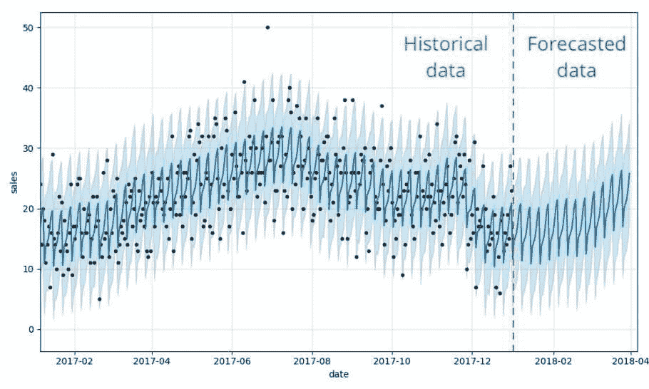

**先知模型背后的数学方程式定义为:**

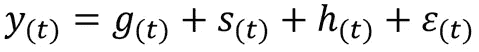

有了，

*   代表趋势的 g(t)
*   s(t)代表周期性变化(每周、每月、每年)
*   h(t)代表假期的影响
*   e(t)是误差项

**使用 FB 先知的优势:**

*   开放源码
*   准确快速
*   可调参数
*   对 Python 和 R 都可用
*   能够轻松模拟任意数量的季节性
*   轻松地将假期集成到模型中

在本文中，我们将使用 FB Prophet 模型来预测谷歌的股票价格。

## 第一步。装置

Prophet 在 **CRAN** 包中，所以你可以使用 **install.packages**

```
install.packages('prophet')
```

Prophet 在 **PyPI** 上，可以用 pip 安装。

```
pip install pystan==2.19.1.1
pip install prophet
```

关于安装的更多信息: [FB Prophet 安装](https://facebook.github.io/prophet/docs/installation.html)。

在本文中，我们将使用 Python

## 第二步。导入所需的库

```
import numpy as np
import pandas as pd
import matplotlib.pyplot as plt
from fbprophet import Prophet
import datetime as dtfrom plotly import tools
import chart_studio.plotly as py
import plotly.figure_factory as ff
import plotly.tools as tls
import plotly.graph_objs as go
from plotly.offline import download_plotlyjs, init_notebook_mode, plot, iplot
init_notebook_mode(connected=True)
import warnings
warnings.filterwarnings("ignore")# plt.style.available
plt.style.use("seaborn-whitegrid")
```

## 第三步。导入数据集

数据集由谷歌的股票市场数据组成。并且可以从[雅虎财经](https://finance.yahoo.com/quote/GOOG/history?p=GOOG)下载。数据显示了谷歌从 2015 年 1 月 1 日到 2020 年 10 月 28 日的股价。

```
df = pd.read_csv('GOOG.csv', sep=";")
df.head(8)
```

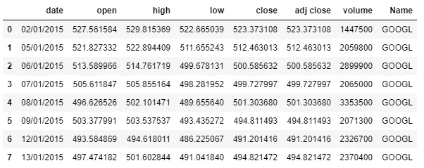

## 第四步。数据预处理

将列名从 name 替换为 ticks。

```
df = df.rename(columns={'Name': 'Ticks'})
google = df.loc[df['Ticks'] == 'GOOGL']
```

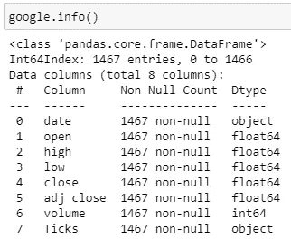

```
**# Create a copy to avoid the SettingWarning .loc issue** 
google_df = google.copy()
**# Change to datetime datatype**
google_df.loc[:, 'date'] = pd.to_datetime(google.loc[:,'date'], format="%d/%m/%Y")
```

分析数据集:

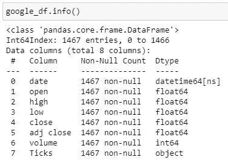

## 第五步。使数据集符合“先知”标准

*   Prophet 的输入始终是一个包含两列的数据帧: **ds** 和 **y** 。
*   **ds** (日期戳)列应该是 Pandas 所期望的格式，理想情况下 **YYYY-MM-DD** 表示日期，或者 **YYYY-MM-DD HH:MM:SS** 表示时间戳。
*   **y** 列必须是数字，代表我们希望预测的测量值。

在本文中，我们将只使用日期和收盘价作为我们模型的特征。我们将日期重命名为“ds”，将收盘价重命名为“y”。

```
**# Drop the columns**
ph_df = google_df.drop(['open', 'high', 'low','volume','adj close', 'Ticks'], axis=1)
ph_df.rename(columns={'close': 'y', 'date': 'ds'}, inplace=True)ph_df.head()
```

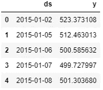

## 第六步。绘制数据集

绘制数据集以获得洞察力:

```
plt.figure(figsize=(10,6))
plt.plot(ph_df.set_index('ds'))
plt.legend(['Close'])
```

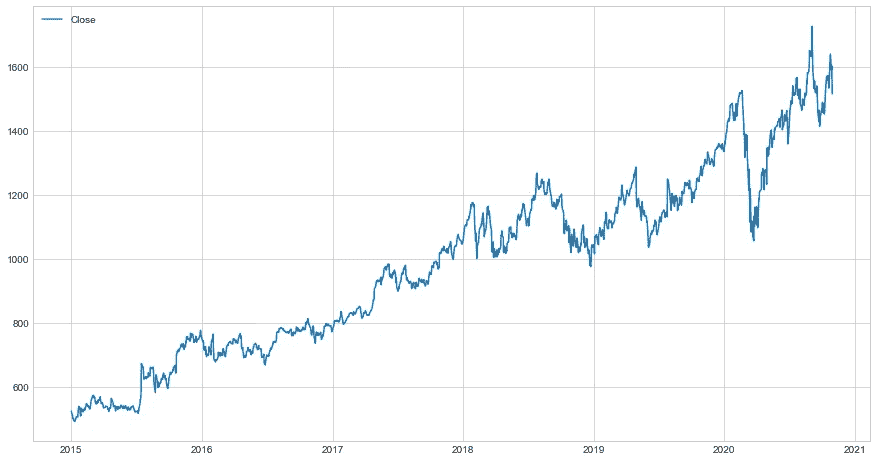

## 第七步。构建预测模型

我们通过实例化一个名为 m1 的新 Prophet 对象来适应这个模型。

```
m1 = Prophet(daily_seasonality=True)
m1.fit(ph_df)
```

我们不会将数据分为训练集和测试集，但我们会使用所有数据来拟合模型。

我们需要告诉先知未来要预测多远。我们可以使用帮助器方法**prophet . make _ future _ data frame 来获得延伸到未来指定天数的合适数据帧。**我们只想预测未来 365 天的收盘价..

预测方法将为未来的每一行分配一个预测值，并将其命名为 yhat。这里的预测对象是一个新的 dataframe，它包括一个包含预测的列 **yhat** ，以及组件和不确定性区间的列。

```
**# Create Future Dates**
future_prices = m1.make_future_dataframe(periods=365)**# Predict Prices** forecast1 = m1.predict(future_prices)
forecast1[['ds', 'yhat', 'yhat_lower', 'yhat_upper']].tail()
```

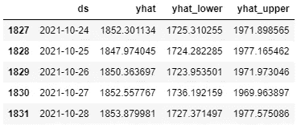

## 第八步。预测的结果

```
import matplotlib.dates as mdates# Dates
starting_date = dt.datetime(2020, 10, 29)
starting_date1 = mdates.date2num(starting_date)pointing_arrow = dt.datetime(2020, 10, 29)
pointing_arrow1 = mdates.date2num(pointing_arrow)# Learn more Prophet tomorrow and plot the forecast for amazon.
fig = m1.plot(forecast1)
ax1 = fig.add_subplot(111)
ax1.set_title("Google Stock Price Forecast", fontsize=16)
ax1.set_xlabel("date", fontsize=12)
ax1.set_ylabel("Close Price", fontsize=12)# Forecast initialization arrow
ax1.annotate('Forecast \n Initialization', xy=(pointing_arrow1, 1595), xytext=(starting_date1,1700),
            arrowprops=dict(facecolor='#ff7f50', shrink=0.01),
            )ax1.axhline(y=1560, color='b', linestyle='-')plt.show()
```

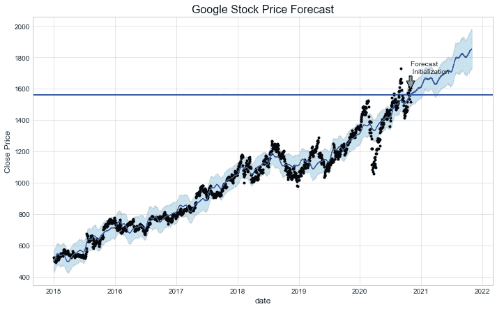

*   **黑点**:原始数据
*   **蓝线**:预测模型
*   **浅蓝色区域**:置信区间

该模型使用所有数据进行训练(黑点)，并预测从 2020 年 10 月 29 日**到 2021 年**10 月 28 日**的未来股价。**

**结论:**根据模型预测，2021 年 10 月**谷歌股价似乎会在**1800**左右。**

## 第九步。绘制预测组件

如果我们想要查看预测组件，我们可以使用**prophet . plot _ components**方法。默认情况下，我们将看到时间序列的**趋势**、**年度**季节性和**每周**季节性。

```
m1.plot_components(forecast1);
```

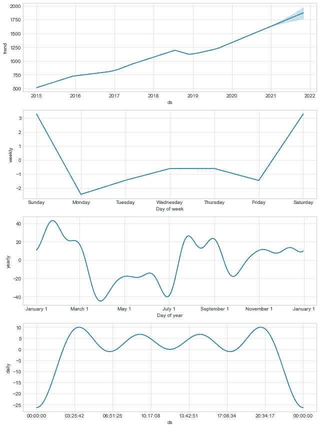

根据估计的趋势，我们可以看到，通常股票价格在 1 月中旬的**和周日的**最高。趋势图显示股票价格在不久的将来会上涨。

## 第十步。添加节日效果

Prophet 提供了将这些节假日或特殊事件引起的波动包括在预测模型中的能力。节假日和事件会导致时间序列发生变化。我们可以通过创建一个包含两列 **ds** 和 **holiday 的 dataframe 来为 Prophet 创建一个定制的假日列表。**

我们将定义一个假日数据帧，其中包含**日期**和**假日描述**(在本文中，例如我们只包括耶稣升天日和圣诞节)**。**

“假日”下部窗口和上部窗口的每个事件对应一行，将假日延长到日期前后的天。

```
ascensionday = pd.DataFrame({
  'holiday': 'AscensionDay',
  'ds': pd.to_datetime(['2015-05-14','2016-05-05','2017-05-25','2018-05-10','2019-05-30','2020-05-21']),
  'lower_window': 0,
  'upper_window': 1,
})christmas = pd.DataFrame({
  'holiday': 'Christmas',
  'ds': pd.to_datetime(['2015-12-25','2016-12-25','2017-12-25','2018-12-25','2019-12-25','2020-12-25']),
  'lower_window': -1,
  'upper_window': 7,
})new_holidays = pd.concat((ascensionday, christmas))
new_holidays.head()
```

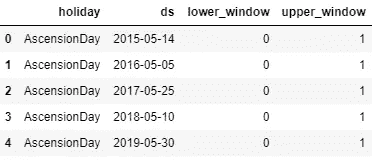

**做出预测**

一旦创建了数据帧，就可以通过传递 **holidays =** 参数来包含假日效果。并且对于预测步骤保持与上面相同:

```
m2 = Prophet(holidays=new_holidays,daily_seasonality=True).fit(ph_df)
future2 = m2.make_future_dataframe(periods=365)
forecast2 = m2.predict(future2)
m2.plot(forecast2);
```

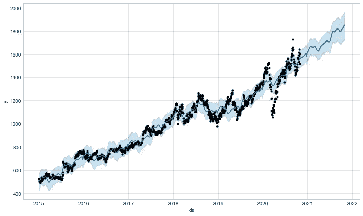

**预测组件**

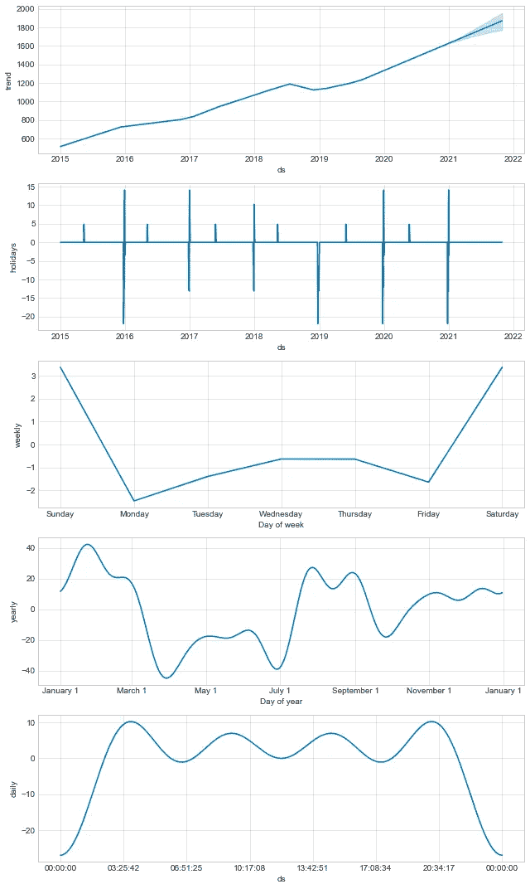

## 第十一步。向 Prophet 添加变化点(附加)

*   变点是时间序列在轨迹中出现**突变**的日期时间点。
*   默认情况下，Prophet 将 **25 个变点**添加到数据集的**初始 80%** 中。
*   使用**add _ change points _ to _ plot**功能添加红线，垂直虚线是趋势发生变化的预测点，红色实线是去除所有季节性的趋势。

```
from fbprophet.plot import add_changepoints_to_plot
fig = m2.plot(forecast2)
a = add_changepoints_to_plot(fig.gca(), m2, forecast2)
```

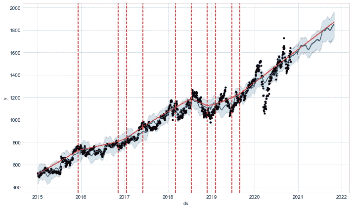

我们可以查看变更点发生的日期:

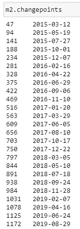

## 第十二步。性能指标

*   使用 **cross_validation 函数**可以在一系列历史临界值内自动完成交叉验证程序。我们指定预测范围(horizon)，然后可选地指定初始训练期的大小(initial)和截止日期之间的间隔(period)。默认情况下，初始训练周期设置为三倍范围，每半个范围进行一次截止。
*   cross_validation 的输出可以用来计算 yhat 与 y 的误差度量。
*   performance_metrics 实用程序可用于计算一些有用的预测性能统计数据(与 y 相比的 yhat、yhat_lower 和 yhat_upper ),作为距截止点的距离的函数。

```
from fbprophet.diagnostics import cross_validation
from fbprophet.diagnostics import performance_metrics
from fbprophet.plot import plot_cross_validation_metric
ph_df_cv = cross_validation(m2, initial='380 days', period='90 days', horizon = '60 days')
ph_df_cv.head()
```

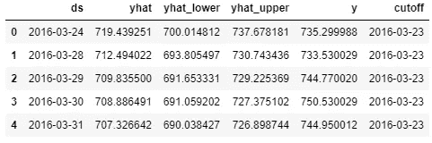

```
ph_df_p = performance_metrics(ph_df_cv)
ph_df_p.head()
```

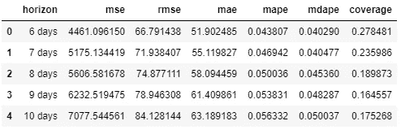

关于每种方法可用选项的更多细节可在文档字符串中获得，例如，通过**帮助(Prophet)** 或**帮助(Prophet.fit)。**

# 参考资料:

[](https://facebook.github.io/prophet/) [## 先知

### Prophet 是一个用 R 和 Python 实现的预测程序。它速度很快，并提供完全自动化的预测…

facebook.github.io](https://facebook.github.io/prophet/) [](https://github.com/raffg/prophet_forecasting) [## raffg/prophet _ 预测

### 这些是我关于先知的博文的支持笔记本…

github.com](https://github.com/raffg/prophet_forecasting) [](https://towardsdatascience.com/predicting-the-future-with-facebook-s-prophet-bdfe11af10ff) [## 用脸书的先知预测“未来”

### 利用脸书先知图书馆预测媒体的未来“观点”

towardsdatascience.com](https://towardsdatascience.com/predicting-the-future-with-facebook-s-prophet-bdfe11af10ff) [](https://towardsdatascience.com/forecasting-in-python-with-facebook-prophet-29810eb57e66) [## 用 Python 预测脸书预言家

### 如何使用领域知识调整和优化 Prophet，以便更好地控制您的预测。

towardsdatascience.com](https://towardsdatascience.com/forecasting-in-python-with-facebook-prophet-29810eb57e66) [](https://towardsdatascience.com/time-series-forecasting-predicting-stock-prices-using-facebooks-prophet-model-9ee1657132b5) [## 时间序列预测:用脸书的先知模型预测股票价格

### 使用可从《先知脸书》公开获得的预测模型预测股票价格

towardsdatascience.com](https://towardsdatascience.com/time-series-forecasting-predicting-stock-prices-using-facebooks-prophet-model-9ee1657132b5) [](https://towardsdatascience.com/time-series-prediction-using-prophet-in-python-35d65f626236) [## Python 中使用 Prophet 进行时间序列预测

### 在本帖中，我们将探索 facebook 的时间序列模型 Prophet。我们会明白什么是先知，它是…

towardsdatascience.com](https://towardsdatascience.com/time-series-prediction-using-prophet-in-python-35d65f626236)