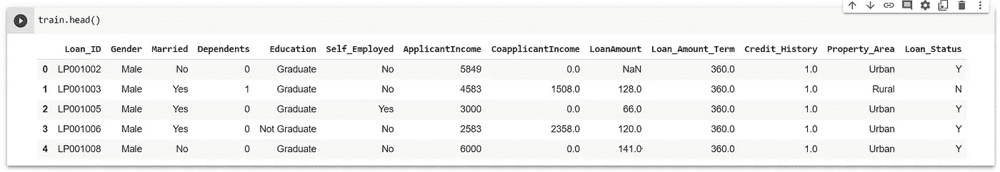
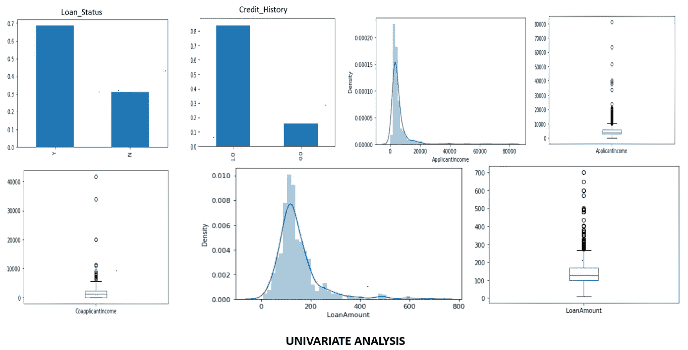
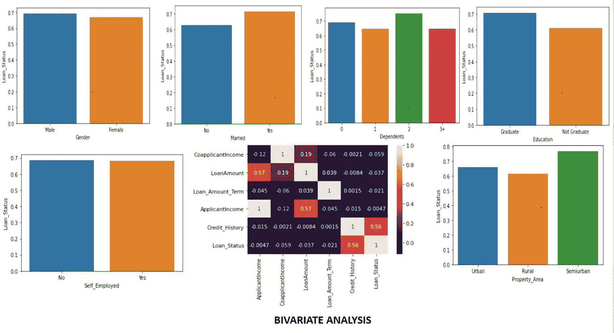
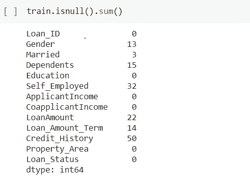
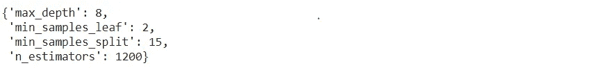
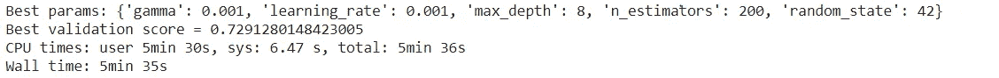

# 预测贷款批准状态—分析 Vidhya 的练习题

> 原文：<https://medium.com/mlearning-ai/predicting-loan-approval-status-practice-problem-on-analytics-vidhya-e15ae8b6b0d2?source=collection_archive---------1----------------------->

Photo by [Alexander Schimmeck](https://unsplash.com/@alschim?utm_source=medium&utm_medium=referral) on [Unsplash](https://unsplash.com?utm_source=medium&utm_medium=referral)

本文讨论了一种通过利用基础数据科学和机器学习技术来预测银行贷款批准状态的方法。这个问题是由 Analytics Vidhya 在他们的黑客马拉松部分作为一个实践挑战主持的。挑战的链接是—[https://data hack . analyticsvidhya . com/contest/practice-problem-loan-prediction-iii/](https://datahack.analyticsvidhya.com/contest/practice-problem-loan-prediction-iii/)

我解决这个问题的方法获得了 0.791 的准确率，并在公开排行榜上获得了 68K+中的 880 分。该问题主要是一个经典的二元分类问题，涵盖了正确有效地建模任何机器学习模型所需的许多重要步骤和过程。

**第一步:数据加载和可视化**

第一步也是最重要的一步是导入必要的库和包，并将数据集作为 pandas dataframe 加载。该平台分别提供训练和测试数据集。因此，我们加载两个数据集以供进一步分析。

通常建议保留原始数据集的副本作为必要的恢复措施，因为数据集的错误处理会给未来的调查造成混乱。

**第二步:可视化和变量分析——理解数据**

现有变量的可视化和有效调查是任何成功的数据分析项目的关键措施。给定数据集，特定申请人的贷款 ID 有 12 个特征。每个功能的描述如下:

1.  *贷款 ID —* 申请贷款的申请人的贷款 ID
2.  *性别—* 申请人的性别
3.  *已婚—* 申请人的婚姻状况
4.  *家属—* 申请人家属人数
5.  *教育* —申请人的教育状况(研究生/本科生)
6.  *自雇—* 申请人是否自雇
7.  *申请人收入—* 申请人的收入
8.  *共同申请人收入—* 共同申请人的收入
9.  *贷款金额—* 贷款金额，以千为单位
10.  *贷款 _ 金额 _ 期限—贷款期限(月)*
11.  *信用记录* —申请人以前的信用记录会议指南
12.  *物业区域—* 城市、半城市或农村地区
13.  *贷款 _ 状态—* 贷款审批状态(目标变量)

Train dataset

取值为 Yes(Y)/No(N)的二元变量 Loan_Status 用作需要利用测试数据预测的目标变量。

如下所示，使用目标变量对特征进行可视化，以从数据中获得单变量和双变量分析的正确推断。可视化的 python 源代码清楚地包含在我的 Github 存储库中，其链接在最后提供。

Visualizations carried out using Matplotlib and Seaborn

*从上述分析中得出的推论是:*

1.  大多数贷款申请人在银行都有良好的信用记录。
2.  从图中可以清楚地看到，申请人的收入不是正态分布的，存在相当数量的异常值和异常值。
3.  然而，贷款金额数字描述了贷款金额的密度在某种程度上是正态分布的，尽管如此，它仍然带有需要适当注意的异常值。
4.  银行在批准贷款时不存在基于性别的重大偏见。
5.  已婚人士和有两个受抚养人的人有很大的机会获得贷款批准。
6.  显而易见，银行在提供贷款时更倾向于毕业生，然而，对于个体经营者来说却没有这种优惠。
7.  与城市和农村居民相比，居住在半城市地区的人更倾向于吸引银行提供贷款。
8.  相关矩阵陈述了一个非常明显的事实，即贷款批准状态与人们过去的信用历史密切相关。

**第三步:数据预处理和特征工程**

人们常说，几乎 80–90%的工作应该投入到数据预处理和特征工程中，以创建一个近乎完美的数据科学和机器学习模型。尽管我在数据预处理方面投入了相当多的时间，但我非常确定可能会有更好的结果。

最初，我们在数据集中检查 null 或 NaN 的出现。我们同时对训练集和测试集进行预处理，以优化进一步的实现。

*   用 Y: 1 和 N: 0 映射目标变量。

*   使用 mode 填充已婚和性别列的空值。

*   *家属*:如果贷款状态为‘1’，家属= 2，否则为 1。对于测试数据，如果 Credit_History = 1，dependent = 2，否则为 1。

*   *Credit_History* :如果贷款状态为‘1’，则 Credit_History = 1，否则为 0。对于测试数据，用模式输入是一个很好的选择。

*   *个体户*:如果信用历史为‘1’，则输入个体户=否

*   *Loan_Amount_Term，LoanAmount* :用分组的其他列(性别、已婚、教育、自雇、受抚养人)的中值输入特征‘null’。

*   引入新功能*Total _ Income = applicant Income+co applicant Income*作为优化功能重要性的功能工程措施。

*   正如从可视化中得出的推论所观察到的，对于 *Total_Amount 和 LoanAmount* 的异常值处理，我们使用对数转换方法。由于这些异常值，大部分数据在左边，有一个长的右尾巴。这被称为右偏度，对数变换是去除异常值的好方法。对数转换不会影响较小的实例，而是减少较大的值以获得正态分布。

*   一个热门的分类变量编码*‘性别’、‘已婚’、‘自雇’、‘教育’。*

*   通过与相关值的映射对遗漏的特征进行标签编码。

*   删除建模过程中不需要的列条目。

**注-** 我采用的这些插补技术是基于我的假设，并牢记影响批准状态的必要因素(即目标变量)。可能有许多其他可能的技术。尽管如此，这些预处理步骤被证明是卓有成效的，使我的模型获得了不错的准确度。

**第三步:建模和结果**

为了对目标变量进行有效的分类，我采用了两种有效的算法:随机森林分类器和 X-treme 梯度推进。这两个模型都用相关数据拟合，其中模型的先验超参数调整使用分类所需的优化参数的网格搜索交叉验证。

第一步是将训练数据集按 80:20 的比例分成训练集和验证集。验证集对于分析完全看不见的数据的结果非常重要。

随机森林在验证集上给出了-77.23%的准确率。

GridSearchCV finds optimal parameters from the given set of parameter ranges

Optimal parameters achieved on hyperparameter tuning

XGBoost 在验证集上给出了-78.86%的准确率。

Optimal Parameters

Fitting the model by creating a pipeline of XGBoost

最终提交的应用了 Vidhya 提供的分析测试数据的训练模型，获得了相当不错的准确度分数— 79.166 %，在公共排行榜上获得了 880 的令人满意的位置。

用 python 写的完整源代码的 github repo—[https://github.com/poddaraayush14/Loan_Prediction_Challenge](https://github.com/poddaraayush14/Loan_Prediction_Challenge)

**步骤 4:结论**

在这个基本的分类问题中，基于树的算法如随机森林分类和梯度推进算法如 XGBoost。可能有更多的算法可以提供更有效的结果。集成学习、深度学习和神经网络可以成为未来与这项工作相关的工作的基础。我已经限制了分析的范围，以获得一个像样的公平的结果。机器学习和数据科学是一个巨大的机会海洋，可以尝试和赌博各种技术和过程。

***快乐学习！！！***