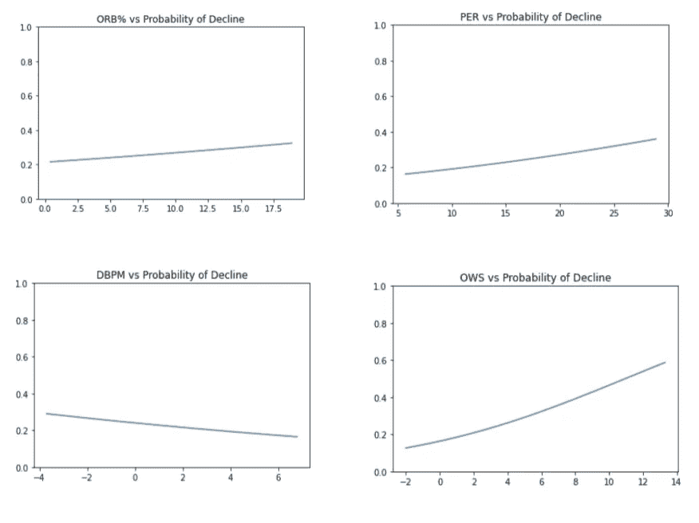
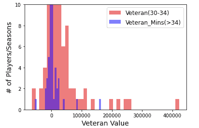
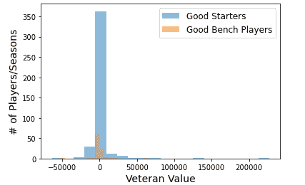
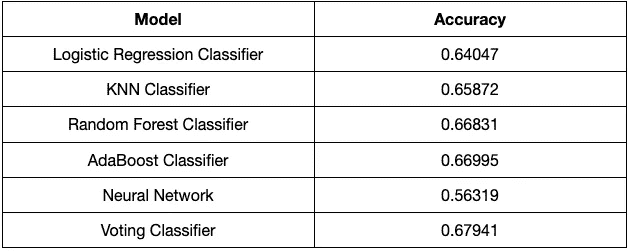

# 预测 NBA 老兵 2021-2022 赛季的价值

> 原文：<https://medium.com/mlearning-ai/predicting-nba-veterans-value-for-the-2021-2022-season-69cca44e0751?source=collection_archive---------5----------------------->

Photo by [Markus Spiske](https://unsplash.com/@markusspiske?utm_source=medium&utm_medium=referral) on [Unsplash](https://unsplash.com?utm_source=medium&utm_medium=referral)

老将的资产对于帮助年轻球员增加血统和将球队变成竞争者是非常重要的。与此同时，根据他们在职业生涯中获得的荣誉以及他们对胜利的影响程度，退伍军人也有很大的不同。因此，这个项目不仅仅是预测老将的价值，而且还将 NBA 老将归类为高水平的替补球员、首发球员、明星或超级明星。该模型将应用自 1996 年以来每个赛季的各种球员评估指标，当时高级统计数据开始真正用于评估球员的表现。然后，该模型将使用老兵价值指标预测 2021-2022 赛季球员的下降或提高。

虽然统计数据肯定可以描绘出一个球员对其特定球队有多大影响的故事，但鉴于名册结构的差异，很难在相同的基础上评估所有球员。此外，该模型没有考虑到新规则的变化，这些变化阻碍了某些球员的罚球命中率。然而，这个项目可以帮助证明，为什么一个预测会比上一个赛季显著提高的球员可能是球队今年甚至明年在自由球员市场的一个很好的选择。此外，这种模式可以帮助幻想爱好者锁定可能在本赛季表现出色的潜伏者。

用于训练模型的大部分数据来自 1950 年至 2017 年的球员统计数据。虽然该数据有许多基本的统计数据，但大多数高级统计数据都被忽略了，因为大多数高级统计数据直到 20 世纪 90 年代末才进行计算。除了球员统计和高级球员统计，我还分别收集了球队净评分数据(TmNetRtg)和球员名单连续性。这两个统计数据在评估球员时都很重要，因为虽然这是个人评估，但篮球是一项团队运动，因此需要将背景加入到球员表现中。高级统计和球队统计来自篮球参考和 NBA 官方网站。完整的 csv 数据可以在 model_data.csv 下提供的 github 链接中找到。

这涉及到大量的数据清理工作。由于 TmNetRtg 数据只跟踪 1996–1997 年的数据，所以我丢弃了该季度之前的数据。我还必须对伤病缠身的赛季、NBA 停摆的赛季以及明显的老球员施加限制。我把老将定义为 30 岁以上的球员，有一个赛季最少比赛和上场时间的门槛。为了将 TmNetRtg 与球员匹配，我不得不操纵某个赛季交易的球员，不包括“TOT ”, TOT 添加了一名球员在一个赛季中效力的两支球队的统计数据。相反，我选择了球员在那个赛季参加比赛最多的球队。

在原始数据集中，玩家投资组合包含许多不同的统计数据，包括 FT、FG%、AST、RBD 等。统计数据的问题是它们不能提供玩家表现的背景。低于 0.500 的球队中最好的球员可以在低效率下打出疯狂的数据，这意味着更少的胜利。出于这个原因，高级统计是一个更好的衡量球员影响力的方法，因为它看的是得分，助攻，篮板的比率，而不是简单的统计总数。在决定了基线特性之后，我使用热图来评估特性选项之间的相关性。高度相关的特性会扭曲模型的性能，因此我们需要一组包含攻击性和防御性影响的特性。以下是做出选择之前的原始功能选项集。

高度相关的要素用红色标记，其值表示要素的相关程度。相关性高于 0.85 的特征是显著的。DRB 百分比(防守篮板百分比)与 TRB 百分比高度相关，所以更有意义的是分别包括 DRB 百分比和篮板球百分比，而忽略总的统计数据，因为我们想独立评估进攻和防守的影响。因为我们有 OWS 和 DWS，所以包括 WS 是没有意义的，因为这只是另外两个功能的总和，BPM 也是如此。VORP 是一个高度关注进攻球员创造和每百次控球得分的统计数据，这就是为什么它与 OWS 高度相关。FG%与 eFG%高度相关，因为我们有 2P%和 3P%,所以我们不需要 FG%。

剩下的主要问题是对照 OWS 和 WS/48 评估 WS。胜利份额代表了一个玩家对一个团队的胜利有多大影响，这是基于与团队评估相比的各种个人统计数据。虽然这些功能高度相关，但 Win Shares 将用于我们的资深价值指标，拥有 WS/48 和 OWS 仍然很重要，因为这两个功能都将被纳入模型，因此放弃其中任何一个功能都没有意义。最后一个问题是评估 TS%(真实命中率%)和 eFG%(有效投篮命中率%)。

真正的投篮因素在罚球的尝试和制造，所以这是一个更可靠的统计在决定效率作为一个得分手。如果你尝试了很多罚球，这将提高你的总命中率。eFG%主要是关于你投了多少，它对三分球有影响。如果一个球员是一个高命中率的射手，他的三分球和两分球一样多，他的投篮命中率会很高。为了评估老兵，高容量投篮不像高效得分手那样令人担忧，因为老兵通常比他们在“黄金”时期获得更少的投篮机会。因此，eFG%将从功能选项中删除。

目标老将价值指标的目的是评估一名球员与上一赛季相比将会提高或下降多少。因此，退伍军人的价值涉及两个不同的因素。首先是玩家在当前赛季和下一个赛季的获胜份额的变化。下一个因素是当前赛季和下一个赛季的团队净评级的变化。虽然获胜份额考虑了玩家影响获胜的能力，但是团队净评级考虑了团队的总体水平。这两个度量的组合被用来添加上下文，并分别衡量好的和坏的团队的改进。这个指标的实现在下面提供的 GitHub 链接中的回归分析笔记本中。

对每个特征执行简单的逻辑回归模型，以查看它对玩家在下一个赛季中下降的机会有多大影响。下跌被简单地视为老兵价值分数低于 0。一些主要结果如下所示。进攻获胜份额和 PER 对预测老将的下降有显著影响。这是有意义的，因为 win shares 是老将价值指标的主要部分，PER 封装了一个球员的许多基本进攻跟踪统计数据，这些数据被突出显示为该模型的单独特征。一个积极的防守框正负意味着一个球员的下降概率更低，这很有趣，因为与防守统计相比，更高的进攻表现更有可能导致下降。

有几个假设值得一看。第一个是老兵价值在 35 岁及以上的老兵中的分布。重要的是要看到这些老将的分布基于年龄的差异，进而在身体上的里程数。数据显示，年龄较大的退伍军人不太可能出现大幅下滑或改善，因为他们通常已经过了全盛时期，他们的角色更加明确和有限。很少有球队会对一个 35 岁以上的人要求很多，除非你的名字是勒布朗·詹姆斯或者克里斯·保罗。

另一个要考虑的重要因素是玩家的角色对他们的老兵价值分类有多大影响。一个超级巨星被要求比一个典型的首发或替补球员做更多的事情。即使一个超级明星球员被预测会有显著的下降，也比一个板凳球员被预期会有很大的进步要好很多。当需要分析模型的结果时，对玩家进行这样的分类将有助于为不同组的玩家添加上下文。下图显示首发球员比替补球员有更大的老将价值分布。再一次，作为先发球员的角色越来越大，导致连续赛季之间的表现差异越来越大。

鉴于上述结果，显然有必要对球员进行分类。对球员进行启发式分类，将他们分为超级明星(3)、明星(2)、首发(1)和替补球员(0)。使用的指标包括每 48 分钟的获胜份额、每场比赛的上场时间和使用率。超级明星和明星都应该有至少 0.15 的 WS/48，并且每场比赛至少打 30 分钟。这些值是基于测量和评估的历史玩家数据来估计的。巨星和明星的主要区别在于，巨星的使用率应该比明星高，但产出应该差不多。一个首发应该有一个较低的赢份额，同时每场比赛至少打 25 分钟。分类值被应用于每个玩家，并作为一个称为“玩家级别”的特征添加。

在选择模型之前，应用一些基本原则来提高模型性能是很重要的。移除异常值是改进预测的第一步。上下界老兵值设置为(-30000，30000)。从最初的总共 821 个数据点中删除了大约 44 个数据点，产生了用于训练该模型的 777 个玩家的最终集合。使用分类模型时，模型的性能通常会更好。因此，需要将老兵价值度量转换为不同的类，以将回归转换为分类问题。在测试了不同的班级规模后，我决定使用 5 个班级，根据百分比阈值平均分配。这 5 个等级的值范围为[0，4]，其中 0 代表与上一年相比显著下降，1 代表下降幅度较小，2 代表与前几年基本相同，3 代表略有改善，4 代表与上一年相比显著改善。

测试了六种型号，看哪种性能最好。使用的模型是逻辑回归分类器、KNN 分类器、随机森林分类器、AdaBoost 分类器、神经网络和投票分类器。最初，交叉验证使用 10 倍，看看哪个模型表现最好。在每个模型上应用大量折叠的原因是为了测试性能中是否存在高可变性，并收集更多的指标来更好地评估模型。使用 10 个折叠意味着数据将被分成 10 个部分，并被测试 10 次，每个部分代表每个单独模型中的测试数据集。在对每个模型进行交叉验证后，随机森林分类器表现最佳。然后，使用 90–10 的训练对数据集训练模型进行验证。我们发现这种分割在曲线下面积方面表现最佳。AUC 越高，模型在区分正类和负类方面的性能越好。

投票分类器表现最好。投票分类器在其他五个模型上进行训练，并基于其选择类别的最高概率预测老兵价值类别作为输出。该模型使用软投票，这意味着输出类别是基于该类别的平均概率的预测。该模型对 1997 年至 2020 年 NBA 赛季的一组球员进行训练，并预测 2021 年至 2022 年 NBA 老兵类别的 VV 类别。

**注意**:关于这个模型的实现以及模型试探法计算的更多信息，请访问下面的 GitHub 链接。请继续关注后续文章，分析一些球员对本赛季的预测。如果你想联系或合作一个项目，也可以看看我的 LinkedIn。

 [## GitHub-gauravmohan 1/NBA-老兵 _ 分析

### 这个项目的目标是帮助前线办公室评估退伍军人时，加入他们的花名册，以支持冠军…

github.com](https://github.com/GauravMohan1/NBA-Veteran_Analysis)  [## 加州大学欧文分校唐纳德·布伦信息和通信学院本科生研究助理

### 你好！我是 UCI 大学商业/计算机科学专业四年级新生。我有创建功能的经验…

www.linkedin.com](https://www.linkedin.com/in/gaurav-mohan/)  [## Mlearning.ai 提交建议

### 如何成为 Mlearning.ai 上的作家

medium.com](/mlearning-ai/mlearning-ai-submission-suggestions-b51e2b130bfb)