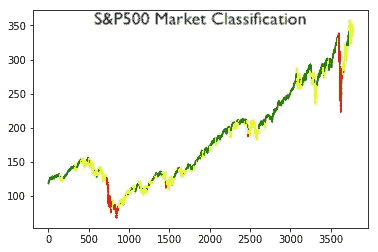

# 用 Python 预测 S&P500 波动率对市场进行分类

> 原文：<https://medium.com/mlearning-ai/predicting-s-p500-volatility-to-classify-the-market-in-python-9431f7a56ffa?source=collection_archive---------0----------------------->

我将对 S&P500 的波动性进行建模，将市场分为三个不同的部分，以增强算法交易策略。

S&P500 Market Classification

> 利用市场细分创造更有利可图的算法交易策略

主要的想法是根据模拟的波动率将 S&P500 分为三个部分，并使用…