# 预测商店销售额-随机森林回归

> 原文：<https://medium.com/mlearning-ai/predicting-store-sales-random-forest-regression-b77abec64c17?source=collection_archive---------2----------------------->


在任何业务中，销售都是推动收入和利润的最重要因素之一。因此，这也是为什么现在的公司都在头脑风暴如何增加总销售额的原因。

尤其是在基于 web/app 的公司中，每天都会生成数据。公司希望将这些数据转化为可操作的见解，以提高销售额。

在本文的其余部分，我将概述一些关于公司如何生成自己的预测模型的基本方法。

使用的数据集可以从这个[链接](https://www.kaggle.com/c/competitive-data-science-predict-future-sales/data)下载，它有几个 shop_id 和 item_id，每天销售的总商品和商品价格不同。该数据集的主要目标是确定下个月销售了多少商品。

# 未来销售预测模型

概述:开发一个 ML 模型，用于预测多个商店和项目的未来总项目

目标:
1。从给定的数据集
2 中分析并生成洞察。确定预测模型
3。测量模型精度
4。生成预测结果

文件描述:
1。sales _ train.csv 训练集。2013 年 1 月至 2015 年 10 月的每日历史数据。
2。test.csv —测试集。你需要预测这些商店和产品在 2015 年 11 月的销售额。
3。items.csv 关于物品/产品的补充信息。
4。item _ categories.csv 关于项目类别的补充信息。
5。关于商店的补充信息。

数据字段:
1。ID —表示测试集
2 中的(商店，商品)元组的 ID。shop_id —商店的唯一标识符
3。item_id —产品的唯一标识符
4。item_category_id —项目类别的唯一标识符
5。item_cnt_day —售出的产品数量。你在预测这项措施的每月金额
6。item _ price——物品的当前价格
7。日期—格式为 dd/mm/yyyy
8 的日期。date _ block _ num 为方便起见而使用的连续月份数。2013 年 1 月是 0，2013 年 2 月是 1，…，2015 年 10 月是 33
9。item_name —项目的名称
10。商店名称—商店名称
11。项目类别名称—项目类别的名称

# 指导方针

在本文中，以下是我们模型开发的步骤。数据准备、清理和操作
2。探索性数据分析
3。特征工程、模型开发和评估
4。生成预测结果

# 1.数据准备、清理和操作

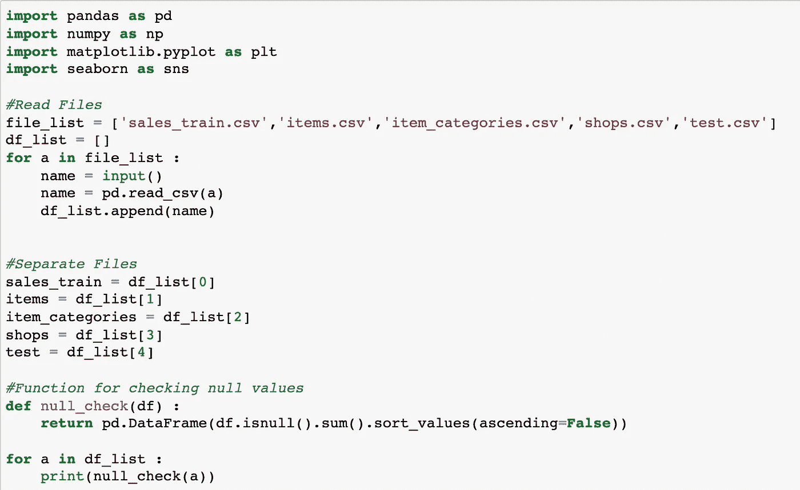

以上是加载文件并检查数据集中是否有空值。

加载数据集后，我们根据每个唯一的 id 合并数据，并删除重复的数据。

```
#Creating final df for training model and submissiontrain_final = sales_train.merge(items, on = 'item_id', how = 'left').merge(item_categories, on = 'item_category_id', how = 'left').merge(shops, on = 'shop_id', how = 'left')
test_final = test.merge(items, on = 'item_id', how = 'left').merge(item_categories, on = 'item_category_id', how = 'left').merge(shops, on = 'shop_id', how = 'left') #Check duplicates in dataset and remove if any
print('Total Rows Before Removing Duplicate : ', train_final.shape[0])print('Total Duplicate Rows : ',train_final.duplicated().sum())train_final = train_final[~train_final.duplicated()]
print('Total Rows After Removing Duplicate : ',train_final.shape[0])
```

以下是上述代码的打印结果:

*   删除重复项之前的总行数:2935849
*   重复行总数:6
*   删除重复项后的总行数:2935843

在我们的合并数据集中只有 6 个重复的行，保留这些数据实际上是没问题的，因为它对我们的模型训练没有太大影响。

```
#Changing date format and add additional columnstrain_final['date'] = pd.to_datetime(train_final['date']).dt.datetrain_final['sales'] = train_final['item_price']*train_final['item_cnt_day']
train_final['year'] = pd.DatetimeIndex(train_final['date']).year
train_final['month'] = pd.DatetimeIndex(train_final['date']).month
```

因为我们希望根据年和月来训练我们的模型，所以我们创建了“年”和“月”列，以便稍后进行分组。

接下来，为了减少数据集中的任何噪声，我们将从数据中移除异常值。

```
#Printing Values for each percentilefor a in range(0,101,10) :
    print(f'{a}th percentile value for item_cnt_day is {np.percentile(train_final["item_cnt_day"],a)}')for a in range(0,101,10) :
    print(f'{a}th percentile value for item_price is {np.percentile(final["item_price"],a)}')
```

上述每个循环的结果:

1.  项目天数:

```
0th percentile value for item_cnt_day is -22.0
10th percentile value for item_cnt_day is 1.0
20th percentile value for item_cnt_day is 1.0
30th percentile value for item_cnt_day is 1.0
40th percentile value for item_cnt_day is 1.0
50th percentile value for item_cnt_day is 1.0
60th percentile value for item_cnt_day is 1.0
70th percentile value for item_cnt_day is 1.0
80th percentile value for item_cnt_day is 1.0
90th percentile value for item_cnt_day is 2.0
100th percentile value for item_cnt_day is 2169.0
```

2.项目 _ 价格:

```
0th percentile value for item_price is -1.0
10th percentile value for item_price is 149.0
20th percentile value for item_price is 199.0
30th percentile value for item_price is 299.0
40th percentile value for item_price is 349.0
50th percentile value for item_price is 399.0
60th percentile value for item_price is 573.96
70th percentile value for item_price is 799.0
80th percentile value for item_price is 1190.0
90th percentile value for item_price is 1999.0
100th percentile value for item_price is 307980.0
```

根据上面的结果，应该根据 item_cnt_day 筛选低于 90%和高于 0%的数据。然后，我们将使用 item_price 列进行筛选(> 0%值且≤90%值)。

```
#Removing Outliersfinal = train_final[(train_final[‘item_cnt_day’]>0)&(train_final[‘item_cnt_day’] < train_final[‘item_cnt_day’].quantile(0.96))]final = final[(final['item_price'] > 0)&(final['item_price']<final['item_price'].quantile(0.92))]
```

在移除重复值、异常值和检查空值之后，数据应该可以进行探索和训练了。

# 2.探索性数据分析

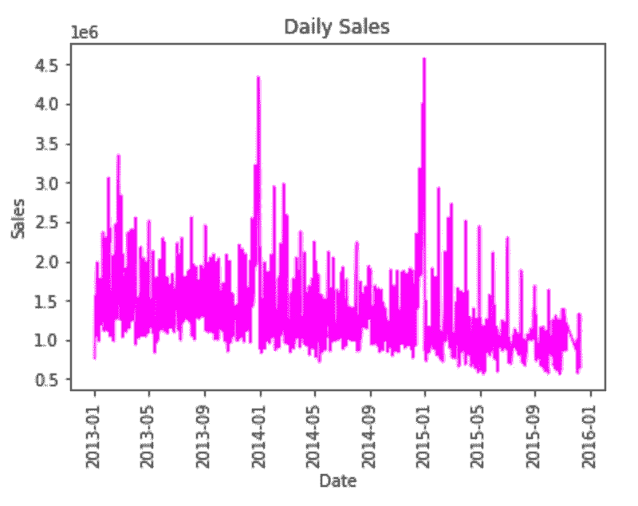

从日常角度来看，销售额连续 3 年呈横向增长，在 2013 年底和 2014 年出现大幅增长。由于我们已经删除了上一步中的异常值，数据显示出了更好的一致性(噪音和波动性更小)。

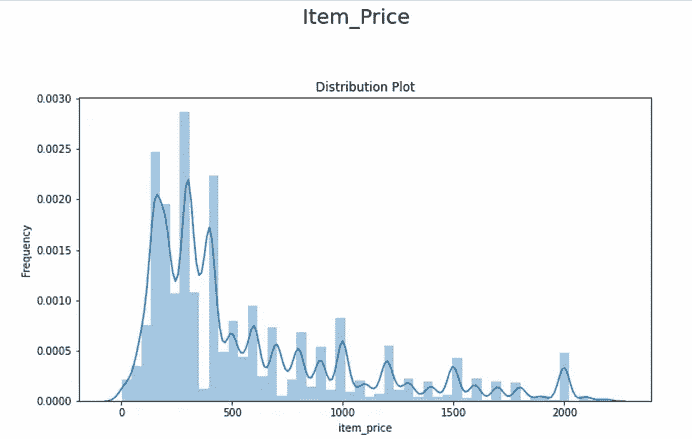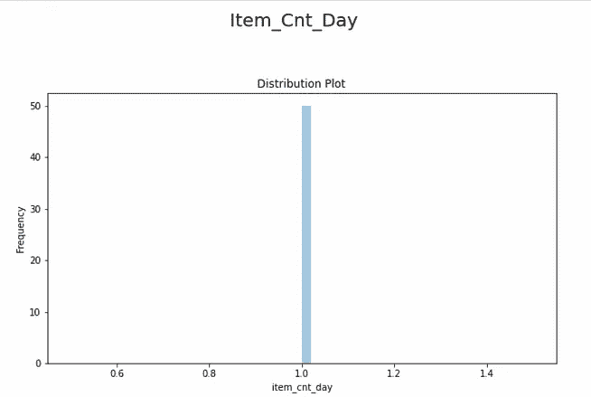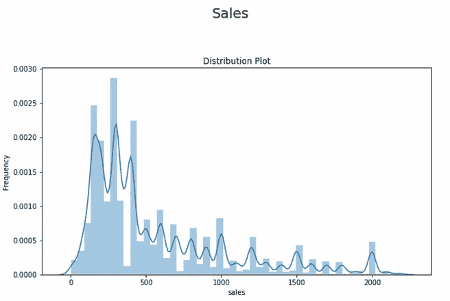

Distribution Plot

分布图表示 Item_Price 和 Sales 的右偏度(其中大多数值低于 500)。而另一方面，如图所示，Item_Cnt_Day 列的值为 1。

让我们列出数据集中排名前 10 的商店和商品。

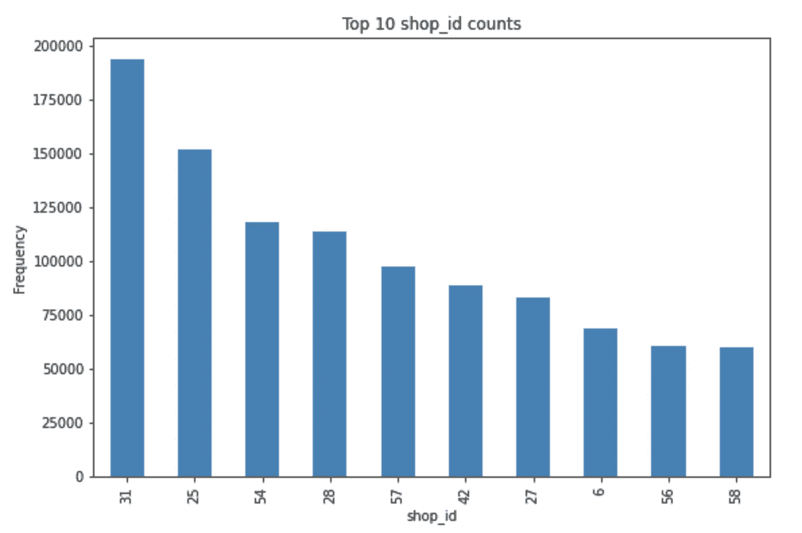

根据数据中排名前 10 位的商店和商品，可以得出这样的结论:即使是表现最好的商店，在商品总销售额方面也普遍表现不佳。前 1 名和前 10 名之间的总销售额差距很大，大约有 60%的差距。

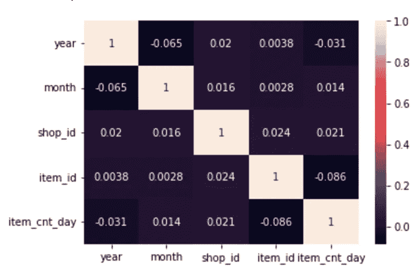

Correlation Heat Map

显然，上述特征与每天售出的商品总量没有直接关系。因此，可能存在与此高度相关的其他因素，但由于提供的数据有限，因此实际上最好找到其他数据源，以发现这些商店和项目中销售的项目的原因。

# 3.特征工程、模型开发和评估

因为我们上面的数据集显示了特征和目标变量之间的低(负)相关性。我们将使用随机森林回归来训练我们的模型。

以下是我决定使用随机森林的原因:

*   有利于避免过度拟合
*   非常适合实验(灵活的参数调整)
*   处理好线性和非线性的关系
*   受离群值影响较小(或不受离群值影响)

但是使用这种算法也有几个缺点:

*   计算成本高(尤其是数据集很大时)
*   很难解释这个模型
*   很少控制模型在幕后做什么(这就是为什么它首先被称为随机的)

因此，在训练模型之前，让我们先将数据集分为要素和标注。

```
#Selecting shop_id and item_id that exist in test datasettest_shop_ids = test['shop_id'].unique()
test_item_ids = test['item_id'].unique()monthly_item_cnt = monthly_item_cnt[monthly_item_cnt['shop_id'].isin(test_shop_ids)]
monthly_item_cnt = monthly_item_cnt[monthly_item_cnt['item_id'].isin(test_item_ids)]#Import Model and Metricsfrom sklearn.ensemble import RandomForestRegressor
from sklearn.model_selection import train_test_split, GridSearchCV, RandomizedSearchCV
from sklearn.metrics import mean_squared_error, r2_score
from numpy import mean, std
from pprint import pprintX,y = monthly_item_cnt[['year','month','shop_id','item_id']], monthly_item_cnt['item_cnt_day']
X_train, X_test, y_train, y_test = train_test_split(X,y, test_size = 0.25, random_state = 42)random_rf = RandomForestRegressor(random_state = 42)
pprint(random_rf.get_params())
```

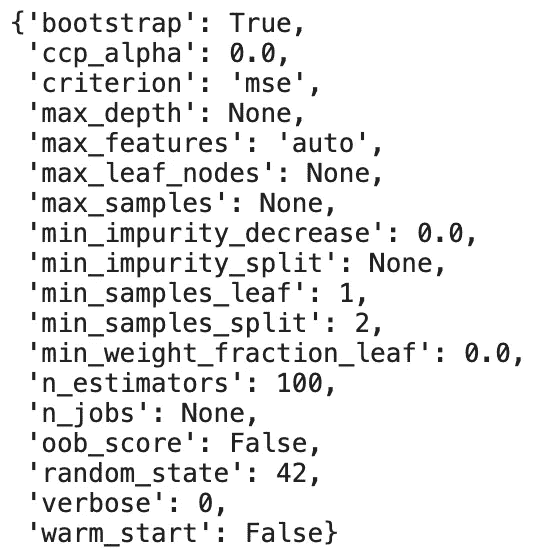

Random Forest Parameters

接下来，我们可以开始调整模型的参数。

```
bootstrap = [True, False]
n_estimators = [int(x) for x in np.linspace(start=200,stop=2000, num = 10)]
max_depth = [int(x) for x in np.linspace(start=10, stop = 110, num = 11)]
max_depth.append(None)
max_features = ['auto','sqrt']
min_samples_split = [2,5,10]
min_samples_leaf = [1,2,4]random_grid = {
    'bootstrap' : bootstrap,
    'n_estimators' : n_estimators,
    'max_depth' : max_depth,
    'max_features' : max_features,
    'min_samples_split' : min_samples_split,
    'min_samples_leaf' : min_samples_leaf
}pprint(random_grid)
```

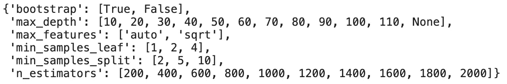

Parameters for Training

既然一切都已经设置好了，现在我们准备训练我们的模型。

```
rf_random = RandomizedSearchCV(estimator = random_rf, param_distributions = random_grid,
                               cv = 3, n_jobs = -1, random_state = 42, n_iter = 3, scoring='neg_mean_absolute_error',
                               verbose = 2, return_train_score = True)rf_random.fit(X_train,y_train)
```

正如你们从上面可以看到的，n_iter 设置为 3，CV 设置为 3，这意味着模型将使用上面参数的随机组合训练(或拟合)9 次。

为了获得最好的结果，应该进行更多的训练，但是由于当我设置 n_iter 大于 10 时，我的笔记本电脑在完成之前就关机了，所以我不得不将其缩小到 3(即使这样也几乎失败)。

训练完成后，我们可以使用我们拆分的测试数据集来评估模型。

```
def evaluate(model, X_test, y_test) :
    prediction = model.predict(X_test)
    error = abs(prediction - y_test)
    mape = 100 * np.mean(error/y_test)
    accuracy = 100 - mape
    print('Model Performance')
    print('Average Error: {:0.4f} degrees.'.format(np.mean(error)))
    print('Accuracy = {:0.2f}%.'.format(accuracy))

    return accuracyrandom_model = rf_random.best_estimator_
evaluate(random_model, X_test, y_test)
```

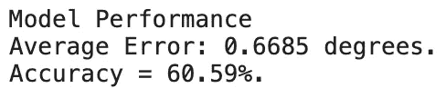

该模型显示了 60%的准确性，老实说，这实际上不是很大，但由于我不得不等待 1 个多小时来训练这个模型，我决定在这一点上停止。

但是对于那些可能拥有超过 32GB 内存的人，我鼓励你们通过调整参数和在模型上设置更多迭代来对模型进行实验。因为，使用随机森林的好处是，我们可以通过设置正确的参数来提高其准确性(这只能通过更多的试错来实现)。

# 4.生成预测结果

在最后一部分，我们将使用上面的测试数据，通过上面的训练模型来预测结果。

```
#Generate item_cnt_month result using above modeltest_df = test.copy()
test_df['year'] = '2015'
test_df['month'] = '11'result_rf = random_model.predict(test_df[['year','month','shop_id','item_id']])
result_rf_df = pd.DataFrame(result_rf)final_result = pd.merge(test_df, result_rf_df, left_index=True, right_index=True)
final_result = final_result.rename(columns={0:'item_cnt_month'})
final_result = final_result[['ID','item_cnt_month']]
final_result.shape
```

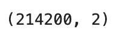

这就是它的结尾，如果您在 submission 选项卡上浏览 Kaggle 网站，您会看到预期的提交应该是 214200 行，有两列(ID 和 item_cnt_month)。

我希望这篇文章对使用 Random Forest 开发预测模型有所帮助。

感谢您阅读此内容，请在下面给我留言，或者您可以通过我的社交媒体资料(或电子邮件)联系我！

## 参考

[](https://github.com/WillKoehrsen/Machine-Learning-Projects/blob/master/random_forest_explained/Improving%20Random%20Forest%20Part%202.ipynb) [## 机器学习项目/改进随机森林第 2 部分。

### 机器学习实验和工作。有助于 WillKoehrsen/机器学习项目的发展，通过创造一个…

github.com](https://github.com/WillKoehrsen/Machine-Learning-Projects/blob/master/random_forest_explained/Improving%20Random%20Forest%20Part%202.ipynb) [](https://www.kaggle.com/c/competitive-data-science-predict-future-sales/data) [## 预测未来销售

### Coursera 课程“如何赢得数据科学竞赛”的期末项目

www.kaggle.com](https://www.kaggle.com/c/competitive-data-science-predict-future-sales/data) [](https://medium.datadriveninvestor.com/random-forest-pros-and-cons-c1c42fb64f04) [## 随机森林:利弊

### 随机森林是一种监督学习算法。它用决策树的集合构建了一个森林。这是一个简单的…

medium.datadriveninvestor.com](https://medium.datadriveninvestor.com/random-forest-pros-and-cons-c1c42fb64f04) [](/mlearning-ai/mlearning-ai-submission-suggestions-b51e2b130bfb) [## Mlearning.ai 提交建议

### 如何成为 Mlearning.ai 上的作家

medium.com](/mlearning-ai/mlearning-ai-submission-suggestions-b51e2b130bfb)