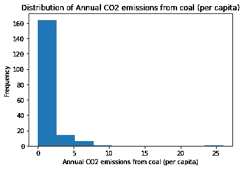
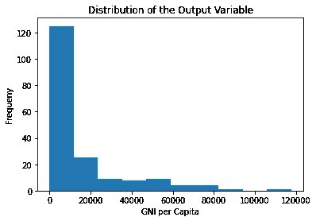
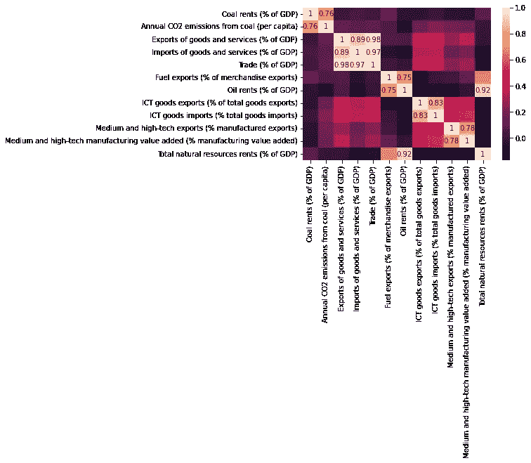
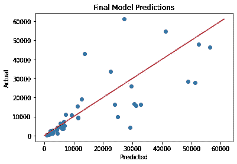
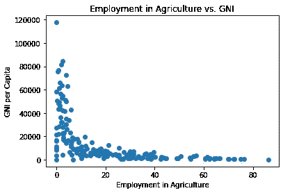

# 预测各国的收入水平

> 原文：<https://medium.com/mlearning-ai/predicting-the-income-level-of-countries-a829e43459c?source=collection_archive---------4----------------------->

在写了我过去关于自动机器学习的大部分博客后，我决定将这篇文章献给一个实际的机器学习任务。

这项任务的目标是找出一个国家收入水平的预测属性，因此，试图根据某些属性预测一个国家的收入水平。

原始源代码可以在[1]中找到。

# 数据选择

开始时，我们必须决定任务要考虑的属性，并找到数据源来为我们提供相关数据。在这里，重要的是要注意可能是低收入国家造成的属性，而不是有助于解释收入水平的属性(例如，保健支出低很可能是低收入国家造成的)。

因此，我们决定采用进出口、自然资源、CO₂排放量和工作部门及其对国内生产总值的贡献的数据。

此外，我们在选择适当的年份时遇到了一些困难。由于当时并非所有 2021 年的数据都可用，2020 年的数据由 COVID 主导，这就是为什么数据中可能存在一些异常，我们决定使用 2019 年的数据。

可以从世界银行[2]和我们的世界数据库[3]中下载所有的数据。

# 数据预处理

数据预处理包括加载数据和检查丢失的数据值。如果某个值缺失，我们使用 pandas 的插值函数来使用前几年的值进行插值。

两个数据源都包括国家名称和国家代码(三位数代码)。我们使用 dataprep 库[4]标准化国家名称。之后，使用这些属性合并数据集就很容易了。

合并后，数据框架由 42 个属性组成。此外，我们决定删除非 Nan 值少于 20 的行。剩余的 NaN 值用零填充。

# 数据探索

在对数据进行预处理之后，我们查看了各自的属性值，并检查了异常值和根本没有意义的值。因此，我们为每个属性绘制了箱线图，并进一步检查了大于 *Q3 + 1.5*IQR* 的数据点。

我们反复核对了高得令人难以置信的数值，并得出结论，大多数数值似乎都有道理(例如，中国的出口比率比其他国家高得多)。

我们继续观察变量的分布，发现它们中的许多是非常偏斜的(见下面的例子)。



Distribution of Annual CO2 Emissions from Coal

接下来，我们研究了产出变量(GNI——国民总收入——人均),它也非常不准确。我们在现阶段已经计算出，对于高国民总收入值，预测很可能不准确，因为数据点很少。下图显示了分布情况。



Distribution of GNI Per Capita

此外，我们检查了相关性，并在热图中绘制了相关系数大于 0.75 的相关性。这导致我们删除了另外两个属性，因为相关性太高，它们不会提供更多的信息。



Correlation Plot

# 机器学习

在探索数据之后，我们尝试使用线性回归来预测一个国家的 GNI 值。不幸的是，数据似乎不是线性可分的，预测值极端地为-80 000。

因此，我们决定实施 5 重交叉验证，并比较随机森林回归、支持向量回归、Lasso 回归和 K-NN 回归。此外，我们使用最小-最大-缩放器和标准-缩放器来缩放数据，以检查最佳缩放方法。

对于每个模型，我们运行网格搜索 CV 来考虑不同的超参数值并优化它们。根据模型(例如 K-NN)，超参数值可能会对特定数据集上的模型性能产生巨大影响。

随机森林回归导致最佳结果，下面提供了独立测试集上的最终模型和预测性能的概述。

```
Best Model: Random Forest Regressor
Final Hyper-Parameters: {'criterion': 'absolute_error', 'min_samples_leaf': 3, 'n_estimators': 75}
RMSE: 10473.221551759796
Explained Variance: 0.5597928858095078
Max Error: 34088.66666666667
Mean Absolute Error: 6195.449645390071
Median Absolute Error: 2092.533333333333
```

下图显示了最终预测。可以看出，对较低国民总收入值的预测相当准确，而对较高国民总收入值的残差相当大。

在查看模型的结果时，也可以观察到这一点。RMSE(对高残差的惩罚很大)非常高，最大误差和平均误差也是如此。尽管如此，中值误差还是相当低的。



Performance of the Final Model

# 特征重要性

由于该任务的一个主要目标是找出哪些属性可以预测 GNI 值，因此我们使用特征排列来计算特征重要性。

在特征置换中，给定属性的值被混洗(从输出变量解耦),并且计算关于预测误差的结果。如果错误率变化很大，该属性将产生很大的影响，并且对预测很重要，反之亦然。

我们提取了最终模型的三个最重要的特征，并将其值与人均国民总收入值进行了对比。可以看出，特别是农业就业和服务业就业值提供了一个国家国民总收入值的大量信息。要获得更全面的分析，我建议您参考[1]中的 GitHub 库。



Important Attibutes vs. GNI Per Capita

在特征重要性评估期间，我们发现，至少根据我们的数据集，工作部门和 CO₂排放量是最具预测性的，并且是与贸易(进口、出口)相关的主导变量。

尽管如此，我们相信，通过考虑更大和更多样化的数据集，可以做出更好的预测。然而，重要的是要考虑到哪些变量影响一个国家的收入水平，哪些变量是一个国家收入水平的直接结果，不要在数据中包含任何偏差。

[1][https://github.com/sabrinaherbst/income_level_country](https://github.com/sabrinaherbst/income_level_country)

[2]世界银行。世界发展指标。在 databank.worldbank.org 在线出版。检索自:[https://databank . world bank . org/source/world-development-indicators](https://databank.worldbank.org/source/world-development-indicators)。[在线资源]。

[3]汉娜·里奇和马克斯·罗瑟(2020)。CO₂和温室气体排放。在 OurWorldInData.org 在线出版。检索自:[https://ourworldindata . org/CO2-和-其他-温室气体-排放](https://ourworldindata.org/co2-and-other-greenhouse-gas-emissions)【在线资源】。

[https://pypi.org/project/dataprep/](https://pypi.org/project/dataprep/)

[](/mlearning-ai/mlearning-ai-submission-suggestions-b51e2b130bfb) [## Mlearning.ai 提交建议

### 如何成为 Mlearning.ai 上的作家

medium.com](/mlearning-ai/mlearning-ai-submission-suggestions-b51e2b130bfb)