# 预测母猪生下的小猪数量

> 原文：<https://medium.com/mlearning-ai/predicting-the-number-of-piglets-born-to-a-sow-6d6b43630772?source=collection_archive---------5----------------------->

## 我对在稀疏数据集中构建分类器的看法

这个副标题可能有点误导，我马上承认。并不是说我不打算向您展示如何构建一个分类器来预测一头母猪生下的小猪数量。不，我的意思是数据集实际上没有那么稀疏。这取决于你认为什么是稀疏。

这个项目在我之前工作的公司有点名气(所以我不能分享数据，因为它是商业数据)，因为它本来是数据科学和机器学习力量的路演。最后，它变成了一个路演，展示了一个特定的管理者对这个数据集可用性的信念是如何影响理智的批判性思维的。没有什么比相信更糟糕的了，因为你相信，当数据的早期一瞥向你显示它是多么的脆弱。

在这篇博文中，我将向你展示如何组合来自三个来源(饲料、体重、结果)的数据，以及当数据没有真正重叠时，这将变得多么困难。事实上，我将向你展示潜在的非常有用的信息是如何很快变得毫无用处的。

尽情享受吧！

```
rm(list = ls())library(readr)
library(dplyr)
library(ggplot2)
library(data.table)
library(caret)feed <- read_csv("nedap_feed_export_27_8_2019.csv")
weight <- read_csv("nedap_weights_export_27_8_2019.csv")
outcome <- read_csv("steentjes.csv")skimr::skim(feed)
skimr::skim(weight)
skimr::skim(outcome)
```

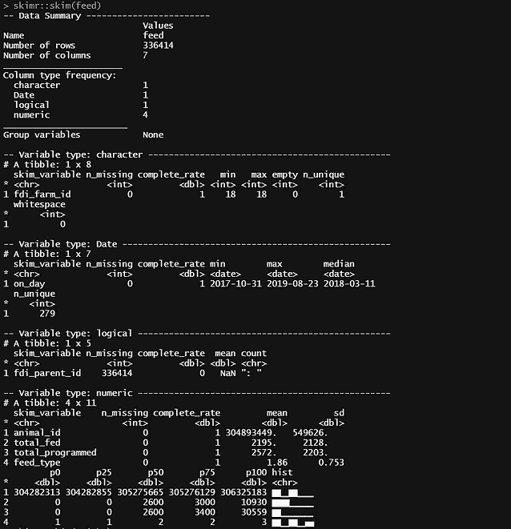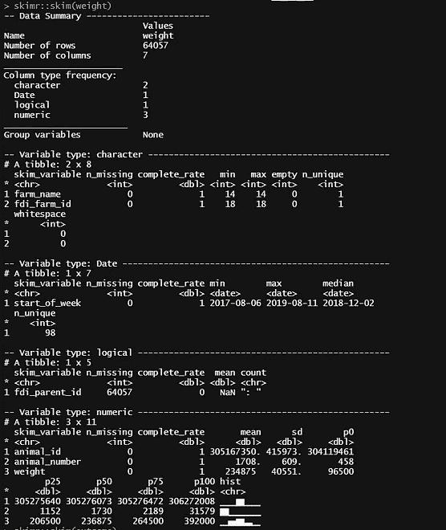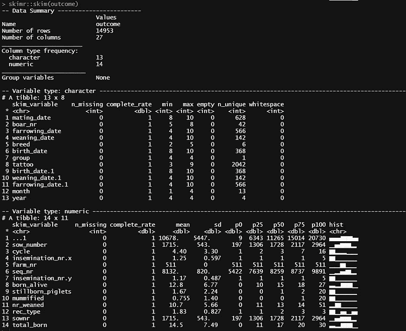

Plenty of rows of data.

```
dim(feed)
dim(weight)
dim(outcome)
```

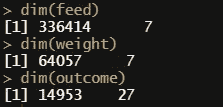

You can see that the measurements are not equally in terms of granularity.

因此，饲料数据比重量数据粒度更细，而重量数据比结果数据粒度更细。后者是有意义的，因为结果数据围绕着小猪的出生。这种情况每隔 100 多天就会发生一次，因此我们将拥有比结果数据更多的饲料和体重数据。

现在的关键是，把母体的特征和小猪联系起来。乍一看，应该有足够的数据，尽管行数仅提供了关于数据对建模的有用性的有限信息。

接下来，为了理解如何组合数据，需要进行大量的绘图和数据争论。

```
str(outcome)
outcome<-outcome[, c(2:20,25:27)]
outcome$mating_date<-as.Date(outcome$mating_date, format = "%m/%d/%Y")
outcome$weaning_date<-as.Date(outcome$weaning_date, format = "%m/%d/%Y")
outcome$farrowing_date<-as.Date(outcome$farrowing_date, format = "%m/%d/%Y")
outcome$birth_date<-as.Date(outcome$birth_date, format = "%m-%d-%Y")outcome$age_mating<-outcome$mating_date-outcome$birth_date
outcome$age_farrowing<-outcome$farrowing_date-outcome$birth_date 
outcome$age_weaning<-outcome$weaning_date-outcome$birth_datelength(unique(weight$animal_id))
length(unique(weight$animal_number))
```

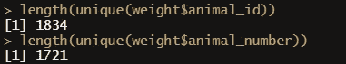

根据你使用的 ID，你会得到不同数量的动物。

```
ggplot2::ggplot(weight, aes(x=start_of_week, 
                            y=weight, 
                            group=animal_id))+
  geom_point(alpha=0.4)+
  geom_line(alpha=0.5)+
  theme_bw()weight%>%
  dplyr::filter(animal_number<663)%>%
  ggplot(., aes(x=start_of_week, 
                     y=weight, 
                     group=animal_number))+
  geom_point(alpha=0.4)+
  geom_line(alpha=0.5)+
  theme_bw()weight%>%
  dplyr::filter(animal_number<663)%>%
  ggplot(., aes(x=start_of_week, 
                y=weight, 
                group=animal_number, 
                color=factor(animal_number)))+
  geom_point(alpha=0.4)+
  geom_line(alpha=0.5)+
  theme_bw()
```

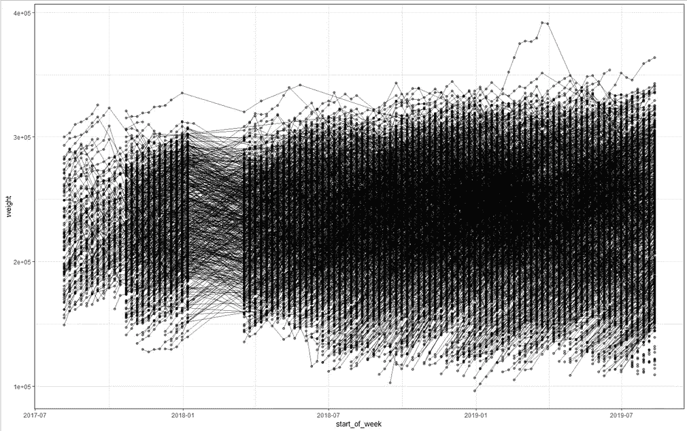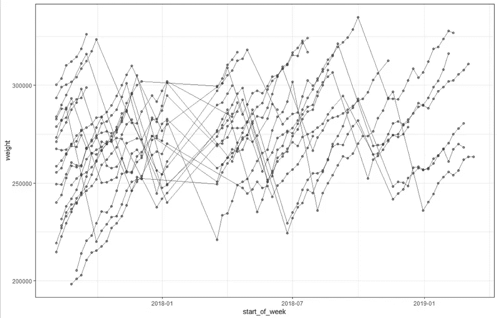

Like I said, there seems to be quite a lot of data.

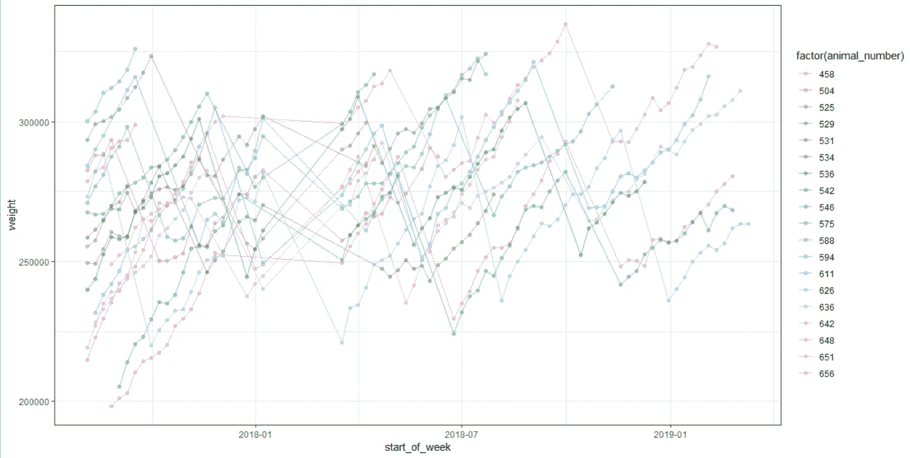

Although, from time to time, we do not have measurements of weight. This is probably when they have just farrowed piglets.

```
ggplot2::ggplot(weight, 
                aes(x=start_of_week, 
                    y=factor(animal_number), 
                    fill=weight/1000))+
  geom_tile()+
  viridis::scale_fill_viridis(option="magma")+
  theme_bw()+
  labs(x="Date", 
       y="Animals", 
       fill="Weight/100")+
  theme(axis.text.y=element_blank(),
        axis.ticks.y=element_blank())
```

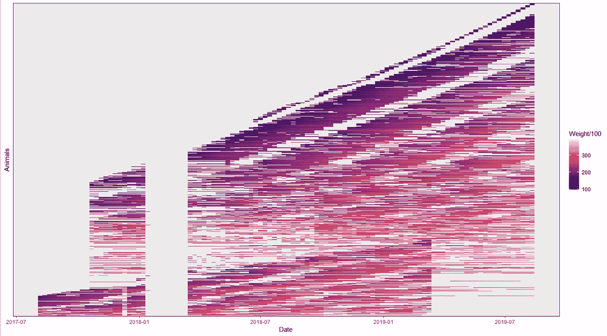

And here you can see that every animal, every sow, follows her own curve. You can also see that data is missing from time to time with quite a big gap that seems to hint at a malfunction of the system.

让我们转向三个数据集中最大的一个。

```
ggplot2::ggplot(feed, aes(x=on_day, 
                          y=total_fed, 
                          group=animal_id))+
  geom_point(alpha=0.4)+
  geom_line(alpha=0.5)+
  theme_bw()
```

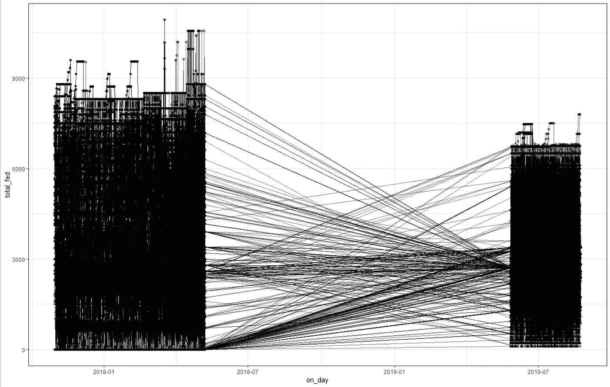

And, here we can see even better the enormous gap of data. It is quite difficult, if not impossible, to impute such missing data.

从这些数据中，你可以看到吃了什么，以及喂食机被编程来提供什么。清楚地看到，有时动物不吃东西，即使机器被编程。

```
feed%>%
  dplyr::filter(animal_id<304282318)%>%
  ggplot2::ggplot(., aes(x=on_day, 
                          y=total_fed, 
                          group=animal_id))+
  geom_point(alpha=0.4)+
  geom_line(alpha=0.5)+
  geom_point(aes(y=total_programmed), col="red", alpha=0.2)+
  theme_bw()+
  facet_wrap(~animal_id)
```

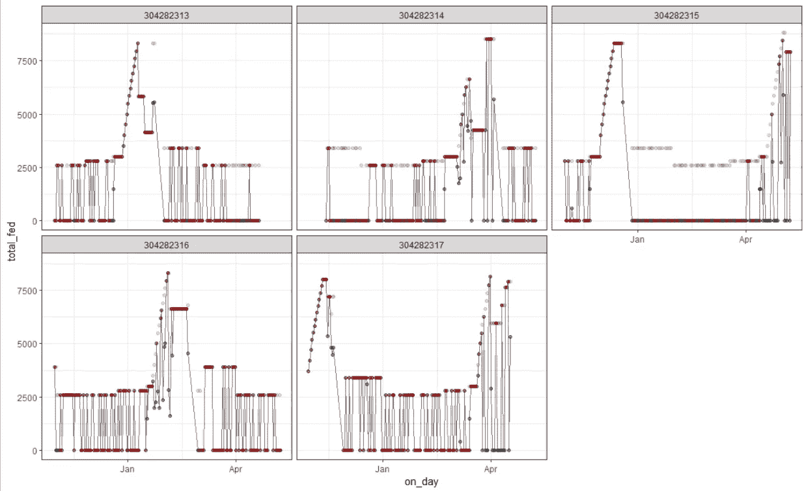

```
feed%>%dplyr::select(animal_id)%>%dplyr::top_n(n=10)
weight%>%dplyr::select(animal_id)%>%dplyr::top_n(n=10)
weight%>%dplyr::select(animal_number)%>%dplyr::top_n(n=10)
```

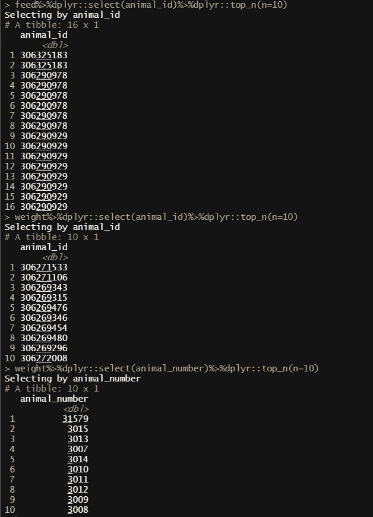

Clear to see that feed and weight have an overarching identifier, which is good.

而且，根据动物的需求和饲养过程的目的，可以提供不同的饲养类型。

```
feed%>%
  dplyr::filter(animal_id<304282318)%>%
  ggplot2::ggplot(., aes(x=on_day, 
                         y=total_fed, 
                         group=animal_id, 
                         color=factor(feed_type)))+
  geom_point(alpha=0.4)+
  geom_line(alpha=0.5)+
  theme_bw()+
  facet_wrap(~animal_id)
```

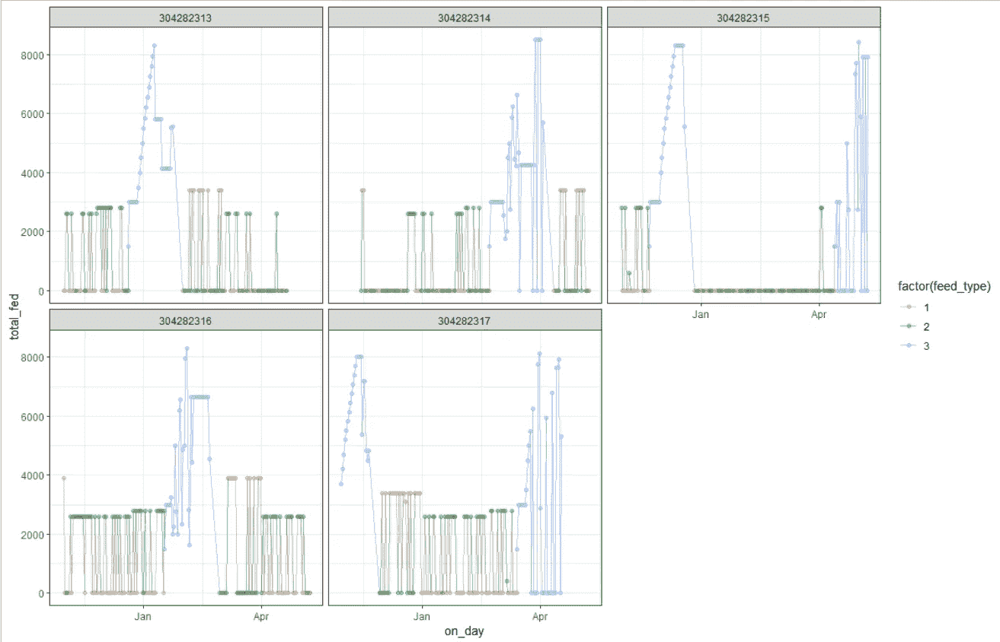

因此，体重和饲料数据集非常简单。一个给你看动物的重量，另一个给你看它们吃什么。现在，是时候关注动物的结果了，即出生的小猪数量以及有多少存活到断奶。由于母猪可以多次产仔，周期确实很重要，我们将从这方面的数据开始。

```
outcome%>%
  dplyr::filter(sow_number=="868")%>%
  ggplot(., aes(x=cycle, 
                y=born_alive))+
  geom_point()+
  geom_line()+
  theme_bw()ggplot(outcome, aes(x=cycle, 
                y=born_alive, 
                group=sow_number))+
  geom_point(alpha=0.7)+
  geom_line(alpha=0.1)+
  theme_bw()ggplot(outcome, aes(x=as.factor(cycle), 
                    y=born_alive))+
  geom_boxplot()+
  theme_bw()
```

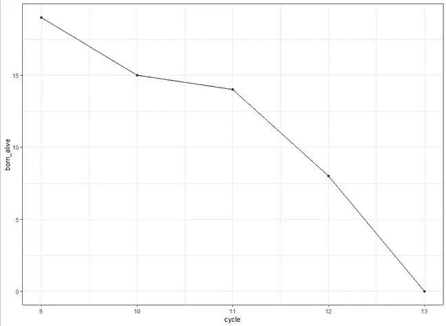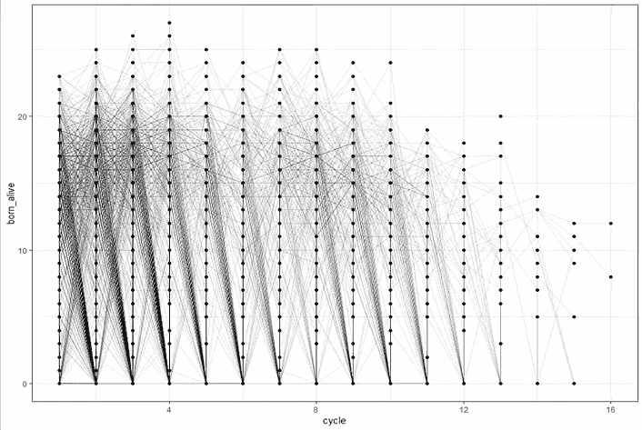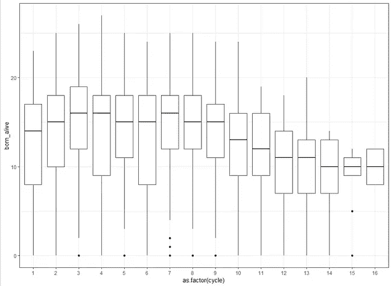

Here, you can see per cycle (and sometimes for a single sow, or multiple), how many piglets were born to to sow. The cycle an animal is in makes a lot of difference for sure.

上面用来描述周期对出生动物数量的影响的方法并不是最好的方法。让我们用不同的方式来描述它。

```
outcome%>%
  group_by(cycle, born_alive)%>%
  count(cycle, born_alive)%>%
  ggplot()+
  geom_tile(aes(x=born_alive, cycle))outcome%>%
  dplyr::select(cycle, born_alive)%>%
  dplyr::group_by(cycle)%>%
  dplyr::count(born_alive)%>%
  ggplot()+
  aes(x=born_alive, y=n)+
  geom_bar(stat="identity")+
  facet_wrap(~cycle)+
  theme_bw()outcome%>%
  dplyr::select(cycle, born_alive)%>%
  dplyr::group_by(cycle)%>%
  dplyr::count(born_alive)%>%
  ggplot()+
  aes(x=factor(born_alive), y=factor(cycle), fill=n)+
  geom_tile()+
  viridis::scale_fill_viridis(option="magma")+
  theme_bw()+
  labs(x="Born Alive", 
       y="Cycle", 
       fill="Count")outcome%>%
  dplyr::select(cycle, born_alive)%>%
  dplyr::group_by(cycle)%>%
  dplyr::count(born_alive)%>%
  dplyr::filter(cycle>1 & born_alive>0)%>%
  ggplot()+
  aes(x=factor(born_alive), y=factor(cycle), fill=n)+
  geom_tile()+
  viridis::scale_fill_viridis(option="magma")+
  theme_bw()+
  labs(x="Born Alive", 
       y="Cycle", 
       fill="Count")
```

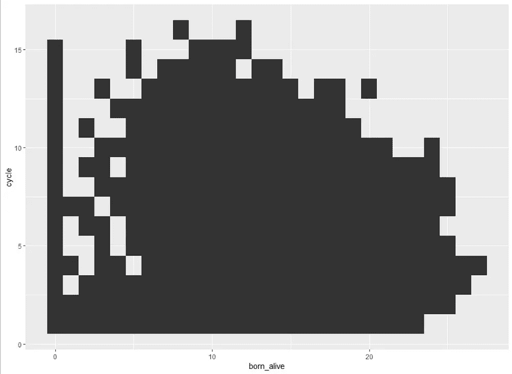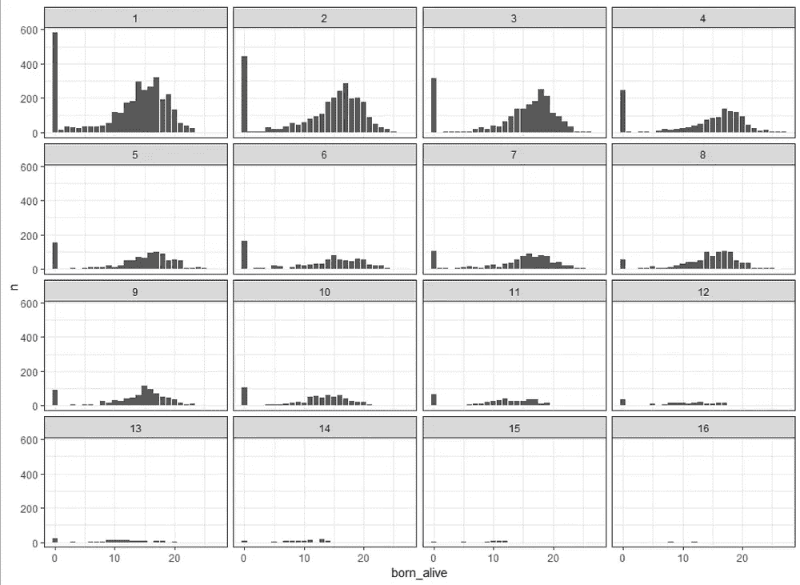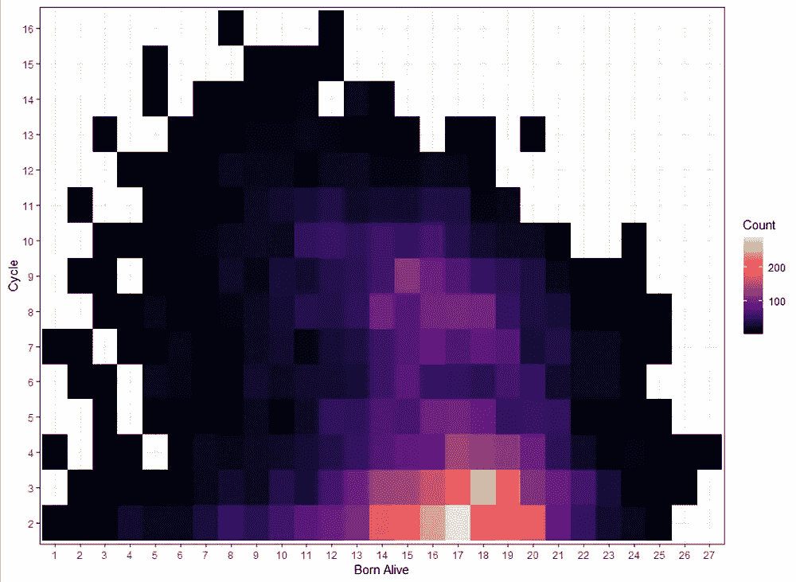

Cycle zero is not helping here, so lets take that one out to get the graph to the right. That graph clearly shows the influence of cycle on the number of piglets born alive.

活着出生的动物数量直接取决于出生动物的总数。

```
ggplot(outcome)+
  geom_density(aes(x=born_alive),fill="red", alpha=0.6)+
  geom_density(aes(x=total_born),fill="blue", alpha=0.5)+
  theme_bw()+
  labs(x="Births", 
       y="#", 
       fill="")ggplot(outcome, aes(x=as.factor(cycle)))+
  geom_boxplot(aes(y=born_alive),fill="red",col="red", alpha=0.6)+
  geom_boxplot(aes(y=total_born), fill="blue", col="blue", alpha=0.5)+
  theme_bw()+
  facet_wrap(~breed, 
             scales="free", 
             ncol=2)+
  labs(x="Cycle", 
       y="#", 
       fill="")ggplot(outcome, aes(x=birth_date))+
  geom_point(aes(y=born_alive),col="red", alpha=0.6)+
  geom_point(aes(y=total_born),col="blue", alpha=0.5)+
  theme_bw()+
  facet_wrap(~breed, 
             scales="free", 
             ncol=2)+
  labs(x="Birth date", 
       y="#", 
       fill="")
```

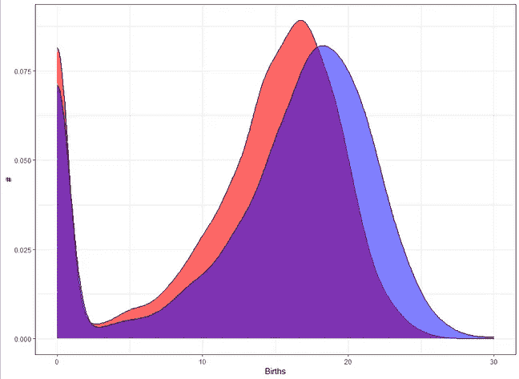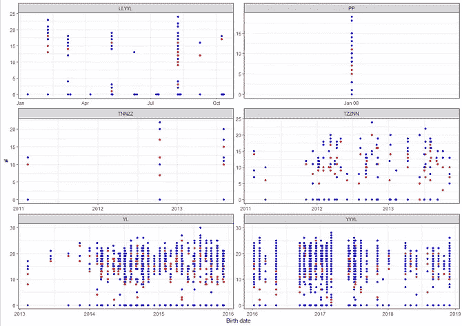

所以，让我们建立一个简单的比例，然后再看看。

```
outcome%>%
  dplyr::select(cycle, born_alive, total_born)%>%
  dplyr::group_by(cycle)%>%
  dplyr::summarize(prop_alive=born_alive/total_born)%>%
  tidyr::drop_na()%>%
  ggplot()+
  aes(x=prop_alive, fill=factor(cycle))+
  geom_density(alpha=0.5)+
  theme_bw()
```

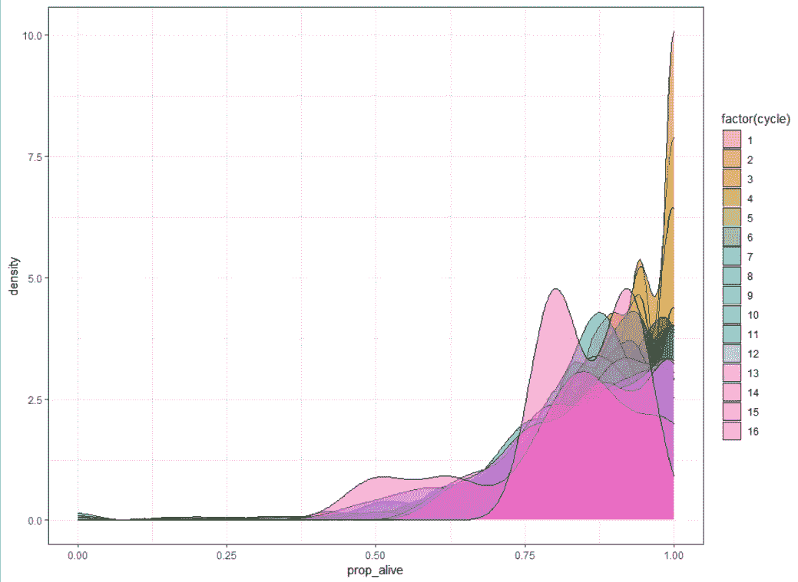

Density plots are useful and dangerous at the same time. It goes to show that the majority of animals will produce around 80–90% of animals born alive, but here the influence of the cycles is not that clear.

```
outcome%>%
  dplyr::select(cycle, born_alive, total_born)%>%
  dplyr::filter(cycle>1 & born_alive>0)%>%
  dplyr::group_by(cycle)%>%
  dplyr::summarize(prop_alive=born_alive/total_born)%>%
  dplyr::summarize(prop_alive = mean(prop_alive))%>%
  ggplot()+
  aes(x=factor(cycle), y=prop_alive, group=1)+
  geom_point()+
  geom_line()+
  theme_bw()+
  labs(x="Cycle", 
       y="Proportion Alive")
```

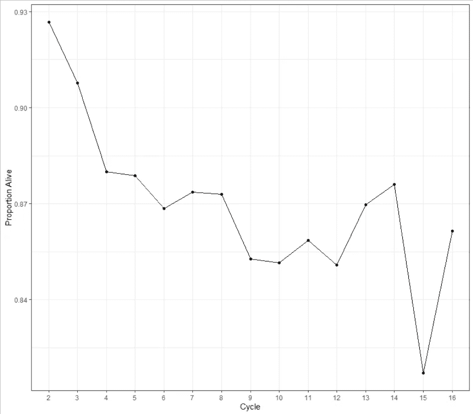

Nice plot, but without confidence bands, it can give a twisted view of the data we have at hand.

```
outcome%>%
  dplyr::select(cycle, born_alive, total_born)%>%
  dplyr::filter(cycle>1 & born_alive>0)%>%
  dplyr::group_by(cycle)%>%
  dplyr::summarize(prop_alive=born_alive/total_born)%>%
  tidyr::drop_na()%>%
  dplyr::summarise(prop_alive_m   = mean(prop_alive), 
                   prop_alive_sd  = sd(prop_alive), 
                   prop_alive_n   = n(), 
                   prop_alive_se  = prop_alive_sd/sqrt(prop_alive_n),
                   prop_alive_lcl = prop_alive_m-1.96*prop_alive_se, 
                   prop_alive_ucl = prop_alive_m+1.96*prop_alive_se)%>%
  ggplot()+
  aes(x=factor(cycle), y=prop_alive_m, group=1)+
  geom_point()+
  geom_line()+
  geom_ribbon(aes(ymin=prop_alive_lcl, 
                  ymax=prop_alive_ucl), fill="red", alpha=0.4)+
  theme_bw()+
  labs(x="Cycle", 
       y="Proportion Alive")
```

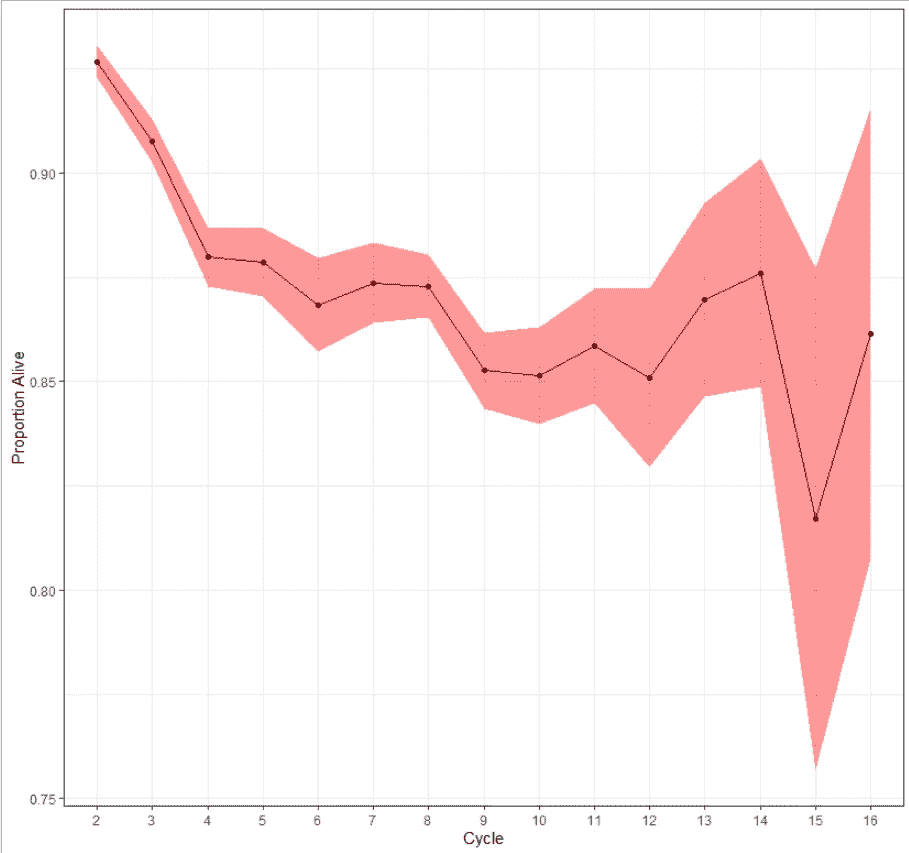

With confidence bands, you can see that after twelve cycles, the data become strange. I am not sure if this is an opportunity for modelling or if this were the limited amount of data is coming to haunt me.

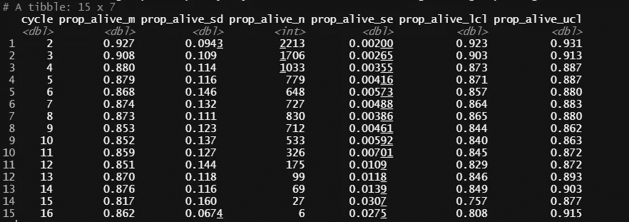

Probably the limited amount of data. After the 12th cycle, the data becomes sparse very very quickly.

现在是时候寻找组合数据的方法了，但是要正确地认识到，我们需要先好好看看潜在的重叠之处。

```
g1<-feed%>%
  dplyr::select(animal_id, on_day, total_fed)%>%
  dplyr::filter(animal_id=="305275612")%>%
  ggplot(., 
         aes(x=on_day, y=total_fed))+
  geom_line()+
  geom_point()+
  theme_bw()+
  scale_x_date(limits = as.Date(c('2017-09-01','2019-08-01')))+
  theme(axis.text.y=element_blank(),
        axis.ticks.y=element_blank())
g2<-weight%>%
  dplyr::select(animal_number, start_of_week, weight, animal_id)%>%
  dplyr::filter(animal_number=="1075")%>%
  ggplot(., 
         aes(x=start_of_week, 
             y=weight))+
  geom_line()+
  geom_point()+
  theme_bw()+
  scale_x_date(limits = as.Date(c('2017-09-01','2019-08-01')))+
  theme(axis.text.y=element_blank(),
        axis.ticks.y=element_blank())
g3<-outcome%>%
  dplyr::select(sow_number, farrowing_date, born_alive)%>%
  dplyr::filter(sow_number=="1075")%>%
  ggplot(., 
         aes(x=farrowing_date, 
             y=born_alive))+
  geom_line()+
  geom_point()+
  theme_bw()+
  scale_x_date(limits = as.Date(c('2017-09-01','2019-08-01')))+
  theme(axis.text.y=element_blank(),
        axis.ticks.y=element_blank())
gridExtra::grid.arrange(g1,g2,g3,ncol=1)
```

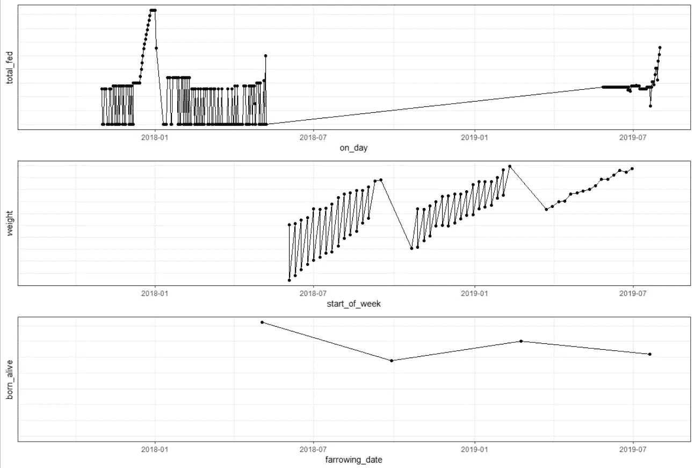

And here we can already see the issue of the dataset. Although we have data on feed, weight and outcomes we do not have overlapping data. Perhaps the feed registry stopped when the animals started giving birth, but what I see are cycles of outcomes in which I have no feed data, only weight data.

有了这样的数据，最好是随机放大到某个特定的动物，看看你对那个动物有什么了解。你有多少个数据点？有多少重叠？这种动物到底有多少信息？

虽然单个动物很难代表整个数据集，但您仍然可以很好地了解其余的动物。尤其是当我们考虑到当前数据集主要是由自动化数据收集产生的。

```
weight%>%dplyr::filter(animal_id=="305275842")%>%dim()
feed%>%dplyr::filter(animal_id=="305275842")%>%dim()
```

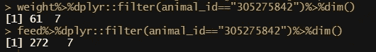

当我们有稀疏的数据和不能在最原始的层次上连接的数据时，我们必须找到一种方法来聚合数据，使它们开始重叠。在接下来的几分钟里，我将向你们展示这对于这个数据集来说有多困难，以及如果你没有真正考虑清楚就这么做的后果。

让我们对饲料数据进行分类，并开始从一天到一周进行汇总，看看我们是否可以找到与重量数据的重叠。

```
feed%>%
  dplyr::filter(animal_id=="305275842")%>%
  dplyr::group_by(animal_id)%>%
  timetk::summarise_by_time(.,
    on_day,
    .by = "week",
    total_fed  = sum(total_fed), 
    total_programmed = sum(total_programmed))
feed%>%dplyr::filter(animal_id=="305275842")
weight%>%dplyr::filter(animal_id=="305275842")
```

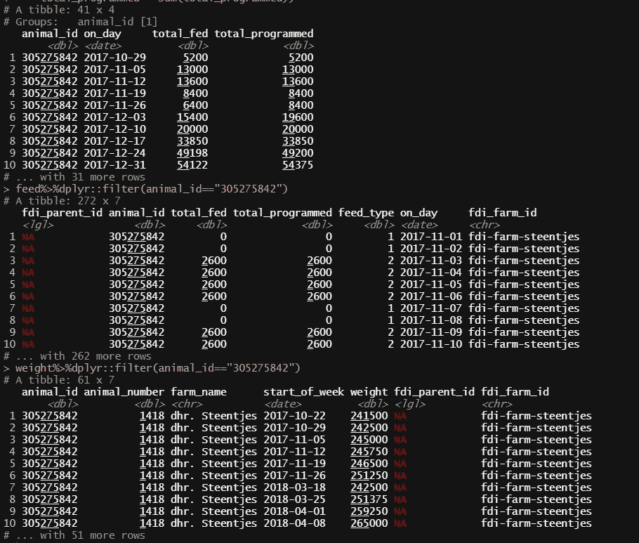

As you can see, both datasets have different names for the date variable, but the **animal_id** overlaps. It also seems that the dates have some overlap, so that seems to be good news.

让我们对数据进行更多的讨论，以便与体重数据更好地结合起来。

```
feed_sum<-feed%>%
  dplyr::group_by(animal_id)%>%
  timetk::summarise_by_time(.,
                            on_day,
                            .by = "week",
                            total_fed  = sum(total_fed), 
                            total_programmed = sum(total_programmed))%>%
  dplyr::rename(., start_of_week = on_day)
```

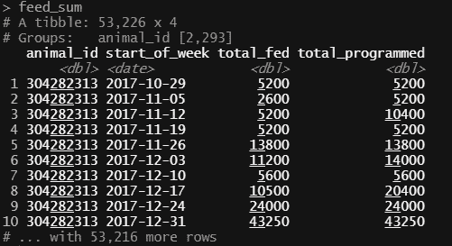

现在，我们应该能够合并重量数据，并检查最终结果。

```
weight_feed <- merge(weight,feed_sum ,by=c("animal_id", "start_of_week"))
table(weight_feed$animal_id)
dim(table(weight_feed$animal_id))
length(unique(weight_feed$animal_id))
```

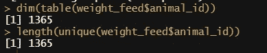

Looking good so far.

让我们看看动物在体重数据方面有多少数据点。

```
weight_feed%>%
  dplyr::select(animal_id)%>%
  dplyr::count(animal_id)%>%
  ggplot()+
  aes(x=n)+
  geom_bar()+
  theme_bw()
```

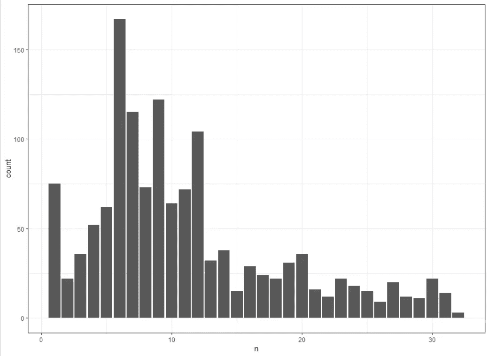

That is NOT a lot. The majority of the animals do not really have more than 10–15 weeks of weight data.

如果我们真的想知道一旦我们开始汇总和组合数据，数据的粒度会发生什么变化，请参见下文。

```
weight_feed%>%
  dplyr::select(animal_id)%>%
  dplyr::filter(animal_id=="305275842")%>%
  dplyr::count()feed%>%
  dplyr::select(animal_id)%>%
  dplyr::filter(animal_id=="305275842")%>%
  dplyr::count()weight%>%
  dplyr::select(animal_id)%>%
  dplyr::filter(animal_id=="305275842")%>%
  dplyr::count()
```

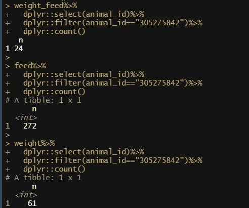

We go from 272 datapoints of feed and 61 datapoints of weight to 24 datapoints of weight & feed. That's quite a change.

让我们看看数据是否至少做了必要的重叠。

```
weight_feed%>%
  dplyr::filter(animal_id<"305275509")%>%
  ggplot(., aes(x=start_of_week))+
  geom_line(aes(y=weight/10), col="red")+
  geom_point(aes(y=weight/10), col="red")+
  geom_line(aes(y=total_fed), col="blue")+
  geom_point(aes(y=total_fed), col="blue")+
  theme_bw()+
  facet_wrap(~animal_id, scales="free")
```

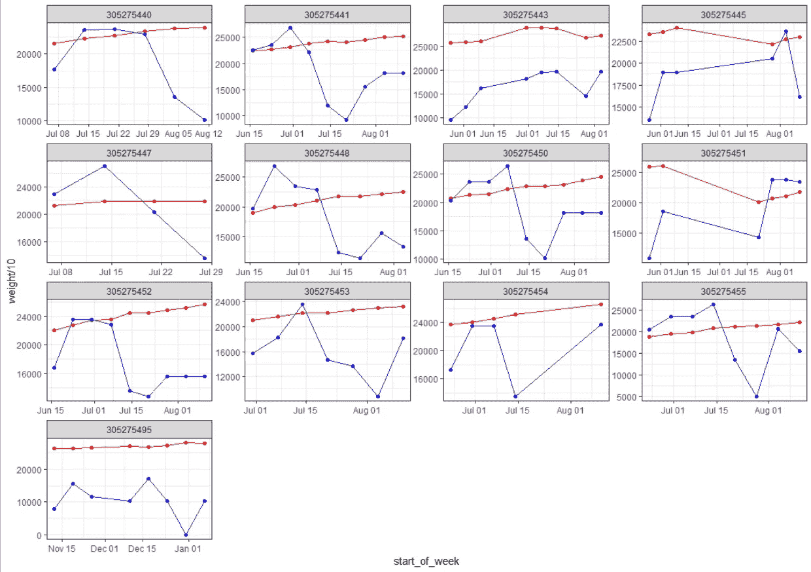

And it does! Which looks very nice, but looking at the x-axis we are indeed talking three months of data on average. Considering that we have outcomes, per animal, for multiple cycles and each cycle spans more than 100 days it is easy to see how the weight and feed data is almost impossible to use.

```
obj1<-weight_feed%>%
  dplyr::filter(animal_id=="305275440")%>%
  lattice::xyplot(weight~start_of_week, ., type="l")
obj2<-weight_feed%>%
  dplyr::filter(animal_id=="305275440")%>%
  lattice::xyplot(total_fed~start_of_week, ., type="l")
latticeExtra::doubleYScale(obj1, obj2, add.axis = TRUE)
```

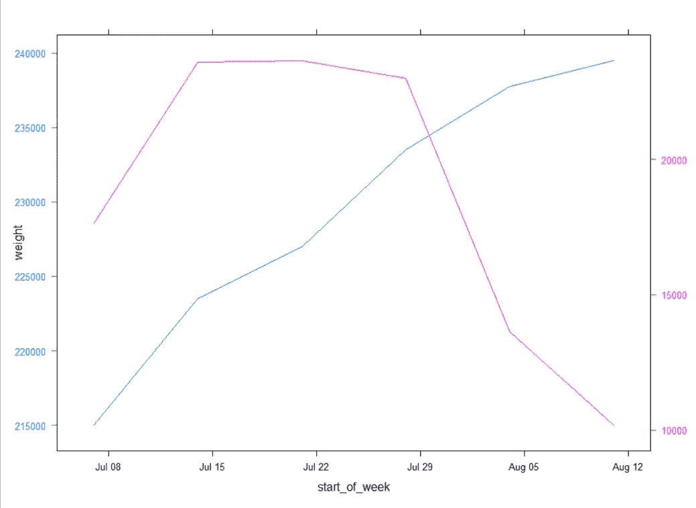

Another way to plot the data, using **Lattice**.

如果我们将*进给编程的*数据添加到混音中，我们开始看到差距。差距很大。

```
weight_feed%>%
  dplyr::filter(animal_id<305275453)%>%
  ggplot(., aes(x=start_of_week))+
  geom_line(aes(y=weight/10), col="red")+
  geom_point(aes(y=weight/10), col="red")+
  geom_line(aes(y=total_fed), col="blue")+
  geom_point(aes(y=total_fed), col="blue")+
  geom_line(aes(y=total_programmed), col="orange")+
  geom_point(aes(y=total_programmed), col="orange")+
  theme_bw()+
  facet_wrap(~animal_id)
```

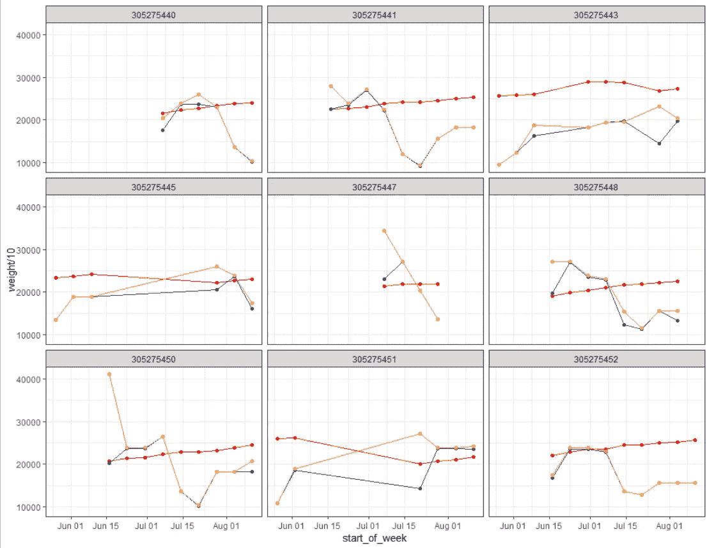

Big gaps in between measurements.

另一种显示与上述相同数据的方式是熔化，如下所示。

```
weight_feed_melt<-weight_feed%>%
  dplyr::mutate(weight = weight/10)%>%
  data.table::as.data.table()%>%
  data.table::melt(weight_feed,
                   id=c("animal_id", "start_of_week"), 
                   measure.vars=c("weight", "total_fed", 
                   "total_programmed"), 
                   variable.name="Variable", 
                   value.name="Value", 
                   na.rm=TRUE)
weight_feed_melt%>%
  dplyr::filter(animal_id<305275453)%>%
  ggplot(., aes(x=start_of_week, y=Value, col=Variable))+
  geom_line()+
  geom_point()+
  theme_bw()+
  facet_wrap(~animal_id)
```

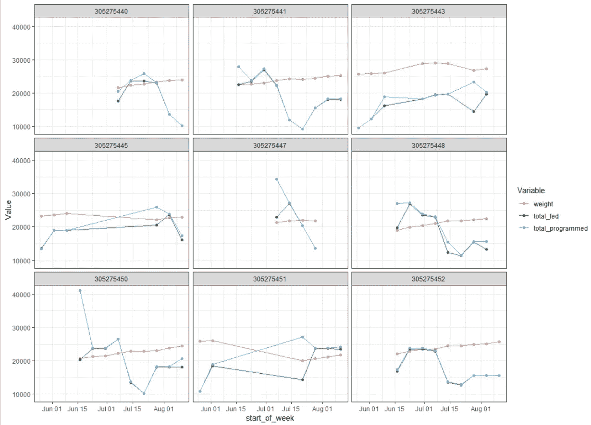

我想回去重新开始研究结果数据。另外，我也会开始结合数据。

```
g1<-outcome%>%
  dplyr::filter(sow_number=="2373")%>%
  ggplot(.)+
  geom_linerange(aes(x=mating_date, ymin=0, ymax=1), col="black")+
  geom_linerange(aes(x=farrowing_date, ymin=0, ymax=1), col="red")+
  geom_linerange(aes(x=weaning_date, ymin=0, ymax=1), col="blue")+
  geom_linerange(aes(x=birth_date, ymin=0, ymax=1), col="green")+
  theme_bw()combined<-weight_feed%>%
  dplyr::rename(sow_number = animal_number)%>%
  merge(.,outcome, by=c("sow_number"))g2<-combined%>%
  dplyr::filter(sow_number=="2373")%>%
  ggplot(.)+
  geom_linerange(aes(x=mating_date, ymin=0, ymax=1), col="black")+
  geom_linerange(aes(x=farrowing_date, ymin=0, ymax=1), col="red")+
  geom_linerange(aes(x=weaning_date, ymin=0, ymax=1), col="blue")+
  geom_linerange(aes(x=birth_date, ymin=0, ymax=1), col="green")+
  theme_bw()
gridExtra::grid.arrange(g1,g2,ncol=2)
```

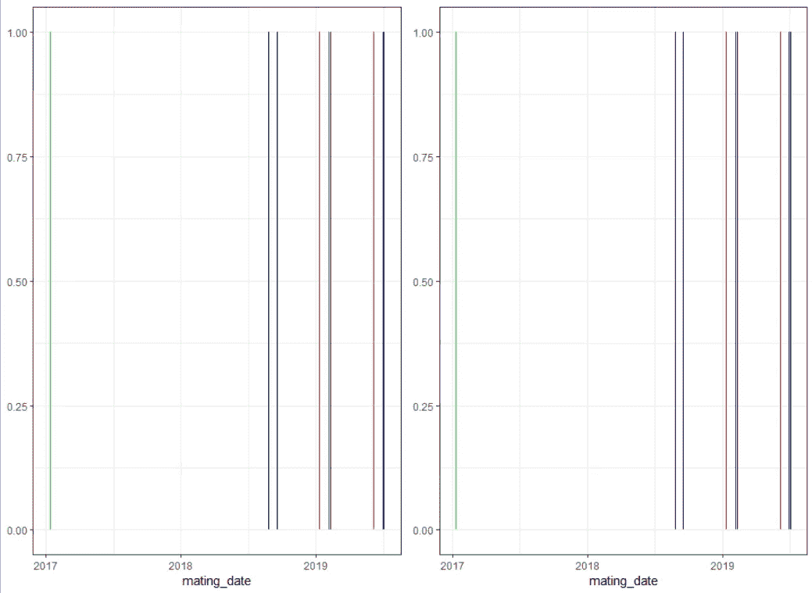

This plot clearly shows that the outcome data span years worth of data. Combined with the weight and feed data, the outcome days stays as it should be.

让我们绘制来自*重量*、*饲料*和组合数据集的数据，看看组合数据进行得如何。

```
g1<-combined%>%
  dplyr::select(sow_number, start_of_week, total_fed)%>%
  dplyr::filter(sow_number=="1075")%>%
  ggplot(., 
         aes(x=start_of_week, y=total_fed))+
  geom_line()+
  geom_point()+
  theme_bw()+
  scale_x_date(limits = as.Date(c('2017-09-01','2019-08-01')))+
  theme(axis.text.y=element_blank(),
        axis.ticks.y=element_blank())
g2<-combined%>%
  dplyr::select(sow_number, start_of_week, weight)%>%
  dplyr::filter(sow_number=="1075")%>%
  ggplot(., 
         aes(x=start_of_week, 
             y=weight))+
  geom_line()+
  geom_point()+
  theme_bw()+
  scale_x_date(limits = as.Date(c('2017-09-01','2019-08-01')))+
  theme(axis.text.y=element_blank(),
        axis.ticks.y=element_blank())
g3<-combined%>%
  dplyr::select(sow_number, farrowing_date, born_alive)%>%
  dplyr::filter(sow_number=="1075")%>%
  ggplot(., 
         aes(x=farrowing_date, 
             y=born_alive))+
  geom_line()+
  geom_point()+
  theme_bw()+
  scale_x_date(limits = as.Date(c('2017-09-01','2019-08-01')))+
  theme(axis.text.y=element_blank(),
        axis.ticks.y=element_blank())
g4<-feed%>%
  dplyr::select(animal_id, on_day, total_fed)%>%
  dplyr::filter(animal_id=="305275612")%>%
  ggplot(., 
         aes(x=on_day, y=total_fed))+
  geom_line()+
  geom_point()+
  theme_bw()+
  scale_x_date(limits = as.Date(c('2017-09-01','2019-08-01')))+
  theme(axis.text.y=element_blank(),
        axis.ticks.y=element_blank())
g5<-weight%>%
  dplyr::select(animal_number, start_of_week, weight)%>%
  dplyr::filter(animal_number=="1075")%>%
  ggplot(., 
         aes(x=start_of_week, 
             y=weight))+
  geom_line()+
  geom_point()+
  theme_bw()+
  scale_x_date(limits = as.Date(c('2017-09-01','2019-08-01')))+
  theme(axis.text.y=element_blank(),
        axis.ticks.y=element_blank())
g6<-outcome%>%
  dplyr::select(sow_number, farrowing_date, born_alive)%>%
  dplyr::filter(sow_number=="1075")%>%
  ggplot(., 
         aes(x=farrowing_date, 
             y=born_alive))+
  geom_line()+
  geom_point()+
  theme_bw()+
  scale_x_date(limits = as.Date(c('2017-09-01','2019-08-01')))+
  theme(axis.text.y=element_blank(),
        axis.ticks.y=element_blank())
gridExtra::grid.arrange(g1,g2,
                        g3,g4,
                        g5,g6,
                        ncol=3)
```

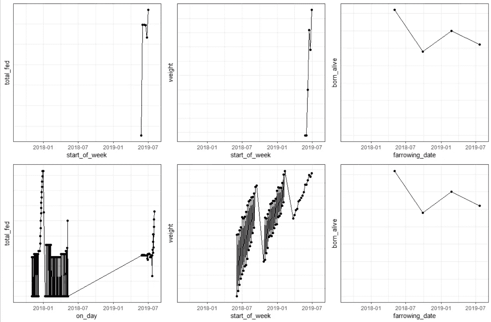

On the top row, you see the combined data. The bottom rows sows the data coming from feed, weight and outcomes, separately. It clearly shows that although the outcome data is preserved, a lof of other data is not. That means that combining the data the way I did it is not correct.

让我们再来看一下重量和饲料数据，并在合并的数据集中将其与*重量*和*饲料*进行对比。

```
g1<-weight_feed%>%
  dplyr::filter(animal_id == "305275453")%>%
  ggplot(., aes(x=start_of_week))+
  geom_line(aes(y=weight/10), col="red")+
  geom_point(aes(y=weight/10), col="red")+
  geom_line(aes(y=total_fed), col="blue")+
  geom_point(aes(y=total_fed), col="blue")+
  geom_line(aes(y=total_programmed), col="orange")+
  geom_point(aes(y=total_programmed), col="orange")+
  theme_bw()+
  facet_wrap(~animal_id)
g2<-combined%>%
  dplyr::filter(sow_number == "2384")%>%
  ggplot(., aes(x=start_of_week))+
  geom_line(aes(y=weight/10), col="red")+
  geom_point(aes(y=weight/10), col="red")+
  geom_line(aes(y=total_fed), col="blue")+
  geom_point(aes(y=total_fed), col="blue")+
  geom_line(aes(y=total_programmed), col="orange")+
  geom_point(aes(y=total_programmed), col="orange")+
  theme_bw()+
  facet_wrap(~animal_id)
gridExtra::grid.arrange(g1,g2,ncol=2)
```

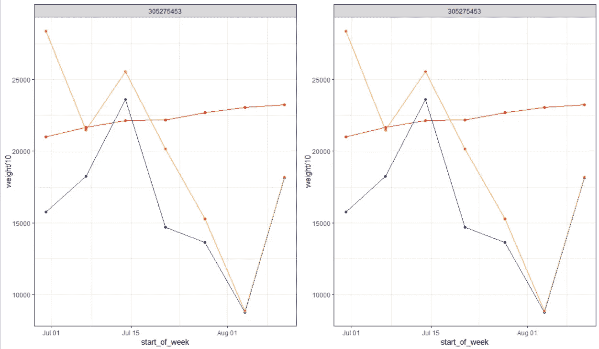

Nothing wrong for this animal, looking good.

但是，如果你开始将饲料和体重数据的位置与结果数据进行比较，你会再次看到这些数据是多么的无用。

```
combined%>%
  dplyr::filter(sow_number=="2373")%>%
  ggplot(.)+
  geom_line(aes(x=start_of_week, y=weight/10), col="red")+
  geom_point(aes(x=start_of_week, y=weight/10), col="red")+
  geom_line(aes(x=start_of_week, y=total_fed), col="blue")+
  geom_point(aes(x=start_of_week, y=total_fed), col="blue")+
  geom_line(aes(x=start_of_week, y=total_programmed), col="orange")+
  geom_point(aes(x=start_of_week, y=total_programmed), col="orange")+
  geom_linerange(aes(x=mating_date, ymin=0, ymax=max(total_programmed)), col="black")+
  geom_linerange(aes(x=farrowing_date, ymin=0, ymax=max(total_programmed)), col="grey")+
  geom_linerange(aes(x=weaning_date, ymin=0, ymax=max(total_programmed)), col="green")+
  theme_bw()
```

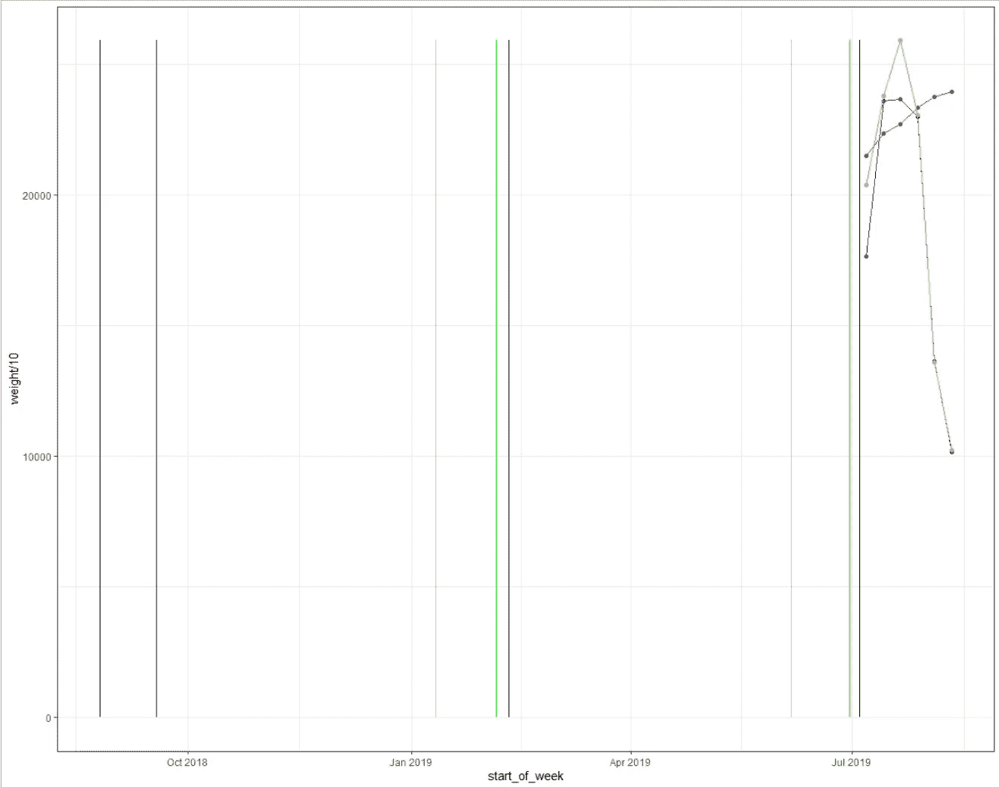

For this animal, and for many more probably, the feed and weight data is not useful at al.

现在，我之前说过，结果数据很好地进入了组合数据集，但我开始怀疑是否真的是这样。所以让我们比较一下。

```
g1<-combined%>%
  dplyr::select(sow_number, cycle, born_alive)%>%
  group_by(sow_number, cycle)%>%
  ggplot()+
  aes(x=factor(sow_number), 
      y=factor(cycle), 
      fill=born_alive)+
  geom_tile()+
  viridis::scale_fill_viridis(option="magma")+
  theme_bw()+
  labs(x="Sow Number", 
       y="Cycle", 
       fill="Born alive")+
  theme(axis.text.x=element_blank(),
        axis.ticks.x=element_blank())
g2<-outcome%>%
  dplyr::select(sow_number, cycle, born_alive)%>%
  group_by(sow_number, cycle)%>%
  ggplot()+
  aes(x=factor(sow_number), 
      y=factor(cycle), 
      fill=born_alive)+
  geom_tile()+
  viridis::scale_fill_viridis(option="magma")+
  theme_bw()+
  labs(x="Sow Number", 
       y="Cycle", 
       fill="Born alive")+
  theme(axis.text.x=element_blank(),
        axis.ticks.x=element_blank())
gridExtra::grid.arrange(g1,g2,ncol=1)
```


It did not come through good at all. The combined dataset is not a usefull dataset.

上述努力非常清楚地表明，组合数据是一个比仅仅根据 sow 和日期组合复杂得多的过程。如果我们使用日期，数据很可能不会合并。

然而，我们能做的是每周期合并。交配和分娩之间有一个周期。所以我需要计算总饲料或平均饲料和重量，饲料增长或重量增长，或饲料中的百分比，以便将其与一个循环结合起来。否则这是行不通的。

这意味着我们需要汇总每头母猪和母猪内每个周期的数据，然后结合饲料、体重和结果数据。信息的损失是相当大的，但是在我们连接它们的过程中这将是一个干净的开始。

让我们再试一次！

```
outcome%>%
  dplyr::select(sow_number, cycle, 
                born_alive, birth_date,
                mating_date, 
                farrowing_date, 
                weaning_date)%>%
  group_by(sow_number, cycle)%>%
  dplyr::filter(sow_number=="1001")%>%
  ggplot(., )+
    geom_linerange(aes(x=mating_date, ymin=0, ymax=1), col="black")+
    geom_linerange(aes(x=farrowing_date, ymin=0, ymax=1), col="grey")+
    geom_linerange(aes(x=weaning_date, ymin=0, ymax=1), col="green")+
    geom_label(aes(x=farrowing_date, y=1, label=cycle))+
    theme_bw()
```

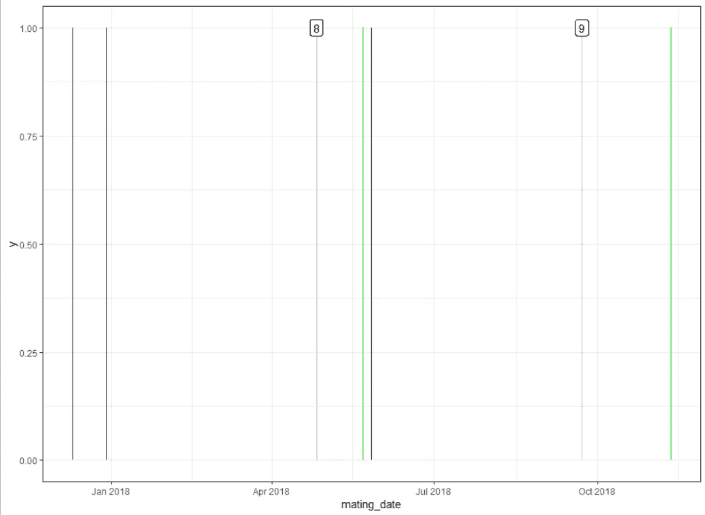

Making sure I capture relevant cycle information.

下面的代码将对每个周期的所有结果进行分组，为相似性准备重量数据，然后将结果和重量数据组合起来，这样我们就有了每个 sow 每个周期的总重量数据。

```
outcome_per_cycle<-outcome%>%
  dplyr::select(sow_number, 
         cycle,
         birth_date,
         mating_date, 
         farrowing_date, 
         weaning_date,
         total_born,
         born_alive,
         stillborn_piglets,
         mummified,
         nr_weaned,
         breed,
         age_mating,
         age_farrowing,
         age_weaning,
         )%>%
  group_by(sow_number, cycle)%>%
  dplyr::mutate(cycle_start=last(mating_date),
                cycle_end=farrowing_date)%>%
  filter(row_number()==1)%>%
  select(sow_number,
         cycle,
         cycle_start,
         cycle_end,total_born,
         born_alive,
         stillborn_piglets,
         mummified,
         nr_weaned,
         breed,
         age_mating,
         age_farrowing,
         age_weaning)outcome_weight_combined<-weight%>%
  dplyr::rename(sow_number = animal_number)%>%
  select(sow_number, animal_id,start_of_week, weight)%>%
  merge(x=.,
        y=outcome_per_cycle,
        by = "sow_number", 
        all.y=TRUE)dim(weight)
dim(outcome_per_cycle)
dim(outcome_weight_combined)
```

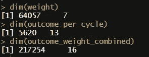

Then, making sure the data is order and grouped per cycle, and that combing it with weight went well.

```
outcome_weight_combined%>%
  arrange(cycle)%>%
  dplyr::mutate(include = if_else(start_of_week<cycle_end & start_of_week>cycle_start, 
                                  "yes", 
                                  "no"))%>%
  dplyr::select(include)%>%
  table()
```

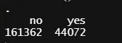

Then making sure that we know when a cycle starts and ends. Those two columns will be necessary to place the weight data at the correct spot.

现在我们可以结合结果和体重数据。

```
outcome_weight_filtered<-outcome_weight_combined%>%
  arrange(cycle)%>%
  dplyr::mutate(include = if_else(start_of_week<cycle_end & 
                                    start_of_week>cycle_start, 
                                  "yes", 
                                  "no"))%>%
  dplyr::filter(include=="yes")%>%
  group_by(sow_number, cycle)%>%
  arrange(sow_number, start_of_week)%>%
  mutate(sum_kg = sum(weight/1000))%>%
  dplyr::select(-c(weight, start_of_week))%>%
  dplyr::distinct()
```

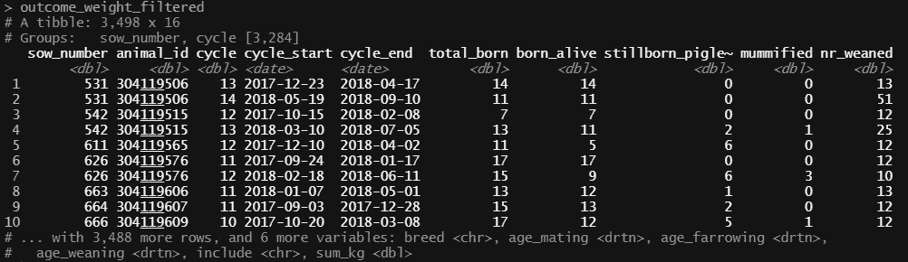

And in the end, we have the dataset. Per cycle, we have the outcomes and weight. However, the data has become very very sparse.

现在，我们可以开始对提要数据进行分组、转换，并将其与结果和权重数据合并。

```
feed2<-weight%>%
  dplyr::select(animal_id,animal_number)%>%
  merge(x=., 
        y=feed, 
        by="animal_id", 
        all.y=TRUE)%>%
  tidyr::drop_na(c("animal_number", 
                   "total_fed"))%>%
  dplyr::rename(sow_number=animal_number)%>%
  dplyr::select(sow_number, total_fed, 
                total_programmed, feed_type,
                on_day)
outcome_feed_combined<-feed2%>%
  merge(x=.,
        y=outcome_per_cycle,
        by = "sow_number", 
        all.y=TRUE)
dim(feed)
dim(outcome_per_cycle)
dim(outcome_feed_combined)  
outcome_feed_combined%>%
  arrange(cycle)%>%
  dplyr::mutate(include = if_else(on_day<cycle_end & on_day>cycle_start, 
                                  "yes", 
                                  "no"))%>%
  dplyr::select(include)%>%
  table()
outcome_feed_filtered<-outcome_feed_combined%>%
  arrange(cycle)%>%
  dplyr::mutate(include = if_else(on_day<cycle_end & on_day>cycle_start, 
                                  "yes", 
                                  "no"))%>%
  dplyr::filter(include=="yes")%>%
  group_by(sow_number, cycle)%>%
  arrange(sow_number, on_day)%>%
  mutate(sum_fed = sum(total_fed),
         sum_programmed = sum(total_programmed))%>%
  dplyr::select(-c(total_fed, total_programmed, feed_type, on_day))%>%
  dplyr::distinct()  
outcome_feed_filtered
```

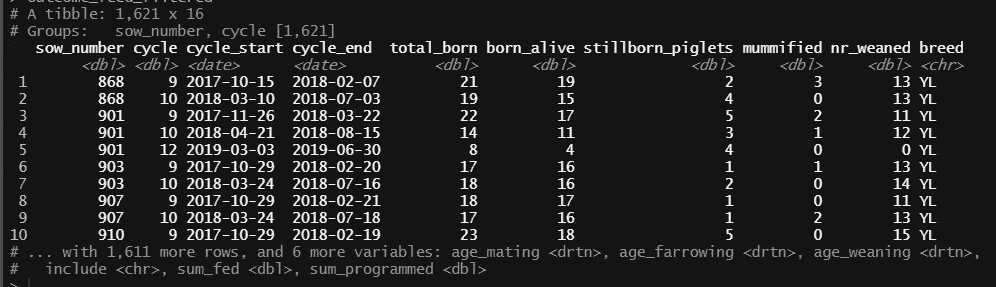

And here we have all the data combined.

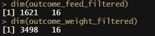

Same columns, different number of rows.

```
combined<-
  outcome_weight_filtered%>%
  dplyr::select(sow_number, cycle, sum_kg)%>%
  merge(x=., 
        y=outcome_feed_filtered, 
        by=c("sow_number", "cycle"), 
        all.y=TRUE)
```

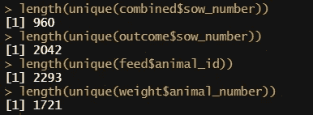

In the end, we have 960 animals left, from the 2000+ we started with. That is not a good thing.

既然我们已经有了我们能够并且想要使用的格式的所有数据，我们就可以开始进行实际的探索了。在最终的数据集中，我们知道每个周期的实际结果以及动物的喂食量和体重的汇总。尽管周期本质上使数据具有纵向性，但粒度却非常具有横向性。数据集的原始粒度已经所剩无几。

```
combined<-combined%>%
  dplyr::mutate(cycle_length = cycle_end-cycle_start, 
                feed_loss = sum_programmed/1000 - sum_fed/1000, 
                average_weight = sum_kg/as.numeric(cycle_length))
summary(as.numeric(combined$cycle_length))
summary(combined$feed_loss)
summary(combined$average_weight)
hist(as.numeric(combined$cycle_length))
```

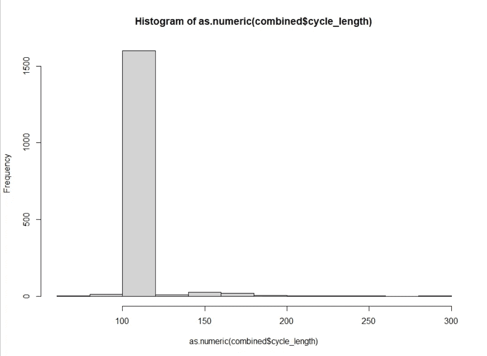

Each cycle has a length of appoximately 115 days. In that sense, the production data is quite strong and so cycle length will not really be of influence.

总的来说，似乎在周期之间有变化，但在一个周期内没有这么多。

```
ggplot(combined, 
       aes(x=cycle_length, 
           y=born_alive/total_born,
           color=factor(cycle)))+
  geom_point()+
  theme_bw()ggplot(combined, 
       aes(x=sum_kg, 
           y=born_alive/total_born,
           color=factor(cycle)))+
  geom_point(alpha=0.5)+
  theme_bw()ggplot(combined, 
       aes(x=cycle_length, 
           y=sum_fed,
           color=factor(cycle)))+
  geom_point(alpha=0.5)+
  theme_bw()+
  xlim(90,130)
```

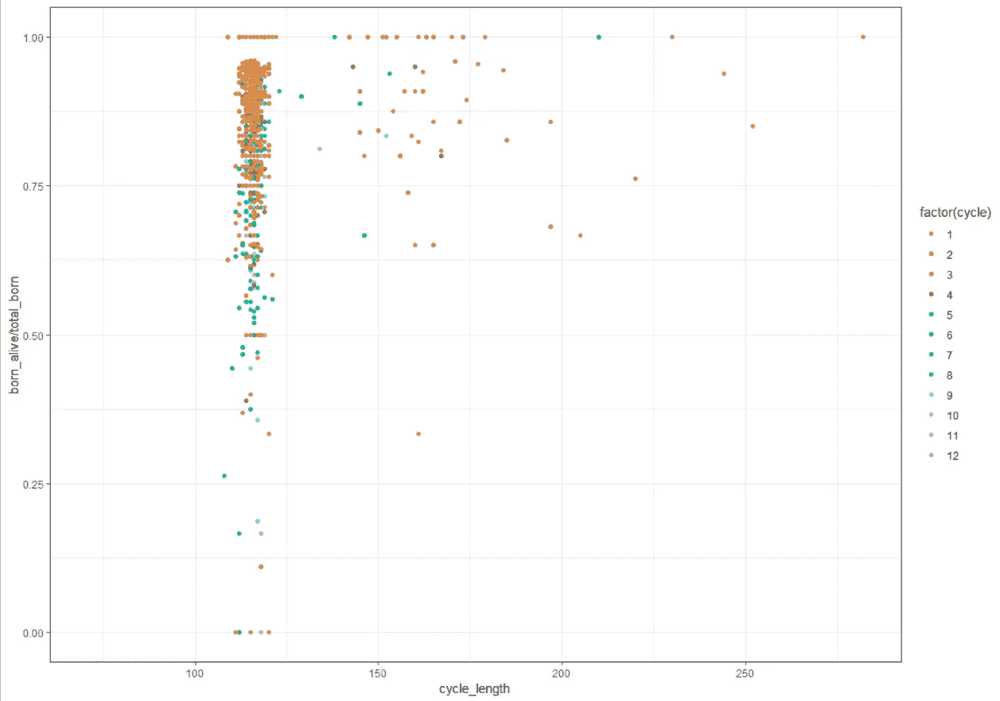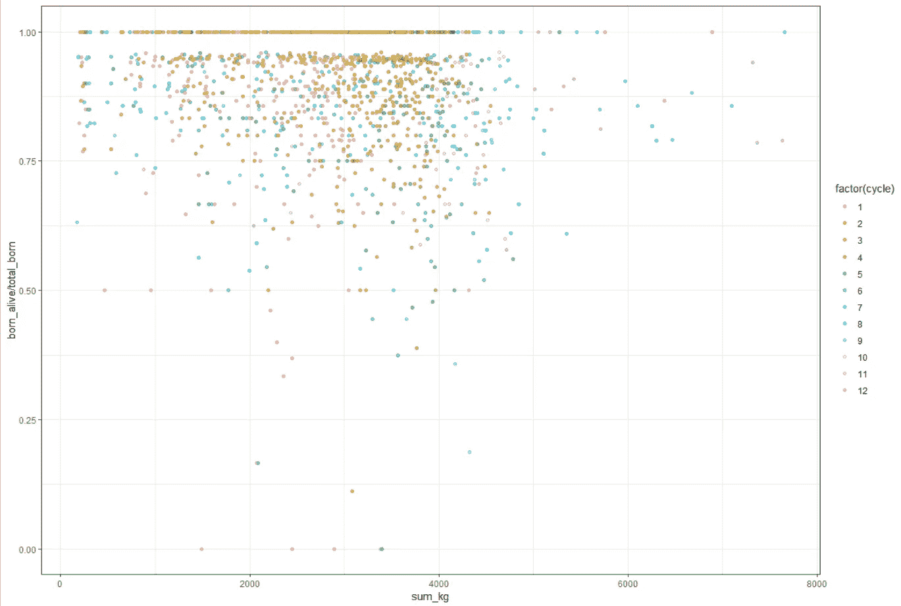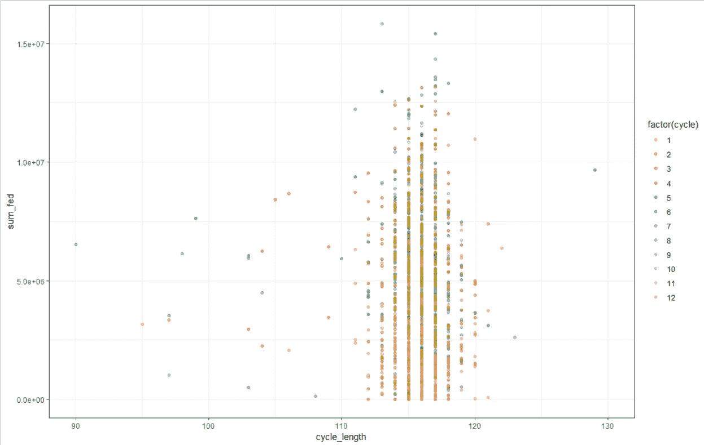

我们可以开始在周期之间更深入地挖掘，活着出生的动物数量和出生总数，以及它们的体重和喂养情况。事实上，现在真的没有那么多可去的了。

```
combined%>%
  dplyr::filter(cycle_length>90 & 
                  cycle_length<130)%>%
  dplyr::mutate(cycle_length_factor = cut(as.numeric(cycle_length), 5))%>%
ggplot(., 
       aes(fill=factor(cycle_length_factor), 
           x=sum_fed/1000))+
  geom_density(alpha=0.5)+
  theme_bw()+
  facet_wrap(~factor(cycle))ggplot(combined, 
       aes(x=sum_kg, 
           y=born_alive))+
  geom_point(alpha=0.5)+
  geom_density_2d()+
  theme_bw()ggplot(combined, 
       aes(x=sum_kg, 
           y=born_alive/total_born,
           color=factor(cycle)))+
  geom_point(alpha=0.5)+
  theme_bw()ggplot(combined, 
       aes(x=sum_kg, 
           y=sum_fed/1000, 
           size=born_alive/total_born,
           color=factor(cycle)))+
  geom_point(alpha=0.5)+
  theme_bw()
ggplot(combined, 
       aes(x=sum_kg, 
           y=sum_fed/1000, 
           size=born_alive/total_born,
           color=factor(cycle)))+
  geom_point(alpha=0.5)+
  facet_wrap(~cycle, scales="free")+
  theme_bw()ggplot(combined, 
       aes(x=age_farrowing, 
           y=born_alive,
           color=factor(cycle)))+
  geom_point(alpha=0.5)+
  facet_wrap(~cycle, scales="free")+
  theme_bw()
```

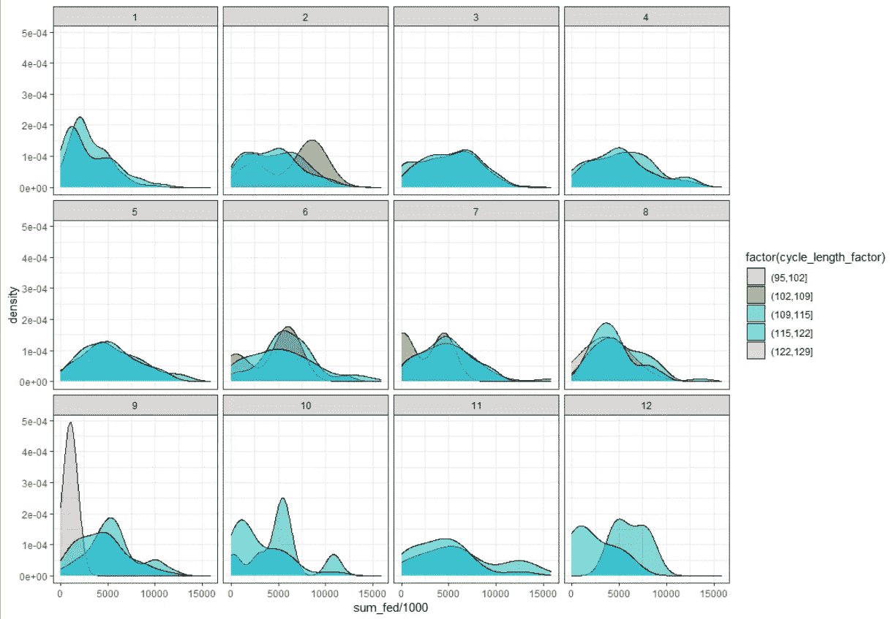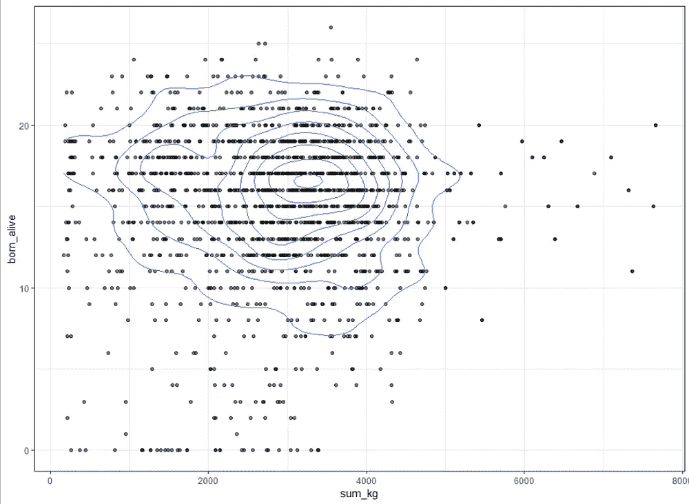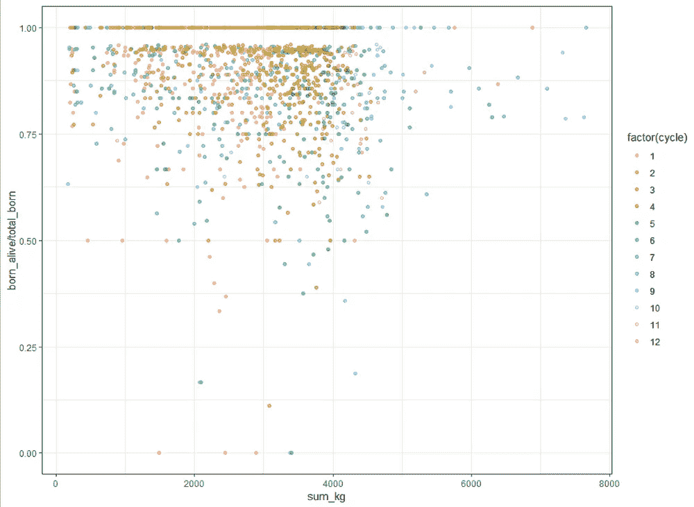

Not a real relationship between animals born and the weight of the animal. At least, not using these variables.

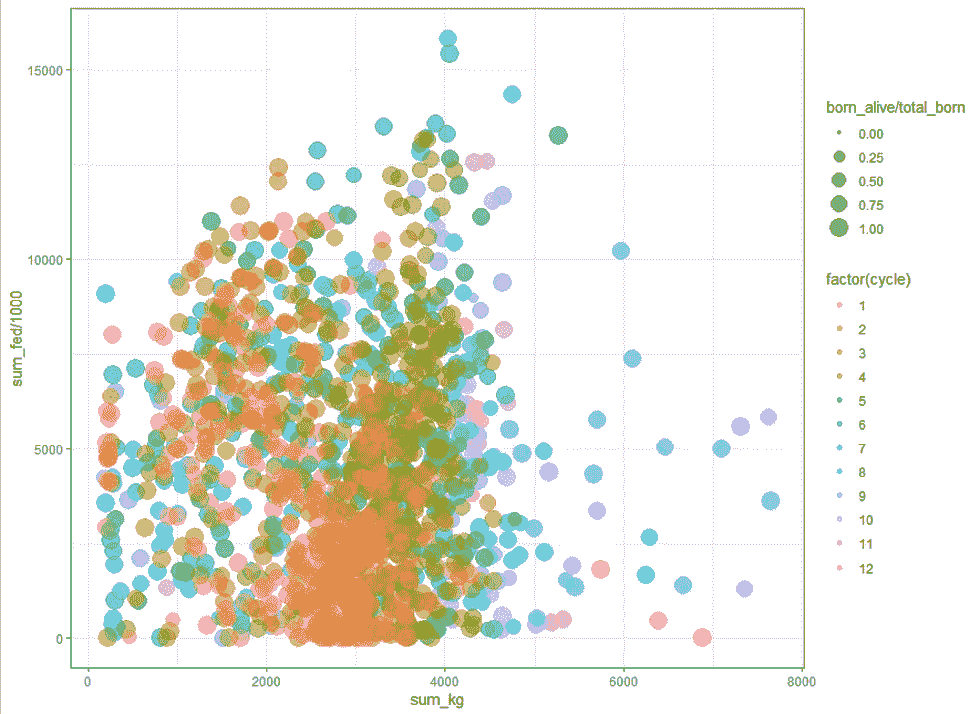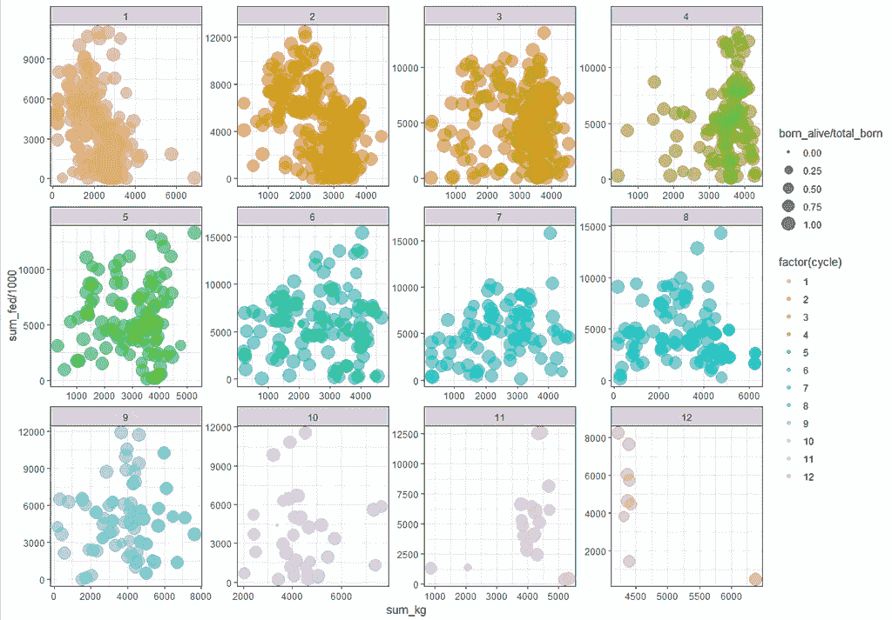

Also feed does not seem to hold a direct relationship. Once again, not when we use the overall summary of feed. And also not of weight.

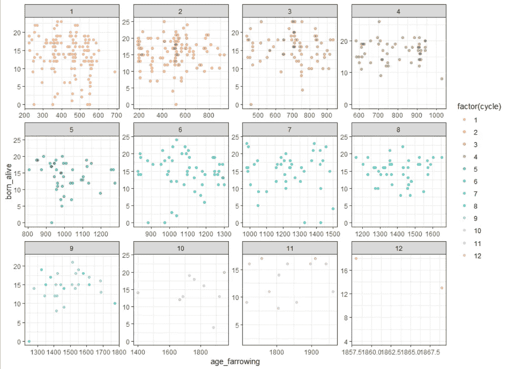

The age of farrowing does not seem to hold a direct relationship on the number of animals born.

从上面的图来看，我不认为当前的数据集有任何预测能力。虽然体重和他们吃的东西很可能影响动物出生的数量，但从我们现有的数据来看，如何预测这一点并不容易。从某种意义上说，我们已经从数据中提取了几乎所有的信息。

尽管如此，让我们试一试，并建立分类器(但最好是，这是你可以停止项目，节省你的时间和痛苦)。

```
combined_cc<-combined%>%
  select(born_alive,
         cycle,
         sum_kg,
         breed,
         sum_fed,
         sum_programmed,
         cycle_length)%>%
  dplyr::mutate(cycle_length=as.numeric(cycle_length))%>%
  tidyr::drop_na()
combined_cc<-mltools::one_hot(as.data.table(combined_cc))%>%as.data.frame()
dim(combined_cc)
str(combined_cc)i <- caret::createDataPartition(y = combined_cc$born_alive,
                                times = 1, 
                                p = 0.8, 
                                list = FALSE)training_set <- combined_cc[i,]
test_set <- combined_cc[-i,]
dim(training_set);dim(test_set)ggplot()+
  geom_bar(data=training_set, aes(x=factor(cycle-0.001), fill="training"))+
  geom_bar(data=test_set, aes(x=factor(cycle), fill="test"))+
  theme_bw()
```

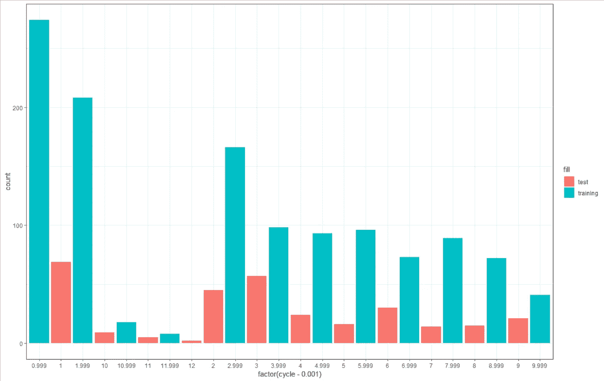

Looking at the distribution of the classes between test and train.

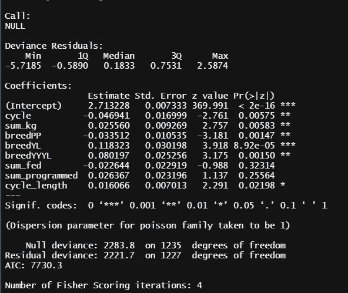

Output firs model, simple linear regression.

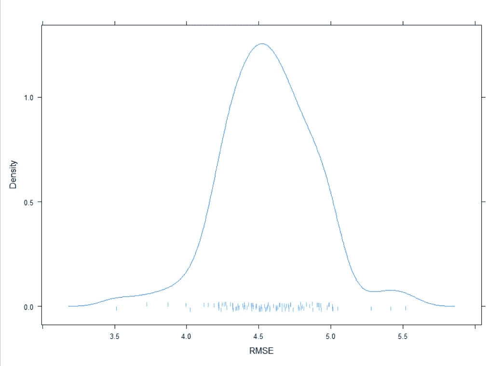

Root Mean Squared Error — which is kind of funny if you realize that your are building a classifier, not a model for continuous data. I suspect that I have not properly stated that the outcome of interest is ordinal.

```
pred<-round(predict(default_glm_mod, newdata = test_set),0)
test_set$pred<-pred
g1<-ggplot(data=test_set)+
  geom_point(aes(x=born_alive, y=pred))+
  geom_abline(intercept=0, slope=1, lty=2, col="red")+
  geom_smooth(aes(x=born_alive, y=pred))+
  theme_bw()+
  labs(x="Observed born alive", 
       y="Predicted born alive ")
g2<-ggplot(data=test_set)+
  geom_point(aes(x=born_alive, y=pred, color=pred-born_alive))+
  geom_abline(intercept=0, slope=1, lty=2, col="black")+
  viridis::scale_color_viridis(option="magma")+
  theme_bw()+
  labs(x="Observed born alive", 
       y="Predicted born alive ")
gridExtra::grid.arrange(g1,g2,ncol=1)trellis.par.set(caretTheme())
densityplot(default_glm_mod, pch = "|")
```

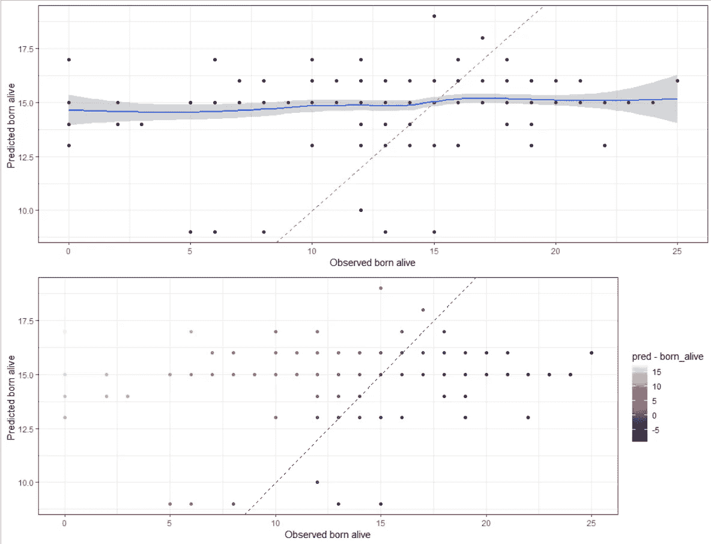

This hurts. But does not come unexpected. If you see predictions like these, it is better to just pick a random number.

现在，如果聪明的话，很多人下一步会做的是回到数据上。看看周期总结是否可以扩展到周数据中。或者增长率什么的。不太聪明的人，比如我，会使用更先进的模型。在这种情况下是随机森林。

这个例子很好地说明了算法不能代替稀疏数据。你不能制造你没有的东西。

```
library(doParallel)
cl <- makePSOCKcluster(5)
registerDoParallel(cl)
rfFit1 <- caret::train(factor(born_alive) ~ .,
                       data = training_set,
                       method = "rf",
                       metric = 'Accuracy',
                       trControl = trainControl(method="repeatedcv", 
                                                number=10, 
                                                repeats=10,
                                                search='grid',
                                                allowParallel = TRUE),
                       tuneGrid = expand.grid(mtry=c(1:15)))
rfFit1
plot(rfFit1)  
plot(rfFit1, metric = "Kappa")
ggplot(rfFit1) + theme_bw()pred<-predict(rfFit1, 
              newdata = test_set)
test_set$pred<-pred
g1<-ggplot(data=test_set)+
  geom_point(aes(x=born_alive, y=pred))+
  geom_abline(intercept=0, slope=1, lty=2, col="red")+
  theme_bw()+
  labs(x="Observed born alive", 
       y="Predicted born alive ")
g2<-ggplot(data=test_set)+
  geom_point(aes(x=born_alive, y=pred, 
                 color=as.numeric(pred)-born_alive))+
  geom_abline(intercept=0, slope=1, lty=2, col="black")+
  viridis::scale_color_viridis(option="magma")+
  theme_bw()+
  labs(x="Observed born alive", 
       y="Predicted born alive", 
       col="")
gridExtra::grid.arrange(g1,g2,ncol=1)rfImp <- caret::varImp(rfFit1, scale = FALSE)
rfImp
plot(rfImp, top = 20)roc_imp <- filterVarImp(x = training_set[, -ncol(training_set)], 
                        y = training_set$born_alive)
head(roc_imp)
```

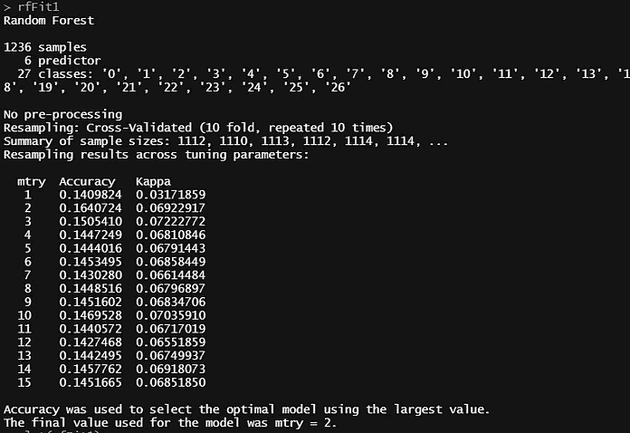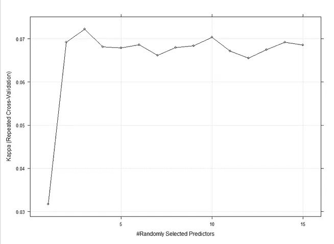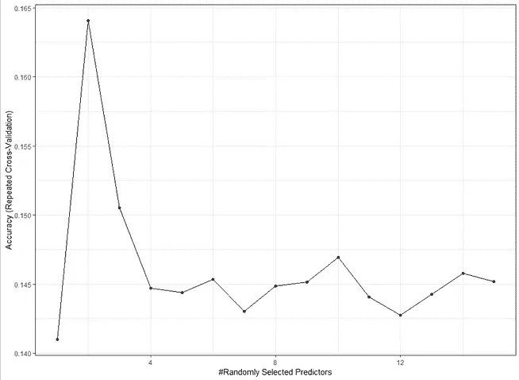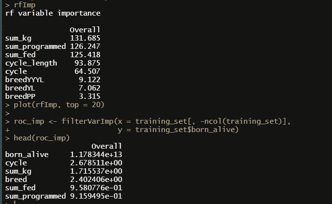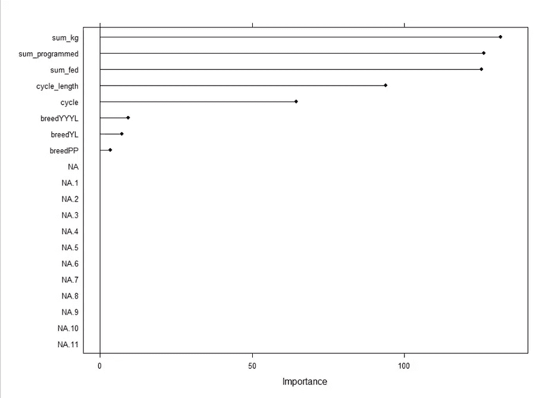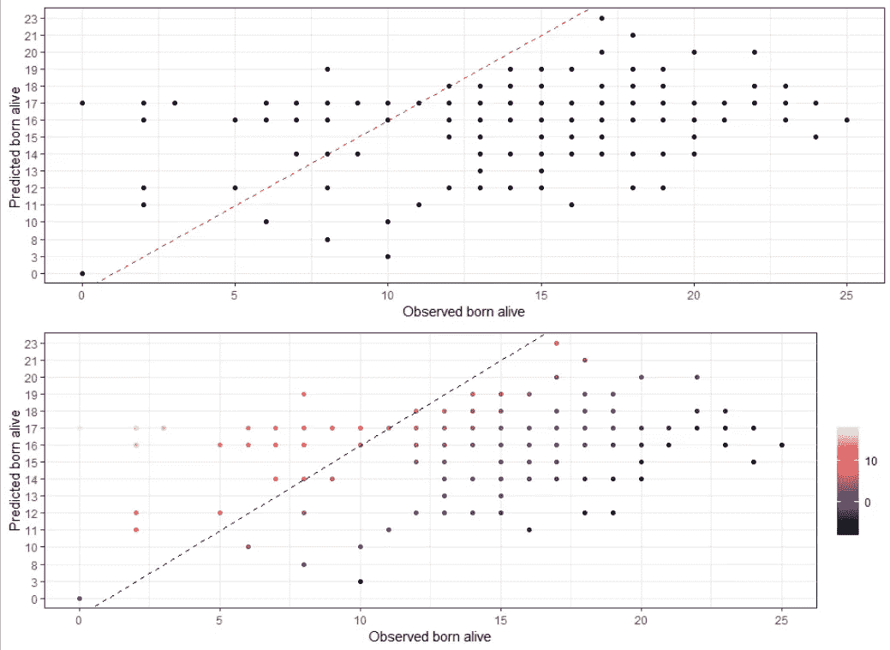

Looks better, but still bad. Seriously bad.

所以，这就是我要离开你们的地方了。我希望你能从这篇博客中获得的任何知识都是关于组合数据，使用 **dplyr** ，以及看到稀疏数据不能被模型保存。

归根结底，建模最重要的是数据争论。这正是我们的祸根。

如果有什么不对劲，请告诉我！

[](/mlearning-ai/mlearning-ai-submission-suggestions-b51e2b130bfb) [## Mlearning.ai 提交建议

### 如何成为 Mlearning.ai 上的作家

medium.com](/mlearning-ai/mlearning-ai-submission-suggestions-b51e2b130bfb)