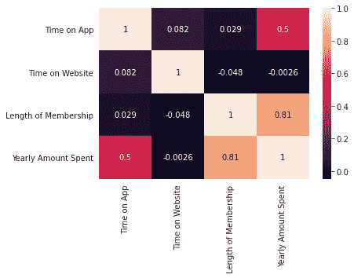
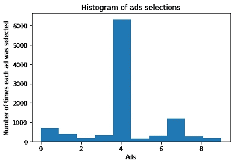
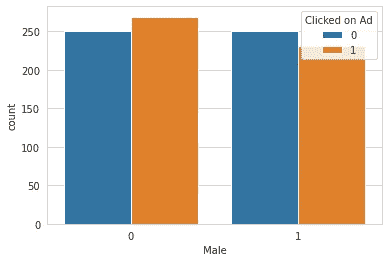
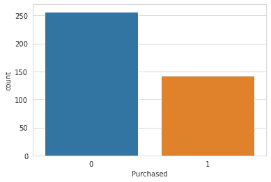
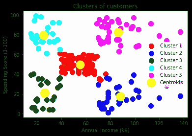

# 用于电子商务的预测、广告优化和细分引擎

> 原文：<https://medium.com/mlearning-ai/prediction-ad-optimization-and-segmentation-engine-for-e-commerce-a51f76e89980?source=collection_archive---------5----------------------->

Machine Learning techniques to apply in E-commerce

# 概观

数据科学和机器学习已经在包括电子商务在内的所有行业中得到应用。根据一家主要报纸的报道，印度是全球主要经济体中在线零售增长最快的国家。随着超过 50%的增长率，比过去更多的电子商务网站浮出水面。目前，大多数电子商务的具体进展都围绕着数据科学和机器学习的应用，以提出复杂问题的创新解决方案。

每天大约会产生 2.5 万亿字节的数据，对于这些玩家来说，如何让客户开心和满意变得至关重要。这就是数据科学项目的重要性，他们在客户细分、推荐系统、广告优化等领域使用数据科学。例如，易贝正在向数据科学和个性化购物机器人投入大量资金，以增强客户体验。而 Myntra 则通过其机器人 Artie 使用数据分析和人工智能，这是一个收集消费者见解的智能机器人，等等。

# 目标

让我们假设我们刚刚与纽约市的一家电子商务公司签订了一些合同，纽约市是电子产品和计算机产品的在线中心。该网站有各种各样的产品，从笔记本电脑，平板电脑，智能手机，数码相机到游戏硬件，显示器到打印机，路由器和扬声器。购物者可以在这个庞大但易于浏览的电子商务网站上浏览和购买各种各样的电子产品。

导航和分类都定义得很好，在您键入时为您提供关键词建议。除此之外，他们还有与电子产品或设备功能相关的店内会议，并在这些建议会议中提供与特定型号相关的反馈。顾客来到商店，与个人技术人员进行会话/会议，然后他们可以回家，在移动应用程序或网站上订购他们想要的设备/小工具。现在，作为一名数据科学家/ML 工程师，我们将构建一个系统，在该系统中，我们将为该公司执行以下任务，以维持其整体收入和营销/广告成本，改进系统以获得最佳结果。

# 使用回归增加收入的预测系统:

# 规范

该公司正试图决定是将精力集中在移动应用体验还是网站上。为了解决这个问题，我们将记录在应用程序上花费的平均时间(以分钟计)、在网站上花费的平均时间(以分钟计)、特定客户的会员资格长度，以通过建立各种机器学习模型来确定和预测客户每年花费的金额。

我们将首先进行探索性的数据分析，以了解我们所拥有的数据，了解不同功能之间的关系，并根据这些图表，我们将尝试预测问题的最终答案，以便组织中的董事会成员能够更好地理解它。之后，我们将进行数据预处理，包括数据清理、数据分割、特征缩放和分类数据编码。之后，我们将开始构建机器学习算法。对于这一部分，由于我们的数据只有四个特征，并且对于获得因变量是重要的，因此特征选择对于该任务是不必要的。

Correlation of the Dependent variable with all the features

我们将使用 11 种回归技术，包括多元线性回归、多项式回归、决策树回归、随机森林回归、支持向量回归、AdaBoost 回归、梯度增强回归、LightBoost 回归、XGBoost 回归、Catboost 回归和具有两个隐藏层的深度学习神经网络。为了提高模型性能，我们还将应用模型选择技术，如 K-Fold 交叉验证和使用随机搜索和网格搜索的超参数调整。最后，我们还将通过检查像 MAE、MSE、RMSE 和 R2 分数(因为数据是线性的)这样的误差函数来比较这些模型，以获得最佳模型。该数据集将包含定期使用这些在线平台的 500 名客户的详细信息。

使用的功能:-

平均值。会话长度:店内风格建议会话的平均会话时间。

在应用上的时间:花在应用上的平均时间(分钟)

在网站上的时间:花在网站上的平均时间(分钟)

会员资格年限:客户成为会员的年限。

客户的电子邮件 id

客户的地址

客户每年花费的美元金额:-因变量

# 里程碑

结果:-

1.多元线性回归:-

梅伊:7 岁。59660.78878888686

均方误差:92。59860 . 68988889861

RMSE:九岁。59860.88888888686

AdjR2_Score: 98.60 %

R2 得分:98.28 %

标准偏差:0.23 %

2.多项式回归:-

梅伊:9 岁。58960.88988898986

迈克尔·舒马赫:20005.688686868616

RMSE: 12 岁。58660.88888888861

adjr 2 _ Score:0.975386368686

R2 得分:98.28 %

标准偏差:0.23 %

3.决策树回归:-

梅伊:22 岁。59660.88868888686

迈克尔·舒马赫:19860.688686868617

RMSE:29860 . 48868686867

adjr 2 _ Score:0.86387838386

R2 得分:85.47 %

标准偏差:4.47 %

4.随机森林回归:-

梅伊:16 岁。59666.88868688666

迈克尔·舒马赫:19960.868686868617

RMSE: 24 岁。58660.88868888686

adjr 2 _ Score:0.915386868686

R2 得分:91.40 %

标准偏差:2.18 %

5.梯度推进回归:-

梅伊:11 岁。59860.88868888861

迈克尔·舒马赫:19860.688686868616

RMSE: 17 岁。58660.88888888686

adjr 2 _ Score:0.954863676786

R2 得分:95.78 %

标准偏差:1.23 %

6.AdaBoost 回归

梅伊:23 岁。59660.88868888686

迈克尔·舒马赫:19860.688686868617

RMSE:32860 . 48686868666

adjr 2 _ Score:0.845858686686

R2 得分:87.26 %

标准偏差:2.46 %

7.LightGBM 回归

梅伊:17 岁。58660.88868688686

迈克尔·舒马赫:19860.688686868617

RMSE:24 . 48668686867

adjr 2 _ Score:0.914863867686

R2 得分:93.68 %

标准偏差:1.89 %

8.支持向量回归:-

梅伊:7 岁。58660.78878888686

迈克尔·舒马赫:93。59960 . 68988898991

RMSE:九岁。59660.88888888686

adjr 2 _ Score:0.98614878861

R2 得分:98.28 %

标准偏差:0.23 %

9.XGBoost 回归:-

梅伊:12 岁。58660.88868888861

迈克尔·舒马赫:19960.868686868616

RMSE: 17 岁。58660.88888888686

adjr 2 _ Score:0.954867868686

R2 得分:96.55 %

标准偏差:0.98 %

10.CatBoost 回归:-

梅伊:11 岁。59860.88868888861

迈克尔·舒马赫:19860.868686868616

RMSE: 17 岁。58660.88888888686

adjr 2 _ Score:0.956363676766

R2 得分:96.29 %

标准偏差:1.07 %

11.深度学习神经网络:-

梅伊:8 岁。58680.88888888886

迈克尔·舒马赫:20006.868686866616

RMSE: 12 岁。59660.88888888686

R2 得分:97.25%

标准偏差:0.994%

因此，正如我们从以下结果中看到的，如果我们查看最终值，多元线性回归和支持向量回归具有最佳性能，这是因为数据在某种程度上是线性可分的，因为在这种情况下，客户每年花费的金额和特定客户的会员资格长度之间的关系是线性可分的，客户每年花费的金额和客户在应用上花费的时间之间的关系也是线性关系。

我们得出的结论是:-

保持所有其他功能不变，平均增加 1 个单位。会话长度与客户花费的 25.98 美元的总费用的增加相关联。

在所有其他功能不变的情况下，用户在 App 上花费的时间每增加 1 个单位，就会增加 38.59 美元。

在所有其他特征不变的情况下，用户在网站上停留的时间每增加 1 个单位，总花费就会增加 0.19 美元。

在所有其他特征保持不变的情况下，会员资格期限每增加 1 个单位，客户的总支出就会增加 61.27 美元。

对于这个特定的场景，一个简单的问题:-你认为公司应该更专注于移动应用还是网站？

这很棘手，有两种方法可以考虑:开发网站以赶上移动应用程序的性能，或者开发更多的应用程序，因为这是更好的工作方式。这种答案取决于公司的其他因素，在得出结论之前，你可能会想探索会员资格与应用程序或网站之间的关系！

# 使用强化学习的广告优化:

# 规范

在这个特定的任务中，我们将通过在不同的广告设计中寻找最佳广告来优化在线广告，最佳广告将汇聚最大数量的客户来点击广告并潜在地购买公司的产品。

广告团队准备了十种不同设计的十种不同广告。例如，在其中一个广告中，客户会看到著名板球运动员 Virat Kohli 制作的智能手机广告，他正在球场上进行繁重的训练，并在一些应用程序上记录/监控他的表现，或将他的新陈代谢与电池寿命进行比较；在另一个广告中，客户会看到著名演员布拉德·皮特在追捕罪犯的一些动作场景中制作的智能手表广告；在另一个广告中，一些游客模特正在使用数码相机拍摄一辆 SUV 在法国南部或意大利等迷人城市的高清照片。现在，广告团队想知道哪一个广告会最集中，哪一个广告会吸引最多的人点击广告，然后潜在地购买他们的产品。

所以我们有这十个不同的广告，我们要做的是在线学习的过程，就是在网上向不同的用户展示这些广告。一旦他们连接到某个网站或搜索引擎，当他们在谷歌上做任何类型的研究时，就会有广告出现在页面顶部。每次用户连接到网页时，我们将显示其中一个广告，我们将记录用户点击广告时是还是否的结果。

我们将在这项任务中使用强化学习，包括置信上限和 Thompson 采样来获得最终结果。因此，我们将选择一个广告显示给该用户，然后用户将决定在广告上单击是或否。如果用户点击了广告，我们会将其记录为 1，而如果用户没有点击广告，我们会将其记录为 0。然后一个新用户连接到网页，算法选择一个广告来显示这个新用户。我们的数据集包含 10000 个用户。我们需要在最少的回合数内计算出哪个广告转换成最有意义的广告，哪个是最吸引用户的最佳广告。

# 里程碑

第五个广告是被选择最多的广告，也是点击率最高的广告。就我们的商业案例研究而言，它对应于最有吸引力的广告，具有最多的相关粉丝群，将向作为未来客户的用户销售最多。

Count-plot showing the distribution of the ad with best CTR

UCB 算法做得很好，但这里有一个限制，即尽快识别这个广告，这是在最少的回合数。我们必须观察 UCB 算法需要多少轮才能识别出这个具有最高点击的广告。我们将通过调整作为参数的客户数量来实现这一点。对于 5000 个用户的 5000 轮，UCB 可以识别具有最高点击率的广告。如果我们在这里用 1000 代替 5000，它仍然可以识别具有最高点击率的广告，仍然是广告 5。现在，我们要用 500 来代替这里的 1000。并且 500 轮不足以让 UCB 算法识别最佳广告，UCB 将最佳广告识别为索引为 7 的广告，因此 500 轮是不够的。

现在，如果我们对相同的数据集使用 Thompson 采样算法，那么即使有 500 个用户，它也会给出正确的结果，即，即使在 500 轮中，它也能够找到具有最高 CTR 的广告号 5。因此，在大多数情况下，这种技术比 UCB 更强大、更有效。

# 最佳广告预测系统使用分类:

# 规范

现在，我们有了最好的广告，即第 5 号广告，我们将为新客户群测试这一广告。我们将使用包含 1000 名新用户的广告数据集，并显示特定互联网用户是否点击了任何网站或应用程序上的广告。这些广告将与我们公司的产品相关，可以是任何电子小工具或设备，因为这些新客户很有可能会点击这个广告，因为在我们的老客户身上测试时，它已经获得了最大的点击率。如果有人点击这个最佳广告，他/她就有可能购买我们的产品。我们将尝试创建一个模型，根据用户的特征来预测他们是否会点击广告。我们将与该公司的电子商务客户 CSV 文件。它有客户信息，如年龄，日常互联网使用，以及他们各自的国家。该数据集包含以下特征:

使用的功能:-

年龄:以年为单位的客户年龄

地区收入:平均。消费者地理区域的收入

每日互联网使用:平均。消费者每天花 30 分钟上网

广告主题行:广告的标题

城市:消费者的城市

男性:不管消费者是不是男性

国家:消费国

时间戳:消费者点击广告或关闭窗口的时间

点击广告:0 或 1 表示点击广告

我们将首先进行探索性的数据分析，以了解我们所拥有的数据，了解不同功能之间的关系，并根据这些图表，我们将尝试预测问题的最终答案，以便组织中的董事会成员能够更好地理解它。之后，我们将进行数据预处理，包括数据清理、数据分割、特征缩放和分类数据编码。之后，我们将开始构建机器学习算法。对于这一部分，由于我们的数据只有五个特征，而这对于获取因变量也很重要，因此对于这项任务来说，特征选择是不必要的。

Count-plot showing the distribution of male/female clicked on an ad

我们将使用十二种分类技术，包括逻辑回归、KNearestNeighbour 分类、朴素贝叶斯分类、决策树分类、随机森林分类、支持向量机分类、XGBoost 分类、梯度增强分类、AdaBoost 分类、LightGBM 分类、Catboost 分类和具有两个隐藏层的深度学习神经网络。为了提高模型性能，我们还将应用模型选择技术，如 K-Fold 交叉验证和使用随机搜索和网格搜索的超参数调整。最后，我们还将通过比较这些模型的准确性来比较它们，以获得最佳模型。该数据集包含 1000 名定期使用这些在线平台的互联网用户的详细信息。

# 里程碑

获得的结果:-

1.逻辑回归:-

准确率:96.53 %

标准偏差:1.48 %

精确召回 f1-分数支持

0 0.97 0.99 0.98 136

1 0.99 0.96 0.98 114

2.KNearestNeighbour 分类:-

准确率:96.27 %

标准偏差:1.55 %

精确召回 f1-分数支持

0 0.95 1.00 0.97 136

1 1.00 0.94 0.97 114

3.SVM 分类:-

准确率:96.80 %

标准偏差:1.36 %

精确召回 f1-分数支持

0 0.97 0.99 0.98 136

1 0.99 0.96 0.98 114

4.朴素贝叶斯分类:-

准确率:96.27 %

标准偏差:1.31 %

精确召回 f1-分数支持

0 0.97 0.97 0.97 136

1 0.96 0.96 0.96 114

5.决策树分类:-

准确率:95.20 %

标准偏差:1.74 %

精确召回 f1-分数支持

0 0.92 0.95 0.93 136

1 0.94 0.90 0.92 114

6.随机森林分类:-

准确率:96.00 %

标准偏差:2.23 %

精确召回 f1-分数支持

0 0.96 0.96 0.96 136

1 0.96 0.95 0.95 114

7.AdaBoost 分类:-

准确率:94.80 %

标准偏差:2.10 %

精确召回 f1-分数支持

0 0.97 0.97 0.97 136

1 0.96 0.96 0.96 114

8.梯度推进分类:-

准确率:95.47 %

标准偏差:1.48 %

精确召回 f1-分数支持

0 0.96 0.97 0.96 136

1 0.96 0.95 0.96 114

9.LightGBM 分类:-

准确率:95.20 %

标准偏差:1.60 %

精确召回 f1-分数支持

0 0.96 0.97 0.96 136

1 0.96 0.95 0.96 114

10.XGBoost 分类:-

准确率:95.73 %

标准偏差:2.05 %

精确召回 f1-分数支持

0 0.98 0.97 0.97 136

1 0.97 0.97 0.97 114

11.CatBoost 分类:-

准确率:95.87 %

标准偏差:1.73 %

精确召回 f1-分数支持

0 0.96 0.98 0.97 136

1 0.97 0.96 0.96 114

12.深度学习神经网络:-

准确率:97.2%

精确召回 f1-分数支持

0 0.96 0.99 0.98 136

1 0.99 0.96 0.97 114

因此，我们可以看到，支持向量机和人工神经网络以最高的准确度正确预测了结果，即 96.80 和 97.2 以及良好的精度，召回值使用 RBF 作为内核，NN 具有两个隐藏层，这表示这里的数据本质上是非线性的。此外，我们得到了一个惊人的结果，在 520 名女性用户中，约有 260 人点击了我们的广告来查看特定的小工具，在 480 名男性用户中，约有 230 人点击了我们的广告，这表明总共约有一半的新用户发现我们的广告很有吸引力。

# 使用分类购买产品的预测系统:

# 规范

现在，在解决了所有这些任务之后，我们感兴趣的主要问题是，这个人是否有兴趣购买该产品，也就是说，特定的客户在参加了所有的头脑风暴会议并点击了具有最高点击率的广告之后，是否购买了该公司的任何产品。因此，使用分类，我们将基于两个特征来预测客户是否已经购买了该产品，这两个特征是客户的年龄和他的估计年薪(美元)。因此，很明显，从我们之前的数据集来看，大约有 500 名客户点击了最佳设计广告，因此我们正在获取 400 名客户的年龄和估计工资信息。

我们将首先进行探索性的数据分析，以了解我们所拥有的数据，了解不同功能之间的关系，并根据这些图表，我们将尝试预测问题的最终答案，以便组织中的董事会成员能够更好地理解它。之后，我们将进行数据预处理，包括数据清理、数据分割、特征缩放和分类数据编码。之后，我们将开始构建机器学习算法。对于这一部分，由于我们的数据只有两个特征，而这对于获取因变量也很重要，因此特征选择对于这项任务来说是不必要的。

Count-plot showing the distribution of whether the product has been purchased or not

我们将使用十二种分类技术，包括逻辑回归、KNearestNeighbour 分类、朴素贝叶斯分类、决策树分类、随机森林分类、支持向量机分类、XGBoost 分类、梯度增强分类、AdaBoost 分类、LightGBM 分类、Catboost 分类和具有两个隐藏层的深度学习神经网络。为了提高模型性能，我们还将应用模型选择技术，如 K-Fold 交叉验证和使用随机搜索和网格搜索的超参数调整。最后，我们还将通过比较这些模型的准确性来比较它们，以获得最佳模型。该数据集包含 400 名用户的详细信息，即他们的年龄和工资。

# 里程碑

获得的结果:-

1.逻辑回归:-

准确率:82.67 %

标准偏差:9.52 %

精确召回 f1-分数支持

0 0.89 0.96 0.92 68

1 0.89 0.75 0.81 32

2.KNearestNeighbour 分类:-

准确率:91.00 %

标准偏差:5.59 %

精确召回 f1-分数支持

0 0.96 0.94 0.95 68

1 0.88 0.91 0.89 32

3.SVM 分类:-

准确率:90.67 %

标准偏差:6.11 %

精确召回 f1-分数支持

0 0.96 0.94 0.95 68

1 0.88 0.91 0.89 32

4.朴素贝叶斯分类:-

准确率:87.67 %

标准偏差:8.95 %

精确召回 f1-分数支持

0 0.90 0.96 0.93 68

1 0.89 0.78 0.83 32

5.决策树分类:-

准确率:90.67 %

标准偏差:6.29 %

精确召回 f1-分数支持

0 0.97 0.94 0.96 68

1 0.88 0.94 0.91 32

6.随机森林分类:-

准确率:91.00 %

标准偏差:6.33 %

精确召回 f1-分数支持

0 0.97 0.94 0.96 68

1 0.88 0.94 0.91 32

7.XGBoost 分类:-

准确率:88.00 %

标准偏差:6.18 %

精确召回 f1-分数支持

0 0.96 0.94 0.95 68

1 0.88 0.91 0.89 32

8.AdaBoost 分类器

准确率:85.67 %

标准偏差:7.16 %

精确召回 f1-分数支持

0 0.93 0.94 0.93 68

1 0.87 0.84 0.86 32

9.梯度推进分类器

准确率:88.67 %

标准偏差:5.81 %

精确召回 f1-分数支持

0 0.93 0.94 0.93 68

1 0.87 0.84 0.86 32

10.LightGBM 分类器

准确度:90.00 %

标准偏差:6.50 %

精确召回 f1-分数支持

0 0.93 0.91 0.92 68

1 0.82 0.84 0.83 32

11.CatBoost 分类:-

准确率:91.00 %

标准偏差:5.97 %

精确召回 f1-分数支持

0 0.96 0.94 0.95 68

1 0.88 0.91 0.89 32

12.深度学习神经网络:-

精确度:89.0

标准偏差:5.972

精确召回 f1-分数支持

0 0.94 0.91 0.93 68

1 0.82 0.88 0.85 32

因此，正如我们所见，KNN 分类预测的平均准确率最高，即 91%，标准偏差为 5.57%(精确度和召回值也很好)，表明客户在点击具有最佳设计的广告或具有最高点击率的广告后是否会购买该产品。这意味着我们的模型在预测已经购买或没有购买该产品的正确用户数量方面有 91%的效率。此外，在 400 名顾客中，约有 140 名顾客从公司网站或应用程序或通过访问商店为他们带来了一些东西，这极大地增加了公司的利润。

# 使用聚类进行客户细分:

# 规范

该公司的战略团队收集了一些关于他们客户的数据。每行对应于该组织的一个客户。对于这些客户中的每一个，该团队的数据分析师收集了以下信息，包括客户的 id、性别、年龄、年收入，以及可以取 1 到 100 之间的值的支出分数。支出分数是公司制定的衡量每位客户支出的指标。所以他们用 1 到 100 的值来做这个指标。该指标的规模是这样的，分数越低，客户花费越少，分数越高，客户花费越多。而这是在某个时期，比如说过去一年。

因此，现在这项任务的目的是战略团队或分析团队希望了解其客户。也就是说，他们希望使用一些机器学习算法，如本例中的聚类技术，来识别客户群中的一些模式。但是即使我们不知道具体预测什么，我们仍然知道我们想要识别一些模式并进行客户细分。

我们如何识别这样的模式？

我们将通过使用 K-means 聚类和层次聚类来实现这一点，更具体地说，我们将创建一个取有限个值的因变量。

# 里程碑

我们有这些不同类别的客户，所以现在我们知道一些商业战略或商业理念，比如营销，将针对公司的客户。属于第三类的客户具有高年收入和高消费得分的特点，对于这些客户，当有一些新优惠如新交易时，我们可以真正瞄准他们，因为从这些客户那里我们将获得销售我们产品的最高机会，因为他们花费很多。此外，他们有很高的年收入，因此，有很大的潜力购买很多东西。

第一类是年收入低但支出分数高的客户群。对于这些年收入似乎较低但支出过多的客户，组织可能希望负责任地保护这些客户，不要过多地针对他们推出新的交易和新的不可抗拒的优惠，毕竟这些客户最终可能并不需要这些东西。他们可能会将目标锁定在这些客户身上。第四类包含所有年收入低、在公司网站或应用上花费很少的客户。组织的董事会不应该对这个集群做任何事情，因为我们不需要保护他们。毕竟他们花的不多。此外，他们的收入很低，所以我们不想太针对他们。那么第五个聚类对应于所有年收入高但在购买公司产品上花费不多的客户。

这将是一个有趣的目标，因为我们可能会错过很多客户，他们似乎对该公司的产品不太感兴趣。因此，对于这些班级，我们可以集思广益，看看如何向他们发送更好的广告，更好地吸引他们，并更好地跟踪他们进入公司网站或店内购物中心，这样他们就可以购买更多的产品，提高他们的消费分数。

现在，最后一个聚类类似于一个平均聚类，包含年收入平均、在公司网站上正常消费以及有时来店内咨询会议的客户。对于这个特殊的阶层，我们不能做太多，因为我们不想针对那些年收入低的人。所以我们想同时保护他们。

这里，我们确定了一些不同的客户群，对于每个客户群，我们可以部署不同的营销策略或不同的业务策略，在一些客户群中促进客户增长，在其他客户群中保护客户。

Customer Segmentation

# 结论

这是数据科学和机器学习如何在电子商务公司中实施的一个例子，该公司是电子设备和计算机产品的在线中心。通过智能机器人、客户细分、推荐系统、广告优化，公司可以增加收入，提高客户保留率，并为客户提供无缝的端到端体验。类似的应用程序可以扩展到不同的领域和行业，为满足客户愿景的特定用例创建定制模型。

有关所有代码和数据集的相关信息，可以访问以下 GitHub 链接:
[https://GitHub . com/ni shant-Wadhwani/PASREFT-Prediction-Ad-Optimization-Segmentation-and-Recommendation-Engine-for-Tech-Novan-](https://github.com/Nishant-Wadhwani/PASREFT-Prediction-Ad-Optimization-Segmentation-and-Recommendation-Engine-for-Tech-Novan-)

 [## Mlearning.ai 提交建议

### 如何成为 Mlearning.ai 上的作家

medium.com](/mlearning-ai/mlearning-ai-submission-suggestions-b51e2b130bfb)