# 2022 年后 100，000 辆新车和二手车的价格分析—车龄、里程、品牌等因素的影响

> 原文：<https://medium.com/mlearning-ai/price-analysis-of-100-000-new-and-used-cars-from-2022-effects-of-car-age-mileage-brand-and-7b798960c986?source=collection_archive---------1----------------------->

对于我之前的故事的后续分析，[二手车价格是由哪些因素构成的？SHAP 值基于 Kaggle 车辆数据集| by Dmytro Iakubovskyi | Sep，2022 | Medium](/@dima806/which-factors-form-the-used-car-price-shap-values-based-on-the-kaggle-vehicle-dataset-33b0a2f7896c) ，我发现了一个更大的[公共数据集](https://www.kaggle.com/datasets/jodancker/swedens-used-car-market)，其中包含了 2022 年可供销售的超过 10 万辆汽车的详细数据。分析的全部细节可以在这个公开的笔记本中找到[。](https://www.kaggle.com/code/dima806/100k-used-car-prices-explanation)

**你能认出哪个汽车品牌最贵吗**？

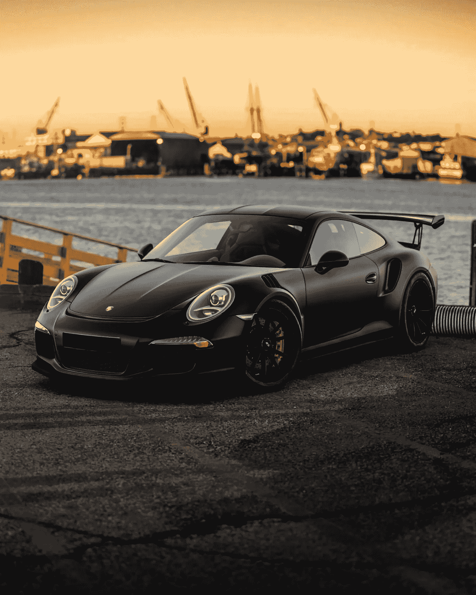

Photo by [Josh Berquist](https://unsplash.com/@bbtl?utm_source=unsplash&utm_medium=referral&utm_content=creditCopyText) on [Unsplash](https://unsplash.com/s/photos/porsche-911?utm_source=unsplash&utm_medium=referral&utm_content=creditCopyText)

# 步骤 1 —数据预处理

这里，数据预处理包括以下步骤:

*   删除销售价格最高(最低)的 1% (1%)辆汽车；
*   汽车价格和里程的对数转换；
*   从数据集中至少有 100 条记录的品牌中选择汽车；
*   将接近的数值分组到较大的桶中；
*   替换空值；
*   最后，删除未使用的列。

# 步骤 2-设置机器学习模型来预测汽车销售价格

上一步准备的数据在训练样本和测试样本之间随机分割，并使用明确考虑分类特征的 [CatBoostRegressor](https://catboost.ai/en/docs/concepts/python-reference_catboostregressor) 模型建模。最终模型的[均方根误差](https://scikit-learn.org/stable/modules/generated/sklearn.metrics.mean_squared_error.html) (RMSE)为**约 0.074**[**dex**](https://joe-antognini.github.io/astronomy/what-is-a-dex)，与基准模型 RMSE 的约 0.342[**dex**](https://joe-antognini.github.io/astronomy/what-is-a-dex)相比有显著的**改善(假设同样的**价格约为 191，000 瑞典克朗或约 17，000 美元****

# **步骤 3——对获得的机器学习模型的解释。**

**在这里，我们使用了[【沙普利附加解释(SHAP)](https://shap-lrjball.readthedocs.io/en/latest/index.html) 方法，一种最常见的探索机器学习模型可解释性的方法。SHAP 值的单位因此为 [**dex**](https://joe-antognini.github.io/astronomy/what-is-a-dex) 。**

**首先，我们研究我们感兴趣的每个特征的 SHAP 值的跨度:**

**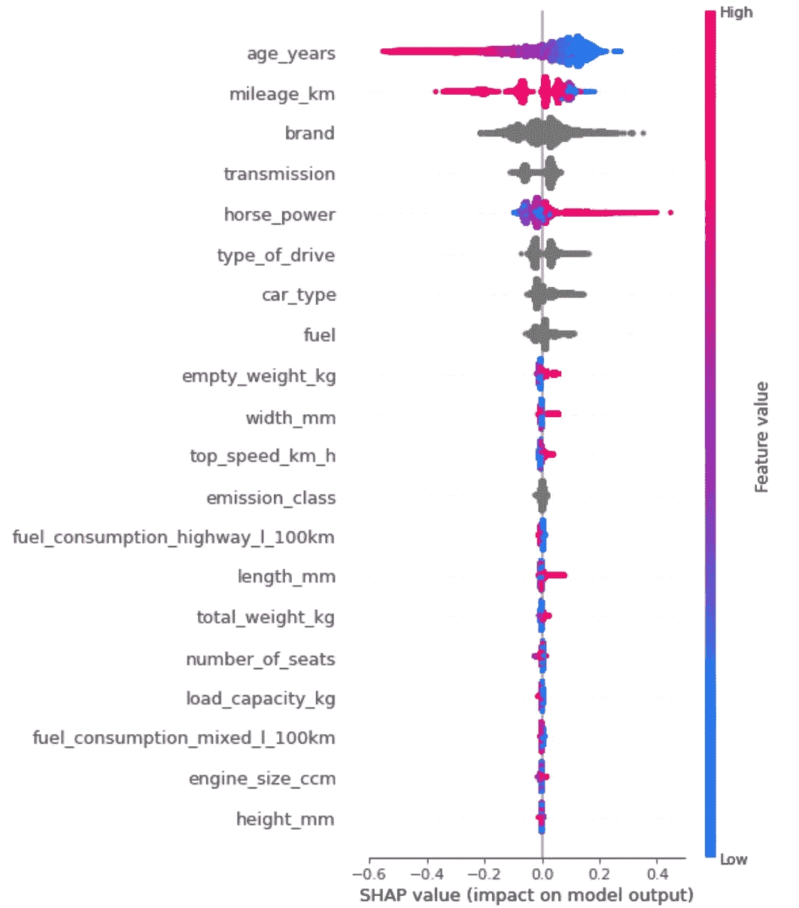**

**Image source: author, [100k_used_car_prices_explanation | Kaggle](https://www.kaggle.com/code/dima806/100k-used-car-prices-explanation)**

**在这里，决定车价最重要的特征是**年龄**、**里程**、**品牌**。**

**查看每个功能的更多详细信息。从车龄开始( **age_years** 变量):**

**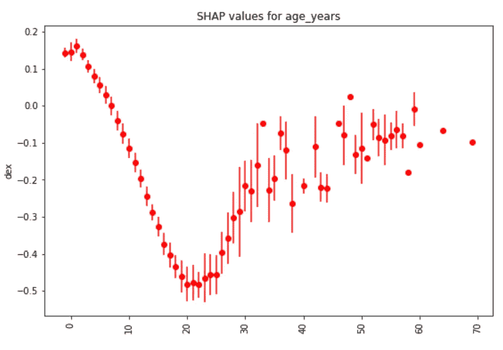**

**Image source: author, [100k_used_car_prices_explanation | Kaggle](https://www.kaggle.com/code/dima806/100k-used-car-prices-explanation)**

> **值得注意的是，我们看到 SHAP 值**下降了大约 20 年**(总共下降了**大约 0.65 dex 或** `**10**0.65 = 4.5**` **倍**)，随后**在 20-30 年**上升，最后**达到 40 多年的平台期**。**

**下一个重要的影响是汽车行驶里程:**

**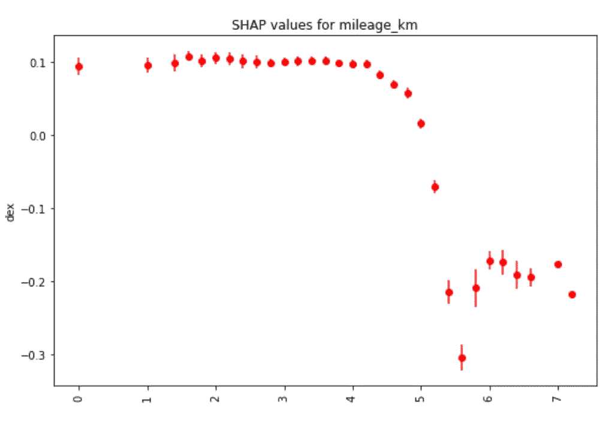**

**Image source: author, [100k_used_car_prices_explanation | Kaggle](https://www.kaggle.com/code/dima806/100k-used-car-prices-explanation)**

> **这里，汽车里程是**对数转换**(**x->log10(1+x)**)。这意味着 0 公里里程的汽车在这种转换后将具有 0.0，而 100，000 公里里程的汽车将具有大约 5.0 的转换里程。类似于汽车的年龄特征，我们再次看到在大约 200，000 km 之前下降了大约 0.4 dex 或大约`10**0.4 = 2.5`倍，随后是较小的后续上升，并且在大约 1，000，000 km 的里程之后达到平台期。**

**然后，说到汽车品牌名称。在相应的情节中，我们看到太多不同的品牌，无法一一写出:**

****

**Image source: author, [100k_used_car_prices_explanation | Kaggle](https://www.kaggle.com/code/dima806/100k-used-car-prices-explanation)**

**以下是数据中最贵的五大汽车品牌:**

**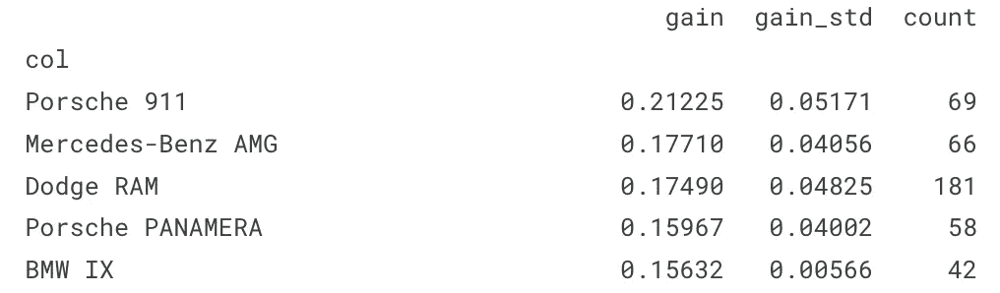**

**Image source: author, [100k_used_car_prices_explanation | Kaggle](https://www.kaggle.com/code/dima806/100k-used-car-prices-explanation)**

**不出意外，**最贵的汽车品牌**是[保时捷 911](https://www.porsche.com/usa/models/911/) (上图也有看到)，比马力、座位数、车龄、里程等特征相同的一般汽车贵出约 **+0.21 dex** (或`**10**0.21 = 1.62**` **倍。**)，其次是[奔驰-AMG](https://www.mercedes-amg.com/en/home.html) 、[道奇公羊](https://www.dodge-wiki.com/wiki/Dodge_Ram)、[保时捷 Panamera](https://www.porsche.com/usa/models/panamera/) 、[宝马 IX](https://www.bmw.com/en/events/nextgen/reveal-bmw-ix.html) 。同样，**同表中最便宜的汽车品牌**是[现代 I10](https://www.hyundai.com/worldwide/en/cars/i10/highlights) 、[丰田 Aygo](https://www.toyota.co.uk/new-cars/aygo-x) 和[起亚 Picanto](https://www.kia.com/dk/modeller/picanto/oplev/) 。**

**下一个重要特征是**变速器类型**:**

**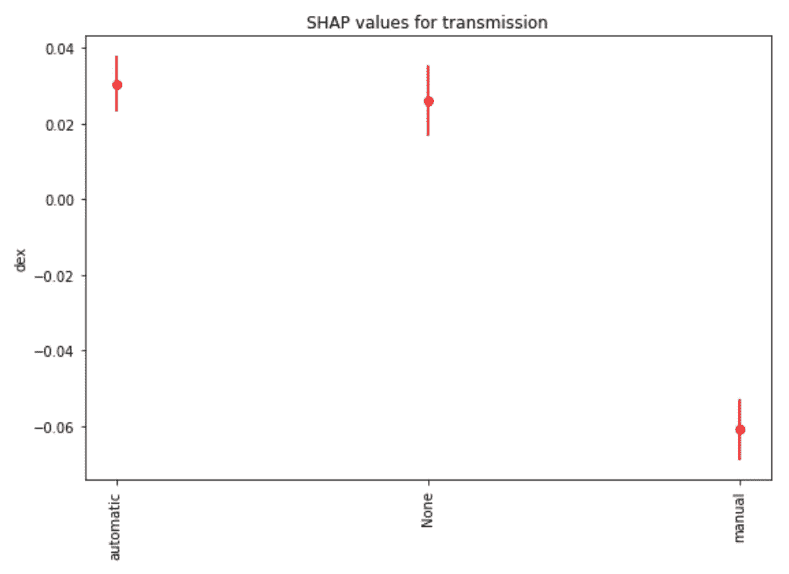**

**Image source: author, [100k_used_car_prices_explanation | Kaggle](https://www.kaggle.com/code/dima806/100k-used-car-prices-explanation)**

**毫不奇怪，**配备自动变速器的汽车平均约 0.09 dex，比配备手动变速器的汽车贵 23%**。**

**最大发动机功率(马力)是下一个重要特征:**

**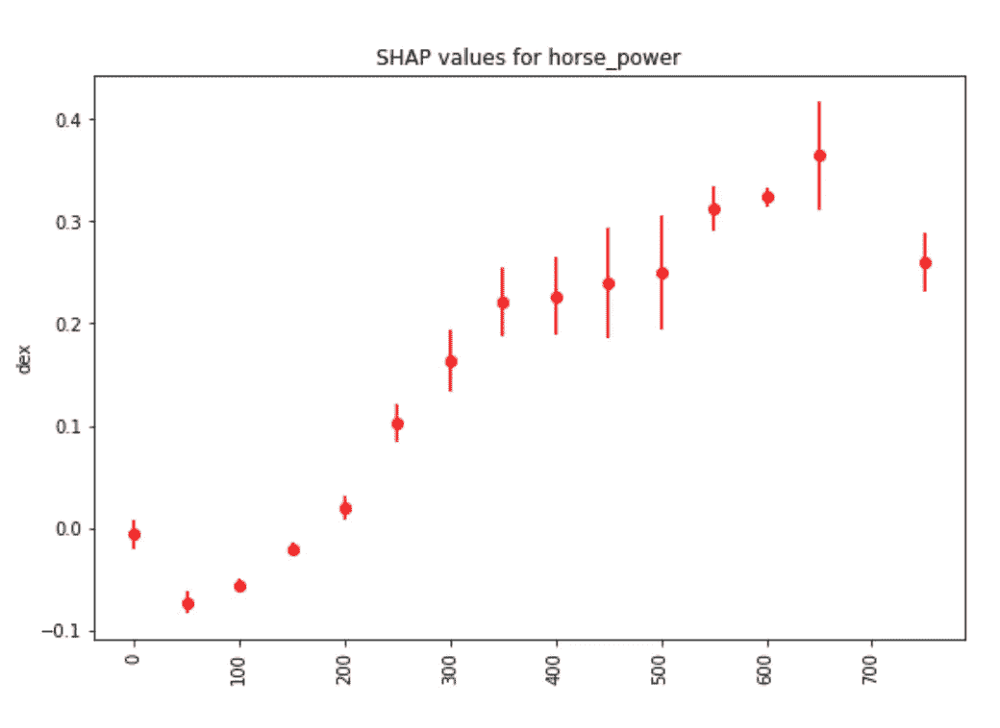**

**Image source: author, [100k_used_car_prices_explanation | Kaggle](https://www.kaggle.com/code/dima806/100k-used-car-prices-explanation)**

> **不出意外，**马力越大也意味着价格越大**，相差高达 0.4 dex(或 2.5 倍)。**

**此外，平均而言，**四轮驱动汽车约为 0.059 dex，比两轮驱动汽车贵 15%左右**:**

**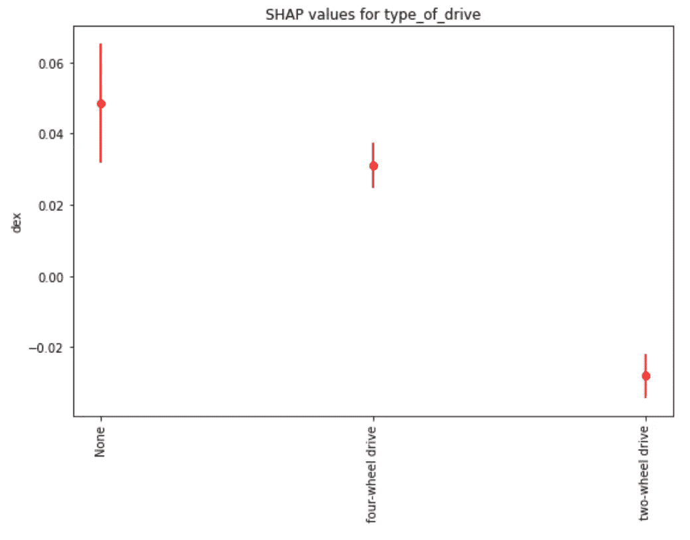**

**Image source: author, [100k_used_car_prices_explanation | Kaggle](https://www.kaggle.com/code/dima806/100k-used-car-prices-explanation)**

**此外，最昂贵的[车型](https://mechanicbase.com/cars/different-car-models-types/)是出租车和双门轿车:**

**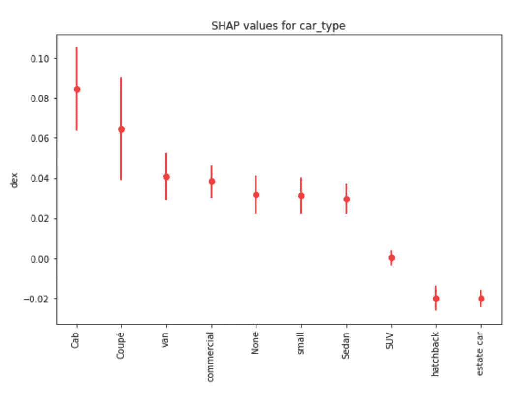**

**Image source: author, [100k_used_car_prices_explanation | Kaggle](https://www.kaggle.com/code/dima806/100k-used-car-prices-explanation)**

> **就燃料种类而言，**最贵的是电动和混合动力汽车，而最便宜的是汽油和柴油汽车**:**

**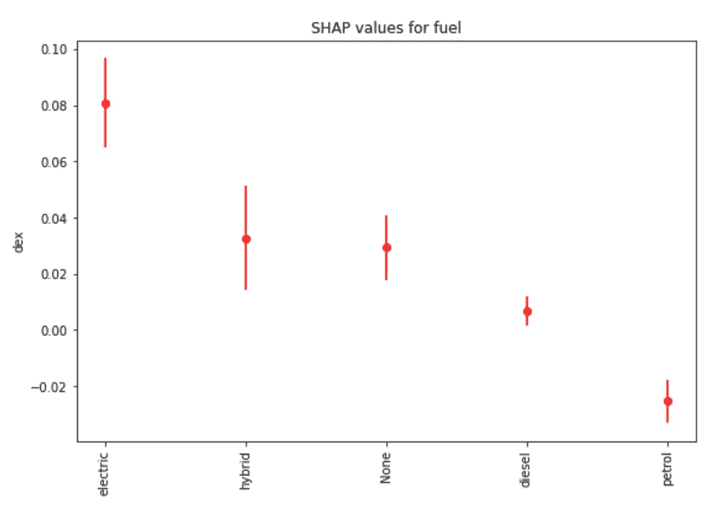**

**Image source: author, [100k_used_car_prices_explanation | Kaggle](https://www.kaggle.com/code/dima806/100k-used-car-prices-explanation)**

**就空车重量而言，车价在大约 **2000 公斤**后开始增长:**

**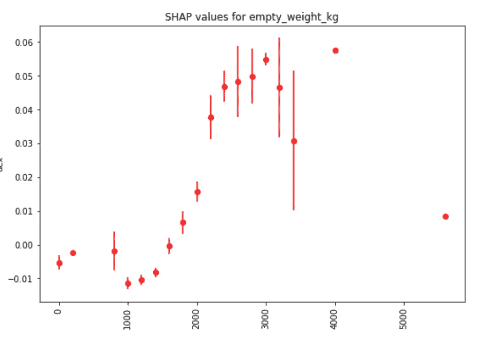**

**Image source: author, [100k_used_car_prices_explanation | Kaggle](https://www.kaggle.com/code/dima806/100k-used-car-prices-explanation)**

**与**车宽度相差约 2 米后**:**

**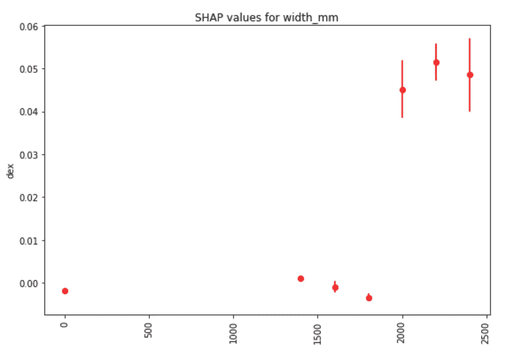**

**Image source: author, [100k_used_car_prices_explanation | Kaggle](https://www.kaggle.com/code/dima806/100k-used-car-prices-explanation)**

****最高车速约 180 公里/小时后**:**

**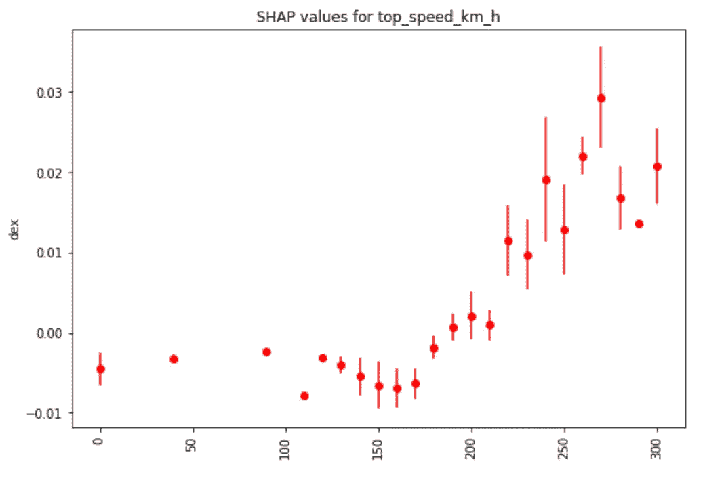**

**Image source: author, [100k_used_car_prices_explanation | Kaggle](https://www.kaggle.com/code/dima806/100k-used-car-prices-explanation)**

**混合模式下的油耗**小于 2.5 升/100 公里**:**

****

**Image source: author, [100k_used_car_prices_explanation | Kaggle](https://www.kaggle.com/code/dima806/100k-used-car-prices-explanation)**

**公路工况下的油耗**小于每 100 公里 9 升**:**

**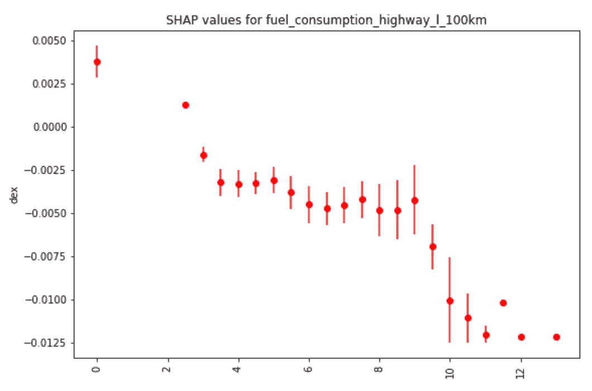**

**Image source: author, [100k_used_car_prices_explanation | Kaggle](https://www.kaggle.com/code/dima806/100k-used-car-prices-explanation)**

****长度超过 4.5 米的汽车**:**

**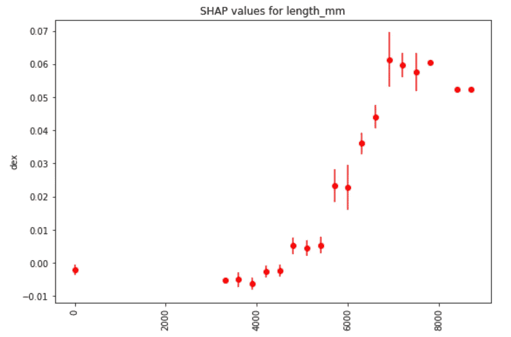**

**Image source: author, [100k_used_car_prices_explanation | Kaggle](https://www.kaggle.com/code/dima806/100k-used-car-prices-explanation)**

**最高**车速超过 180 公里/小时**:**

****

**Image source: author, [100k_used_car_prices_explanation | Kaggle](https://www.kaggle.com/code/dima806/100k-used-car-prices-explanation)**

**总重量超过 2500 千克的汽车**:****

****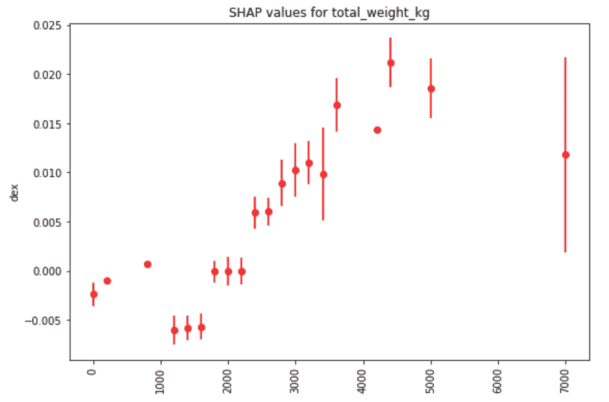****

****Image source: author, [100k_used_car_prices_explanation | Kaggle](https://www.kaggle.com/code/dima806/100k-used-car-prices-explanation)****

****汽车排放等级的影响表明**欧 6 标准**的汽车比其他汽车略贵:****

****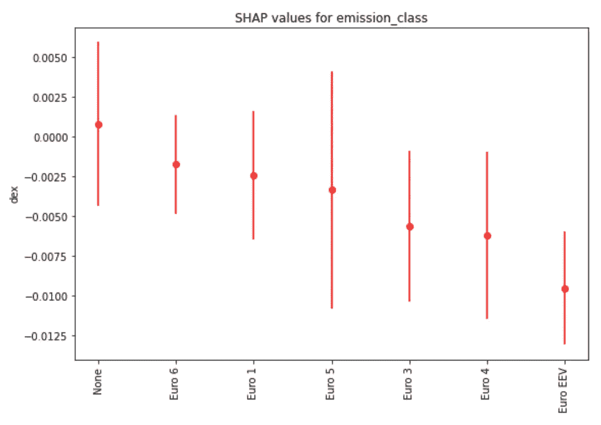****

****Image source: author, [100k_used_car_prices_explanation | Kaggle](https://www.kaggle.com/code/dima806/100k-used-car-prices-explanation)****

****最后，**对席位数量几乎没有显著影响**:****

****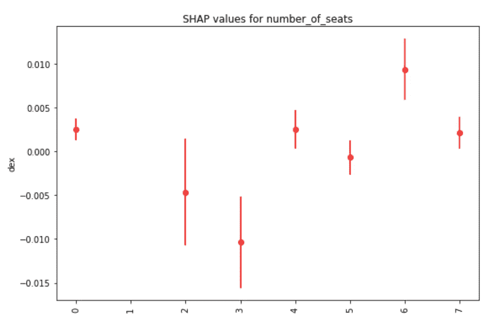****

****Image source: author, [100k_used_car_prices_explanation | Kaggle](https://www.kaggle.com/code/dima806/100k-used-car-prices-explanation)****

******负载能力**(单位为千克):****

****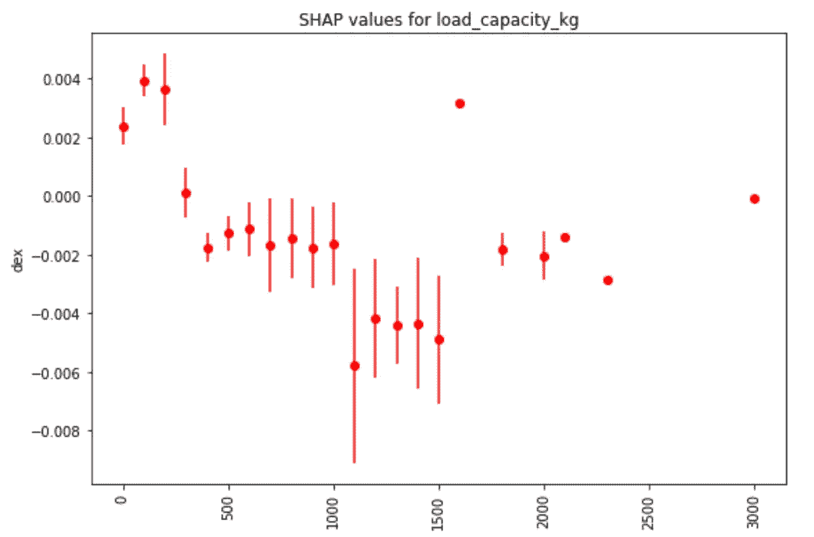****

****Image source: author, [100k_used_car_prices_explanation | Kaggle](https://www.kaggle.com/code/dima806/100k-used-car-prices-explanation)****

******发动机尺寸**(立方厘米):****

****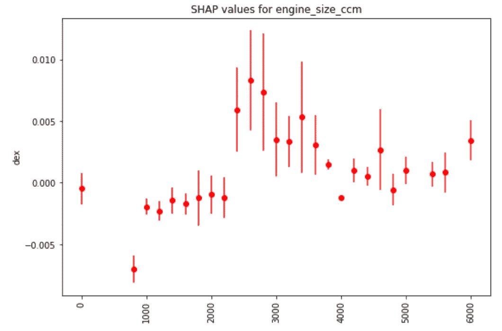****

****Image source: author, [100k_used_car_prices_explanation | Kaggle](https://www.kaggle.com/code/dima806/100k-used-car-prices-explanation)****

****和**轿厢高度**(单位为毫米):****

****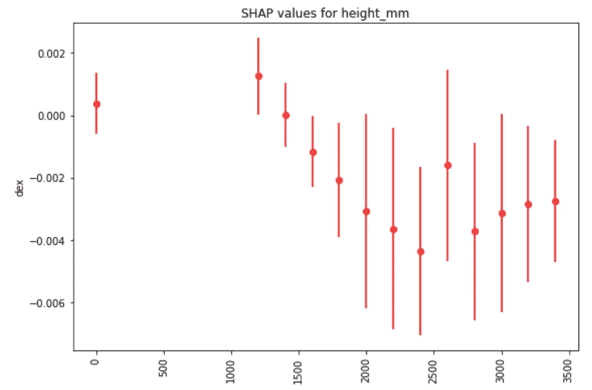****

****Image source: author, [100k_used_car_prices_explanation | Kaggle](https://www.kaggle.com/code/dima806/100k-used-car-prices-explanation)****

****希望这些结果能对你有用。如果有问题/意见，不要犹豫，在下面的评论中写下或**通过 [LinkedIn](https://www.linkedin.com/in/dima806/) 或 [Twitter](https://twitter.com/dima806_dima) 直接联系我**。****

****你也可以 [**订阅我的新文章**](/subscribe/@dima806) ，或者 [**成为推荐媒介会员**](/@dima806/membership) 。****

**** [## Mlearning.ai 提交建议

### 如何成为 Mlearning.ai 上的作家

medium.com](/mlearning-ai/mlearning-ai-submission-suggestions-b51e2b130bfb)****