# 简化的主成分分析

> 原文：<https://medium.com/mlearning-ai/principal-component-analysis-pca-simplified-22ef97b0e1dc?source=collection_archive---------5----------------------->

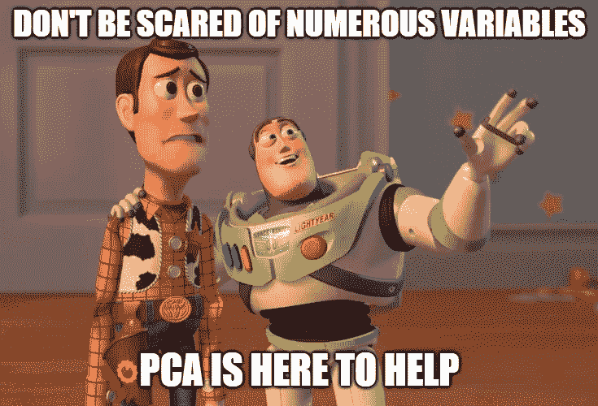

source: author

链接代码: [Github](https://github.com/Jnjerry/ArticlesCode/tree/main/PCA)

# 问题陈述

假设您有一个包含 1000 个要素的数据集。想象所有这些特征并试图解释这些特征之间的关系将是一场噩梦。此外，你的模型冒着**过度拟合**的风险。简单地说，过度拟合意味着您的模型已经记住了您的数据集模式太多，以至于在给定新数据时它表现不佳。

# 先决条件

数据集中的特征数量被称为其**维度**。因此，包含大量特征的数据集称为高维数据集，包含少量特征的数据集称为低维数据集。因此，为了解决我们上面的问题陈述，我们需要做的是**将高维数据集转换成低维数据集**。这叫做**降维。**

***请注意，降维不是删除列。它是对列中的信息进行数学转换，以获取相同的精确信息，但使用更少的列。例如，如果您有两个高度相关的特征，您可以将它们合并成一个新的特征。***

# 降维的好处

*   消耗较少的计算资源。
*   运行速度更快的型号。
*   改进您的模型性能。
*   更好的数据可视化。

帮助我们降维的最流行的技术之一是主成分分析( **PCA)。**

*PCA 于 1901 年由* [*卡尔·皮尔逊*](https://en.wikipedia.org/wiki/Karl_Pearson) *发明，至今仍在使用，已经证明它在降维方面是多么的高效。*

# 应用 PCA

1.  **手动计算生成主成分**。— PCA 有一个数学方法。为了充分理解这个概念，我们将手动生成主成分。
2.  **使用 scikit-learn 库** —我们将利用 scikit-learn 库为我们自动输出和生成主要组件。这是您在创建机器学习模型时最理想的使用方式。但是首先使用方法 1 来理解这个概念是很重要的。

# 执行 PCA 的步骤

1.  标准化
2.  协方差矩阵
3.  特征分解
4.  按特征值排序
5.  选择你的主要成分

# 标准化

当分析数据时，我们处理的数据集的特征在数量和单位上有很大不同。例如，您可以处理以千克、千米、克、厘米等计量的要素。通过将机器学习技术应用于这些特征，例如，你的算法会认为 100 克大于 1 千克，这是不正确的，我们的算法会给我们错误的预测。

因此，在应用任何算法之前，我们需要想出一种方法来标准化我们的特征。因此，这意味着在处理体重(0-10000 克)、年龄(0-100 岁)和工资(0-8000 美元)等变量时，特征缩放会将它们标准化到相同的范围内，例如，范围(0，1)，具体取决于所使用的缩放技术。

**请注意:如果变量之间的比例是一致的，那么标准化对于 PCA 来说可能是不必要的。**

# 协方差矩阵

标准化数据集后，下一步是创建协方差矩阵。为了理解协方差矩阵，我们需要首先理解什么是方差和协方差。

**方差—** 衡量您的数据被分散了多少。

在下图中，我们有 **x 和 y 方差**，其中 **x 方差**显示有多少数据在水平方向扩散， **y 方差**显示有多少数据在垂直方向扩散。因此，只看下图，x 方差高于 y 方差，因为数据在水平轴上分布得更广。

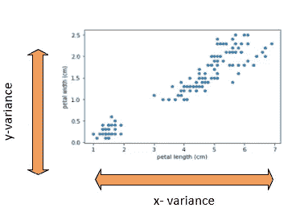

source:author

**协方差** —这是一种描述变量之间关系的度量。换句话说，你不能得到这种关系，因为你只使用了一个变量。然而，当你结合两个变量时，你可以得到关于它们如何相互联系以及它们的方向的信息。也就是说，如果变量 x 增加，变量 y 会增加还是减少或者保持不变。

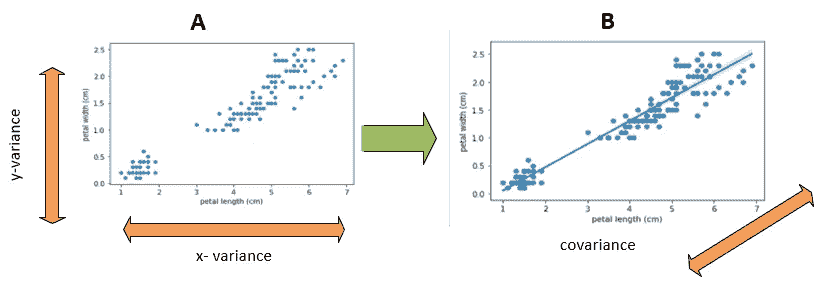

variance vs covariance: source- author

两个变量之间的协方差可以是正的、负的和零。这可以被视为您的数据具有正相关性、负相关性或无相关性，如下图所示。


source- emathzone

**协方差矩阵** —这是一个**方阵**，显示变量的**方差**和数据集中一对变量之间的**协方差**。如果变量 X、Y 和 Z 的值如下所示，那么我们将首先计算 X、Y 和 Z 的**方差，分别为 80.3、33.037 和 142.5。**

z 的方差最高，Y 的方差最低。

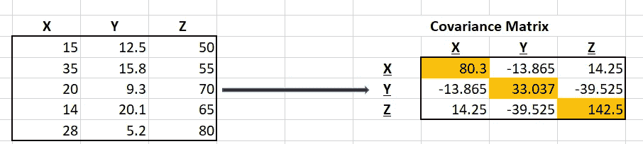

covariance matrix: source -author

一旦获得了元素的方差，现在就可以计算协方差并创建协方差矩阵，如上图所示。

**cov(X，Y)是-13.865** —这是一个负数，意味着 X 增加，Y 减少，反之亦然。

**cov(X，Z)是 14.25**——这是一个正数，意味着随着 X 的增加，Z 也增加，反之亦然。

**cov(Y，Z)是-39.525**——这是一个负数，意味着随着 Y 的增加，Z 减少，反之亦然。

因此，上面 3 个变量的公式如下所示，其中对角线元素表示数据集的方差，非对角线项表示一对变量之间的协方差。

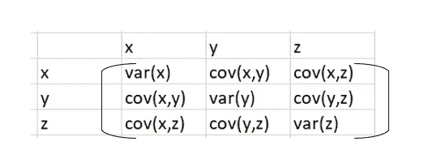

covariance matrix: source-author

# **特征分解**

现在你有了上面的协方差矩阵，下一步叫做特征分解，它是产生特征值和特征向量的简单过程。通常先找到一个特征值，然后找到一个特征向量来帮助我们得到主成分(我们得到的新变量是初始变量的组合或混合的结果)

特征向量告诉我们数据集的方向。如果你的数据集有两个变量，比如说一个人的年龄和收入，你会期望两个特征向量来解释年龄和收入的方向。你也有两个特征值，表示特征向量的方差。

# 例子

如果您有一个如下所示的二维数据集，那么您将有**两个向量 u 和 v。按照层级顺序，** **u 将被视为您的第一个向量**(数据变化最大的方向)，而 **v 将被视为第二个向量**(垂直于第一个特征向量的向量中变化最大的方向)。如果你有第三个特征向量，那么这将是垂直于前两个向量的方向中方差最大的一个，依此类推**。用简单的英语来说，特征值就是你的箭头的长度，它解释了每个向量的方差。**

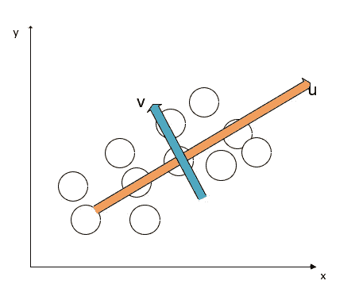

source:author

请访问此[链接](https://georgemdallas.wordpress.com/2013/10/30/principal-component-analysis-4-dummies-eigenvectors-eigenvalues-and-dimension-reduction/)以获得对特征向量和值的更多了解。

# 按特征值排序并选择主成分

**主成分**是我们从初始变量的组合或混合中得到的新变量。特征向量通常乘以你的原始数据集得到**主成分。**

具有最低特征值的特征向量包含关于数据分布的最少信息，并且那些是我们理想地丢弃的。因此，如果从 3 个特征值中取两个最高值，那么你将得到 2 维数据集。一旦你决定了特征值，你现在把原始数据乘以相应的特征向量来得到主成分。如果你的年龄、身高和体重导致了肥胖，如果体重和身高有最高的特征值，那么你就会忽略年龄有最低的特征值。然后你将得到体重和身高的特征向量，你将得到主成分。这些将是数据集中的新要素。

# 手动计算和生成主成分

1.  加载您的数据。

```
data=np.array([
[6., 3., 2.],
[3., 2., 7.],
[5., 4., 2.],
[1., 4., 3.],
[7., 3., 1.0],
[5., 1., 8.],
[4., 2., 2.],
[8., 6., 6.],
[6., 3., 2.],
[7., 1., 1.]])
```

2.标准化并计算协方差矩阵。

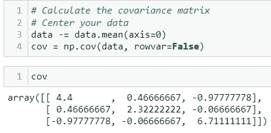

3.特征分解得到特征值和特征向量。

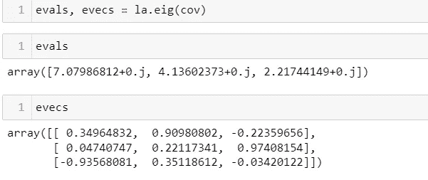

4.按特征值排序，得到按重要性排序的特征值和特征向量。

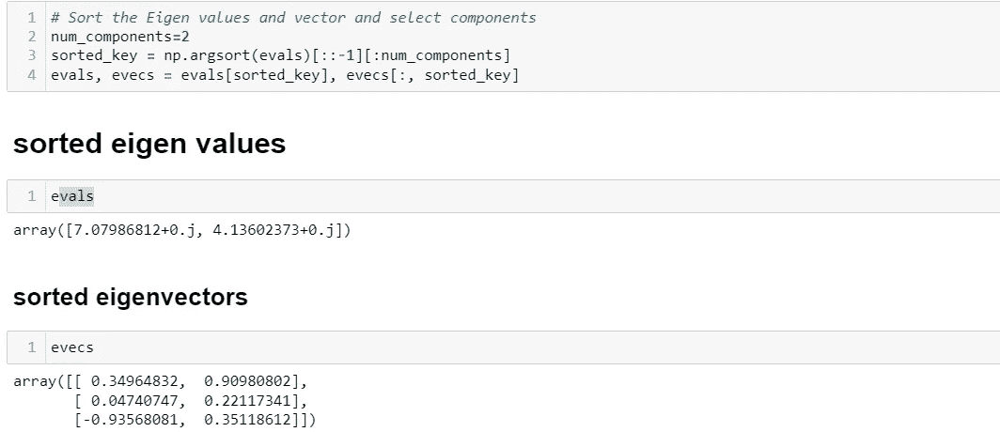

5.将选择的特征向量乘以原始数据，得到主成分。

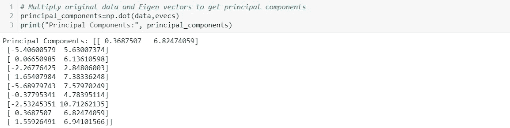

# 使用 Scikit 的 PCA-Learn

1.  加载您的数据—我们将使用 pandas 内置的葡萄酒数据集。

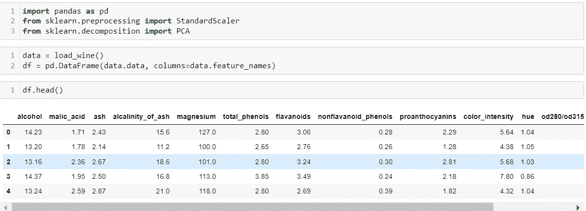

2.标准化您的数据集并使其适合 PCA 方法。

通过将分量的数量指定为 2 ( `n_components=2`)，您要求 PCA 找到最能解释数据可变性的两个分量。

您可以根据自己的需求设置首选的组件数量，但是两个组件通常是最容易在散点图上解释和可视化的。

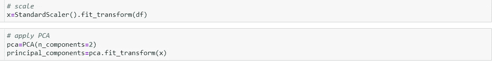

3.输出您的新尺寸。

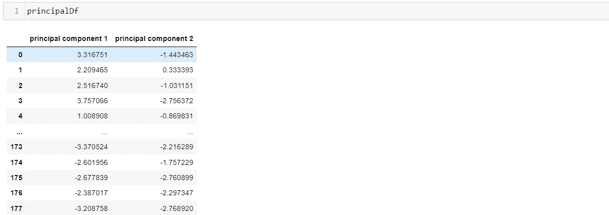

如果您的数据集中有其他要素(如目标变量),您可以将新要素连接到数据集中的其他要素，然后构建您的机器学习模型。

# 何时使用 PCA

1.  当你想减少变量的数量，但不能清楚地确定你想删除的变量。
2.  当你想确保你的变量是相互独立的。

代码链接: [Github](https://github.com/Jnjerry/ArticlesCode/tree/main/PCA)

[](/mlearning-ai/mlearning-ai-submission-suggestions-b51e2b130bfb) [## Mlearning.ai 提交建议

### 如何成为 Mlearning.ai 上的作家

medium.com](/mlearning-ai/mlearning-ai-submission-suggestions-b51e2b130bfb)